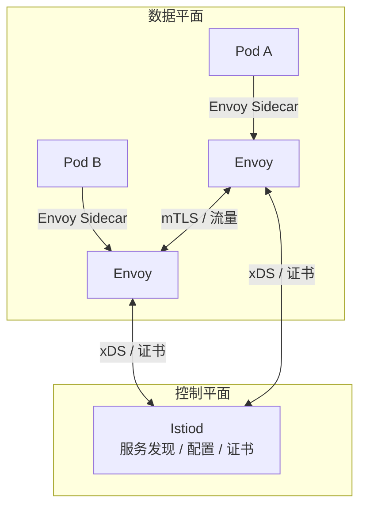
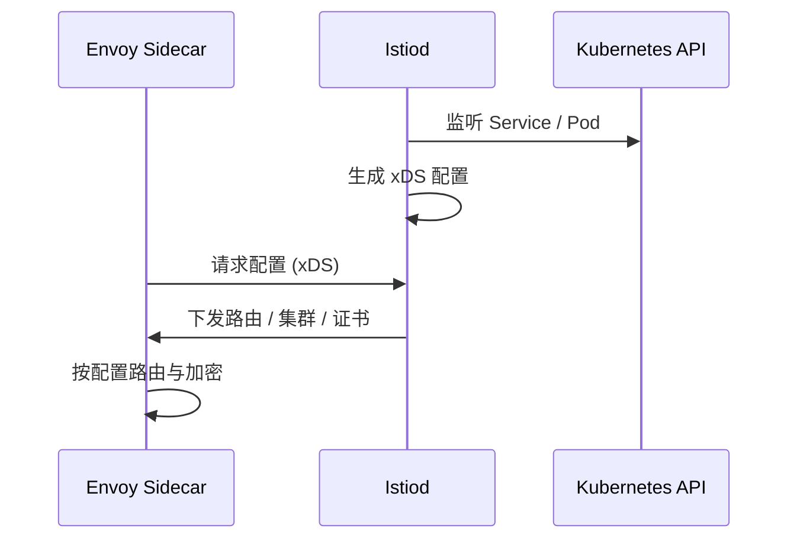
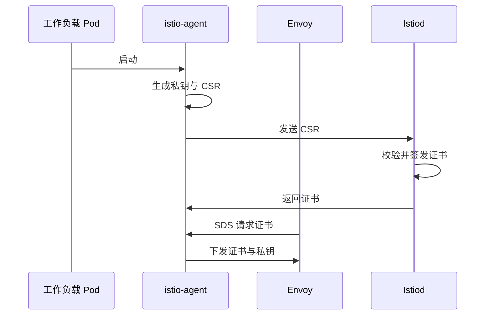

# 概述

**Istio** 是一个开源的 **服务网格（Service Mesh）** 平台，用于连接、保护、控制和观测微服务之间的通信。它在不侵入业务代码的前提下，通过 **Sidecar 代理** 统一处理服务间流量，提供流量管理、安全（mTLS、鉴权）、可观测性（指标、追踪、日志）等能力。

**核心价值**：

- **流量控制**：金丝雀发布、A/B 测试、按权重/条件路由、重试/超时/熔断等，无需改应用代码。
- **安全**：服务间双向 TLS（mTLS）、基于身份的访问控制、JWT 请求认证，默认安全。
- **可观测性**：自动采集指标、分布式追踪、访问日志，统一观测网格内服务行为。

# 架构

Istio 从逻辑上分为 **数据平面** 和 **控制平面**。



- **数据平面**：由部署为 **Sidecar** 的 **Envoy** 代理组成，拦截并转发微服务之间的所有流量，执行路由、策略、加密，并上报遥测。
- **控制平面**：由 **Istiod** 组成，负责服务发现、将路由/策略转换为 Envoy 配置（通过 xDS）、以及证书签发与轮换。

# 核心组件

## Envoy 代理

Istio 使用 **Envoy** 的扩展版本作为数据平面代理，用 C++ 编写，高性能。每个业务 Pod 旁会注入一个 Envoy Sidecar，**所有进出该 Pod 的流量都经过 Envoy**，因此 Envoy 是唯一直接处理数据平面流量的 Istio 组件。

**主要能力**：

| 能力 | 说明 |
|------|------|
| 动态服务发现 | 从 Istiod 获取服务与端点信息 |
| 负载均衡 | 轮询、随机、最少请求等 |
| TLS 终止 / mTLS | 与对端 Envoy 建立 TLS，对业务透明 |
| HTTP/2、gRPC | 代理与协议转换 |
| 熔断器、健康检查 | 故障隔离与剔除不健康实例 |
| 故障注入 | 延迟、中断，用于测试 |
| 基于权重的流量分割 | 金丝雀、A/B、分阶段发布 |
| 访问日志与指标 | 上报给可观测性后端 |

Sidecar 模式使 Istio 可以为现有部署增加上述能力，而**无需改应用代码或架构**。

## Istiod

**Istiod** 是 Istio 的控制平面组件（原 Pilot、Citadel、Galley 等合并而成），主要职责：

1. **服务发现**：对接 Kubernetes（或 VM、Consul 等）的服务注册，生成统一的服务与 endpoint 信息。
2. **配置转换**：将 VirtualService、DestinationRule、Gateway 等 **流量管理 API** 转成 Envoy 的 xDS 配置，下发给各 Sidecar。
3. **证书与身份**：作为 **CA（证书颁发机构）** 为每个工作负载签发 X.509 证书，并自动轮换，用于 mTLS。
4. **安全策略**：下发认证、授权策略到 Envoy，在数据平面执行。



# 流量管理

Istio 的流量路由与弹性能力都通过 **CRD（自定义资源）** 配置，由 Istiod 转换为 Envoy 配置，在 Sidecar 中执行。

## 核心资源

| 资源 | 作用 |
|------|------|
| **VirtualService** | 定义“如何路由”：按 host、URI、header、权重等把流量导向不同服务或子集 |
| **DestinationRule** | 定义“到达目标后怎么做”：子集（如按版本）、负载均衡策略、连接池、熔断、TLS 模式等 |
| **Gateway** | 定义网格边界的 L4–L6 配置（端口、协议、TLS），通常与 VirtualService 配合做南北向流量 |
| **ServiceEntry** | 把网格外服务注册进 Istio，使其可被发现和路由 |
| **Sidecar** | 限制某工作负载可见/可访问的服务范围，减少配置与噪声 |

**关系**：VirtualService 负责“选路”，DestinationRule 负责“到达目标后的策略”；Gateway 负责入口，VirtualService 可绑定到 Gateway 上。

## 虚拟服务示例

下面示例：带 `end-user: jason` 的请求到 `reviews` 的 v2，其余到 v3；子集 `v2`/`v3` 在 DestinationRule 中定义。

```yaml
apiVersion: networking.istio.io/v1
kind: VirtualService
metadata:
  name: reviews
spec:
  hosts:
    - reviews
  http:
    - match:
        - headers:
            end-user:
              exact: jason
      route:
        - destination:
            host: reviews
            subset: v2
    - route:
        - destination:
            host: reviews
            subset: v3
```

金丝雀发布（按权重分流）：

```yaml
  http:
    - route:
        - destination:
            host: reviews
            subset: v1
          weight: 75
        - destination:
            host: reviews
            subset: v2
          weight: 25
```

## 网络弹性与测试

在 VirtualService / DestinationRule 中可配置：

- **超时**：请求超时时间。
- **重试**：重试次数、条件（如 5xx）、间隔。
- **熔断**：在 DestinationRule 中按连接数、请求数、失败率限制并隔离故障实例。
- **故障注入**：在 VirtualService 中注入延迟或中断，用于验证弹性与监控。

# 安全

Istio 的安全在数据平面由 Envoy 执行，在控制平面由 Istiod 配置与发证。

## 身份与证书

- **身份**：使用 **服务身份**（如 Kubernetes Service Account）标识工作负载，而不是 IP。
- **证书**：Istiod 作为 CA 为每个工作负载签发 X.509 证书；`istio-agent` 与 Envoy 同容器，负责向 Istiod 申请证书并通过 SDS 提供给 Envoy，并自动轮换。



## 认证

- **对等认证（Peer Authentication）**：服务到服务，使用 **双向 TLS（mTLS）**。Istio 可自动为网格内流量开启 mTLS，无需改应用；客户端与服务器 Envoy 建立 TLS，并做**安全命名**校验（服务器证书中的身份是否被允许运行目标服务）。
- **请求认证（Request Authentication）**：针对最终用户，使用 **JWT**；支持与 OpenID Connect（如 Google、Keycloak、Auth0）等集成。

## 授权

- **AuthorizationPolicy**：基于**服务身份**（以及请求属性如 path、method）的访问控制，在 Envoy 侧执行，实现“谁可以访问谁”。
- 可与认证配合，实现零信任、深度防御；默认可设为“默认拒绝、显式放行”。

# 可观测性

Istio 通过 Envoy 为网格内流量自动生成遥测，无需业务打点。

| 类型 | 说明 |
|------|------|
| **指标** | 代理级（Envoy 原始指标）与服务级（如 `istio_requests_total`，含 source/destination、response_code 等）；覆盖延迟、流量、错误、饱和等；可导出到 Prometheus，配合预置仪表板 |
| **分布式追踪** | 为每个请求生成 span，支持 Zipkin、Jaeger、OpenTelemetry 等；需应用转发追踪相关 header |
| **访问日志** | 每个请求的访问日志（可配置格式与输出），便于按实例排查 |

运维人员可以基于上述数据排查故障、做容量与稳定性优化，而**不需要在业务代码里埋点**。

# 小结

| 维度 | 要点 |
|------|------|
| **定位** | 服务网格：连接、保护、控制、观测微服务间通信 |
| **架构** | 数据平面（Envoy Sidecar）+ 控制平面（Istiod） |
| **流量管理** | VirtualService、DestinationRule、Gateway、ServiceEntry、Sidecar；金丝雀、重试、超时、熔断、故障注入 |
| **安全** | 服务身份 + Istiod CA；mTLS 对等认证；JWT 请求认证；AuthorizationPolicy 授权 |
| **可观测性** | 指标、分布式追踪、访问日志，由 Sidecar 自动采集 |

Istio 通过 Sidecar 与声明式 API 将流量、安全与可观测性从业务中剥离，适合在 Kubernetes 上构建可运维、可观测、安全的微服务架构。更多细节与示例见 [Istio 官方文档](https://istio.io/latest/zh/docs/)。
