分布式系统监控是保障系统稳定运行、快速定位问题、优化系统性能的关键基础设施。本文档详细介绍分布式系统监控的设计原则、数据打点方式、数据存储和展示方案。

# 分布式系统监控概述

## 什么是分布式系统监控？

分布式系统监控是指对分布式系统中的各个组件进行实时监控，收集指标、日志、追踪等数据，通过分析和展示，帮助运维和开发人员了解系统状态、定位问题、优化性能。

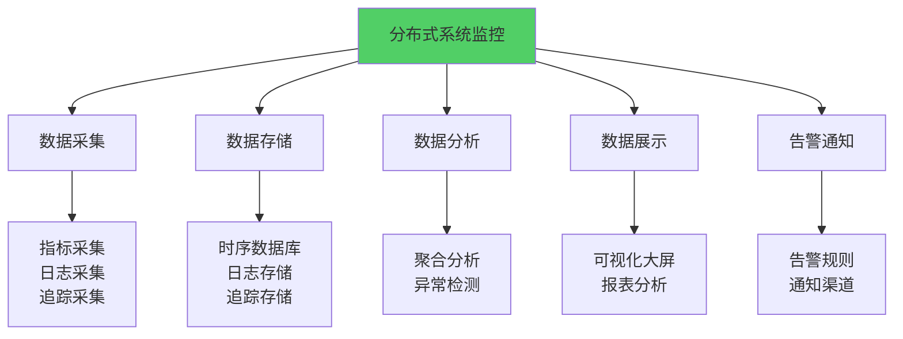

**核心功能：**
- **数据采集**：收集系统运行数据
- **数据存储**：持久化存储监控数据
- **数据分析**：分析数据，发现异常
- **数据展示**：可视化展示监控数据
- **告警通知**：异常时及时通知

## 监控的价值

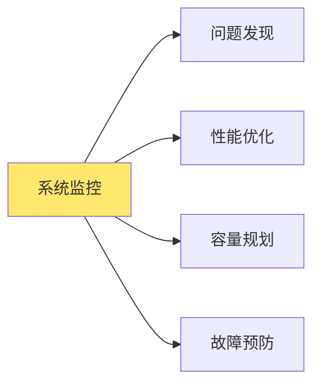

**价值体现：**
- **问题发现**：快速发现系统异常和问题
- **性能优化**：识别性能瓶颈，优化系统
- **容量规划**：基于监控数据规划容量
- **故障预防**：提前预警，预防故障

## 可观测性三大支柱

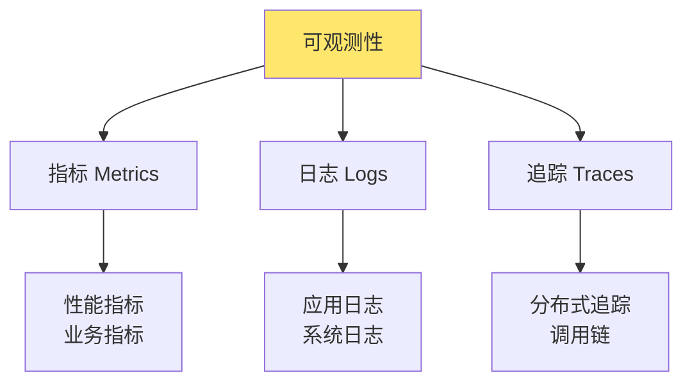

**三大支柱：**
1. **指标（Metrics）**：数值型数据，如CPU使用率、请求数
2. **日志（Logs）**：文本型数据，记录事件和错误
3. **追踪（Traces）**：请求在系统中的完整调用路径

# 数据打点

数据打点是监控的基础，通过在代码中埋点，收集系统运行数据。

## 数据打点概述

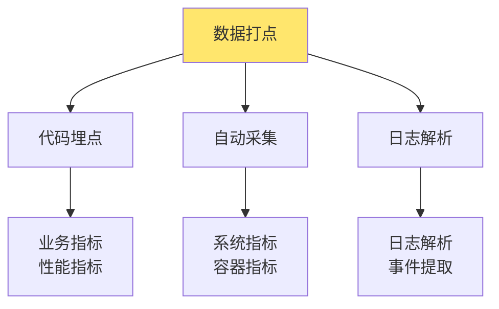

**打点方式：**
- **代码埋点**：在代码中显式埋点
- **自动采集**：通过Agent自动采集
- **日志解析**：从日志中提取指标

## 基于日志打点监控

基于日志的监控是通过解析应用日志，提取监控指标和事件。

### 日志打点架构

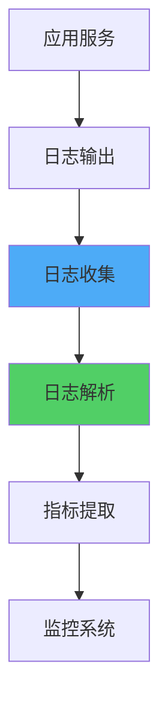

**流程：**
1. 应用输出结构化日志
2. 日志收集器收集日志
3. 解析日志提取指标
4. 发送到监控系统

### 日志格式设计

**结构化日志：**
```json
{
  "timestamp": "2024-01-01T10:00:00Z",
  "level": "INFO",
  "service": "order-service",
  "trace_id": "abc123",
  "span_id": "def456",
  "message": "Order created",
  "fields": {
    "order_id": "12345",
    "user_id": "user001",
    "amount": 99.99,
    "duration_ms": 150
  }
}
```

**日志级别：**
- **DEBUG**：调试信息
- **INFO**：一般信息
- **WARN**：警告信息
- **ERROR**：错误信息
- **FATAL**：致命错误

### sls

阿里云日志服务（SLS）是云原生的日志管理和分析平台。

#### SLS特性

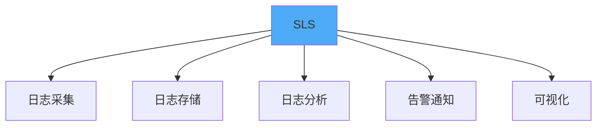

**核心特性：**
- 实时日志采集
- 海量日志存储
- 强大的查询分析
- 可视化仪表盘
- 告警通知

#### SLS集成

```go
// SLS日志客户端
import (
    "github.com/aliyun/aliyun-log-go-sdk/producer"
)

type SLSLogger struct {
    producer *producer.Producer
    project  string
    logstore string
}

func NewSLSLogger(endpoint, accessKeyID, accessKeySecret, project, logstore string) *SLSLogger {
    config := producer.GetDefaultProducerConfig()
    config.Endpoint = endpoint
    config.AccessKeyID = accessKeyID
    config.AccessKeySecret = accessKeySecret
    
    p := producer.InitProducer(config)
    p.Start()
    
    return &SLSLogger{
        producer: p,
        project:  project,
        logstore: logstore,
    }
}

func (l *SLSLogger) Log(level, message string, fields map[string]string) error {
    log := producer.GenerateLog(uint32(time.Now().Unix()), map[string]string{
        "level":   level,
        "message": message,
    })
    
    // 添加自定义字段
    for k, v := range fields {
        log.Contents = append(log.Contents, &sls.LogContent{
            Key:   proto.String(k),
            Value: proto.String(v),
        })
    }
    
    return l.producer.SendLog(l.project, l.logstore, "", "", log)
}

// 使用示例
func main() {
    logger := NewSLSLogger(
        "cn-hangzhou.log.aliyuncs.com",
        "your-access-key-id",
        "your-access-key-secret",
        "my-project",
        "my-logstore",
    )
    
    logger.Log("INFO", "Order created", map[string]string{
        "order_id": "12345",
        "user_id":  "user001",
        "amount":   "99.99",
    })
}
```

#### 日志查询分析

```sql
-- SLS查询语言（SQL-like）
-- 统计错误日志数量
SELECT COUNT(*) as error_count
FROM logstore
WHERE level = 'ERROR'
AND __time__ > now() - 1h

-- 统计各服务的请求数
SELECT service, COUNT(*) as request_count
FROM logstore
WHERE message LIKE '%request%'
GROUP BY service

-- 统计平均响应时间
SELECT service, AVG(duration_ms) as avg_duration
FROM logstore
WHERE duration_ms IS NOT NULL
GROUP BY service
```

### ELK Stack

ELK Stack（Elasticsearch + Logstash + Kibana）是开源的日志管理方案。

#### ELK架构

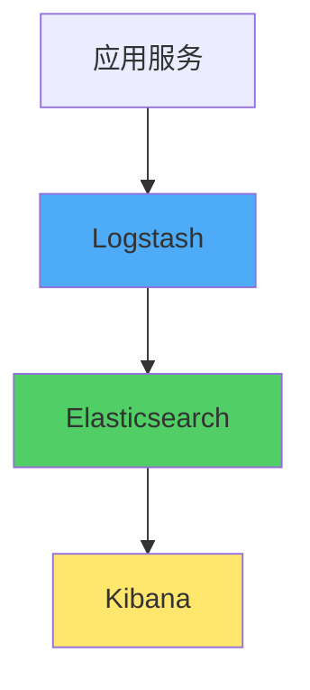

**组件：**
- **Logstash**：日志收集和解析
- **Elasticsearch**：日志存储和搜索
- **Kibana**：日志可视化和分析

#### Logstash配置

```ruby
# logstash.conf
input {
  file {
    path => "/var/log/app/*.log"
    start_position => "beginning"
  }
}

filter {
  json {
    source => "message"
  }
  
  grok {
    match => { "message" => "%{TIMESTAMP_ISO8601:timestamp} %{LOGLEVEL:level} %{GREEDYDATA:message}" }
  }
  
  date {
    match => [ "timestamp", "ISO8601" ]
  }
}

output {
  elasticsearch {
    hosts => ["localhost:9200"]
    index => "app-logs-%{+YYYY.MM.dd}"
  }
}
```

### Loki

Loki是Grafana Labs开发的日志聚合系统，与Prometheus集成良好。

#### Loki特性

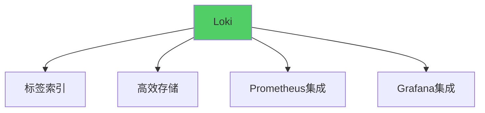

**核心特性：**
- 标签索引，类似Prometheus
- 高效存储，只索引标签
- 与Prometheus集成
- 与Grafana集成

#### Promtail配置

```yaml
# promtail-config.yaml
server:
  http_listen_port: 9080
  grpc_listen_port: 0

positions:
  filename: /tmp/positions.yaml

clients:
  - url: http://loki:3100/loki/api/v1/push

scrape_configs:
  - job_name: app
    static_configs:
      - targets:
          - localhost
        labels:
          job: app
          __path__: /var/log/app/*.log
```

## 基于数据库打点监控

基于数据库的监控是通过查询数据库，提取业务指标和系统状态。

### 数据库监控指标

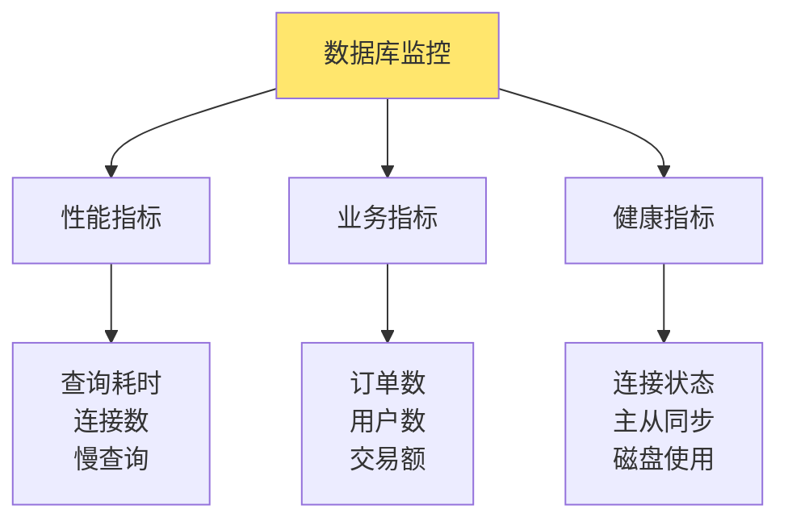

**监控指标：**
- **性能指标**：查询耗时、连接数、慢查询
- **业务指标**：订单数、用户数、交易额
- **健康指标**：连接状态、主从同步、磁盘使用

### 数据库监控实现

```go
// 数据库监控
type DatabaseMonitor struct {
    db *sql.DB
}

func (m *DatabaseMonitor) CollectMetrics() (*DBMetrics, error) {
    metrics := &DBMetrics{}
    
    // 1. 连接数
    var connections int
    m.db.QueryRow("SHOW STATUS LIKE 'Threads_connected'").Scan(&connections)
    metrics.Connections = connections
    
    // 2. 慢查询数
    var slowQueries int
    m.db.QueryRow("SHOW STATUS LIKE 'Slow_queries'").Scan(&slowQueries)
    metrics.SlowQueries = slowQueries
    
    // 3. 查询耗时
    var avgQueryTime float64
    m.db.QueryRow(`
        SELECT AVG(query_time) 
        FROM information_schema.processlist 
        WHERE command = 'Query'
    `).Scan(&avgQueryTime)
    metrics.AvgQueryTime = avgQueryTime
    
    // 4. 表大小
    var tableSize int64
    m.db.QueryRow(`
        SELECT SUM(data_length + index_length) 
        FROM information_schema.tables 
        WHERE table_schema = DATABASE()
    `).Scan(&tableSize)
    metrics.TableSize = tableSize
    
    return metrics, nil
}

// 业务指标查询
func (m *DatabaseMonitor) GetBusinessMetrics() (*BusinessMetrics, error) {
    metrics := &BusinessMetrics{}
    
    // 今日订单数
    m.db.QueryRow(`
        SELECT COUNT(*) 
        FROM orders 
        WHERE DATE(created_at) = CURDATE()
    `).Scan(&metrics.TodayOrders)
    
    // 今日交易额
    m.db.QueryRow(`
        SELECT SUM(amount) 
        FROM orders 
        WHERE DATE(created_at) = CURDATE()
    `).Scan(&metrics.TodayAmount)
    
    // 活跃用户数
    m.db.QueryRow(`
        SELECT COUNT(DISTINCT user_id) 
        FROM orders 
        WHERE created_at > DATE_SUB(NOW(), INTERVAL 1 DAY)
    `).Scan(&metrics.ActiveUsers)
    
    return metrics, nil
}
```

### 数据库监控最佳实践

**1. 定期采集**
```go
// 定时采集数据库指标
func (m *DatabaseMonitor) StartCollecting(interval time.Duration) {
    ticker := time.NewTicker(interval)
    defer ticker.Stop()
    
    for range ticker.C {
        metrics, err := m.CollectMetrics()
        if err != nil {
            log.Printf("Failed to collect metrics: %v", err)
            continue
        }
        
        // 发送到监控系统
        m.sendToMonitor(metrics)
    }
}
```

**2. 慢查询监控**
```go
// 慢查询监控
func (m *DatabaseMonitor) MonitorSlowQueries(threshold time.Duration) {
    rows, err := m.db.Query(`
        SELECT id, user, host, db, command, time, state, info
        FROM information_schema.processlist
        WHERE command = 'Query' AND time > ?
    `, threshold.Seconds())
    if err != nil {
        return
    }
    defer rows.Close()
    
    for rows.Next() {
        var query SlowQuery
        rows.Scan(&query.ID, &query.User, &query.Host, &query.DB,
            &query.Command, &query.Time, &query.State, &query.Info)
        
        // 记录慢查询
        logSlowQuery(&query)
    }
}
```

## 基于时序数据库打点

时序数据库专门用于存储时间序列数据，适合存储监控指标。

### 时序数据库特性

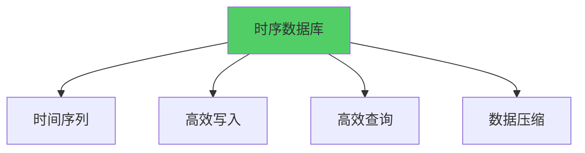

**核心特性：**
- 专门优化时间序列数据
- 高效写入和查询
- 数据自动压缩
- 支持聚合查询

### prometheus

Prometheus是CNCF毕业项目，广泛使用的监控系统。

#### Prometheus架构

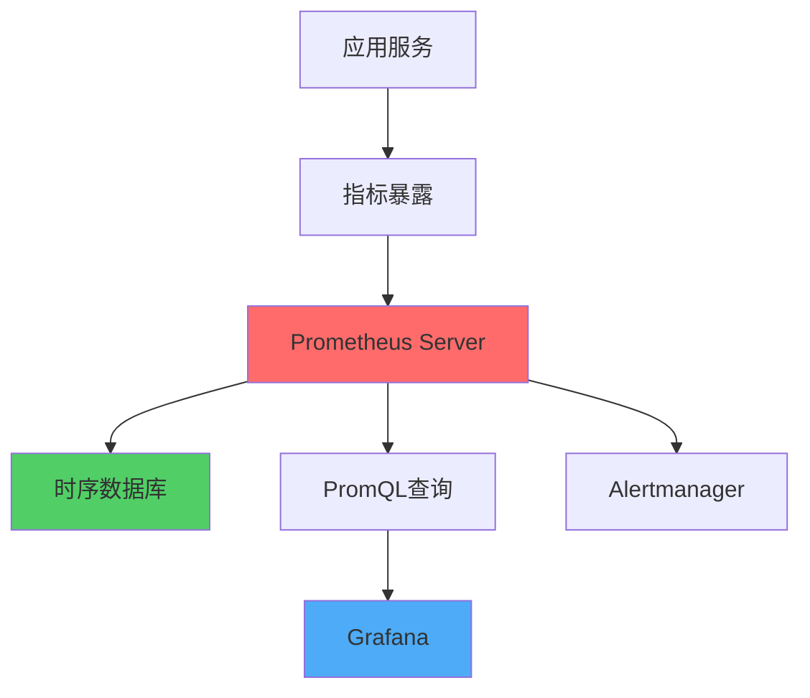

**核心组件：**
- **Prometheus Server**：采集和存储指标
- **时序数据库**：TSDB存储
- **PromQL**：查询语言
- **Alertmanager**：告警管理

#### 指标类型

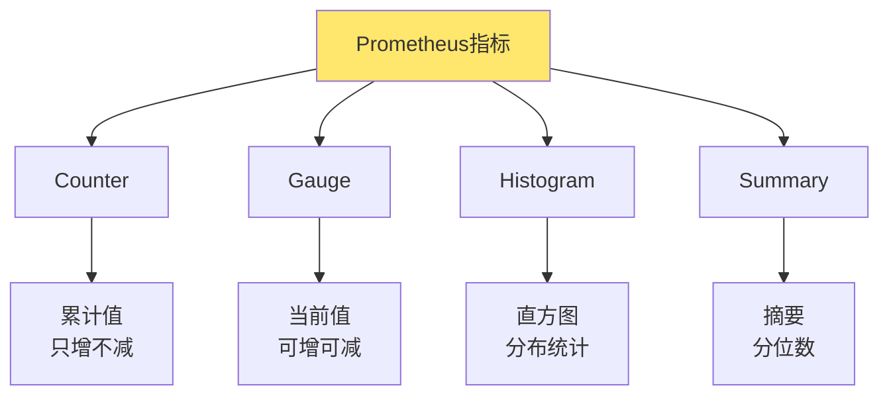

**指标类型：**
- **Counter**：计数器，累计值，如请求总数
- **Gauge**：仪表盘，当前值，如内存使用
- **Histogram**：直方图，分布统计，如响应时间分布
- **Summary**：摘要，分位数，如P95、P99延迟

#### Prometheus集成

```go
// Prometheus指标定义
import (
    "github.com/prometheus/client_golang/prometheus"
    "github.com/prometheus/client_golang/prometheus/promhttp"
)

var (
    // Counter：请求总数
    httpRequestsTotal = prometheus.NewCounterVec(
        prometheus.CounterOpts{
            Name: "http_requests_total",
            Help: "Total number of HTTP requests",
        },
        []string{"method", "endpoint", "status"},
    )
    
    // Gauge：当前连接数
    httpConnections = prometheus.NewGauge(
        prometheus.GaugeOpts{
            Name: "http_connections",
            Help: "Current number of HTTP connections",
        },
    )
    
    // Histogram：响应时间分布
    httpRequestDuration = prometheus.NewHistogramVec(
        prometheus.HistogramOpts{
            Name:    "http_request_duration_seconds",
            Help:    "HTTP request duration",
            Buckets: prometheus.DefBuckets,
        },
        []string{"method", "endpoint"},
    )
    
    // Summary：响应时间摘要
    httpRequestDurationSummary = prometheus.NewSummaryVec(
        prometheus.SummaryOpts{
            Name:       "http_request_duration_summary_seconds",
            Help:       "HTTP request duration summary",
            Objectives: map[float64]float64{0.5: 0.05, 0.9: 0.01, 0.99: 0.001},
        },
        []string{"method", "endpoint"},
    )
)

func init() {
    prometheus.MustRegister(httpRequestsTotal)
    prometheus.MustRegister(httpConnections)
    prometheus.MustRegister(httpRequestDuration)
    prometheus.MustRegister(httpRequestDurationSummary)
}

// 使用指标
func handleRequest(w http.ResponseWriter, r *http.Request) {
    start := time.Now()
    
    // 增加连接数
    httpConnections.Inc()
    defer httpConnections.Dec()
    
    // 处理请求
    // ...
    
    duration := time.Since(start).Seconds()
    status := "200"
    
    // 记录指标
    httpRequestsTotal.WithLabelValues(r.Method, r.URL.Path, status).Inc()
    httpRequestDuration.WithLabelValues(r.Method, r.URL.Path).Observe(duration)
    httpRequestDurationSummary.WithLabelValues(r.Method, r.URL.Path).Observe(duration)
}

// 暴露指标端点
func main() {
    http.Handle("/metrics", promhttp.Handler())
    http.ListenAndServe(":8080", nil)
}
```

#### PromQL查询

```promql
# 查询请求总数
http_requests_total

# 查询特定端点的请求数
http_requests_total{endpoint="/api/orders"}

# 查询错误率
rate(http_requests_total{status="500"}[5m]) / rate(http_requests_total[5m])

# 查询平均响应时间
rate(http_request_duration_seconds_sum[5m]) / rate(http_request_duration_seconds_count[5m])

# 查询P95响应时间
histogram_quantile(0.95, rate(http_request_duration_seconds_bucket[5m]))

# 查询连接数
http_connections
```

#### Prometheus配置

```yaml
# prometheus.yml
global:
  scrape_interval: 15s
  evaluation_interval: 15s

scrape_configs:
  - job_name: 'order-service'
    static_configs:
      - targets: ['localhost:8080']
        labels:
          service: 'order-service'
          env: 'production'
  
  - job_name: 'user-service'
    static_configs:
      - targets: ['localhost:8081']
        labels:
          service: 'user-service'
          env: 'production'
  
  - job_name: 'kubernetes-pods'
    kubernetes_sd_configs:
      - role: pod
    relabel_configs:
      - source_labels: [__meta_kubernetes_pod_annotation_prometheus_io_scrape]
        action: keep
        regex: true
```

### influxdb

InfluxDB是专门为时序数据设计的数据库。

#### InfluxDB特性

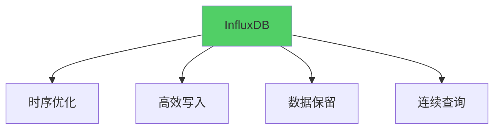

**核心特性：**
- 专门优化时序数据
- 高效写入性能
- 数据保留策略
- 连续查询（CQ）

#### InfluxDB集成

```go
// InfluxDB客户端
import (
    "github.com/influxdata/influxdb-client-go/v2"
    "github.com/influxdata/influxdb-client-go/v2/api"
)

type InfluxDBClient struct {
    client influxdb2.Client
    writeAPI api.WriteAPI
}

func NewInfluxDBClient(url, token, org, bucket string) *InfluxDBClient {
    client := influxdb2.NewClient(url, token)
    writeAPI := client.WriteAPI(org, bucket)
    
    return &InfluxDBClient{
        client:   client,
        writeAPI: writeAPI,
    }
}

func (c *InfluxDBClient) WriteMetric(measurement string, tags map[string]string, 
    fields map[string]interface{}) error {
    point := influxdb2.NewPoint(
        measurement,
        tags,
        fields,
        time.Now(),
    )
    
    c.writeAPI.WritePoint(point)
    return nil
}

// 使用示例
func main() {
    client := NewInfluxDBClient(
        "http://localhost:8086",
        "your-token",
        "my-org",
        "my-bucket",
    )
    
    // 写入指标
    client.WriteMetric("http_requests", map[string]string{
        "method":  "GET",
        "endpoint": "/api/orders",
        "status":  "200",
    }, map[string]interface{}{
        "count": 1,
        "duration_ms": 150,
    })
}
```

#### InfluxDB查询

```sql
-- 查询请求数
SELECT COUNT(*) FROM http_requests WHERE time > now() - 1h

-- 查询平均响应时间
SELECT MEAN(duration_ms) FROM http_requests WHERE time > now() - 1h

-- 按端点分组统计
SELECT COUNT(*) FROM http_requests 
WHERE time > now() - 1h 
GROUP BY endpoint

-- 查询P95响应时间
SELECT PERCENTILE(duration_ms, 95) FROM http_requests 
WHERE time > now() - 1h
```

## 数据打点最佳实践

### 1. 指标设计原则

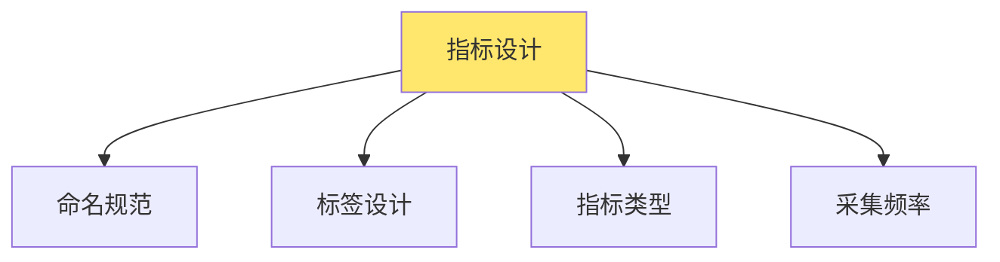

**原则：**
- **命名规范**：使用统一的命名规范
- **标签设计**：合理使用标签，避免高基数
- **指标类型**：选择合适的指标类型
- **采集频率**：合理的采集频率

### 2. 指标命名规范

```
# 格式：<namespace>_<metric_name>_<unit>_<type>

# 示例
http_requests_total          # HTTP请求总数
http_request_duration_seconds # HTTP请求耗时（秒）
memory_usage_bytes           # 内存使用（字节）
cpu_usage_percent            # CPU使用率（百分比）
```

### 3. 标签设计

```go
// 好的标签设计
http_requests_total{
    method="GET",
    endpoint="/api/orders",
    status="200",
    service="order-service"
}

// 避免高基数标签
http_requests_total{
    user_id="user12345",  // 高基数，不推荐
    order_id="order67890" // 高基数，不推荐
}
```

### 4. 采集频率

- **高频指标**：1-5秒（如请求数、错误数）
- **中频指标**：10-30秒（如CPU、内存）
- **低频指标**：1-5分钟（如业务指标）

# 数据展示

数据展示是将监控数据可视化，帮助用户理解系统状态。

## 数据展示概述

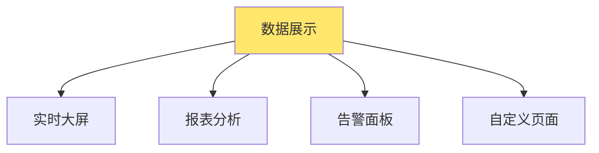

## 自定义运营页面

自定义运营页面是根据业务需求定制的监控展示页面。

### 页面设计

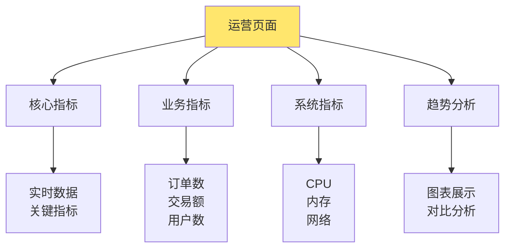

### 实现示例

```go
// 运营页面API
package main

import (
    "encoding/json"
    "net/http"
    "time"
)

type DashboardData struct {
    Timestamp time.Time        `json:"timestamp"`
    Core      CoreMetrics      `json:"core"`
    Business  BusinessMetrics `json:"business"`
    System    SystemMetrics    `json:"system"`
}

type CoreMetrics struct {
    TotalRequests    int64   `json:"total_requests"`
    ErrorRate        float64 `json:"error_rate"`
    AvgResponseTime  float64 `json:"avg_response_time"`
    ActiveUsers      int64   `json:"active_users"`
}

type BusinessMetrics struct {
    TodayOrders      int64   `json:"today_orders"`
    TodayAmount      float64 `json:"today_amount"`
    ConversionRate   float64 `json:"conversion_rate"`
}

type SystemMetrics struct {
    CPUUsage    float64 `json:"cpu_usage"`
    MemoryUsage float64 `json:"memory_usage"`
    DiskUsage   float64 `json:"disk_usage"`
}

func dashboardHandler(w http.ResponseWriter, r *http.Request) {
    data := &DashboardData{
        Timestamp: time.Now(),
        Core: CoreMetrics{
            TotalRequests:    getTotalRequests(),
            ErrorRate:        getErrorRate(),
            AvgResponseTime:  getAvgResponseTime(),
            ActiveUsers:      getActiveUsers(),
        },
        Business: BusinessMetrics{
            TodayOrders:    getTodayOrders(),
            TodayAmount:    getTodayAmount(),
            ConversionRate: getConversionRate(),
        },
        System: SystemMetrics{
            CPUUsage:    getCPUUsage(),
            MemoryUsage: getMemoryUsage(),
            DiskUsage:   getDiskUsage(),
        },
    }
    
    w.Header().Set("Content-Type", "application/json")
    json.NewEncoder(w).Encode(data)
}

// 前端页面（HTML + JavaScript）
const dashboardHTML = `
<!DOCTYPE html>
<html>
<head>
    <title>运营监控大屏</title>
    <script src="https://cdn.jsdelivr.net/npm/chart.js"></script>
</head>
<body>
    <div id="dashboard">
        <h1>运营监控大屏</h1>
        
        <div class="metrics">
            <div class="metric-card">
                <h3>总请求数</h3>
                <div id="total-requests">0</div>
            </div>
            
            <div class="metric-card">
                <h3>错误率</h3>
                <div id="error-rate">0%</div>
            </div>
            
            <div class="metric-card">
                <h3>今日订单</h3>
                <div id="today-orders">0</div>
            </div>
            
            <div class="metric-card">
                <h3>今日交易额</h3>
                <div id="today-amount">¥0</div>
            </div>
        </div>
        
        <div class="charts">
            <canvas id="request-chart"></canvas>
            <canvas id="business-chart"></canvas>
        </div>
    </div>
    
    <script>
        // 定时刷新数据
        setInterval(updateDashboard, 5000);
        
        function updateDashboard() {
            fetch('/api/dashboard')
                .then(response => response.json())
                .then(data => {
                    updateMetrics(data);
                    updateCharts(data);
                });
        }
        
        function updateMetrics(data) {
            document.getElementById('total-requests').textContent = data.core.total_requests;
            document.getElementById('error-rate').textContent = (data.core.error_rate * 100).toFixed(2) + '%';
            document.getElementById('today-orders').textContent = data.business.today_orders;
            document.getElementById('today-amount').textContent = '¥' + data.business.today_amount.toFixed(2);
        }
    </script>
</body>
</html>
`
```

## grafana

Grafana是开源的可视化平台，支持多种数据源。

### Grafana特性

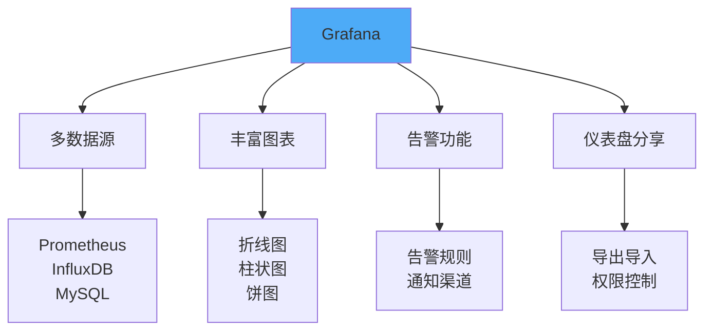

**核心特性：**
- 支持多种数据源
- 丰富的图表类型
- 强大的告警功能
- 仪表盘分享和权限控制

### Grafana数据源配置

```yaml
# Prometheus数据源
datasources:
  - name: Prometheus
    type: prometheus
    url: http://prometheus:9090
    access: proxy
    isDefault: true

# InfluxDB数据源
  - name: InfluxDB
    type: influxdb
    url: http://influxdb:8086
    database: metrics
    access: proxy
```

### Grafana仪表盘配置

```json
{
  "dashboard": {
    "title": "系统监控大屏",
    "panels": [
      {
        "title": "请求数",
        "type": "graph",
        "targets": [
          {
            "expr": "rate(http_requests_total[5m])",
            "legendFormat": "{{method}} {{endpoint}}"
          }
        ]
      },
      {
        "title": "错误率",
        "type": "graph",
        "targets": [
          {
            "expr": "rate(http_requests_total{status=\"500\"}[5m]) / rate(http_requests_total[5m])",
            "legendFormat": "Error Rate"
          }
        ]
      },
      {
        "title": "响应时间",
        "type": "graph",
        "targets": [
          {
            "expr": "histogram_quantile(0.95, rate(http_request_duration_seconds_bucket[5m]))",
            "legendFormat": "P95"
          }
        ]
      },
      {
        "title": "CPU使用率",
        "type": "graph",
        "targets": [
          {
            "expr": "100 - (avg(irate(node_cpu_seconds_total{mode=\"idle\"}[5m])) * 100)",
            "legendFormat": "CPU Usage"
          }
        ]
      }
    ]
  }
}
```

### Grafana告警配置

```yaml
# 告警规则
alert:
  - name: HighErrorRate
    condition: |
      rate(http_requests_total{status="500"}[5m]) / 
      rate(http_requests_total[5m]) > 0.05
    for: 5m
    annotations:
      summary: "错误率过高"
      description: "错误率超过5%，持续5分钟"
    notifications:
      - email
      - slack

  - name: HighResponseTime
    condition: |
      histogram_quantile(0.95, 
        rate(http_request_duration_seconds_bucket[5m])) > 1
    for: 5m
    annotations:
      summary: "响应时间过长"
      description: "P95响应时间超过1秒，持续5分钟"
```

## 数据展示最佳实践

### 1. 仪表盘设计

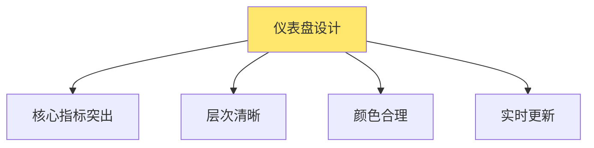

**设计原则：**
- **核心指标突出**：重要指标放在显眼位置
- **层次清晰**：按重要性组织布局
- **颜色合理**：使用颜色表达状态（绿正常、黄警告、红错误）
- **实时更新**：数据实时刷新

### 2. 图表选择

- **折线图**：趋势分析
- **柱状图**：对比分析
- **饼图**：占比分析
- **仪表盘**：单指标展示
- **热力图**：分布分析

### 3. 告警设计

- **告警级别**：严重、警告、信息
- **告警规则**：合理的阈值设置
- **告警通知**：多渠道通知
- **告警处理**：告警处理流程

# 监控架构设计

## 监控架构

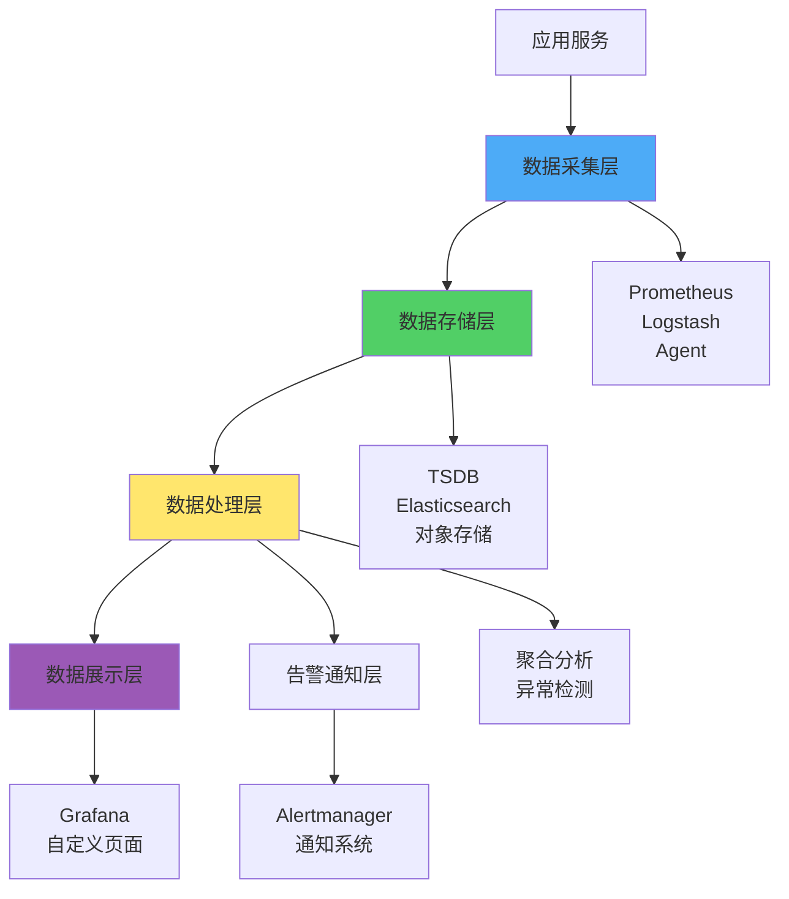

## 监控分层

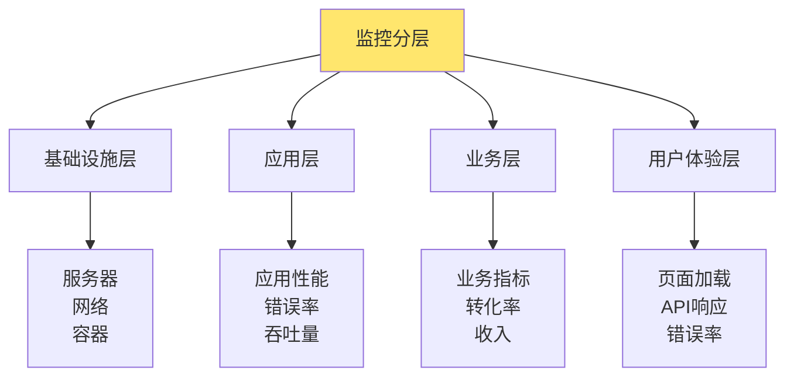

# 监控最佳实践

## 1. 监控指标设计

- **黄金指标**：延迟、流量、错误、饱和度
- **业务指标**：订单数、交易额、用户数
- **系统指标**：CPU、内存、磁盘、网络

## 2. 告警设计

- **告警规则**：合理的阈值和持续时间
- **告警级别**：严重、警告、信息
- **告警收敛**：避免告警风暴
- **告警处理**：明确的处理流程

## 3. 数据保留

- **原始数据**：保留7-30天
- **聚合数据**：保留1-3个月
- **长期数据**：保留1年或更久

## 4. 成本优化

- **采样**：对高频指标进行采样
- **聚合**：存储聚合数据而非原始数据
- **压缩**：使用数据压缩
- **分层存储**：热数据SSD，冷数据HDD

# 总结

分布式系统监控是保障系统稳定运行的关键基础设施。通过合理的数据打点、数据存储和数据展示，可以实现对系统的全面监控。

**关键要点：**
1. **数据打点**：基于日志、数据库、时序数据库等多种方式
2. **数据存储**：选择合适的存储方案（Prometheus、InfluxDB、ELK等）
3. **数据展示**：使用Grafana或自定义页面可视化数据
4. **告警通知**：及时发现和处理问题

**最佳实践：**
- 设计合理的监控指标
- 选择合适的监控工具
- 建立完善的告警机制
- 持续优化监控系统

通过系统性的监控设计，可以构建可观测、可维护、高性能的分布式系统。
