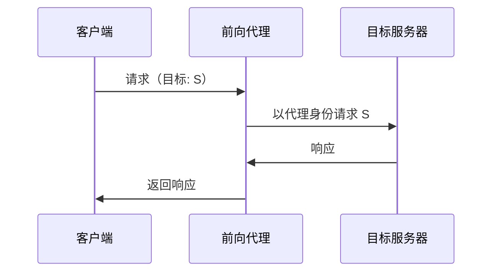
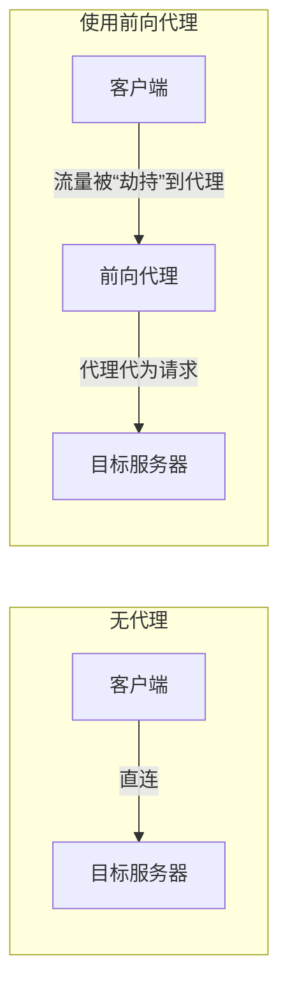
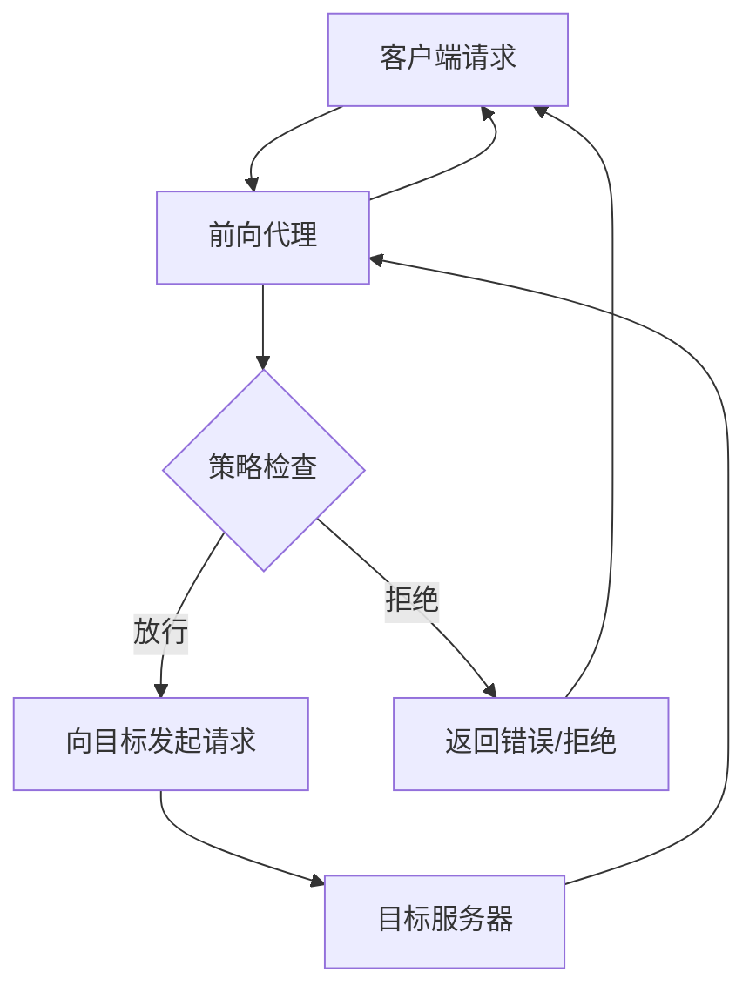
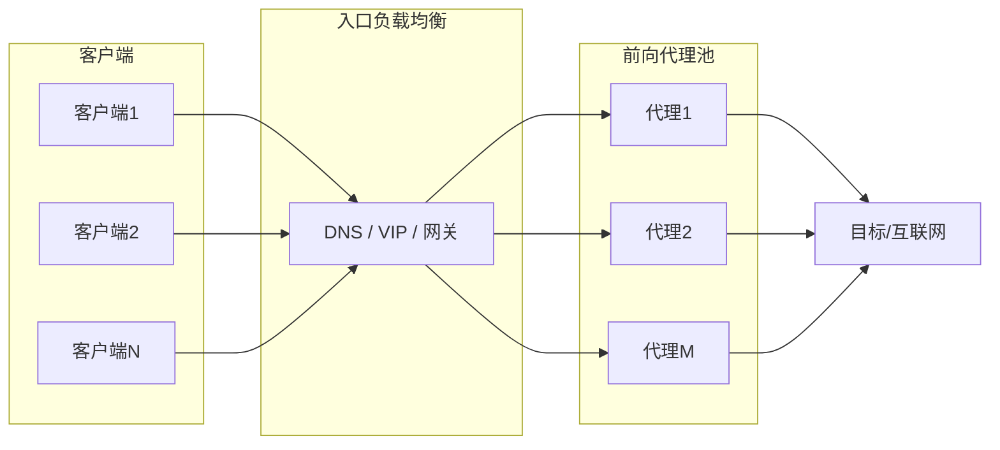
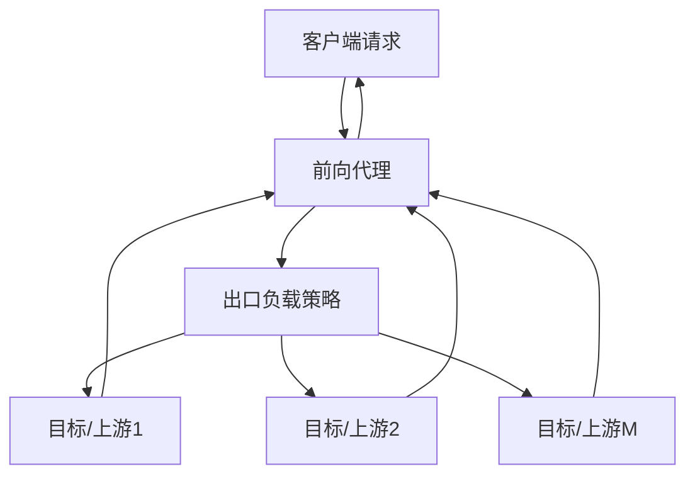
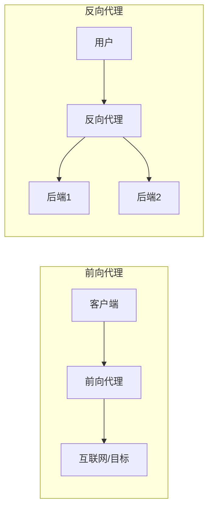

# 概述

**前向代理（Forward Proxy）** 是站在**客户端一侧**的代理服务器：客户端把请求发往代理，由代理代替客户端向**目标源站**发起请求，并把响应返回给客户端。对源站而言，请求来自代理而非真实用户，因此前向代理常被用于**隐藏客户端身份、统一出口、访问控制、缓存**等场景。

**核心特征**：客户端**显式配置**使用该代理（如浏览器/系统设置代理地址）；代理代表客户端“向前”访问互联网或内网服务，即**流量由客户端 → 代理 → 目标服务器**。

# 工作原理

- **客户端**：配置了代理地址（如 `http://proxy:8080`），所有要访问外网的请求先发往代理。
- **前向代理**：收到请求后，解析目标（如 URL、Host），再以**代理自身**为请求方向目标服务器建连并转发请求；收到响应后原路返回给客户端。
- **目标服务器**：看到的是代理的 IP 和请求，无法直接看到真实客户端（除非代理在请求头里附带 X-Forwarded-For 等）。

# 流量劫持

在“前向代理”语境下，**流量劫持**指的是：客户端的出站流量被**拦截并导向代理**，再由代理决定是否转发、如何转发、或做修改后再转发。

- **“劫持”的含义**：客户端本应直连目标，但因配置了代理，流量先到代理，由代理再连目标；从“不经代理直连”的视角看，相当于出站流量被“劫”到代理上。
- **实现方式**：  
  - **显式配置**：用户在系统或浏览器里设置 HTTP/HTTPS/SOCKS 代理，应用按配置把请求发往代理。  
  - **透明代理**：网关/路由器上做 DNAT 或策略路由，把指定端口的流量重定向到代理，客户端无感知（不配代理也会被转到代理）。
- **代理能做什么**：可对请求/响应做**检查、过滤、改写、缓存、记录**，从而实现访问控制、内容过滤、审计、加速等。

因此，前向代理下的“流量劫持”本质是**把客户端的出站流量集中到代理，由代理统一转发并施加策略**。

# 流量转发

**流量转发**指前向代理收到客户端请求后，**代表客户端**向目标服务器建立连接、发送请求、接收响应，并把响应返回给客户端的过程。

- **转发动作**：代理作为 TCP/HTTP 中间人，把客户端的请求（可能经过协议解析与改写）转发到目标，再把目标的响应转发回客户端。
- **协议支持**：常见有 **HTTP 代理**（CONNECT 可隧道化 HTTPS）、**SOCKS 代理**（应用层协议无关），透明代理则多在 L4 做转发。
- **与“劫持”的关系**：劫持解决“流量如何到代理”；转发解决“代理如何把流量送到目标并回传”。二者配合：先通过劫持/配置让流量进代理，再通过转发完成对目标服务器的访问。

# 流量负载均衡

前向代理场景下的**流量负载均衡**可从两个方向看：**入口侧**（多客户端流量如何分摊到多台代理实例）、**出口侧**（代理转发时若有多个等价目标，如何分摊到多个上游）。

## 入口侧：客户端流量在多代理间的均衡

当大量客户端共用代理出口时，单台代理容易成为瓶颈。通过**多实例 + 负载均衡**，把客户端请求分散到多台前向代理上，实现水平扩展与高可用。

- **实现方式**：  
  - **DNS 轮询/分片**：多个代理对应不同 A 记录或同一域名多 IP，客户端或本地 DNS 解析到不同代理。  
  - **四层 VIP + 健康检查**：F5、LVS、云厂商 LB 等对外一个 VIP，后端挂多台代理，按四层做转发与健康探测。  
  - **网关/策略路由**：透明代理场景下，网关按源 IP、五元组等把流量哈希或轮询到不同代理节点。  
- **策略**：轮询、加权轮询、最少连接、一致性哈希（同一客户端尽量固定到同一代理，便于会话或缓存亲和）等。

## 出口侧：代理到多上游目标的均衡

当前向代理转发到**多个等价目标**（如多个镜像源、多个出口 IP、多个上游代理）时，需要在出口侧做**目标选择**，把请求合理分摊到不同上游，并兼顾可用性与亲和性。

- **典型场景**：  
  - **多镜像源**：下载/拉包时，同一资源有多个 CDN 或镜像，代理按策略选一个上游（轮询、加权、按地域、按健康状态）。  
  - **多出口 IP**：代理有多个出口地址，按会话或目标做哈希/轮询，分散连接与限流风险。  
  - **多级代理/链式代理**：前向代理上游再接多台代理，在多台上游代理间做负载均衡。  
- **策略**：轮询、加权、最少连接、一致性哈希（同一目标 Host 或 URL 尽量走同一上游，利于连接复用与缓存）、故障剔除与熔断等。

## 负载均衡策略简述

| 策略           | 说明 | 适用场景 |
|----------------|------|----------|
| **轮询**       | 依次选下一个节点 | 节点能力相近、无状态 |
| **加权轮询**   | 按权重分配比例 | 节点性能不一 |
| **最少连接**   | 选当前连接数最少的节点 | 长连接、连接数差异大 |
| **一致性哈希** | 按 key（如客户端 IP、目标 Host）哈希到固定节点 | 需要会话/缓存亲和 |
| **随机**       | 随机选节点 | 简单分流、打破热点 |

## 与前向代理整体流程的关系

负载均衡在前向代理链路中的位置可概括为：

1. **客户端 → 代理**：入口侧 LB 决定请求由哪台代理实例处理。  
2. **代理 → 目标**：出口侧 LB（若存在多上游）决定请求由哪个上游/目标处理。  
3. **代理内部**：连接池、健康检查、熔断等可与出口 LB 配合，避免把流量打到不可用或过载的上游。

因此，**流量负载均衡**在前向代理中既包括“多代理实例分担客户端流量”，也包括“代理在多个等价上游间合理分发出口流量”，二者结合可提升整体吞吐与可用性。

# 典型应用场景

| 场景         | 说明 |
|--------------|------|
| **统一出口** | 内网机器通过同一台前向代理访问外网，便于做策略、审计、NAT。 |
| **流量负载均衡** | 入口侧多代理实例分担客户端流量；出口侧在多个镜像/上游间分摊请求，提升吞吐与可用性。 |
| **访问控制** | 代理只放行白名单或合规流量，禁止访问特定域名/IP。 |
| **缓存加速** | 代理缓存常用资源，相同请求直接命中缓存，减少回源与延迟。 |
| **隐藏客户端** | 源站只看到代理 IP，可用于隐私或绕过“按 IP 限流”。 |
| **科学上网/跨网** | 客户端通过境外或特定区域代理访问被限制的资源。 |
| **内容过滤** | 企业/学校在代理侧过滤不良站点或注入提示页。 |

# 前向代理 vs 反向代理

| 维度       | 前向代理                     | 反向代理                     |
|------------|------------------------------|------------------------------|
| **代表谁** | 代表**客户端**访问外部服务   | 代表**服务器**接收来自互联网的请求 |
| **配置方** | 客户端（或网关）配置代理     | 服务端部署，客户端通常无感知 |
| **客户端是否知悉** | 通常知道在用代理（或透明代理不知） | 多数不知道，以为直连“网站” |
| **典型用途** | 出口统一、访问控制、缓存、翻墙 | 负载均衡、隐藏源站、SSL 卸载、网关 |

# 小结

- **前向代理**：站在客户端一侧，客户端（或网络）把请求发到代理，由代理代为访问目标服务器并回传响应。
- **流量劫持**：客户端出站流量被引到代理（显式配置或透明重定向），由代理统一处理后再决定是否、如何转发。
- **流量转发**：代理收到请求后向目标建连并转发请求/响应，是前向代理的核心动作；常与访问控制、缓存、审计等策略结合。
- **流量负载均衡**：入口侧在多台前向代理实例间分摊客户端流量；出口侧在多个等价上游/目标间分摊请求；常用轮询、加权、最少连接、一致性哈希等策略。
- 与**反向代理**的区别：前向代理代表“客户端”访问外部，反向代理代表“服务端”接收外部请求，二者在代表对象和典型场景上不同。
