工程化框架设计是构建可维护、可扩展、高性能微服务系统的基础。本文档详细介绍了微服务框架的各个核心组件和设计原则。

# 自动生成代码框架

代码生成是提高开发效率、保证代码一致性的重要手段。通过代码生成工具，可以自动生成重复性代码，减少人工错误。

## 代码生成的价值

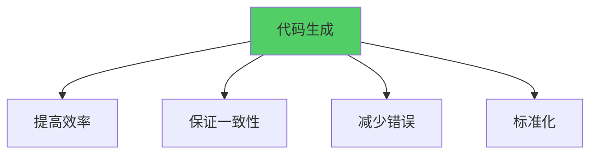

**优势：**
- **提高开发效率**：自动生成重复代码，减少手工编写
- **保证代码一致性**：统一的代码风格和结构
- **减少人为错误**：避免手工编写导致的错误
- **标准化开发**：统一的开发规范和模式

## 代码生成场景

### 1. API代码生成

从API定义（如OpenAPI/Swagger、Protocol Buffers）自动生成客户端和服务端代码。

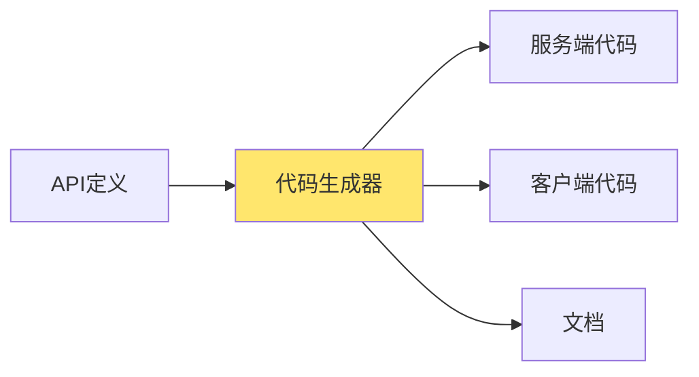

**生成内容：**
- 服务端接口实现框架
- 客户端调用代码
- 数据模型定义
- API文档

### 2. 数据模型生成

从数据库Schema自动生成ORM模型代码。

**生成内容：**
- 数据模型结构体
- CRUD操作方法
- 数据库迁移代码
- 查询构建器

### 3. 项目脚手架生成

自动生成项目基础结构和配置文件。

**生成内容：**
- 项目目录结构
- 配置文件模板
- 基础代码框架
- 依赖管理文件

## 代码生成工具

### Go语言生态

- **go-swagger**：从Swagger定义生成Go代码
- **protoc-gen-go**：从Protocol Buffers生成Go代码
- **gorm**：从数据库生成模型代码
- **cobra**：CLI应用代码生成

### 实现示例

```go
// 代码生成器接口
type CodeGenerator interface {
    Generate(definition Definition) ([]File, error)
}

// API代码生成器
type APIGenerator struct {
    templateDir string
    outputDir   string
}

func (g *APIGenerator) Generate(apiDef APIDefinition) error {
    // 1. 解析API定义
    // 2. 加载模板
    // 3. 生成代码
    // 4. 格式化代码
    // 5. 写入文件
}
```

# 脚手架工具

脚手架工具（Scaffolding Tools）是快速创建项目基础结构的工具，通过预定义的模板和配置，自动生成项目的目录结构、配置文件、基础代码等，大幅提升项目初始化效率。

## 脚手架工具的价值

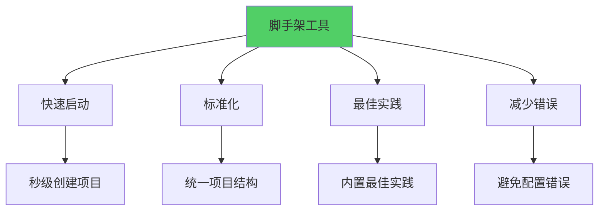

**核心价值：**
- **快速启动**：秒级创建项目，无需手动搭建
- **标准化**：统一的项目结构和代码风格
- **最佳实践**：内置行业最佳实践和设计模式
- **减少错误**：避免手动配置导致的错误
- **团队协作**：统一的开发环境，降低协作成本

## 脚手架工具分类

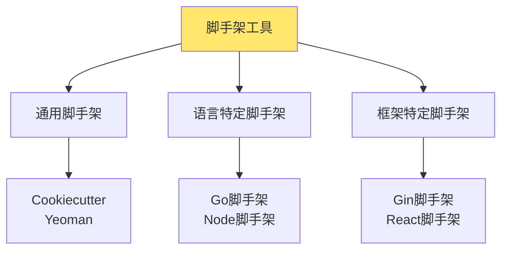

### 1. 通用脚手架工具

**Cookiecutter**
- 跨语言项目模板工具
- 支持变量替换
- 模板丰富

**Yeoman**
- Web应用脚手架工具
- 插件化架构
- 生态丰富

### 2. 语言特定脚手架

**Go语言脚手架：**
- **gobuffalo/buffalo**：全栈Web框架脚手架
- **kataras/cli**：CLI应用脚手架
- **自定义脚手架**：基于cobra或自定义实现

**Node.js脚手架：**
- **create-react-app**：React应用脚手架
- **vue-cli**：Vue应用脚手架
- **nest-cli**：NestJS应用脚手架

### 3. 框架特定脚手架

针对特定框架的脚手架，内置框架最佳实践。

## Go语言脚手架工具

### 1. Buffalo

Buffalo是Go语言的快速Web开发框架，提供完整的项目脚手架。

#### 特性

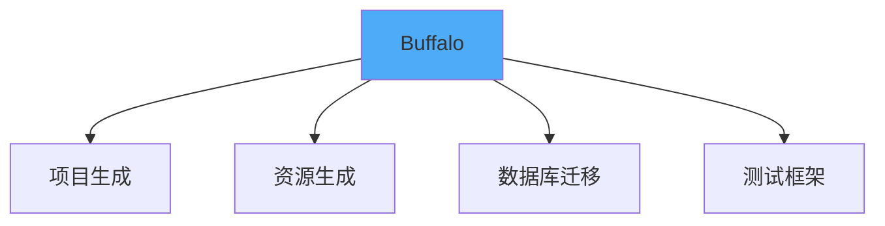

**核心功能：**
- 快速创建Web应用
- 资源生成（CRUD）
- 数据库迁移
- 测试框架集成

#### 使用示例

```bash
# 安装Buffalo
go install github.com/gobuffalo/cli/cmd/buffalo@latest

# 创建新项目
buffalo new myapp --api

# 生成资源
buffalo generate resource users name:string email:string

# 生成数据库迁移
buffalo generate migration create_users_table
```

### 2. Cobra CLI脚手架

Cobra是Go语言的CLI应用框架，可以快速生成CLI应用结构。

#### 使用示例

```bash
# 安装Cobra
go install github.com/spf13/cobra-cli@latest

# 创建CLI应用
cobra-cli init mycli

# 添加命令
cobra-cli add serve
cobra-cli add config
```

#### 生成的项目结构

```
mycli/
├── cmd/
│   ├── root.go      # 根命令
│   ├── serve.go     # serve命令
│   └── config.go    # config命令
├── internal/
│   └── ...          # 内部包
├── main.go          # 入口文件
└── go.mod
```

### 3. 自定义脚手架工具

基于实际需求，可以开发自定义的脚手架工具。

#### 脚手架工具设计

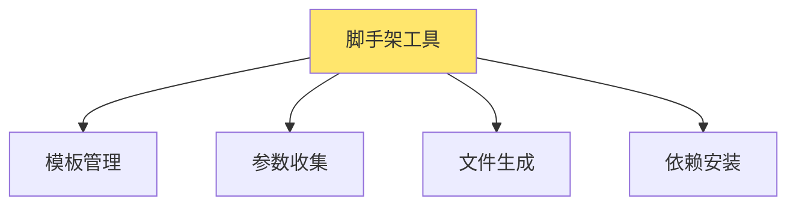

#### 实现示例

```go
// 脚手架工具
package main

import (
    "fmt"
    "os"
    "path/filepath"
    "text/template"
)

type ProjectConfig struct {
    Name        string
    Module      string
    Framework   string
    Database    string
    UseRedis    bool
    UseKafka    bool
}

type Scaffold struct {
    templates map[string]*template.Template
}

func NewScaffold() *Scaffold {
    return &Scaffold{
        templates: make(map[string]*template.Template),
    }
}

// 加载模板
func (s *Scaffold) LoadTemplate(name, content string) error {
    tmpl, err := template.New(name).Parse(content)
    if err != nil {
        return err
    }
    s.templates[name] = tmpl
    return nil
}

// 生成项目
func (s *Scaffold) GenerateProject(config ProjectConfig, outputDir string) error {
    // 1. 创建项目目录
    if err := os.MkdirAll(outputDir, 0755); err != nil {
        return err
    }
    
    // 2. 生成目录结构
    dirs := []string{
        "cmd",
        "internal",
        "internal/handler",
        "internal/service",
        "internal/repository",
        "internal/model",
        "pkg",
        "configs",
        "scripts",
    }
    
    for _, dir := range dirs {
        if err := os.MkdirAll(filepath.Join(outputDir, dir), 0755); err != nil {
            return err
        }
    }
    
    // 3. 生成文件
    files := map[string]string{
        "main.go":           mainGoTemplate,
        "go.mod":            goModTemplate,
        "configs/app.yaml":  configTemplate,
        ".gitignore":        gitignoreTemplate,
        "README.md":         readmeTemplate,
    }
    
    for filePath, content := range files {
        if err := s.generateFile(outputDir, filePath, content, config); err != nil {
            return err
        }
    }
    
    // 4. 根据配置生成额外文件
    if config.UseRedis {
        s.generateFile(outputDir, "internal/repository/redis.go", redisTemplate, config)
    }
    
    if config.UseKafka {
        s.generateFile(outputDir, "internal/mq/kafka.go", kafkaTemplate, config)
    }
    
    return nil
}

func (s *Scaffold) generateFile(outputDir, filePath, content string, config ProjectConfig) error {
    tmpl, err := template.New("file").Parse(content)
    if err != nil {
        return err
    }
    
    fullPath := filepath.Join(outputDir, filePath)
    file, err := os.Create(fullPath)
    if err != nil {
        return err
    }
    defer file.Close()
    
    return tmpl.Execute(file, config)
}

// 模板定义
const mainGoTemplate = `package main

import (
    "log"
    "{{.Module}}/internal/handler"
    "{{.Module}}/internal/service"
    "{{.Module}}/internal/repository"
)

func main() {
    // 初始化依赖
    repo := repository.New()
    svc := service.New(repo)
    h := handler.New(svc)
    
    // 启动服务
    if err := h.Start(); err != nil {
        log.Fatal(err)
    }
}
`

const goModTemplate = `module {{.Module}}

go 1.21

require (
    github.com/gin-gonic/gin v1.9.1
    {{- if .UseRedis}}
    github.com/redis/go-redis/v9 v9.0.5
    {{- end}}
    {{- if .UseKafka}}
    github.com/IBM/sarama v1.41.2
    {{- end}}
)
`

const configTemplate = `app:
  name: {{.Name}}
  port: 8080
  env: development

database:
  host: localhost
  port: 3306
  user: root
  password: ""
  database: {{.Name}}
`

const gitignoreTemplate = `# Binaries
*.exe
*.exe~
*.dll
*.so
*.dylib

# Test binary
*.test

# Output
/bin/
/dist/

# IDE
.idea/
.vscode/
*.swp
*.swo

# OS
.DS_Store
Thumbs.db
`

const readmeTemplate = `# {{.Name}}

{{.Name}} 项目说明

## 快速开始

\`\`\`bash
# 安装依赖
go mod download

# 运行服务
go run cmd/main.go
\`\`\`

## 项目结构

- \`cmd/\`: 应用入口
- \`internal/\`: 内部代码
- \`pkg/\`: 可复用包
- \`configs/\`: 配置文件
`

// CLI入口
func main() {
    scaffold := NewScaffold()
    
    config := ProjectConfig{
        Name:      "myapp",
        Module:    "github.com/user/myapp",
        Framework: "gin",
        Database:  "mysql",
        UseRedis:  true,
        UseKafka:  false,
    }
    
    if err := scaffold.GenerateProject(config, "./myapp"); err != nil {
        fmt.Printf("Error: %v\n", err)
        os.Exit(1)
    }
    
    fmt.Println("Project generated successfully!")
}
```

## 脚手架工具功能设计

### 1. 项目结构生成

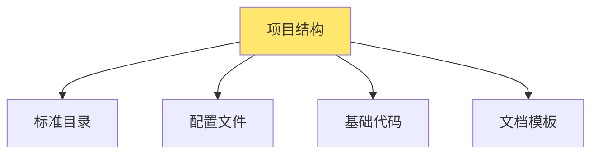

**标准目录结构：**
```
project/
├── cmd/              # 应用入口
│   └── main.go
├── internal/         # 内部代码
│   ├── handler/     # HTTP处理器
│   ├── service/      # 业务逻辑
│   ├── repository/   # 数据访问
│   └── model/        # 数据模型
├── pkg/              # 可复用包
├── configs/          # 配置文件
├── scripts/          # 脚本文件
├── docs/             # 文档
├── tests/            # 测试
├── go.mod
├── go.sum
├── .gitignore
└── README.md
```

### 2. 配置文件生成

脚手架工具可以生成多种配置文件：

**应用配置：**
- `configs/app.yaml`：应用配置
- `configs/database.yaml`：数据库配置
- `configs/redis.yaml`：Redis配置

**开发配置：**
- `.env.example`：环境变量示例
- `.gitignore`：Git忽略文件
- `Makefile`：构建脚本

**CI/CD配置：**
- `.github/workflows/ci.yml`：CI配置
- `Dockerfile`：容器化配置
- `docker-compose.yml`：本地开发环境

### 3. 代码模板生成

#### Handler模板

```go
// internal/handler/user_handler.go
package handler

import (
    "net/http"
    "{{.Module}}/internal/service"
)

type UserHandler struct {
    userService *service.UserService
}

func NewUserHandler(userService *service.UserService) *UserHandler {
    return &UserHandler{
        userService: userService,
    }
}

func (h *UserHandler) CreateUser(w http.ResponseWriter, r *http.Request) {
    // 实现创建用户逻辑
}

func (h *UserHandler) GetUser(w http.ResponseWriter, r *http.Request) {
    // 实现获取用户逻辑
}
```

#### Service模板

```go
// internal/service/user_service.go
package service

import (
    "{{.Module}}/internal/model"
    "{{.Module}}/internal/repository"
)

type UserService struct {
    userRepo *repository.UserRepository
}

func NewUserService(userRepo *repository.UserRepository) *UserService {
    return &UserService{
        userRepo: userRepo,
    }
}

func (s *UserService) CreateUser(user *model.User) error {
    // 业务逻辑
    return s.userRepo.Create(user)
}
```

#### Repository模板

```go
// internal/repository/user_repository.go
package repository

import (
    "{{.Module}}/internal/model"
    "gorm.io/gorm"
)

type UserRepository struct {
    db *gorm.DB
}

func NewUserRepository(db *gorm.DB) *UserRepository {
    return &UserRepository{db: db}
}

func (r *UserRepository) Create(user *model.User) error {
    return r.db.Create(user).Error
}

func (r *UserRepository) FindByID(id uint) (*model.User, error) {
    var user model.User
    err := r.db.First(&user, id).Error
    return &user, err
}
```

### 4. 中间件生成

脚手架可以生成常用中间件：

```go
// internal/middleware/auth.go
package middleware

import (
    "net/http"
)

func AuthMiddleware(next http.Handler) http.Handler {
    return http.HandlerFunc(func(w http.ResponseWriter, r *http.Request) {
        // 认证逻辑
        token := r.Header.Get("Authorization")
        if token == "" {
            http.Error(w, "Unauthorized", http.StatusUnauthorized)
            return
        }
        
        // 验证token
        // ...
        
        next.ServeHTTP(w, r)
    })
}

// internal/middleware/logging.go
func LoggingMiddleware(next http.Handler) http.Handler {
    return http.HandlerFunc(func(w http.ResponseWriter, r *http.Request) {
        // 记录请求日志
        log.Printf("%s %s", r.Method, r.URL.Path)
        next.ServeHTTP(w, r)
    })
}
```

## 脚手架工具实现

### 基于模板的实现

```go
// 模板引擎
type TemplateEngine struct {
    templates map[string]*template.Template
    funcMap   template.FuncMap
}

func NewTemplateEngine() *TemplateEngine {
    return &TemplateEngine{
        templates: make(map[string]*template.Template),
        funcMap: template.FuncMap{
            "lower": strings.ToLower,
            "upper": strings.ToUpper,
            "title": strings.Title,
            "camelCase": toCamelCase,
            "snakeCase": toSnakeCase,
        },
    }
}

func (e *TemplateEngine) Render(templateName string, data interface{}) (string, error) {
    tmpl, ok := e.templates[templateName]
    if !ok {
        return "", fmt.Errorf("template %s not found", templateName)
    }
    
    var buf bytes.Buffer
    if err := tmpl.Execute(&buf, data); err != nil {
        return "", err
    }
    
    return buf.String(), nil
}
```

### 交互式CLI

```go
// 交互式脚手架
package main

import (
    "bufio"
    "fmt"
    "os"
    "strings"
)

type InteractiveScaffold struct {
    reader *bufio.Reader
}

func NewInteractiveScaffold() *InteractiveScaffold {
    return &InteractiveScaffold{
        reader: bufio.NewReader(os.Stdin),
    }
}

func (s *InteractiveScaffold) Prompt(question string) string {
    fmt.Print(question + ": ")
    answer, _ := s.reader.ReadString('\n')
    return strings.TrimSpace(answer)
}

func (s *InteractiveScaffold) PromptWithDefault(question, defaultValue string) string {
    fmt.Printf("%s [%s]: ", question, defaultValue)
    answer, _ := s.reader.ReadString('\n')
    answer = strings.TrimSpace(answer)
    if answer == "" {
        return defaultValue
    }
    return answer
}

func (s *InteractiveScaffold) PromptYesNo(question string) bool {
    for {
        answer := s.Prompt(question + " (y/n)")
        switch strings.ToLower(answer) {
        case "y", "yes":
            return true
        case "n", "no":
            return false
        default:
            fmt.Println("Please enter y or n")
        }
    }
}

func (s *InteractiveScaffold) CollectConfig() ProjectConfig {
    config := ProjectConfig{}
    
    config.Name = s.Prompt("Project name")
    config.Module = s.PromptWithDefault("Module path", fmt.Sprintf("github.com/user/%s", config.Name))
    
    fmt.Println("\nSelect framework:")
    fmt.Println("1. Gin")
    fmt.Println("2. Echo")
    fmt.Println("3. Fiber")
    frameworkChoice := s.Prompt("Choice")
    config.Framework = getFramework(frameworkChoice)
    
    fmt.Println("\nSelect database:")
    fmt.Println("1. MySQL")
    fmt.Println("2. PostgreSQL")
    fmt.Println("3. MongoDB")
    dbChoice := s.Prompt("Choice")
    config.Database = getDatabase(dbChoice)
    
    config.UseRedis = s.PromptYesNo("Use Redis?")
    config.UseKafka = s.PromptYesNo("Use Kafka?")
    
    return config
}

func getFramework(choice string) string {
    switch choice {
    case "1":
        return "gin"
    case "2":
        return "echo"
    case "3":
        return "fiber"
    default:
        return "gin"
    }
}

func getDatabase(choice string) string {
    switch choice {
    case "1":
        return "mysql"
    case "2":
        return "postgresql"
    case "3":
        return "mongodb"
    default:
        return "mysql"
    }
}
```

### 文件系统操作

```go
// 文件系统操作
type FileSystem struct{}

func (fs *FileSystem) CreateDir(path string) error {
    return os.MkdirAll(path, 0755)
}

func (fs *FileSystem) WriteFile(path, content string) error {
    dir := filepath.Dir(path)
    if err := os.MkdirAll(dir, 0755); err != nil {
        return err
    }
    
    return os.WriteFile(path, []byte(content), 0644)
}

func (fs *FileSystem) CopyFile(src, dst string) error {
    data, err := os.ReadFile(src)
    if err != nil {
        return err
    }
    
    return fs.WriteFile(dst, string(data))
}

func (fs *FileSystem) CopyDir(src, dst string) error {
    return filepath.Walk(src, func(path string, info os.FileInfo, err error) error {
        if err != nil {
            return err
        }
        
        relPath, err := filepath.Rel(src, path)
        if err != nil {
            return err
        }
        
        dstPath := filepath.Join(dst, relPath)
        
        if info.IsDir() {
            return fs.CreateDir(dstPath)
        }
        
        return fs.CopyFile(path, dstPath)
    })
}
```

## 脚手架工具最佳实践

### 1. 模板设计原则

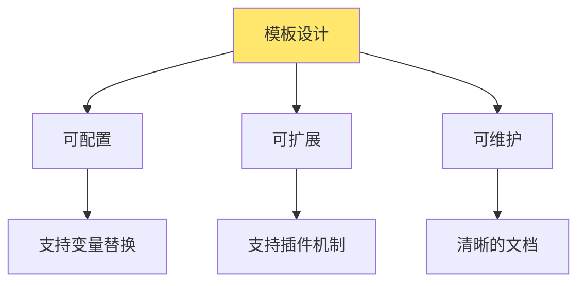

**原则：**
- **可配置**：支持参数化配置
- **可扩展**：支持自定义模板
- **可维护**：模板代码清晰，易于维护
- **文档完善**：提供详细的使用文档

### 2. 版本管理


**版本管理：**
- 使用语义化版本（SemVer）
- 保持向后兼容
- 提供版本迁移指南
- 支持多版本模板

### 3. 错误处理

```go
// 错误处理
type ScaffoldError struct {
    Code    string
    Message string
    Err     error
}

func (e *ScaffoldError) Error() string {
    if e.Err != nil {
        return fmt.Sprintf("%s: %v", e.Message, e.Err)
    }
    return e.Message
}

func (s *Scaffold) GenerateProject(config ProjectConfig, outputDir string) error {
    // 检查输出目录
    if _, err := os.Stat(outputDir); err == nil {
        return &ScaffoldError{
            Code:    "DIR_EXISTS",
            Message: fmt.Sprintf("Directory %s already exists", outputDir),
        }
    }
    
    // 生成项目
    if err := s.doGenerate(config, outputDir); err != nil {
        return &ScaffoldError{
            Code:    "GENERATE_FAILED",
            Message: "Failed to generate project",
            Err:     err,
        }
    }
    
    return nil
}
```

### 4. 依赖管理

```go
// 依赖管理
func (s *Scaffold) InstallDependencies(outputDir string) error {
    // 运行 go mod download
    cmd := exec.Command("go", "mod", "download")
    cmd.Dir = outputDir
    cmd.Stdout = os.Stdout
    cmd.Stderr = os.Stderr
    
    return cmd.Run()
}

func (s *Scaffold) TidyDependencies(outputDir string) error {
    // 运行 go mod tidy
    cmd := exec.Command("go", "mod", "tidy")
    cmd.Dir = outputDir
    cmd.Stdout = os.Stdout
    cmd.Stderr = os.Stderr
    
    return cmd.Run()
}
```

## 脚手架工具使用示例

### 完整使用流程

```bash
# 1. 安装脚手架工具
go install github.com/user/my-scaffold@latest

# 2. 运行脚手架
my-scaffold create myproject

# 交互式配置
# Project name: myproject
# Module path: github.com/user/myproject
# Framework: gin
# Database: mysql
# Use Redis? y
# Use Kafka? n

# 3. 进入项目目录
cd myproject

# 4. 安装依赖
go mod download

# 5. 运行项目
go run cmd/main.go
```

### 非交互式使用

```bash
# 使用命令行参数
my-scaffold create myproject \
    --module github.com/user/myproject \
    --framework gin \
    --database mysql \
    --redis \
    --no-kafka

# 使用配置文件
my-scaffold create myproject --config scaffold.yaml
```

## 脚手架工具扩展

### 插件机制

```go
// 插件接口
type ScaffoldPlugin interface {
    Name() string
    BeforeGenerate(config *ProjectConfig) error
    AfterGenerate(outputDir string) error
    Templates() map[string]string
}

// 插件注册
type Scaffold struct {
    plugins []ScaffoldPlugin
}

func (s *Scaffold) RegisterPlugin(plugin ScaffoldPlugin) {
    s.plugins = append(s.plugins, plugin)
}

func (s *Scaffold) GenerateProject(config ProjectConfig, outputDir string) error {
    // 执行插件前置钩子
    for _, plugin := range s.plugins {
        if err := plugin.BeforeGenerate(&config); err != nil {
            return err
        }
    }
    
    // 生成项目
    // ...
    
    // 执行插件后置钩子
    for _, plugin := range s.plugins {
        if err := plugin.AfterGenerate(outputDir); err != nil {
            return err
        }
    }
    
    return nil
}
```

### 自定义模板

```go
// 支持自定义模板目录
func (s *Scaffold) LoadCustomTemplates(templateDir string) error {
    return filepath.Walk(templateDir, func(path string, info os.FileInfo, err error) error {
        if err != nil {
            return err
        }
        
        if info.IsDir() {
            return nil
        }
        
        content, err := os.ReadFile(path)
        if err != nil {
            return err
        }
        
        relPath, _ := filepath.Rel(templateDir, path)
        s.templates[relPath] = string(content)
        
        return nil
    })
}
```

# 服务发现

服务发现是微服务架构的基础设施，用于动态发现和定位服务实例。

## 服务发现架构

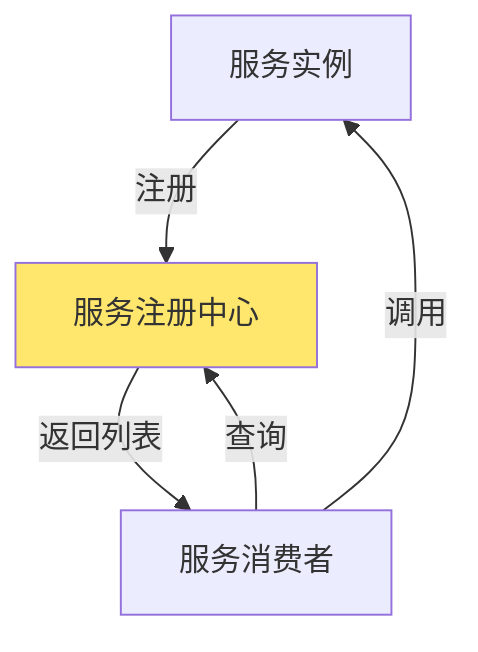

## etcd

etcd是CoreOS开发的分布式键值存储，常用于服务发现。

### 特性

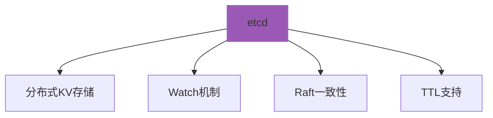

**核心特性：**
- 分布式键值存储
- Watch机制监听键变化
- Raft一致性算法
- TTL支持（自动过期）
- 高可用集群

### 服务注册实现

```go
// etcd服务注册
type EtcdRegistry struct {
    client *clientv3.Client
    leaseID clientv3.LeaseID
}

func (r *EtcdRegistry) Register(service *Service) error {
    // 1. 创建租约
    lease, err := r.client.Grant(context.Background(), 30)
    if err != nil {
        return err
    }
    r.leaseID = lease.ID
    
    // 2. 注册服务
    key := fmt.Sprintf("/services/%s/%s", service.Name, service.InstanceID)
    value, _ := json.Marshal(service)
    
    _, err = r.client.Put(context.Background(), key, string(value), 
        clientv3.WithLease(lease.ID))
    if err != nil {
        return err
    }
    
    // 3. 续约
    go r.keepAlive()
    return nil
}

func (r *EtcdRegistry) keepAlive() {
    ch, err := r.client.KeepAlive(context.Background(), r.leaseID)
    if err != nil {
        return
    }
    
    for ka := range ch {
        log.Printf("续约成功: %v", ka)
    }
}
```

### 服务发现实现

```go
// etcd服务发现
func (r *EtcdRegistry) Discover(serviceName string) ([]*Service, error) {
    prefix := fmt.Sprintf("/services/%s/", serviceName)
    resp, err := r.client.Get(context.Background(), prefix, 
        clientv3.WithPrefix())
    if err != nil {
        return nil, err
    }
    
    var services []*Service
    for _, kv := range resp.Kvs {
        var service Service
        if err := json.Unmarshal(kv.Value, &service); err != nil {
            continue
        }
        services = append(services, &service)
    }
    return services, nil
}

// Watch服务变化
func (r *EtcdRegistry) Watch(serviceName string, handler func([]*Service)) {
    prefix := fmt.Sprintf("/services/%s/", serviceName)
    watchChan := r.client.Watch(context.Background(), prefix, 
        clientv3.WithPrefix())
    
    for watchResp := range watchChan {
        services, _ := r.Discover(serviceName)
        handler(services)
    }
}
```

## nacos

Nacos是阿里巴巴开源的服务发现和配置管理平台。

### 特性

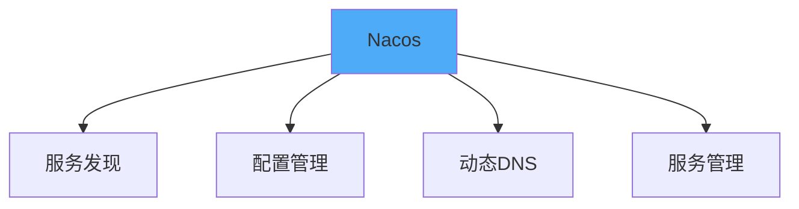

**核心特性：**
- 服务注册和发现
- 动态配置管理
- 服务健康监测
- 动态DNS服务
- 服务及其元数据管理

### 服务注册实现

```go
// Nacos客户端
type NacosClient struct {
    namingClient naming_client.INamingClient
}

func (c *NacosClient) Register(service *Service) error {
    instance := vo.RegisterInstanceParam{
        Ip:          service.IP,
        Port:        uint64(service.Port),
        ServiceName: service.Name,
        Weight:      10,
        Enable:      true,
        Healthy:     true,
        Metadata:    service.Metadata,
    }
    
    _, err := c.namingClient.RegisterInstance(instance)
    return err
}
```

### 服务发现实现

```go
// Nacos服务发现
func (c *NacosClient) Discover(serviceName string) ([]*Service, error) {
    param := vo.SelectInstancesParam{
        ServiceName: serviceName,
        GroupName:   "DEFAULT_GROUP",
        HealthyOnly: true,
    }
    
    instances, err := c.namingClient.SelectInstances(param)
    if err != nil {
        return nil, err
    }
    
    var services []*Service
    for _, instance := range instances {
        services = append(services, &Service{
            Name:     instance.ServiceName,
            IP:       instance.Ip,
            Port:     int(instance.Port),
            Metadata: instance.Metadata,
        })
    }
    return services, nil
}
```

# 配置管理

配置管理是框架的核心功能，支持本地配置和配置中心两种方式。

## 配置管理架构

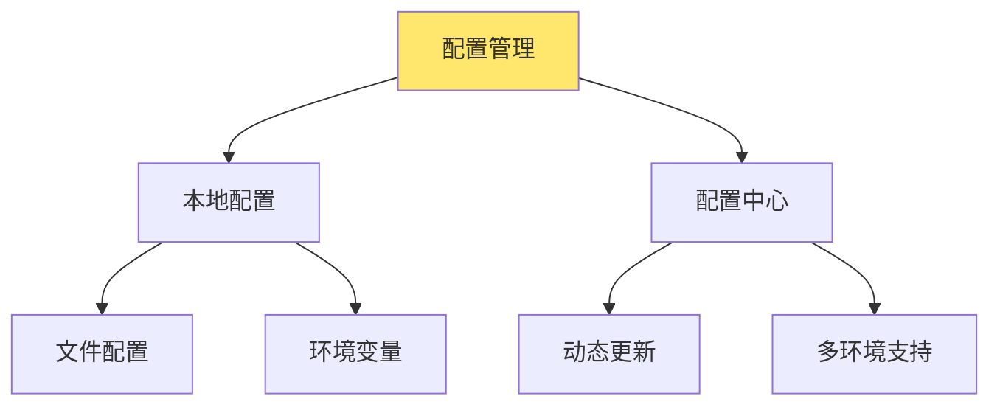

## 本地配置管理

本地配置管理适用于配置相对固定、不需要频繁变更的场景。

### 配置加载策略


**优先级：**
1. 环境变量（最高）
2. 配置文件
3. 默认值（最低）

### cigar

Cigar是一个轻量级的Go配置管理库。

#### 特性

- 支持多种配置格式（YAML、JSON、TOML）
- 环境变量覆盖
- 配置验证
- 配置热加载
- 配置结构体绑定

#### 使用示例

```go
// 配置结构体
type Config struct {
    Server   ServerConfig   `yaml:"server"`
    Database DatabaseConfig `yaml:"database"`
    Redis    RedisConfig    `yaml:"redis"`
}

type ServerConfig struct {
    Host string `yaml:"host" env:"SERVER_HOST" default:"0.0.0.0"`
    Port int    `yaml:"port" env:"SERVER_PORT" default:"8080"`
}

// 加载配置
func LoadConfig(path string) (*Config, error) {
    cfg := &Config{}
    
    // 1. 从文件加载
    data, err := os.ReadFile(path)
    if err != nil {
        return nil, err
    }
    
    if err := yaml.Unmarshal(data, cfg); err != nil {
        return nil, err
    }
    
    // 2. 环境变量覆盖
    if err := envconfig.Process("", cfg); err != nil {
        return nil, err
    }
    
    // 3. 配置验证
    if err := cfg.Validate(); err != nil {
        return nil, err
    }
    
    return cfg, nil
}

// 配置验证
func (c *Config) Validate() error {
    if c.Server.Port <= 0 || c.Server.Port > 65535 {
        return fmt.Errorf("invalid port: %d", c.Server.Port)
    }
    return nil
}
```

#### 配置热加载

```go
// 配置热加载
func WatchConfig(path string, callback func(*Config)) error {
    watcher, err := fsnotify.NewWatcher()
    if err != nil {
        return err
    }
    defer watcher.Close()
    
    if err := watcher.Add(path); err != nil {
        return err
    }
    
    for {
        select {
        case event := <-watcher.Events:
            if event.Op&fsnotify.Write == fsnotify.Write {
                cfg, err := LoadConfig(path)
                if err != nil {
                    log.Printf("配置加载失败: %v", err)
                    continue
                }
                callback(cfg)
            }
        case err := <-watcher.Errors:
            log.Printf("文件监听错误: %v", err)
        }
    }
}
```

## 配置中心配置管理

配置中心适用于需要动态更新、多环境管理的场景。

### nacos

Nacos配置管理功能强大，支持动态配置更新。

#### 配置获取

```go
// Nacos配置客户端
type NacosConfigClient struct {
    configClient config_client.IConfigClient
}

func (c *NacosConfigClient) GetConfig(dataId, group string) (string, error) {
    content, err := c.configClient.GetConfig(vo.ConfigParam{
        DataId: dataId,
        Group:  group,
    })
    return content, err
}
```

#### 配置监听

```go
// 配置监听
func (c *NacosConfigClient) ListenConfig(dataId, group string, 
    callback func(string)) error {
    return c.configClient.ListenConfig(vo.ConfigParam{
        DataId: dataId,
        Group:  group,
        OnChange: func(namespace, group, dataId, data string) {
            callback(data)
        },
    })
}

// 使用示例
func main() {
    client := NewNacosConfigClient()
    
    // 获取配置
    config, _ := client.GetConfig("order-service", "DEFAULT_GROUP")
    
    // 监听配置变更
    client.ListenConfig("order-service", "DEFAULT_GROUP", func(newConfig string) {
        log.Printf("配置已更新: %s", newConfig)
        // 重新加载配置
        reloadConfig(newConfig)
    })
}
```

#### 配置管理最佳实践

```go
// 配置管理器
type ConfigManager struct {
    localConfig  *Config
    remoteConfig *Config
    mu           sync.RWMutex
}

func (m *ConfigManager) GetConfig() *Config {
    m.mu.RLock()
    defer m.mu.RUnlock()
    
    // 优先使用远程配置，降级到本地配置
    if m.remoteConfig != nil {
        return m.remoteConfig
    }
    return m.localConfig
}

func (m *ConfigManager) UpdateConfig(config *Config) {
    m.mu.Lock()
    defer m.mu.Unlock()
    m.remoteConfig = config
}
```

# 日志管理

日志管理是系统可观测性的重要组成部分，包括日志收集、存储、查询和分析。

## 日志管理架构

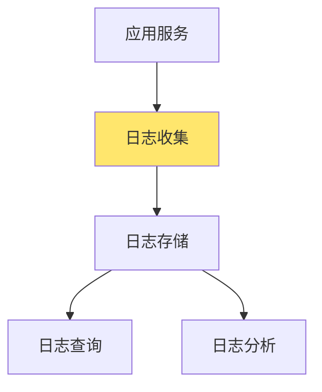

## 日志文件管理

本地日志文件管理适用于单机部署或小规模场景。

### 日志轮转


**轮转策略：**
- 按大小轮转：文件达到指定大小
- 按时间轮转：每天/每小时轮转
- 保留数量：保留最近N个文件

### 实现示例

```go
// 日志轮转
type RotatingFileWriter struct {
    file     *os.File
    filename string
    maxSize  int64
    maxFiles int
    currentSize int64
    mu       sync.Mutex
}

func (w *RotatingFileWriter) Write(p []byte) (n int, err error) {
    w.mu.Lock()
    defer w.mu.Unlock()
    
    // 检查是否需要轮转
    if w.currentSize+int64(len(p)) > w.maxSize {
        if err := w.rotate(); err != nil {
            return 0, err
        }
    }
    
    n, err = w.file.Write(p)
    w.currentSize += int64(n)
    return n, err
}

func (w *RotatingFileWriter) rotate() error {
    // 关闭当前文件
    w.file.Close()
    
    // 轮转旧文件
    for i := w.maxFiles - 1; i > 0; i-- {
        oldName := fmt.Sprintf("%s.%d", w.filename, i)
        newName := fmt.Sprintf("%s.%d", w.filename, i+1)
        os.Rename(oldName, newName)
    }
    
    // 移动当前文件
    os.Rename(w.filename, fmt.Sprintf("%s.1", w.filename))
    
    // 创建新文件
    file, err := os.Create(w.filename)
    if err != nil {
        return err
    }
    w.file = file
    w.currentSize = 0
    
    return nil
}
```

### 结构化日志

```go
// 结构化日志
type StructuredLogger struct {
    logger *zap.Logger
}

func NewStructuredLogger() *StructuredLogger {
    config := zap.NewProductionConfig()
    config.OutputPaths = []string{"stdout", "app.log"}
    logger, _ := config.Build()
    
    return &StructuredLogger{logger: logger}
}

func (l *StructuredLogger) Info(msg string, fields ...zap.Field) {
    l.logger.Info(msg, fields...)
}

func (l *StructuredLogger) Error(msg string, err error, fields ...zap.Field) {
    l.logger.Error(msg, append(fields, zap.Error(err))...)
}

// 使用示例
logger.Info("订单创建成功",
    zap.String("orderId", "12345"),
    zap.String("userId", "user001"),
    zap.Float64("amount", 99.99),
)
```

## sls

阿里云日志服务（SLS）是云原生的日志管理平台。

### 特性

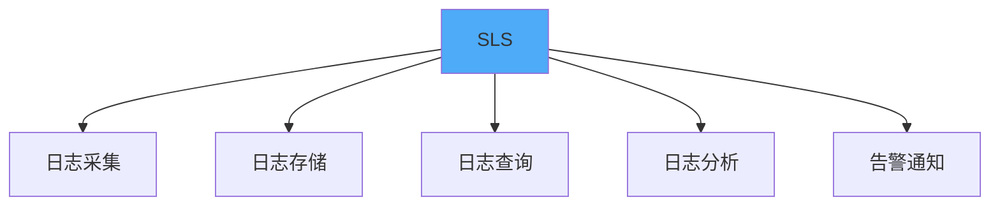

**核心特性：**
- 实时日志采集
- 海量日志存储
- 强大的查询分析
- 可视化仪表盘
- 告警通知

### SLS集成

```go
// SLS客户端
type SLSClient struct {
    client *sls.Client
    project string
    logstore string
}

func (c *SLSClient) WriteLog(logs []*sls.Log) error {
    logGroup := &sls.LogGroup{
        Logs: logs,
    }
    
    return c.client.PutLogs(c.project, c.logstore, logGroup)
}

// 日志写入
func (c *SLSClient) Log(level string, message string, fields map[string]string) error {
    log := &sls.Log{
        Time: proto.Uint32(uint32(time.Now().Unix())),
        Contents: []*sls.LogContent{
            {Key: proto.String("level"), Value: proto.String(level)},
            {Key: proto.String("message"), Value: proto.String(message)},
        },
    }
    
    for k, v := range fields {
        log.Contents = append(log.Contents, &sls.LogContent{
            Key:   proto.String(k),
            Value: proto.String(v),
        })
    }
    
    return c.WriteLog([]*sls.Log{log})
}
```

# 服务分类

根据服务的处理方式，可以将服务分为同步服务、异步服务和定时服务。

## 服务分类架构

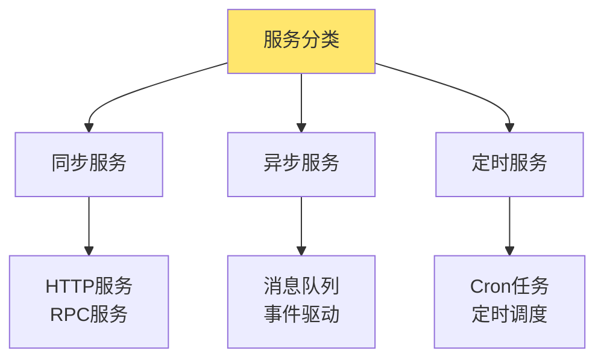

## 同步服务

同步服务处理请求-响应模式的业务，客户端等待服务端响应。

### 特点

- 请求-响应模式
- 客户端阻塞等待
- 实时性要求高
- 适合交互式业务

### 实现框架

```go
// 同步服务框架
type SyncService struct {
    router *gin.Engine
    rpcServer *grpc.Server
}

func (s *SyncService) Start() error {
    // 启动HTTP服务
    go s.startHTTPServer()
    
    // 启动RPC服务
    go s.startRPCServer()
    
    return nil
}

func (s *SyncService) startHTTPServer() error {
    return s.router.Run(":8080")
}

func (s *SyncService) startRPCServer() error {
    lis, err := net.Listen("tcp", ":9090")
    if err != nil {
        return err
    }
    return s.rpcServer.Serve(lis)
}
```

## 异步服务

异步服务处理事件驱动或消息队列模式的业务。

### 特点

- 事件驱动
- 解耦生产者和消费者
- 支持削峰填谷
- 最终一致性

### 实现框架

```go
// 异步服务框架
type AsyncService struct {
    consumers []Consumer
    producer  Producer
}

func (s *AsyncService) Start() error {
    // 启动消费者
    for _, consumer := range s.consumers {
        go consumer.Start()
    }
    return nil
}

// 消息消费者
type Consumer interface {
    Start() error
    Stop() error
    Handle(message *Message) error
}

// 消息生产者
type Producer interface {
    Publish(topic string, message *Message) error
}
```

### 异步处理示例

```go
// 订单异步处理
type OrderAsyncService struct {
    kafkaProducer *kafka.Producer
    kafkaConsumer *kafka.Consumer
}

func (s *OrderAsyncService) CreateOrder(order *Order) error {
    // 1. 创建订单（同步）
    orderID := s.createOrderSync(order)
    
    // 2. 发送异步消息
    message := &Message{
        Topic: "order.created",
        Data:  order,
    }
    return s.kafkaProducer.Publish(message)
}

func (s *OrderAsyncService) HandleOrderCreated(message *Message) error {
    var order Order
    json.Unmarshal(message.Data, &order)
    
    // 异步处理：发送通知、更新库存等
    s.sendNotification(order)
    s.updateInventory(order)
    
    return nil
}
```

## 定时服务

定时服务处理定时任务和调度任务。

### 特点

- 定时执行
- 支持Cron表达式
- 任务调度
- 分布式锁

### 实现框架

```go
// 定时服务框架
type ScheduledService struct {
    scheduler *cron.Cron
    tasks     []Task
}

func (s *ScheduledService) Start() error {
    for _, task := range s.tasks {
        s.scheduler.AddFunc(task.Spec, task.Handler)
    }
    s.scheduler.Start()
    return nil
}

// 定时任务
type Task struct {
    Name    string
    Spec    string  // Cron表达式
    Handler func()
}

// 使用示例
service := NewScheduledService()
service.AddTask(Task{
    Name: "清理过期订单",
    Spec: "0 0 2 * * *",  // 每天凌晨2点
    Handler: func() {
        cleanupExpiredOrders()
    },
})
service.Start()
```

### 分布式定时任务

```go
// 分布式定时任务（使用Redis锁）
type DistributedTask struct {
    task    Task
    redis   *redis.Client
    lockKey string
}

func (t *DistributedTask) Execute() {
    // 获取分布式锁
    lock := t.redis.SetNX(context.Background(), t.lockKey, "locked", 5*time.Minute)
    if !lock.Val() {
        // 其他节点正在执行
        return
    }
    defer t.redis.Del(context.Background(), t.lockKey)
    
    // 执行任务
    t.task.Handler()
}
```

# 网络框架

网络框架提供不同协议的服务通信能力。

## 网络框架架构

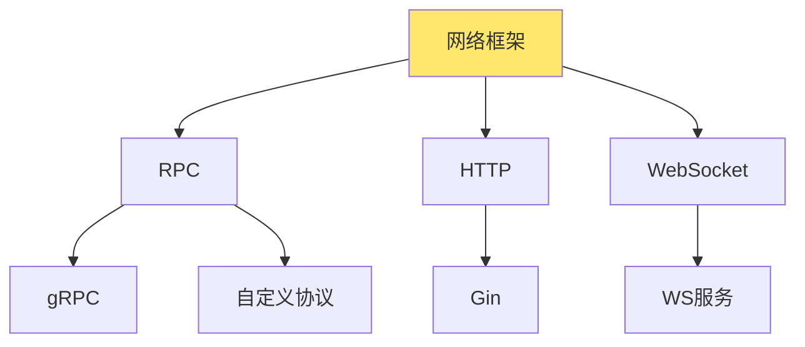

## rpc

RPC（Remote Procedure Call）提供高性能的服务间通信。

### rpc架构


### grpc

gRPC是Google开发的高性能RPC框架。

#### 特性

- 基于HTTP/2
- Protocol Buffers序列化
- 支持流式传输
- 多语言支持
- 强类型接口

#### 服务定义

```protobuf
// order.proto
syntax = "proto3";

service OrderService {
    rpc CreateOrder(CreateOrderRequest) returns (CreateOrderResponse);
    rpc GetOrder(GetOrderRequest) returns (GetOrderResponse);
    rpc ListOrders(ListOrdersRequest) returns (stream Order);
}

message CreateOrderRequest {
    string user_id = 1;
    repeated OrderItem items = 2;
}

message CreateOrderResponse {
    string order_id = 1;
    int64 total_amount = 2;
}
```

#### 服务端实现

```go
// gRPC服务端
type OrderServiceServer struct {
    pb.UnimplementedOrderServiceServer
}

func (s *OrderServiceServer) CreateOrder(ctx context.Context, 
    req *pb.CreateOrderRequest) (*pb.CreateOrderResponse, error) {
    // 业务逻辑
    order := &Order{
        UserID: req.UserId,
        Items:  convertItems(req.Items),
    }
    
    orderID := s.createOrder(order)
    
    return &pb.CreateOrderResponse{
        OrderId:     orderID,
        TotalAmount: order.TotalAmount,
    }, nil
}

// 启动服务
func startGRPCServer() {
    lis, err := net.Listen("tcp", ":9090")
    if err != nil {
        log.Fatal(err)
    }
    
    s := grpc.NewServer()
    pb.RegisterOrderServiceServer(s, &OrderServiceServer{})
    
    if err := s.Serve(lis); err != nil {
        log.Fatal(err)
    }
}
```

#### 客户端实现

```go
// gRPC客户端
func createGRPCClient() {
    conn, err := grpc.Dial("localhost:9090", grpc.WithInsecure())
    if err != nil {
        log.Fatal(err)
    }
    defer conn.Close()
    
    client := pb.NewOrderServiceClient(conn)
    
    resp, err := client.CreateOrder(context.Background(), &pb.CreateOrderRequest{
        UserId: "user001",
        Items:  []*pb.OrderItem{...},
    })
    if err != nil {
        log.Fatal(err)
    }
    
    log.Printf("订单创建成功: %s", resp.OrderId)
}
```

### 自定义协议

自定义RPC协议可以提供更高的性能和更灵活的定制。

#### 协议设计

```mermaid
graph TB
    A[消息头] --> B[消息体]
    A --> A1[魔数]
    A --> A2[版本]
    A --> A3[消息类型]
    A --> A4[消息长度]
    
    style A fill:#FFE66D
```

#### 协议实现

```go
// 自定义协议消息
type Message struct {
    Header MessageHeader
    Body   []byte
}

type MessageHeader struct {
    Magic     uint32  // 魔数
    Version   uint8   // 版本
    Type      uint8   // 消息类型
    Length    uint32  // 消息长度
    RequestID uint64  // 请求ID
}

// 编码
func (m *Message) Encode() ([]byte, error) {
    buf := new(bytes.Buffer)
    
    // 编码头部
    binary.Write(buf, binary.BigEndian, m.Header.Magic)
    binary.Write(buf, binary.BigEndian, m.Header.Version)
    binary.Write(buf, binary.BigEndian, m.Header.Type)
    binary.Write(buf, binary.BigEndian, m.Header.Length)
    binary.Write(buf, binary.BigEndian, m.Header.RequestID)
    
    // 编码消息体
    buf.Write(m.Body)
    
    return buf.Bytes(), nil
}

// 解码
func DecodeMessage(data []byte) (*Message, error) {
    reader := bytes.NewReader(data)
    
    var header MessageHeader
    binary.Read(reader, binary.BigEndian, &header.Magic)
    binary.Read(reader, binary.BigEndian, &header.Version)
    binary.Read(reader, binary.BigEndian, &header.Type)
    binary.Read(reader, binary.BigEndian, &header.Length)
    binary.Read(reader, binary.BigEndian, &header.RequestID)
    
    body := make([]byte, header.Length)
    reader.Read(body)
    
    return &Message{
        Header: header,
        Body:   body,
    }, nil
}
```

#### RPC框架实现

```go
// 自定义RPC框架
type RPCServer struct {
    handlers map[string]Handler
}

func (s *RPCServer) Register(name string, handler Handler) {
    s.handlers[name] = handler
}

func (s *RPCServer) Serve(conn net.Conn) {
    for {
        // 读取消息
        msg, err := s.readMessage(conn)
        if err != nil {
            break
        }
        
        // 处理请求
        go s.handleRequest(conn, msg)
    }
}

func (s *RPCServer) handleRequest(conn net.Conn, msg *Message) {
    handler, ok := s.handlers[msg.Method]
    if !ok {
        s.sendError(conn, msg, "method not found")
        return
    }
    
    // 调用处理器
    result, err := handler(msg.Args)
    if err != nil {
        s.sendError(conn, msg, err.Error())
        return
    }
    
    // 发送响应
    s.sendResponse(conn, msg, result)
}
```

## http

HTTP服务提供RESTful API接口。

### gin

Gin是Go语言的高性能HTTP Web框架。

#### 特性

- 快速路由
- 中间件支持
- JSON验证
- 错误处理
- 性能优秀

#### 服务实现

```go
// Gin服务框架
type HTTPService struct {
    router *gin.Engine
}

func NewHTTPService() *HTTPService {
    router := gin.Default()
    
    // 中间件
    router.Use(gin.Logger())
    router.Use(gin.Recovery())
    router.Use(cors.Default())
    
    return &HTTPService{router: router}
}

func (s *HTTPService) RegisterRoutes() {
    api := s.router.Group("/api/v1")
    {
        // 订单相关
        orders := api.Group("/orders")
        {
            orders.POST("", s.createOrder)
            orders.GET("/:id", s.getOrder)
            orders.GET("", s.listOrders)
        }
        
        // 用户相关
        users := api.Group("/users")
        {
            users.GET("/:id", s.getUser)
        }
    }
}

func (s *HTTPService) createOrder(c *gin.Context) {
    var req CreateOrderRequest
    if err := c.ShouldBindJSON(&req); err != nil {
        c.JSON(400, gin.H{"error": err.Error()})
        return
    }
    
    // 业务逻辑
    order := s.orderService.CreateOrder(&req)
    
    c.JSON(200, order)
}
```

#### 中间件

```go
// 认证中间件
func AuthMiddleware() gin.HandlerFunc {
    return func(c *gin.Context) {
        token := c.GetHeader("Authorization")
        if token == "" {
            c.JSON(401, gin.H{"error": "unauthorized"})
            c.Abort()
            return
        }
        
        // 验证token
        user, err := validateToken(token)
        if err != nil {
            c.JSON(401, gin.H{"error": "invalid token"})
            c.Abort()
            return
        }
        
        c.Set("user", user)
        c.Next()
    }
}

// 限流中间件
func RateLimitMiddleware() gin.HandlerFunc {
    limiter := rate.NewLimiter(100, 10) // 每秒100个请求，突发10个
    
    return func(c *gin.Context) {
        if !limiter.Allow() {
            c.JSON(429, gin.H{"error": "too many requests"})
            c.Abort()
            return
        }
        c.Next()
    }
}
```

## ws

WebSocket提供双向实时通信能力。

### WebSocket服务

```go
// WebSocket服务
type WebSocketService struct {
    upgrader websocket.Upgrader
    clients  map[*websocket.Conn]bool
    mu       sync.Mutex
}

func (s *WebSocketService) HandleConnection(c *gin.Context) {
    conn, err := s.upgrader.Upgrade(c.Writer, c.Request, nil)
    if err != nil {
        return
    }
    defer conn.Close()
    
    // 注册客户端
    s.mu.Lock()
    s.clients[conn] = true
    s.mu.Unlock()
    
    // 处理消息
    for {
        var msg Message
        if err := conn.ReadJSON(&msg); err != nil {
            break
        }
        
        // 处理消息
        s.handleMessage(conn, &msg)
    }
    
    // 注销客户端
    s.mu.Lock()
    delete(s.clients, conn)
    s.mu.Unlock()
}

func (s *WebSocketService) Broadcast(message *Message) {
    s.mu.Lock()
    defer s.mu.Unlock()
    
    for conn := range s.clients {
        conn.WriteJSON(message)
    }
}
```

# 熔断限流

熔断和限流是保护系统稳定性的重要机制。

## 熔断限流架构

```mermaid
graph TB
    A[请求] --> B{限流检查}
    B -->|通过| C{熔断检查}
    B -->|拒绝| D[返回错误]
    C -->|通过| E[处理请求]
    C -->|熔断| F[快速失败]
    
    style B fill:#FFE66D
    style C fill:#FF6B6B
```

## 熔断

熔断器在服务异常时快速失败，避免雪崩效应。

### 熔断器状态

```mermaid
stateDiagram-v2
    [*] --> 关闭：正常状态
    关闭 --> 打开：失败次数达到阈值
    打开 --> 半开：超时后尝试
    半开 --> 关闭：请求成功
    半开 --> 打开：请求失败
```

### 熔断器实现

```go
// 熔断器
type CircuitBreaker struct {
    maxFailures int
    timeout     time.Duration
    state       CircuitState
    failures    int
    lastFailure time.Time
    mu          sync.RWMutex
}

type CircuitState int

const (
    StateClosed CircuitState = iota
    StateOpen
    StateHalfOpen
)

func (cb *CircuitBreaker) Execute(fn func() error) error {
    cb.mu.Lock()
    state := cb.state
    cb.mu.Unlock()
    
    switch state {
    case StateOpen:
        if time.Since(cb.lastFailure) > cb.timeout {
            cb.mu.Lock()
            cb.state = StateHalfOpen
            cb.mu.Unlock()
        } else {
            return ErrCircuitOpen
        }
    case StateHalfOpen:
        // 允许尝试
    case StateClosed:
        // 正常执行
    }
    
    err := fn()
    
    cb.mu.Lock()
    if err != nil {
        cb.failures++
        cb.lastFailure = time.Now()
        if cb.failures >= cb.maxFailures {
            cb.state = StateOpen
        }
    } else {
        cb.failures = 0
        if cb.state == StateHalfOpen {
            cb.state = StateClosed
        }
    }
    cb.mu.Unlock()
    
    return err
}
```

### 熔断器使用

```go
// 使用熔断器
cb := NewCircuitBreaker(5, 30*time.Second)

err := cb.Execute(func() error {
    return callRemoteService()
})

if err == ErrCircuitOpen {
    // 熔断器打开，快速失败
    return fallbackResponse()
}
```

## 限流

限流器控制请求速率，防止系统过载。

### 限流算法

```mermaid
graph TB
    A[限流算法] --> B[令牌桶]
    A --> C[漏桶]
    A --> D[固定窗口]
    A --> E[滑动窗口]
    
    style A fill:#FFE66D
```

* 令牌桶（Token Bucket）：系统按照固定速率持续向桶中加入令牌，每个请求需要先获取令牌才能被执行。如果桶中有令牌则分发并通过请求，否则直接拒绝或等待。适用于突发流量场景，能够缓冲流量波动。
* 漏桶（Leaky Bucket）：请求先进入一个容量有限的桶中，由桶以固定速率向外发送请求。如果桶满则新请求被丢弃或阻塞。能够平滑输出速率，使系统稳态运行，常用于消除高峰流量对系统的压力。
* 固定窗口（Fixed Window Counter）：将时间划分为固定长度窗口（如每分钟、每秒），在每个窗口内统计请求数，不超过设定阈值即可放行，超过则拒绝。实现简单，但临界时刻可能出现突发超限问题。
* 滑动窗口（Sliding Window）：结合多个小窗口（如每秒）组成一个大窗口，实时统计最近N秒内总请求数，细粒度平滑突发流量。能更精准地控制速率，避免固定窗口的临界问题。

### 令牌桶实现

```go
// 令牌桶限流器
type TokenBucket struct {
    capacity int64         // 桶容量
    tokens   int64         // 当前令牌数
    rate     int64         // 每秒生成令牌数
    lastTime time.Time     // 上次更新时间
    mu       sync.Mutex
}

func NewTokenBucket(capacity, rate int64) *TokenBucket {
    return &TokenBucket{
        capacity: capacity,
        tokens:   capacity,
        rate:     rate,
        lastTime: time.Now(),
    }
}

func (tb *TokenBucket) Allow() bool {
    tb.mu.Lock()
    defer tb.mu.Unlock()
    
    now := time.Now()
    elapsed := now.Sub(tb.lastTime)
    
    // 生成新令牌
    tokensToAdd := int64(elapsed.Seconds()) * tb.rate
    tb.tokens = min(tb.tokens+tokensToAdd, tb.capacity)
    tb.lastTime = now
    
    if tb.tokens > 0 {
        tb.tokens--
        return true
    }
    
    return false
}
```

### 漏桶实现

```go
// 漏桶限流器
type LeakyBucket struct {
    capacity int64         // 桶容量
    rate     int64         // 每秒处理请求数
    queue    chan struct{} // 请求队列
}

func NewLeakyBucket(capacity, rate int64) *LeakyBucket {
    lb := &LeakyBucket{
        capacity: capacity,
        rate:     rate,
        queue:    make(chan struct{}, capacity),
    }
    
    // 启动漏桶处理
    go lb.process()
    
    return lb
}

func (lb *LeakyBucket) Allow() bool {
    select {
    case lb.queue <- struct{}{}:
        return true
    default:
        return false
    }
}

func (lb *LeakyBucket) process() {
    ticker := time.NewTicker(time.Second / time.Duration(lb.rate))
    defer ticker.Stop()
    
    for range ticker.C {
        select {
        case <-lb.queue:
            // 处理请求
        default:
            // 队列为空
        }
    }
}
```

### 限流器使用

```go
// 使用限流器
limiter := NewTokenBucket(100, 10) // 容量100，每秒10个

if !limiter.Allow() {
    return errors.New("rate limit exceeded")
}

// 处理请求
```

# 链路追踪

链路追踪用于追踪请求在分布式系统中的完整调用路径。

## 链路追踪架构

```mermaid
graph TB
    A[请求] --> B[服务A]
    B --> C[服务B]
    C --> D[服务C]
    D --> E[数据库]
    
    F[追踪数据] --> G[追踪系统]
    G --> H[可视化]
    
    style G fill:#FFE66D
```

## skywalking

SkyWalking是Apache开源的APM系统。

### 特性

- 分布式追踪
- 性能监控
- 服务拓扑
- 告警通知
- 多语言支持

### SkyWalking集成

```go
// SkyWalking Go Agent
import (
    "github.com/SkyAPM/go2sky"
    "github.com/SkyAPM/go2sky/reporter"
)

func initSkyWalking() {
    r, err := reporter.NewGRPCReporter("localhost:11800")
    if err != nil {
        log.Fatal(err)
    }
    
    tracer, err := go2sky.NewTracer("order-service", 
        go2sky.WithReporter(r))
    if err != nil {
        log.Fatal(err)
    }
    
    go2sky.SetGlobalTracer(tracer)
}

// 追踪HTTP请求
func traceHTTP(c *gin.Context) {
    span, ctx, err := go2sky.GetGlobalTracer().CreateEntrySpan(
        c.Request.Context(),
        c.Request.URL.Path,
        func() (string, error) {
            return c.GetHeader("sw8"), nil
        },
    )
    if err != nil {
        c.Next()
        return
    }
    defer span.End()
    
    span.SetComponent(5004) // HTTP
    span.Tag(go2sky.TagHTTPMethod, c.Request.Method)
    span.Tag(go2sky.TagURL, c.Request.URL.String())
    
    c.Request = c.Request.WithContext(ctx)
    c.Next()
    
    span.Tag(go2sky.TagStatusCode, strconv.Itoa(c.Writer.Status()))
}
```

## arms

ARMS是阿里云的应用性能监控服务。

### 特性

- 应用性能监控
- 分布式追踪
- 错误分析
- 性能分析
- 告警通知

### ARMS集成

```go
// ARMS Go Agent
import "github.com/aliyun/aliyun-log-go-sdk/producer"

func initARMS() {
    producerConfig := producer.GetDefaultProducerConfig()
    producerConfig.Endpoint = "cn-hangzhou.log.aliyuncs.com"
    producerConfig.AccessKeyID = "your-access-key-id"
    producerConfig.AccessKeySecret = "your-access-key-secret"
    
    producerInstance := producer.InitProducer(producerConfig)
    producerInstance.Start()
}

// 发送追踪数据
func sendTrace(trace *Trace) {
    log := producer.GenerateLog(uint32(time.Now().Unix()), map[string]string{
        "traceId": trace.TraceID,
        "spanId":  trace.SpanID,
        "service": trace.Service,
        "method":  trace.Method,
        "duration": strconv.FormatInt(trace.Duration, 10),
    })
    
    producerInstance.SendLog("arms-trace", "trace", "", log)
}
```

# 中间件

中间件提供各种基础设施能力。

## 中间件架构

```mermaid
graph TB
    A[应用服务] --> B[中间件层]
    B --> C[Redis]
    B --> D[MySQL]
    B --> E[Kafka]
    B --> F[Elasticsearch]
    B --> G[InfluxDB]
    B --> H[Prometheus]
    
    style B fill:#FFE66D
```

## redis

Redis提供缓存和分布式锁能力。

### Redis客户端封装

```go
// Redis客户端
type RedisClient struct {
    client *redis.Client
}

func NewRedisClient(addr string) *RedisClient {
    client := redis.NewClient(&redis.Options{
        Addr:     addr,
        Password: "",
        DB:       0,
    })
    
    return &RedisClient{client: client}
}

// 缓存操作
func (r *RedisClient) Get(key string) (string, error) {
    return r.client.Get(context.Background(), key).Result()
}

func (r *RedisClient) Set(key string, value interface{}, expiration time.Duration) error {
    return r.client.Set(context.Background(), key, value, expiration).Err()
}

// 分布式锁
func (r *RedisClient) Lock(key string, expiration time.Duration) (bool, error) {
    return r.client.SetNX(context.Background(), key, "locked", expiration).Result()
}
```

## mysql

MySQL提供关系型数据存储。

### MySQL客户端封装

```go
// MySQL客户端
type MySQLClient struct {
    db *sql.DB
}

func NewMySQLClient(dsn string) (*MySQLClient, error) {
    db, err := sql.Open("mysql", dsn)
    if err != nil {
        return nil, err
    }
    
    db.SetMaxOpenConns(100)
    db.SetMaxIdleConns(10)
    db.SetConnMaxLifetime(time.Hour)
    
    return &MySQLClient{db: db}, nil
}

// 查询
func (m *MySQLClient) Query(query string, args ...interface{}) (*sql.Rows, error) {
    return m.db.Query(query, args...)
}

// 执行
func (m *MySQLClient) Exec(query string, args ...interface{}) (sql.Result, error) {
    return m.db.Exec(query, args...)
}
```

## kafka

Kafka提供消息队列能力。

### Kafka客户端封装

```go
// Kafka生产者
type KafkaProducer struct {
    producer *kafka.Producer
}

func NewKafkaProducer(brokers []string) (*KafkaProducer, error) {
    config := kafka.NewConfig()
    config.Producer.Return.Successes = true
    
    producer, err := kafka.NewProducer(brokers, config)
    if err != nil {
        return nil, err
    }
    
    return &KafkaProducer{producer: producer}, nil
}

func (p *KafkaProducer) Publish(topic string, message []byte) error {
    msg := &kafka.Message{
        Topic: topic,
        Value: message,
    }
    
    return p.producer.Produce(msg, nil)
}

// Kafka消费者
type KafkaConsumer struct {
    consumer *kafka.Consumer
}

func NewKafkaConsumer(brokers []string, groupID string) (*KafkaConsumer, error) {
    config := kafka.NewConfig()
    config.Consumer.Group.Id = groupID
    
    consumer, err := kafka.NewConsumer(brokers, config)
    if err != nil {
        return nil, err
    }
    
    return &KafkaConsumer{consumer: consumer}, nil
}

func (c *KafkaConsumer) Subscribe(topics []string, handler func(*kafka.Message)) error {
    c.consumer.SubscribeTopics(topics, nil)
    
    for {
        msg, err := c.consumer.ReadMessage(-1)
        if err != nil {
            return err
        }
        handler(msg)
    }
}
```

## elasticsearch

Elasticsearch提供搜索和分析能力。

### Elasticsearch客户端封装

```go
// Elasticsearch客户端
type ESClient struct {
    client *elasticsearch.Client
}

func NewESClient(addresses []string) (*ESClient, error) {
    cfg := elasticsearch.Config{
        Addresses: addresses,
    }
    
    client, err := elasticsearch.NewClient(cfg)
    if err != nil {
        return nil, err
    }
    
    return &ESClient{client: client}, nil
}

func (e *ESClient) Index(index string, document map[string]interface{}) error {
    body, _ := json.Marshal(document)
    
    _, err := e.client.Index(index, bytes.NewReader(body))
    return err
}

func (e *ESClient) Search(index string, query map[string]interface{}) ([]map[string]interface{}, error) {
    body, _ := json.Marshal(query)
    
    resp, err := e.client.Search(
        e.client.Search.WithIndex(index),
        e.client.Search.WithBody(bytes.NewReader(body)),
    )
    if err != nil {
        return nil, err
    }
    defer resp.Body.Close()
    
    var result map[string]interface{}
    json.NewDecoder(resp.Body).Decode(&result)
    
    // 解析结果
    hits := result["hits"].(map[string]interface{})["hits"].([]interface{})
    var documents []map[string]interface{}
    for _, hit := range hits {
        documents = append(documents, hit.(map[string]interface{})["_source"].(map[string]interface{}))
    }
    
    return documents, nil
}
```

## influxdb

InfluxDB提供时序数据存储。

### InfluxDB客户端封装

```go
// InfluxDB客户端
type InfluxDBClient struct {
    client influxdb2.Client
    bucket string
    org    string
}

func NewInfluxDBClient(url, token, org, bucket string) *InfluxDBClient {
    client := influxdb2.NewClient(url, token)
    return &InfluxDBClient{
        client: client,
        bucket: bucket,
        org:    org,
    }
}

func (i *InfluxDBClient) Write(measurement string, tags map[string]string, 
    fields map[string]interface{}) error {
    writeAPI := i.client.WriteAPIBlocking(i.org, i.bucket)
    
    point := influxdb2.NewPoint(measurement, tags, fields, time.Now())
    return writeAPI.WritePoint(context.Background(), point)
}
```

## prometheus

Prometheus提供指标监控能力。

### Prometheus指标

```go
// Prometheus指标
var (
    httpRequestsTotal = prometheus.NewCounterVec(
        prometheus.CounterOpts{
            Name: "http_requests_total",
            Help: "Total number of HTTP requests",
        },
        []string{"method", "endpoint", "status"},
    )
    
    httpRequestDuration = prometheus.NewHistogramVec(
        prometheus.HistogramOpts{
            Name: "http_request_duration_seconds",
            Help: "HTTP request duration",
        },
        []string{"method", "endpoint"},
    )
)

func init() {
    prometheus.MustRegister(httpRequestsTotal)
    prometheus.MustRegister(httpRequestDuration)
}

// 使用指标
func recordMetrics(method, endpoint string, duration time.Duration, status int) {
    httpRequestsTotal.WithLabelValues(method, endpoint, strconv.Itoa(status)).Inc()
    httpRequestDuration.WithLabelValues(method, endpoint).Observe(duration.Seconds())
}
```

# 通用工具

通用工具提供框架的基础能力。

## 时间轮

时间轮用于高效的定时任务调度。

### 时间轮实现

```go
// 时间轮
type TimeWheel struct {
    interval    time.Duration
    slots       []*TaskList
    currentSlot int
    ticker      *time.Ticker
    mu          sync.Mutex
}

type TaskList struct {
    tasks []*Task
    mu    sync.Mutex
}

type Task struct {
    delay    time.Duration
    callback func()
}

func NewTimeWheel(interval time.Duration, slots int) *TimeWheel {
    tw := &TimeWheel{
        interval:    interval,
        slots:       make([]*TaskList, slots),
        currentSlot: 0,
    }
    
    for i := range tw.slots {
        tw.slots[i] = &TaskList{}
    }
    
    tw.ticker = time.NewTicker(interval)
    go tw.run()
    
    return tw
}

func (tw *TimeWheel) AddTask(delay time.Duration, callback func()) {
    tw.mu.Lock()
    defer tw.mu.Unlock()
    
    ticks := int(delay / tw.interval)
    slot := (tw.currentSlot + ticks) % len(tw.slots)
    
    tw.slots[slot].mu.Lock()
    tw.slots[slot].tasks = append(tw.slots[slot].tasks, &Task{
        delay:    delay,
        callback: callback,
    })
    tw.slots[slot].mu.Unlock()
}

func (tw *TimeWheel) run() {
    for range tw.ticker.C {
        tw.mu.Lock()
        slot := tw.slots[tw.currentSlot]
        tw.currentSlot = (tw.currentSlot + 1) % len(tw.slots)
        tw.mu.Unlock()
        
        slot.mu.Lock()
        tasks := slot.tasks
        slot.tasks = nil
        slot.mu.Unlock()
        
        for _, task := range tasks {
            go task.callback()
        }
    }
}
```

## 协程池

协程池用于控制并发数量，避免资源耗尽。

### 协程池实现

```go
// 协程池
type GoroutinePool struct {
    workers    int
    jobQueue   chan func()
    wg         sync.WaitGroup
}

func NewGoroutinePool(workers int, queueSize int) *GoroutinePool {
    pool := &GoroutinePool{
        workers:  workers,
        jobQueue: make(chan func(), queueSize),
    }
    
    for i := 0; i < workers; i++ {
        pool.wg.Add(1)
        go pool.worker()
    }
    
    return pool
}

func (p *GoroutinePool) worker() {
    defer p.wg.Done()
    
    for job := range p.jobQueue {
        job()
    }
}

func (p *GoroutinePool) Submit(job func()) error {
    select {
    case p.jobQueue <- job:
        return nil
    default:
        return errors.New("job queue is full")
    }
}

func (p *GoroutinePool) Close() {
    close(p.jobQueue)
    p.wg.Wait()
}

// 使用示例
pool := NewGoroutinePool(10, 100)

for i := 0; i < 1000; i++ {
    pool.Submit(func() {
        // 执行任务
        processTask(i)
    })
}

pool.Close()
```

## 对象池

对象池（Object Pool）是一种设计模式，通过预先创建和复用对象来减少对象创建和销毁的开销，提高性能并减少GC压力。

### 对象池概述

```mermaid
graph TB
    A[对象池] --> B[对象复用]
    A --> C[减少GC]
    A --> D[提高性能]
    A --> E[资源控制]
    
    B --> B1[避免频繁创建销毁]
    C --> C1[减少内存分配]
    D --> D1[降低延迟]
    E --> E1[限制对象数量]
    
    style A fill:#51CF66
```

**核心价值：**
- **对象复用**：复用已创建的对象，避免频繁创建和销毁
- **减少GC压力**：减少对象分配，降低GC频率
- **提高性能**：减少对象创建开销，提高响应速度
- **资源控制**：限制对象数量，控制资源使用

### 对象池适用场景

```mermaid
graph TB
    A[对象池场景] --> B[高频率创建]
    A --> C[创建成本高]
    A --> D[对象生命周期短]
    A --> E[需要资源限制]
    
    B --> B1[HTTP连接<br/>数据库连接]
    C --> C1[复杂对象<br/>大对象]
    D --> D1[临时对象<br/>缓冲区]
    E --> E1[连接池<br/>线程池]
    
    style A fill:#FFE66D
```

**适用场景：**
- **高频率创建**：需要频繁创建和销毁对象
- **创建成本高**：对象创建开销较大
- **对象生命周期短**：对象使用时间短，很快被丢弃
- **需要资源限制**：需要限制对象数量

### 对象池实现

```go
// 对象池接口
type Pool interface {
    Get() interface{}
    Put(interface{})
    Close()
}

// 通用对象池
type ObjectPool struct {
    factory    func() interface{}  // 对象工厂函数
    reset      func(interface{})   // 对象重置函数
    pool       chan interface{}    // 对象池
    maxSize    int                 // 最大池大小
    mu         sync.Mutex
    created    int                 // 已创建对象数
}

func NewObjectPool(factory func() interface{}, reset func(interface{}), maxSize int) *ObjectPool {
    return &ObjectPool{
        factory: factory,
        reset:   reset,
        pool:    make(chan interface{}, maxSize),
        maxSize: maxSize,
    }
}

// 获取对象
func (p *ObjectPool) Get() interface{} {
    select {
    case obj := <-p.pool:
        // 从池中获取对象
        if p.reset != nil {
            p.reset(obj)
        }
        return obj
    default:
        // 池为空，创建新对象
        p.mu.Lock()
        if p.created < p.maxSize {
            p.created++
            p.mu.Unlock()
            return p.factory()
        }
        p.mu.Unlock()
        
        // 达到最大数量，等待或创建临时对象
        select {
        case obj := <-p.pool:
            if p.reset != nil {
                p.reset(obj)
            }
            return obj
        case <-time.After(time.Second):
            // 超时，创建临时对象
            return p.factory()
        }
    }
}

// 归还对象
func (p *ObjectPool) Put(obj interface{}) {
    if obj == nil {
        return
    }
    
    select {
    case p.pool <- obj:
        // 成功归还到池中
    default:
        // 池已满，丢弃对象
    }
}

// 关闭对象池
func (p *ObjectPool) Close() {
    close(p.pool)
    for obj := range p.pool {
        // 清理对象（如果需要）
        if closer, ok := obj.(io.Closer); ok {
            closer.Close()
        }
    }
}
```

### 类型安全的对象池

```go
// 类型安全的对象池
type TypedPool[T any] struct {
    factory func() T
    reset   func(T)
    pool    chan T
    maxSize int
    mu      sync.Mutex
    created int
}

func NewTypedPool[T any](factory func() T, reset func(T), maxSize int) *TypedPool[T] {
    return &TypedPool[T]{
        factory: factory,
        reset:   reset,
        pool:    make(chan T, maxSize),
        maxSize: maxSize,
    }
}

func (p *TypedPool[T]) Get() T {
    select {
    case obj := <-p.pool:
        if p.reset != nil {
            p.reset(obj)
        }
        return obj
    default:
        p.mu.Lock()
        if p.created < p.maxSize {
            p.created++
            p.mu.Unlock()
            return p.factory()
        }
        p.mu.Unlock()
        
        select {
        case obj := <-p.pool:
            if p.reset != nil {
                p.reset(obj)
            }
            return obj
        case <-time.After(time.Second):
            return p.factory()
        }
    }
}

func (p *TypedPool[T]) Put(obj T) {
    select {
    case p.pool <- obj:
    default:
        // 池已满，丢弃
    }
}
```

### 缓冲区对象池

```go
// 字节缓冲区池
type BufferPool struct {
    pool *sync.Pool
}

func NewBufferPool() *BufferPool {
    return &BufferPool{
        pool: &sync.Pool{
            New: func() interface{} {
                return new(bytes.Buffer)
            },
        },
    }
}

func (p *BufferPool) Get() *bytes.Buffer {
    buf := p.pool.Get().(*bytes.Buffer)
    buf.Reset()  // 重置缓冲区
    return buf
}

func (p *BufferPool) Put(buf *bytes.Buffer) {
    if buf.Cap() > 64*1024 {  // 如果缓冲区太大，不归还
        return
    }
    buf.Reset()
    p.pool.Put(buf)
}

// 使用示例
var bufferPool = NewBufferPool()

func processRequest(data []byte) {
    buf := bufferPool.Get()
    defer bufferPool.Put(buf)
    
    // 使用缓冲区
    buf.Write(data)
    // 处理数据...
}
```

### 连接池实现

```go
// 连接池
type ConnectionPool struct {
    factory    func() (net.Conn, error)
    pool       chan net.Conn
    maxSize    int
    idleTimeout time.Duration
    mu         sync.Mutex
    created    int
}

func NewConnectionPool(factory func() (net.Conn, error), maxSize int, idleTimeout time.Duration) *ConnectionPool {
    pool := &ConnectionPool{
        factory:     factory,
        pool:        make(chan net.Conn, maxSize),
        maxSize:     maxSize,
        idleTimeout: idleTimeout,
    }
    
    // 启动清理goroutine
    go pool.cleanup()
    
    return pool
}

func (p *ConnectionPool) Get() (net.Conn, error) {
    select {
    case conn := <-p.pool:
        // 检查连接是否有效
        if p.isValid(conn) {
            return conn, nil
        }
        // 连接无效，关闭并创建新的
        conn.Close()
    default:
    }
    
    // 创建新连接
    p.mu.Lock()
    if p.created < p.maxSize {
        p.created++
        p.mu.Unlock()
        return p.factory()
    }
    p.mu.Unlock()
    
    // 等待连接或超时
    select {
    case conn := <-p.pool:
        if p.isValid(conn) {
            return conn, nil
        }
        conn.Close()
        return p.factory()
    case <-time.After(5 * time.Second):
        return nil, errors.New("connection pool timeout")
    }
}

func (p *ConnectionPool) Put(conn net.Conn) {
    if conn == nil {
        return
    }
    
    // 检查连接是否有效
    if !p.isValid(conn) {
        conn.Close()
        p.mu.Lock()
        p.created--
        p.mu.Unlock()
        return
    }
    
    select {
    case p.pool <- conn:
    default:
        // 池已满，关闭连接
        conn.Close()
        p.mu.Lock()
        p.created--
        p.mu.Unlock()
    }
}

func (p *ConnectionPool) isValid(conn net.Conn) bool {
    // 检查连接是否仍然有效
    // 可以通过发送ping或检查错误状态
    return true
}

func (p *ConnectionPool) cleanup() {
    ticker := time.NewTicker(time.Minute)
    defer ticker.Stop()
    
    for range ticker.C {
        p.mu.Lock()
        size := len(p.pool)
        p.mu.Unlock()
        
        // 清理空闲连接
        for i := 0; i < size; i++ {
            select {
            case conn := <-p.pool:
                // 检查空闲时间
                if time.Since(getLastUsedTime(conn)) > p.idleTimeout {
                    conn.Close()
                    p.mu.Lock()
                    p.created--
                    p.mu.Unlock()
                } else {
                    // 放回池中
                    select {
                    case p.pool <- conn:
                    default:
                        conn.Close()
                        p.mu.Lock()
                        p.created--
                        p.mu.Unlock()
                    }
                }
            default:
                return
            }
        }
    }
}
```

### sync.Pool使用

Go标准库提供了`sync.Pool`，适合临时对象复用。

```go
// 使用sync.Pool
var bufferPool = sync.Pool{
    New: func() interface{} {
        return new(bytes.Buffer)
    },
}

func getBuffer() *bytes.Buffer {
    buf := bufferPool.Get().(*bytes.Buffer)
    buf.Reset()
    return buf
}

func putBuffer(buf *bytes.Buffer) {
    if buf.Cap() > 64*1024 {
        return  // 缓冲区太大，不归还
    }
    bufferPool.Put(buf)
}

// 使用示例
func processData(data []byte) {
    buf := getBuffer()
    defer putBuffer(buf)
    
    buf.Write(data)
    // 处理数据...
}
```

### 对象池最佳实践

```mermaid
graph TB
    A[对象池实践] --> B[合理设置大小]
    A --> C[对象重置]
    A --> D[对象验证]
    A --> E[资源清理]
    
    B --> B1[避免过大或过小]
    C --> C1[归还前重置状态]
    D --> D1[获取时验证有效性]
    E --> E1[关闭时清理资源]
    
    style A fill:#FFE66D
```

**最佳实践：**

1. **合理设置池大小**
   - 根据实际需求设置最大池大小
   - 避免池过大导致资源浪费
   - 避免池过小导致频繁创建

2. **对象重置**
   - 归还对象前重置对象状态
   - 清理对象中的敏感数据
   - 重置对象到初始状态

3. **对象验证**
   - 获取对象时验证有效性
   - 检查连接是否断开
   - 检查对象是否损坏

4. **资源清理**
   - 关闭对象池时清理所有对象
   - 实现资源清理逻辑
   - 避免资源泄漏

5. **监控指标**
   - 监控池使用情况
   - 监控对象创建和复用率
   - 监控池大小变化

### 对象池使用示例

```go
// HTTP客户端池
type HTTPClientPool struct {
    pool *ObjectPool
}

func NewHTTPClientPool(maxSize int) *HTTPClientPool {
    return &HTTPClientPool{
        pool: NewObjectPool(
            func() interface{} {
                return &http.Client{
                    Timeout: 30 * time.Second,
                }
            },
            func(obj interface{}) {
                // 重置客户端（如果需要）
            },
            maxSize,
        ),
    }
}

func (p *HTTPClientPool) Get() *http.Client {
    return p.pool.Get().(*http.Client)
}

func (p *HTTPClientPool) Put(client *http.Client) {
    p.pool.Put(client)
}

// 使用示例
var clientPool = NewHTTPClientPool(10)

func makeRequest(url string) error {
    client := clientPool.Get()
    defer clientPool.Put(client)
    
    resp, err := client.Get(url)
    if err != nil {
        return err
    }
    defer resp.Body.Close()
    
    // 处理响应...
    return nil
}
```

# 总结

工程化框架设计是构建高质量微服务系统的基础。本文档涵盖了框架的各个核心组件：

**核心组件：**
1. **代码生成**：提高开发效率，保证代码一致性
2. **服务发现**：动态服务定位（etcd、Nacos）
3. **配置管理**：集中配置管理（本地配置、配置中心）
4. **日志管理**：日志收集和分析（文件管理、SLS）
5. **服务分类**：同步、异步、定时服务
6. **网络框架**：RPC、HTTP、WebSocket
7. **熔断限流**：保护系统稳定性
8. **链路追踪**：分布式系统可观测性
9. **中间件**：各种基础设施能力
10. **通用工具**：时间轮、协程池、对象池等

**设计原则：**
- **高可用**：组件设计考虑容错和降级
- **高性能**：优化关键路径性能
- **可扩展**：支持水平扩展
- **易用性**：提供简洁的API
- **可观测**：完善的监控和日志

通过统一的框架设计，可以快速构建稳定、高性能的微服务系统，提高开发效率和系统质量。
