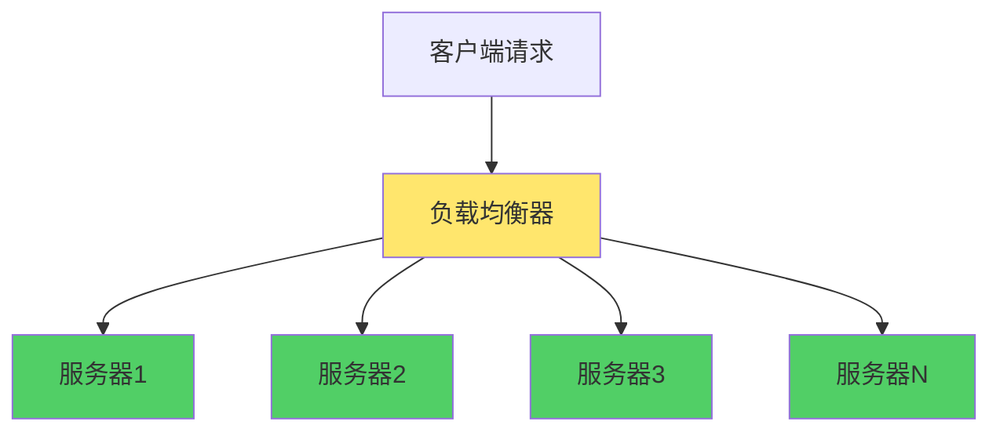
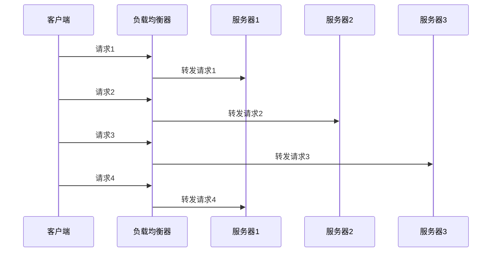
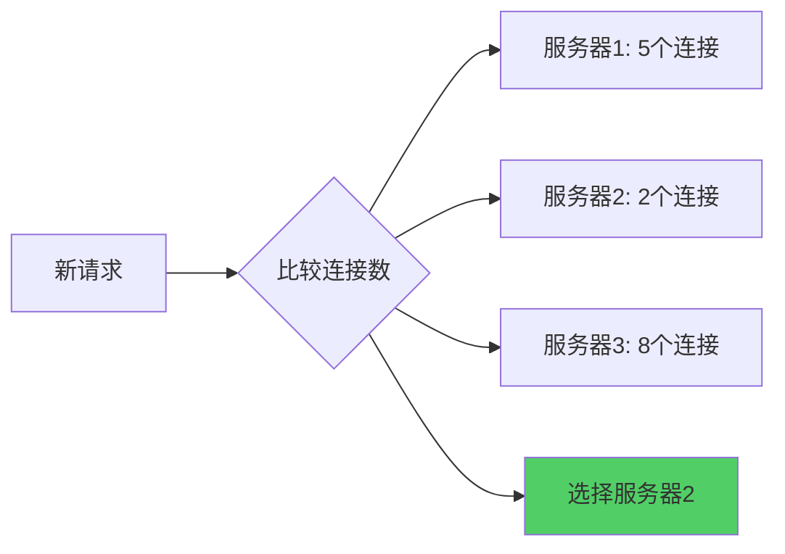
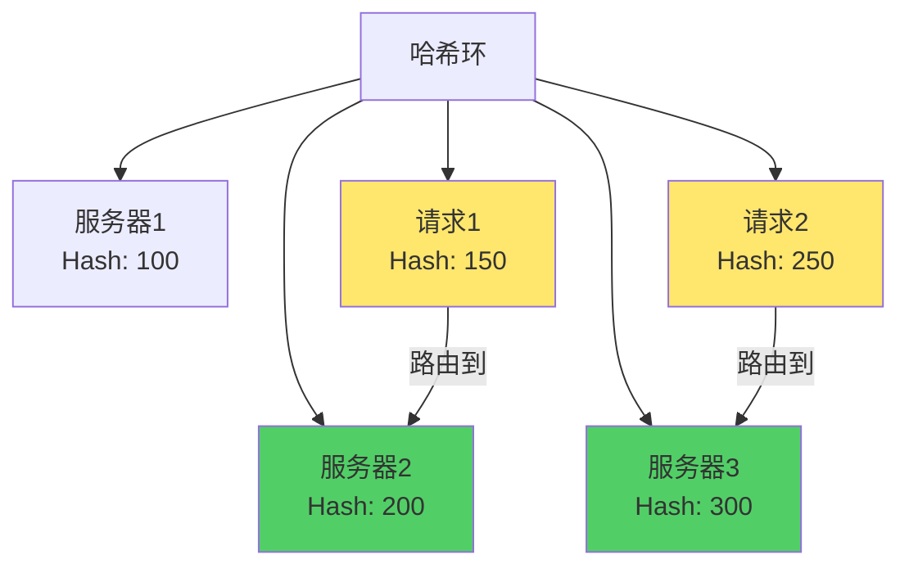

负载均衡（Load Balancing）是分布式系统中的重要技术，通过将请求分发到多个服务器实例上，实现流量分配、提高系统可用性和性能。本文详细介绍常见的负载均衡算法及其实现。

## 负载均衡概述

负载均衡算法将流量尽量平均地分配到每个服务器实例上，避免单个服务器过载，提高系统的整体性能和可用性。



## 1. 随机算法（Random）

### 算法原理

随机算法是最简单的负载均衡算法，每次请求随机选择一个服务器处理。

### 算法特点

- **优点**：
  - 实现简单
  - 调用量越大分布越均匀
  - 适合动态调整服务器权重

- **缺点**：
  - 小样本下分布不均匀
  - 不考虑服务器当前负载
  - 可能将请求发送到性能差的服务器

### Go 实现

```go
package main

import (
    "math/rand"
    "time"
)

// 服务器节点
type Server struct {
    Address string
    Weight  int
}

// 随机负载均衡器
type RandomLoadBalancer struct {
    servers []*Server
    rng     *rand.Rand
}

func NewRandomLoadBalancer(servers []*Server) *RandomLoadBalancer {
    return &RandomLoadBalancer{
        servers: servers,
        rng:     rand.New(rand.NewSource(time.Now().UnixNano())),
    }
}

// 选择服务器
func (lb *RandomLoadBalancer) Select() *Server {
    if len(lb.servers) == 0 {
        return nil
    }
    
    index := lb.rng.Intn(len(lb.servers))
    return lb.servers[index]
}
```

### 加权随机算法（Weight Random）

加权随机算法根据服务器的权重进行随机选择，权重高的服务器被选中的概率更大。

```go
// 加权随机负载均衡器
type WeightRandomLoadBalancer struct {
    servers []*Server
    rng     *rand.Rand
    totalWeight int
}

func NewWeightRandomLoadBalancer(servers []*Server) *WeightRandomLoadBalancer {
    totalWeight := 0
    for _, s := range servers {
        totalWeight += s.Weight
    }
    
    return &WeightRandomLoadBalancer{
        servers:     servers,
        rng:          rand.New(rand.NewSource(time.Now().UnixNano())),
        totalWeight: totalWeight,
    }
}

// 加权随机选择
func (lb *WeightRandomLoadBalancer) Select() *Server {
    if len(lb.servers) == 0 || lb.totalWeight == 0 {
        return nil
    }
    
    // 生成 0 到 totalWeight 之间的随机数
    randomWeight := lb.rng.Intn(lb.totalWeight)
    
    // 根据权重区间选择服务器
    currentWeight := 0
    for _, server := range lb.servers {
        currentWeight += server.Weight
        if randomWeight < currentWeight {
            return server
        }
    }
    
    // 兜底返回最后一个
    return lb.servers[len(lb.servers)-1]
}
```

### 使用场景

- 服务器性能相近
- 不需要会话保持
- 对分布均匀性要求不高

## 2. 轮询算法（Round Robin）

### 算法原理

轮询算法按顺序依次将请求分配给每个服务器，循环往复。



### 算法特点

- **优点**：
  - 实现简单
  - 请求均匀分布
  - 适合服务器性能相近的场景

- **缺点**：
  - 不考虑服务器当前负载
  - 慢服务器会累积请求
  - 不适合服务器性能差异大的场景

### Go 实现

```go
// 轮询负载均衡器
type RoundRobinLoadBalancer struct {
    servers []*Server
    current int
    mutex   sync.Mutex
}

func NewRoundRobinLoadBalancer(servers []*Server) *RoundRobinLoadBalancer {
    return &RoundRobinLoadBalancer{
        servers: servers,
        current: 0,
    }
}

// 轮询选择
func (lb *RoundRobinLoadBalancer) Select() *Server {
    lb.mutex.Lock()
    defer lb.mutex.Unlock()
    
    if len(lb.servers) == 0 {
        return nil
    }
    
    server := lb.servers[lb.current]
    lb.current = (lb.current + 1) % len(lb.servers)
    return server
}
```

### 加权轮询算法（Weight Round Robin）

加权轮询算法根据服务器权重进行轮询，权重高的服务器获得更多请求。

#### 平滑加权轮询实现

```go
// 平滑加权轮询负载均衡器
type WeightRoundRobinLoadBalancer struct {
    servers []*WeightServer
    mutex   sync.Mutex
}

type WeightServer struct {
    Server     *Server
    Weight      int      // 配置权重
    CurrentWeight int    // 当前权重
    EffectiveWeight int  // 有效权重（用于动态调整）
}

func NewWeightRoundRobinLoadBalancer(servers []*Server) *WeightRoundRobinLoadBalancer {
    weightServers := make([]*WeightServer, len(servers))
    for i, s := range servers {
        weightServers[i] = &WeightServer{
            Server:         s,
            Weight:          s.Weight,
            CurrentWeight:  0,
            EffectiveWeight: s.Weight,
        }
    }
    
    return &WeightRoundRobinLoadBalancer{
        servers: weightServers,
    }
}

// 平滑加权轮询选择
func (lb *WeightRoundRobinLoadBalancer) Select() *Server {
    lb.mutex.Lock()
    defer lb.mutex.Unlock()
    
    if len(lb.servers) == 0 {
        return nil
    }
    
    totalWeight := 0
    var selected *WeightServer
    maxCurrentWeight := -1
    
    // 遍历所有服务器，选择当前权重最大的
    for _, ws := range lb.servers {
        // 增加当前权重
        ws.CurrentWeight += ws.EffectiveWeight
        totalWeight += ws.EffectiveWeight
        
        // 选择当前权重最大的服务器
        if ws.CurrentWeight > maxCurrentWeight {
            maxCurrentWeight = ws.CurrentWeight
            selected = ws
        }
    }
    
    if selected != nil {
        // 减少选中服务器的当前权重
        selected.CurrentWeight -= totalWeight
        return selected.Server
    }
    
    return nil
}

// 动态调整服务器权重（例如：服务器响应慢时降低权重）
func (lb *WeightRoundRobinLoadBalancer) AdjustWeight(server *Server, success bool) {
    lb.mutex.Lock()
    defer lb.mutex.Unlock()
    
    for _, ws := range lb.servers {
        if ws.Server == server {
            if success {
                // 成功时逐渐增加有效权重，但不超过配置权重
                if ws.EffectiveWeight < ws.Weight {
                    ws.EffectiveWeight++
                }
            } else {
                // 失败时减少有效权重
                if ws.EffectiveWeight > 0 {
                    ws.EffectiveWeight--
                }
            }
            break
        }
    }
}
```

### 使用场景

- 服务器性能相近
- 需要均匀分配请求
- 不需要会话保持

## 3. 最少连接算法（Least Connections）

### 算法原理

最少连接算法选择当前连接数最少的服务器处理新请求。



### 算法特点

- **优点**：
  - 考虑服务器当前负载
  - 慢服务器收到更少请求
  - 适合长连接场景

- **缺点**：
  - 需要维护连接数状态
  - 实现相对复杂
  - 需要考虑连接数统计的准确性

### Go 实现

```go
// 最少连接负载均衡器
type LeastConnectionsLoadBalancer struct {
    servers map[*Server]*ServerStats
    mutex   sync.RWMutex
}

type ServerStats struct {
    Server      *Server
    Connections int
    mutex       sync.Mutex
}

func NewLeastConnectionsLoadBalancer(servers []*Server) *LeastConnectionsLoadBalancer {
    lb := &LeastConnectionsLoadBalancer{
        servers: make(map[*Server]*ServerStats),
    }
    
    for _, s := range servers {
        lb.servers[s] = &ServerStats{
            Server:      s,
            Connections: 0,
        }
    }
    
    return lb
}

// 选择连接数最少的服务器
func (lb *LeastConnectionsLoadBalancer) Select() *Server {
    lb.mutex.RLock()
    defer lb.mutex.RUnlock()
    
    if len(lb.servers) == 0 {
        return nil
    }
    
    var selected *Server
    minConnections := int(^uint(0) >> 1) // 最大整数
    
    for server, stats := range lb.servers {
        stats.mutex.Lock()
        connections := stats.Connections
        stats.mutex.Unlock()
        
        if connections < minConnections {
            minConnections = connections
            selected = server
        }
    }
    
    return selected
}

// 增加连接数
func (lb *LeastConnectionsLoadBalancer) IncrementConnections(server *Server) {
    lb.mutex.RLock()
    stats, exists := lb.servers[server]
    lb.mutex.RUnlock()
    
    if exists {
        stats.mutex.Lock()
        stats.Connections++
        stats.mutex.Unlock()
    }
}

// 减少连接数
func (lb *LeastConnectionsLoadBalancer) DecrementConnections(server *Server) {
    lb.mutex.RLock()
    stats, exists := lb.servers[server]
    lb.mutex.RUnlock()
    
    if exists {
        stats.mutex.Lock()
        if stats.Connections > 0 {
            stats.Connections--
        }
        stats.mutex.Unlock()
    }
}
```

### 加权最少连接算法（Weight Least Connections）

```go
// 加权最少连接负载均衡器
type WeightLeastConnectionsLoadBalancer struct {
    servers map[*Server]*WeightServerStats
    mutex   sync.RWMutex
}

type WeightServerStats struct {
    Server      *Server
    Weight      int
    Connections int
    mutex       sync.Mutex
}

func NewWeightLeastConnectionsLoadBalancer(servers []*Server) *WeightLeastConnectionsLoadBalancer {
    lb := &WeightLeastConnectionsLoadBalancer{
        servers: make(map[*Server]*WeightServerStats),
    }
    
    for _, s := range servers {
        lb.servers[s] = &WeightServerStats{
            Server:      s,
            Weight:      s.Weight,
            Connections: 0,
        }
    }
    
    return lb
}

// 选择加权连接数最少的服务器
// 计算方式：Connections / Weight，值越小优先级越高
func (lb *WeightLeastConnectionsLoadBalancer) Select() *Server {
    lb.mutex.RLock()
    defer lb.mutex.RUnlock()
    
    if len(lb.servers) == 0 {
        return nil
    }
    
    var selected *Server
    minRatio := float64(^uint(0) >> 1)
    
    for server, stats := range lb.servers {
        stats.mutex.Lock()
        connections := stats.Connections
        weight := stats.Weight
        stats.mutex.Unlock()
        
        if weight == 0 {
            continue
        }
        
        // 计算连接数与权重的比值
        ratio := float64(connections) / float64(weight)
        if ratio < minRatio {
            minRatio = ratio
            selected = server
        }
    }
    
    return selected
}
```

### 使用场景

- 长连接场景（如 WebSocket、TCP 长连接）
- 服务器处理时间差异较大
- 需要动态负载均衡

## 4. 哈希算法（Hash）

### 算法原理

哈希算法根据请求的某个特征（如 IP、URL、参数等）计算哈希值，将相同哈希值的请求路由到同一服务器。

### 算法特点

- **优点**：
  - 相同请求总是路由到同一服务器
  - 支持会话保持
  - 实现简单

- **缺点**：
  - 服务器增减时，大量请求需要重新路由
  - 可能导致负载不均
  - 哈希冲突可能影响分布

### 源 IP 哈希（Source IP Hash）

```go
// 源 IP 哈希负载均衡器
type IPHashLoadBalancer struct {
    servers []*Server
}

func NewIPHashLoadBalancer(servers []*Server) *IPHashLoadBalancer {
    return &IPHashLoadBalancer{
        servers: servers,
    }
}

// 根据客户端 IP 选择服务器
func (lb *IPHashLoadBalancer) Select(clientIP string) *Server {
    if len(lb.servers) == 0 {
        return nil
    }
    
    // 计算 IP 的哈希值
    hash := lb.hash(clientIP)
    
    // 取模选择服务器
    index := hash % len(lb.servers)
    return lb.servers[index]
}

// 简单的哈希函数
func (lb *IPHashLoadBalancer) hash(key string) int {
    hash := 0
    for _, char := range key {
        hash = hash*31 + int(char)
        if hash < 0 {
            hash = -hash
        }
    }
    return hash
}

// 使用 FNV-1a 哈希算法（更好的分布）
func (lb *IPHashLoadBalancer) fnvHash(key string) uint32 {
    hash := uint32(2166136261) // FNV offset basis
    for _, char := range key {
        hash ^= uint32(char)
        hash *= 16777619 // FNV prime
    }
    return hash
}
```

### 参数哈希（Parameter Hash）

```go
// 参数哈希负载均衡器
type ParameterHashLoadBalancer struct {
    servers []*Server
}

func NewParameterHashLoadBalancer(servers []*Server) *ParameterHashLoadBalancer {
    return &ParameterHashLoadBalancer{
        servers: servers,
    }
}

// 根据请求参数选择服务器
func (lb *ParameterHashLoadBalancer) Select(params map[string]string) *Server {
    if len(lb.servers) == 0 {
        return nil
    }
    
    // 将参数序列化为字符串
    key := lb.serializeParams(params)
    
    // 计算哈希值
    hash := lb.hash(key)
    
    // 选择服务器
    index := hash % len(lb.servers)
    return lb.servers[index]
}

func (lb *ParameterHashLoadBalancer) serializeParams(params map[string]string) string {
    var parts []string
    for k, v := range params {
        parts = append(parts, k+"="+v)
    }
    sort.Strings(parts) // 排序保证一致性
    return strings.Join(parts, "&")
}

func (lb *ParameterHashLoadBalancer) hash(key string) int {
    hash := 0
    for _, char := range key {
        hash = hash*31 + int(char)
        if hash < 0 {
            hash = -hash
        }
    }
    return hash
}
```

### 使用场景

- 需要会话保持
- 需要缓存亲和性
- 相同请求需要路由到同一服务器

## 5. 一致性哈希算法（Consistent Hash）

### 算法原理

一致性哈希将服务器和请求都映射到一个哈希环上，请求被路由到顺时针方向最近的服务器。



### 算法特点

- **优点**：
  - 服务器增减时，只影响少量请求
  - 负载相对均匀
  - 支持虚拟节点，提高分布均匀性

- **缺点**：
  - 实现相对复杂
  - 可能出现负载不均（通过虚拟节点缓解）

### Go 实现

```go
import (
    "hash/crc32"
    "sort"
    "strconv"
    "sync"
)

// 一致性哈希负载均衡器
type ConsistentHashLoadBalancer struct {
    hashRing     map[uint32]*Server
    sortedHashes []uint32
    virtualNodes int  // 虚拟节点数
    mutex        sync.RWMutex
}

func NewConsistentHashLoadBalancer(servers []*Server, virtualNodes int) *ConsistentHashLoadBalancer {
    lb := &ConsistentHashLoadBalancer{
        hashRing:     make(map[uint32]*Server),
        sortedHashes: make([]uint32, 0),
        virtualNodes: virtualNodes,
    }
    
    for _, server := range servers {
        lb.AddServer(server)
    }
    
    return lb
}

// 添加服务器
func (lb *ConsistentHashLoadBalancer) AddServer(server *Server) {
    lb.mutex.Lock()
    defer lb.mutex.Unlock()
    
    // 为每个服务器创建虚拟节点
    for i := 0; i < lb.virtualNodes; i++ {
        virtualKey := server.Address + "#" + strconv.Itoa(i)
        hash := lb.hash(virtualKey)
        lb.hashRing[hash] = server
        lb.sortedHashes = append(lb.sortedHashes, hash)
    }
    
    // 排序哈希值
    sort.Slice(lb.sortedHashes, func(i, j int) bool {
        return lb.sortedHashes[i] < lb.sortedHashes[j]
    })
}

// 移除服务器
func (lb *ConsistentHashLoadBalancer) RemoveServer(server *Server) {
    lb.mutex.Lock()
    defer lb.mutex.Unlock()
    
    // 移除所有虚拟节点
    for i := 0; i < lb.virtualNodes; i++ {
        virtualKey := server.Address + "#" + strconv.Itoa(i)
        hash := lb.hash(virtualKey)
        delete(lb.hashRing, hash)
        
        // 从排序列表中移除
        index := sort.Search(len(lb.sortedHashes), func(j int) bool {
            return lb.sortedHashes[j] >= hash
        })
        if index < len(lb.sortedHashes) && lb.sortedHashes[index] == hash {
            lb.sortedHashes = append(
                lb.sortedHashes[:index],
                lb.sortedHashes[index+1:]...,
            )
        }
    }
}

// 选择服务器
func (lb *ConsistentHashLoadBalancer) Select(key string) *Server {
    lb.mutex.RLock()
    defer lb.mutex.RUnlock()
    
    if len(lb.hashRing) == 0 {
        return nil
    }
    
    // 计算 key 的哈希值
    hash := lb.hash(key)
    
    // 在排序的哈希值中找到第一个大于等于 key 哈希值的节点
    index := sort.Search(len(lb.sortedHashes), func(i int) bool {
        return lb.sortedHashes[i] >= hash
    })
    
    // 如果没找到，说明 key 的哈希值大于所有节点，选择第一个节点（环的特性）
    if index == len(lb.sortedHashes) {
        index = 0
    }
    
    // 返回对应的服务器
    serverHash := lb.sortedHashes[index]
    return lb.hashRing[serverHash]
}

// 哈希函数（使用 CRC32）
func (lb *ConsistentHashLoadBalancer) hash(key string) uint32 {
    return crc32.ChecksumIEEE([]byte(key))
}
```

### 使用场景

- 分布式缓存系统
- 需要动态增减服务器
- 需要最小化重新路由的请求数

## 6. 最少活跃数算法（Least Active）

### 算法原理

最少活跃数算法选择当前正在处理的请求数最少的服务器。

### 算法特点

- **优点**：
  - 考虑服务器当前处理能力
  - 慢服务器收到更少请求
  - 适合处理时间差异大的场景

- **缺点**：
  - 需要维护活跃数状态
  - 实现相对复杂

### Go 实现

```go
// 最少活跃数负载均衡器
type LeastActiveLoadBalancer struct {
    servers map[*Server]*ActiveStats
    mutex   sync.RWMutex
}

type ActiveStats struct {
    Server      *Server
    ActiveCount int
    mutex       sync.Mutex
}

func NewLeastActiveLoadBalancer(servers []*Server) *LeastActiveLoadBalancer {
    lb := &LeastActiveLoadBalancer{
        servers: make(map[*Server]*ActiveStats),
    }
    
    for _, s := range servers {
        lb.servers[s] = &ActiveStats{
            Server:      s,
            ActiveCount: 0,
        }
    }
    
    return lb
}

// 选择活跃数最少的服务器
func (lb *LeastActiveLoadBalancer) Select() *Server {
    lb.mutex.RLock()
    defer lb.mutex.RUnlock()
    
    if len(lb.servers) == 0 {
        return nil
    }
    
    var selected *Server
    minActive := int(^uint(0) >> 1)
    
    for server, stats := range lb.servers {
        stats.mutex.Lock()
        activeCount := stats.ActiveCount
        stats.mutex.Unlock()
        
        if activeCount < minActive {
            minActive = activeCount
            selected = server
        }
    }
    
    return selected
}

// 增加活跃数（请求开始处理时调用）
func (lb *LeastActiveLoadBalancer) IncrementActive(server *Server) {
    lb.mutex.RLock()
    stats, exists := lb.servers[server]
    lb.mutex.RUnlock()
    
    if exists {
        stats.mutex.Lock()
        stats.ActiveCount++
        stats.mutex.Unlock()
    }
}

// 减少活跃数（请求处理完成时调用）
func (lb *LeastActiveLoadBalancer) DecrementActive(server *Server) {
    lb.mutex.RLock()
    stats, exists := lb.servers[server]
    lb.mutex.RUnlock()
    
    if exists {
        stats.mutex.Lock()
        if stats.ActiveCount > 0 {
            stats.ActiveCount--
        }
        stats.mutex.Unlock()
    }
}
```

### 使用场景

- 服务器处理时间差异大
- 需要动态负载均衡
- 实时响应性要求高

## 7. 响应时间加权算法（Response Time Weighted）

### 算法原理

根据服务器的平均响应时间动态调整权重，响应时间短的服务器获得更多请求。

### Go 实现

```go
// 响应时间加权负载均衡器
type ResponseTimeWeightedLoadBalancer struct {
    servers map[*Server]*ResponseTimeStats
    mutex   sync.RWMutex
}

type ResponseTimeStats struct {
    Server         *Server
    BaseWeight     int
    AvgResponseTime time.Duration
    RequestCount   int64
    mutex          sync.Mutex
}

func NewResponseTimeWeightedLoadBalancer(servers []*Server) *ResponseTimeWeightedLoadBalancer {
    lb := &ResponseTimeWeightedLoadBalancer{
        servers: make(map[*Server]*ResponseTimeStats),
    }
    
    for _, s := range servers {
        lb.servers[s] = &ResponseTimeStats{
            Server:         s,
            BaseWeight:     s.Weight,
            AvgResponseTime: 100 * time.Millisecond, // 初始值
            RequestCount:   0,
        }
    }
    
    return lb
}

// 选择服务器（使用加权轮询，权重根据响应时间动态调整）
func (lb *ResponseTimeWeightedLoadBalancer) Select() *Server {
    lb.mutex.RLock()
    defer lb.mutex.RUnlock()
    
    if len(lb.servers) == 0 {
        return nil
    }
    
    // 计算总权重
    totalWeight := 0
    for _, stats := range lb.servers {
        stats.mutex.Lock()
        weight := lb.calculateWeight(stats)
        stats.mutex.Unlock()
        totalWeight += weight
    }
    
    if totalWeight == 0 {
        // 如果总权重为0，随机选择一个
        var servers []*Server
        for s := range lb.servers {
            servers = append(servers, s)
        }
        return servers[rand.Intn(len(servers))]
    }
    
    // 加权随机选择
    randomWeight := rand.Intn(totalWeight)
    currentWeight := 0
    
    for server, stats := range lb.servers {
        stats.mutex.Lock()
        weight := lb.calculateWeight(stats)
        stats.mutex.Unlock()
        
        currentWeight += weight
        if randomWeight < currentWeight {
            return server
        }
    }
    
    return nil
}

// 计算动态权重（响应时间越短，权重越高）
func (lb *ResponseTimeWeightedLoadBalancer) calculateWeight(stats *ResponseTimeStats) int {
    // 使用基准响应时间（如 100ms）作为参考
    baseResponseTime := 100 * time.Millisecond
    
    // 如果平均响应时间小于基准，增加权重
    // 如果平均响应时间大于基准，减少权重
    if stats.AvgResponseTime <= 0 {
        return stats.BaseWeight
    }
    
    ratio := float64(baseResponseTime) / float64(stats.AvgResponseTime)
    weight := int(float64(stats.BaseWeight) * ratio)
    
    // 确保权重不为负
    if weight < 1 {
        weight = 1
    }
    
    return weight
}

// 记录响应时间
func (lb *ResponseTimeWeightedLoadBalancer) RecordResponseTime(
    server *Server,
    responseTime time.Duration,
) {
    lb.mutex.RLock()
    stats, exists := lb.servers[server]
    lb.mutex.RUnlock()
    
    if !exists {
        return
    }
    
    stats.mutex.Lock()
    defer stats.mutex.Unlock()
    
    // 使用指数移动平均（EMA）更新平均响应时间
    alpha := 0.3 // 平滑因子
    if stats.RequestCount == 0 {
        stats.AvgResponseTime = responseTime
    } else {
        stats.AvgResponseTime = time.Duration(
            float64(stats.AvgResponseTime)*alpha + float64(responseTime)*(1-alpha),
        )
    }
    stats.RequestCount++
}
```

### 使用场景

- 服务器性能差异大
- 需要根据实时性能调整
- 对响应时间敏感

## 算法对比

| 算法 | 实现复杂度 | 负载均衡性 | 会话保持 | 动态调整 | 适用场景 |
|------|-----------|-----------|---------|---------|---------|
| 随机 | ⭐ | ⭐⭐⭐ | ❌ | ⭐⭐ | 简单场景 |
| 加权随机 | ⭐⭐ | ⭐⭐⭐ | ❌ | ⭐⭐⭐ | 性能差异大 |
| 轮询 | ⭐ | ⭐⭐⭐ | ❌ | ⭐ | 性能相近 |
| 加权轮询 | ⭐⭐ | ⭐⭐⭐ | ❌ | ⭐⭐ | 性能差异大 |
| 最少连接 | ⭐⭐⭐ | ⭐⭐⭐ | ❌ | ⭐⭐⭐ | 长连接 |
| 哈希 | ⭐⭐ | ⭐⭐ | ✅ | ❌ | 会话保持 |
| 一致性哈希 | ⭐⭐⭐ | ⭐⭐⭐ | ✅ | ⭐⭐⭐ | 分布式缓存 |
| 最少活跃数 | ⭐⭐⭐ | ⭐⭐⭐ | ❌ | ⭐⭐⭐ | 处理时间差异大 |
| 响应时间加权 | ⭐⭐⭐⭐ | ⭐⭐⭐ | ❌ | ⭐⭐⭐⭐ | 性能敏感 |

## 选择建议

1. **服务器性能相近**：使用轮询或随机算法
2. **服务器性能差异大**：使用加权轮询或加权随机
3. **需要会话保持**：使用哈希或一致性哈希
4. **长连接场景**：使用最少连接算法
5. **处理时间差异大**：使用最少活跃数算法
6. **动态性能调整**：使用响应时间加权算法
7. **分布式缓存**：使用一致性哈希算法

## 最佳实践

1. **健康检查**：定期检查服务器健康状态，移除不健康的服务器
2. **权重调整**：根据服务器性能动态调整权重
3. **监控指标**：监控各算法的负载分布和性能指标
4. **降级策略**：当所有服务器不可用时，提供降级方案
5. **预热机制**：新服务器加入时，逐渐增加权重，避免突然负载过高

## 总结

负载均衡算法是分布式系统的核心组件，选择合适的算法对系统性能至关重要。需要根据实际场景（服务器性能、会话要求、连接类型等）选择最合适的算法，并在实际使用中根据监控数据不断优化调整。

## 参考文献

- [Dubbo LoadBalance](https://dubbo.gitbooks.io/dubbo-user-book/content/demos/loadbalance.html)
- [Nginx Load Balancing](https://nginx.org/en/docs/http/load_balancing.html)
- [Consistent Hashing](https://en.wikipedia.org/wiki/Consistent_hashing)
- [Load Balancing Algorithms](https://kemptechnologies.com/load-balancer/load-balancing-algorithms-techniques/)