弹性架构（Elastic Architecture）是指系统能够根据负载变化自动调整资源，实现动态扩展和收缩的架构设计。弹性架构是现代分布式系统的核心特征，能够有效应对流量波动，提高资源利用率，降低成本。

# 弹性架构概述

## 什么是弹性架构？

弹性架构是指系统能够根据实际负载自动调整计算、存储、网络等资源，在负载增加时扩展，在负载减少时收缩，从而保持系统性能和成本的最优平衡。

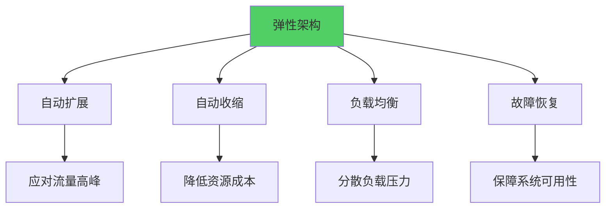

**核心特征：**
- **自动扩展**：负载增加时自动增加资源
- **自动收缩**：负载减少时自动释放资源
- **快速响应**：能够快速应对流量变化
- **成本优化**：按需使用资源，避免浪费

## 弹性架构的价值

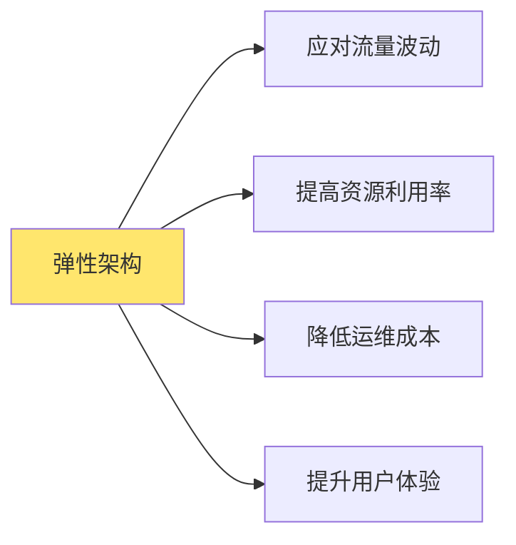

**价值体现：**
- **应对流量波动**：自动应对突发流量和流量高峰
- **提高资源利用率**：按需分配资源，避免资源浪费
- **降低运维成本**：减少人工干预，自动化运维
- **提升用户体验**：保证系统性能，提供稳定服务

## 弹性架构的挑战

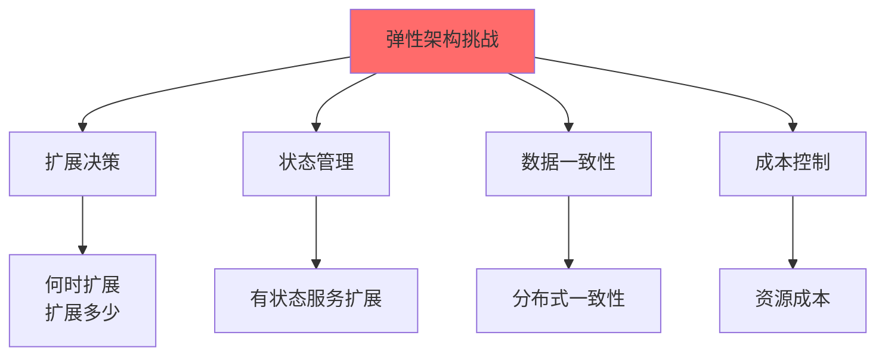

**主要挑战：**
- **扩展决策**：如何判断何时需要扩展，扩展多少
- **状态管理**：有状态服务的扩展和状态同步
- **数据一致性**：扩展过程中的数据一致性保证
- **成本控制**：平衡性能和成本

# 横向扩容

横向扩容（Horizontal Scaling）是通过增加服务器实例数量来提升系统处理能力的方式，也称为水平扩展。

## 横向扩容概述


**特点：**
- 通过增加实例数量扩展
- 理论上可以无限扩展
- 需要负载均衡支持
- 适合无状态服务

## 横向扩容架构

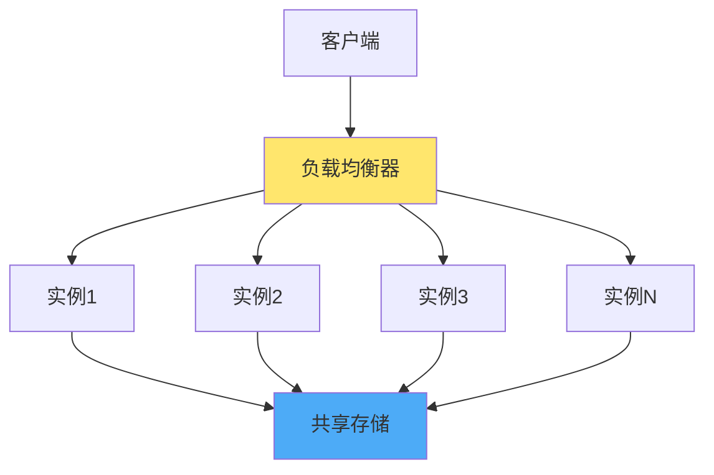

**架构要点：**
- **负载均衡器**：分发请求到多个实例
- **无状态服务**：服务实例不保存状态
- **共享存储**：状态存储在共享存储中
- **服务发现**：动态发现可用实例

## 横向扩容策略

### 1. 手动扩容

手动扩容是运维人员根据监控指标手动增加或减少实例。


**适用场景：**
- 可预测的流量变化（如促销活动）
- 需要精确控制的场景
- 成本敏感的场景

### 2. 自动扩容

自动扩容是根据预设规则自动调整实例数量。

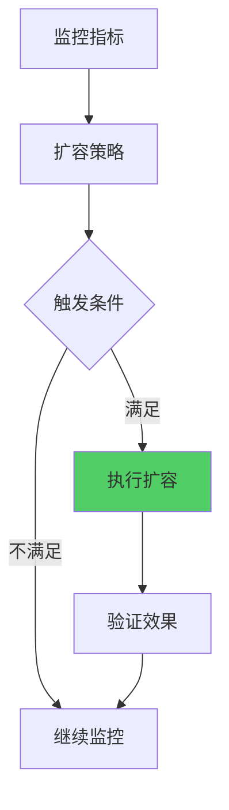

**扩容策略：**

**基于CPU使用率：**
```yaml
autoscaling:
  minReplicas: 2
  maxReplicas: 10
  metrics:
    - type: Resource
      resource:
        name: cpu
        target:
          type: Utilization
          averageUtilization: 70
```

**基于内存使用率：**
```yaml
autoscaling:
  metrics:
    - type: Resource
      resource:
        name: memory
        target:
          type: Utilization
          averageUtilization: 80
```

**基于请求数：**
```yaml
autoscaling:
  metrics:
    - type: Pods
      pods:
        metric:
          name: http_requests_per_second
        target:
          type: AverageValue
          averageValue: "100"
```

### 3. 预测性扩容

预测性扩容是基于历史数据和机器学习预测未来负载，提前扩容。


**优势：**
- 提前准备，避免延迟
- 更平滑的资源调整
- 更好的用户体验

## 横向扩容实现

### Kubernetes HPA

Kubernetes Horizontal Pod Autoscaler（HPA）是Kubernetes的自动扩容组件。

```yaml
apiVersion: autoscaling/v2
kind: HorizontalPodAutoscaler
metadata:
  name: order-service-hpa
spec:
  scaleTargetRef:
    apiVersion: apps/v1
    kind: Deployment
    name: order-service
  minReplicas: 2
  maxReplicas: 10
  metrics:
  - type: Resource
    resource:
      name: cpu
      target:
        type: Utilization
        averageUtilization: 70
  - type: Resource
    resource:
      name: memory
      target:
        type: Utilization
        averageUtilization: 80
  behavior:
    scaleDown:
      stabilizationWindowSeconds: 300
      policies:
      - type: Percent
        value: 50
        periodSeconds: 60
    scaleUp:
      stabilizationWindowSeconds: 0
      policies:
      - type: Percent
        value: 100
        periodSeconds: 15
      - type: Pods
        value: 2
        periodSeconds: 15
      selectPolicy: Max
```

### 自定义扩容逻辑

```go
// 自动扩容控制器
type AutoScaler struct {
    client    kubernetes.Interface
    metrics   MetricsCollector
    strategy  ScalingStrategy
}

type ScalingStrategy struct {
    MinReplicas int
    MaxReplicas int
    TargetCPU   int
    TargetMemory int
}

func (a *AutoScaler) Evaluate(deployment string) error {
    // 1. 获取当前指标
    metrics, err := a.metrics.GetMetrics(deployment)
    if err != nil {
        return err
    }
    
    // 2. 获取当前副本数
    currentReplicas, err := a.getCurrentReplicas(deployment)
    if err != nil {
        return err
    }
    
    // 3. 计算目标副本数
    targetReplicas := a.calculateTargetReplicas(metrics, currentReplicas)
    
    // 4. 应用扩容策略
    targetReplicas = a.applyStrategy(targetReplicas)
    
    // 5. 执行扩容
    if targetReplicas != currentReplicas {
        return a.scale(deployment, targetReplicas)
    }
    
    return nil
}

func (a *AutoScaler) calculateTargetReplicas(metrics *Metrics, current int) int {
    // 基于CPU计算
    cpuReplicas := int(float64(current) * float64(metrics.CPU) / float64(a.strategy.TargetCPU))
    
    // 基于内存计算
    memoryReplicas := int(float64(current) * float64(metrics.Memory) / float64(a.strategy.TargetMemory))
    
    // 取较大值
    target := cpuReplicas
    if memoryReplicas > target {
        target = memoryReplicas
    }
    
    return target
}

func (a *AutoScaler) applyStrategy(target int) int {
    if target < a.strategy.MinReplicas {
        return a.strategy.MinReplicas
    }
    if target > a.strategy.MaxReplicas {
        return a.strategy.MaxReplicas
    }
    return target
}
```

## 横向扩容最佳实践

### 1. 扩容速度控制

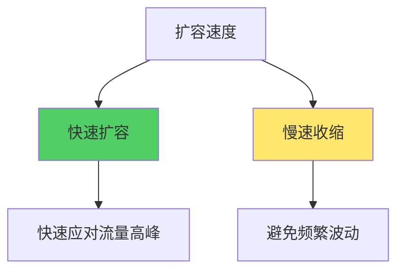

**策略：**
- **快速扩容**：快速应对流量增加
- **慢速收缩**：避免频繁波动，防止流量反弹

### 2. 扩容冷却期

```go
// 扩容冷却期
type AutoScaler struct {
    lastScaleTime time.Time
    cooldownPeriod time.Duration
}

func (a *AutoScaler) shouldScale() bool {
    if time.Since(a.lastScaleTime) < a.cooldownPeriod {
        return false
    }
    return true
}
```

### 3. 扩容边界设置

- **最小副本数**：保证基本可用性
- **最大副本数**：控制成本上限
- **初始副本数**：合理的启动副本数

### 4. 多指标综合判断

```go
// 多指标综合判断
func (a *AutoScaler) calculateReplicas(metrics *Metrics) int {
    // CPU指标
    cpuReplicas := calculateByCPU(metrics.CPU)
    
    // 内存指标
    memoryReplicas := calculateByMemory(metrics.Memory)
    
    // 请求数指标
    requestReplicas := calculateByRequests(metrics.Requests)
    
    // 取最大值
    return max(cpuReplicas, memoryReplicas, requestReplicas)
}
```

# 纵向扩容

纵向扩容（Vertical Scaling）是通过增加单个服务器实例的资源（CPU、内存等）来提升系统处理能力的方式，也称为垂直扩展。

## 纵向扩容概述

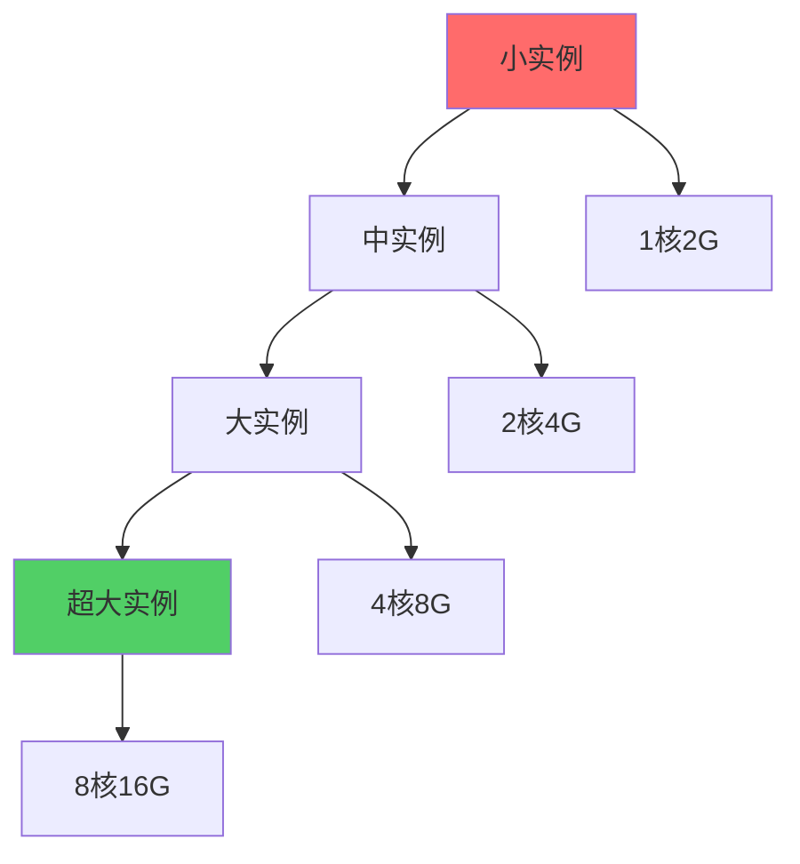

**特点：**
- 通过增加单实例资源扩展
- 有物理上限限制
- 不需要负载均衡调整
- 适合有状态服务

## 纵向扩容架构

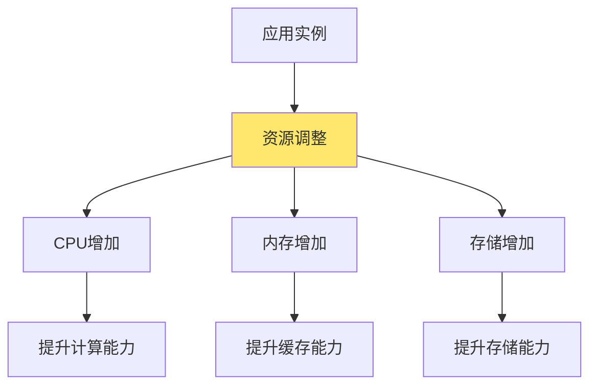

**架构要点：**
- **资源调整**：动态调整实例资源配置
- **无需重启**：支持在线调整（部分场景）
- **状态保持**：实例状态不丢失
- **单点限制**：受限于单机资源上限

## 纵向扩容策略

### 1. 静态扩容

静态扩容是在实例创建时指定资源配置，需要重新创建实例。


**适用场景：**
- 可预测的资源需求
- 允许短暂停机
- 资源需求大幅变化

### 2. 动态扩容

动态扩容是在实例运行过程中动态调整资源配置，无需重启。


**适用场景：**
- 需要在线调整
- 资源需求小幅变化
- 不能中断服务

## 纵向扩容实现

### Kubernetes VPA

Kubernetes Vertical Pod Autoscaler（VPA）是Kubernetes的自动纵向扩容组件。

```yaml
apiVersion: autoscaling.k8s.io/v1
kind: VerticalPodAutoscaler
metadata:
  name: order-service-vpa
spec:
  targetRef:
    apiVersion: apps/v1
    kind: Deployment
    name: order-service
  updatePolicy:
    updateMode: "Auto"  # Auto, Off, Initial
  resourcePolicy:
    containerPolicies:
    - containerName: order-service
      minAllowed:
        cpu: 100m
        memory: 128Mi
      maxAllowed:
        cpu: 2
        memory: 4Gi
      controlledResources: ["cpu", "memory"]
```

### 自定义纵向扩容

```go
// 纵向扩容控制器
type VerticalScaler struct {
    client kubernetes.Interface
    metrics MetricsCollector
}

func (v *VerticalScaler) AdjustResources(pod string) error {
    // 1. 获取当前资源使用情况
    metrics, err := v.metrics.GetPodMetrics(pod)
    if err != nil {
        return err
    }
    
    // 2. 计算目标资源
    targetResources := v.calculateResources(metrics)
    
    // 3. 应用资源限制
    return v.updatePodResources(pod, targetResources)
}

func (v *VerticalScaler) calculateResources(metrics *PodMetrics) *ResourceRequirements {
    // CPU计算：使用率的120%作为请求值
    cpuRequest := int64(float64(metrics.CPUUsage) * 1.2)
    
    // 内存计算：使用率的130%作为请求值
    memoryRequest := int64(float64(metrics.MemoryUsage) * 1.3)
    
    // 设置限制值（请求值的150%）
    return &ResourceRequirements{
        Requests: ResourceList{
            CPU:    cpuRequest,
            Memory: memoryRequest,
        },
        Limits: ResourceList{
            CPU:    cpuRequest * 150 / 100,
            Memory: memoryRequest * 150 / 100,
        },
    }
}
```

## 纵向扩容最佳实践

### 1. 资源请求和限制

```yaml
resources:
  requests:
    cpu: "500m"      # 请求值：保证的最小资源
    memory: "512Mi"
  limits:
    cpu: "2000m"      # 限制值：允许的最大资源
    memory: "2Gi"
```

**原则：**
- **requests**：设置合理的请求值，保证资源分配
- **limits**：设置合理的限制值，防止资源耗尽
- **比例**：limits通常是requests的1.5-2倍

### 2. 资源监控

```go
// 资源监控
type ResourceMonitor struct {
    metricsClient MetricsClient
}

func (m *ResourceMonitor) Monitor(pod string) {
    for {
        metrics, err := m.metricsClient.GetPodMetrics(pod)
        if err != nil {
            continue
        }
        
        // 检查资源使用率
        cpuUsage := float64(metrics.CPUUsage) / float64(metrics.CPULimit) * 100
        memoryUsage := float64(metrics.MemoryUsage) / float64(metrics.MemoryLimit) * 100
        
        // 告警
        if cpuUsage > 80 {
            alert("CPU usage high", cpuUsage)
        }
        if memoryUsage > 80 {
            alert("Memory usage high", memoryUsage)
        }
        
        time.Sleep(30 * time.Second)
    }
}
```

### 3. 资源优化

- **CPU优化**：合理设置CPU请求，避免过度分配
- **内存优化**：合理设置内存请求，避免OOM
- **存储优化**：合理设置存储大小，避免浪费

# 容器预热

容器预热（Container Warm-up）是在流量到达之前提前启动和初始化容器实例，减少冷启动延迟，提升用户体验。

## 容器预热概述

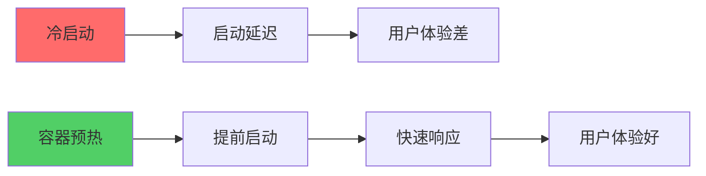

**问题：**
- **冷启动延迟**：新容器启动需要时间
- **初始化延迟**：应用初始化需要时间
- **首次请求慢**：首次请求需要加载资源

**解决方案：**
- **容器预热**：提前启动容器
- **预初始化**：提前初始化应用
- **健康检查**：确保容器就绪

## 容器预热策略

### 1. 最小实例保持

保持最小数量的运行实例，避免全部缩容到0。

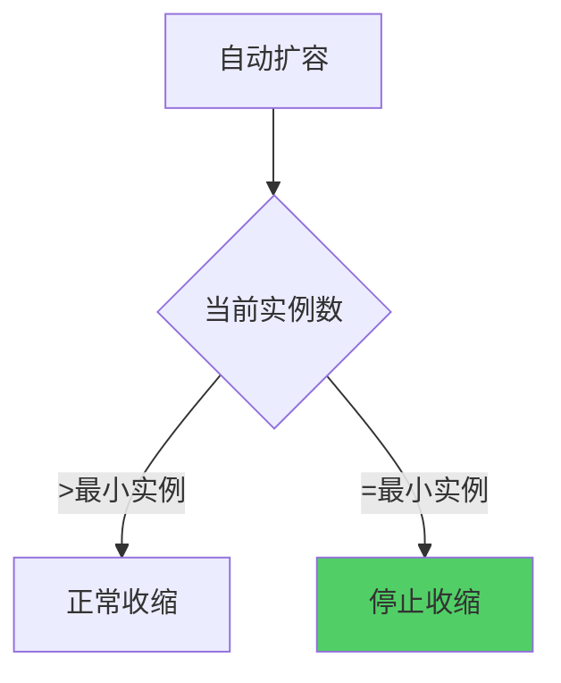

**实现：**
```yaml
autoscaling:
  minReplicas: 2  # 始终保持至少2个实例
  maxReplicas: 10
```

### 2. 预测性预热

基于历史数据预测流量，提前启动容器。


**实现：**
```go
// 预测性预热
type PredictiveWarmup struct {
    historyData []TrafficData
    predictor   TrafficPredictor
}

func (p *PredictiveWarmup) Warmup() error {
    // 1. 预测未来流量
    predictedTraffic := p.predictor.Predict(p.historyData)
    
    // 2. 计算需要的实例数
    requiredInstances := calculateInstances(predictedTraffic)
    
    // 3. 提前扩容
    return p.scaleUp(requiredInstances)
}
```

### 3. 定时预热

在已知的流量高峰时间提前启动容器。

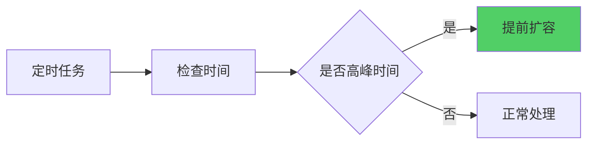

**实现：**
```yaml
# CronJob定时预热
apiVersion: batch/v1
kind: CronJob
metadata:
  name: warmup-job
spec:
  schedule: "0 8 * * *"  # 每天8点执行
  jobTemplate:
    spec:
      template:
        spec:
          containers:
          - name: warmup
            image: warmup-tool
            command: ["/bin/sh", "-c", "scale-up --target=5"]
```

### 4. 渐进式预热

逐步增加实例，而不是一次性扩容。


**实现：**
```go
// 渐进式预热
func (s *Scaler) GradualWarmup(targetReplicas int) error {
    current := s.getCurrentReplicas()
    
    for current < targetReplicas {
        // 每次增加1个实例
        next := min(current+1, targetReplicas)
        
        // 扩容
        if err := s.scale(next); err != nil {
            return err
        }
        
        // 等待实例就绪
        if err := s.waitForReady(next); err != nil {
            return err
        }
        
        current = next
        time.Sleep(10 * time.Second)  // 间隔10秒
    }
    
    return nil
}
```

## 容器预热实现

### 健康检查预热

```yaml
# 健康检查配置
livenessProbe:
  httpGet:
    path: /health
    port: 8080
  initialDelaySeconds: 30
  periodSeconds: 10
  timeoutSeconds: 5
  failureThreshold: 3

readinessProbe:
  httpGet:
    path: /ready
    port: 8080
  initialDelaySeconds: 10
  periodSeconds: 5
  timeoutSeconds: 3
  successThreshold: 1
```

### 应用预热

```go
// 应用预热逻辑
func (app *Application) Warmup() error {
    // 1. 预热数据库连接池
    if err := app.db.Warmup(); err != nil {
        return err
    }
    
    // 2. 预热缓存
    if err := app.cache.Warmup(); err != nil {
        return err
    }
    
    // 3. 加载必要数据
    if err := app.loadInitialData(); err != nil {
        return err
    }
    
    // 4. 预热JIT编译（如适用）
    app.precompile()
    
    return nil
}

// 数据库连接池预热
func (db *Database) Warmup() error {
    // 创建连接池
    pool, err := sql.Open("mysql", db.dsn)
    if err != nil {
        return err
    }
    
    // 设置连接池参数
    pool.SetMaxOpenConns(10)
    pool.SetMaxIdleConns(5)
    
    // 预热连接
    for i := 0; i < 5; i++ {
        conn, err := pool.Conn(context.Background())
        if err != nil {
            return err
        }
        conn.Close()
    }
    
    return nil
}
```

### 预热脚本

```bash
#!/bin/bash
# 容器预热脚本

# 1. 健康检查
check_health() {
    for i in {1..30}; do
        if curl -f http://localhost:8080/health; then
            echo "Health check passed"
            return 0
        fi
        sleep 1
    done
    echo "Health check failed"
    return 1
}

# 2. 预热请求
warmup_requests() {
    # 发送预热请求
    for i in {1..10}; do
        curl -s http://localhost:8080/api/warmup > /dev/null
    done
}

# 3. 执行预热
main() {
    echo "Starting warmup..."
    check_health
    warmup_requests
    echo "Warmup completed"
}

main
```

## 容器预热最佳实践

### 1. 预热时机

- **流量高峰前**：提前30分钟预热
- **定时任务**：在已知高峰时间预热
- **预测性预热**：基于预测提前预热

### 2. 预热策略

- **最小实例保持**：始终保持最小实例运行
- **渐进式预热**：逐步增加实例
- **健康检查**：确保实例就绪

### 3. 预热成本控制

- **合理的最小实例数**：平衡成本和性能
- **预热时间窗口**：只在必要时预热
- **自动收缩**：低峰期自动收缩

# 快速替换

快速替换（Fast Replacement）是指在服务更新或故障恢复时，能够快速替换实例，最小化服务中断时间。

## 快速替换概述


**目标：**
- **零停机部署**：更新过程中服务不中断
- **快速恢复**：故障时快速恢复服务
- **平滑切换**：流量平滑切换到新实例

## 快速替换策略

### 1. 蓝绿部署

蓝绿部署是同时维护两个生产环境，通过切换流量实现零停机部署。

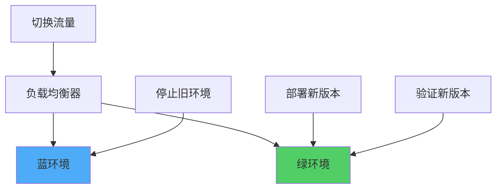

**流程：**
1. 部署新版本到绿环境
2. 验证绿环境功能
3. 切换流量到绿环境
4. 监控绿环境运行
5. 停止蓝环境

**实现：**
```yaml
# 蓝环境
apiVersion: apps/v1
kind: Deployment
metadata:
  name: app-blue
spec:
  replicas: 3
  selector:
    matchLabels:
      app: myapp
      version: blue
  template:
    metadata:
      labels:
        app: myapp
        version: blue
    spec:
      containers:
      - name: app
        image: myapp:v1.0

---
# 绿环境
apiVersion: apps/v1
kind: Deployment
metadata:
  name: app-green
spec:
  replicas: 3
  selector:
    matchLabels:
      app: myapp
      version: green
  template:
    metadata:
      labels:
        app: myapp
        version: green
    spec:
      containers:
      - name: app
        image: myapp:v2.0

---
# Service切换
apiVersion: v1
kind: Service
metadata:
  name: myapp-service
spec:
  selector:
    app: myapp
    version: green  # 切换到绿环境
  ports:
  - port: 80
```

### 2. 金丝雀部署

金丝雀部署是逐步将流量切换到新版本，降低部署风险。

```mermaid
graph TB
    A[负载均衡器] --> B[旧版本 90%]
    A --> C[新版本 10%]
    
    D[验证新版本] --> C
    E[逐步增加流量] --> A
    F[全量切换] --> A
    
    style C fill:#51CF66
```

**流程：**
1. 部署新版本实例（少量）
2. 将少量流量切换到新版本
3. 监控新版本运行情况
4. 逐步增加新版本流量
5. 全量切换到新版本

**实现：**
```yaml
# 使用Istio进行流量分割
apiVersion: networking.istio.io/v1alpha3
kind: VirtualService
metadata:
  name: myapp
spec:
  hosts:
  - myapp
  http:
  - match:
    - headers:
        canary:
          exact: "true"
    route:
    - destination:
        host: myapp
        subset: v2
      weight: 100
  - route:
    - destination:
        host: myapp
        subset: v1
      weight: 90
    - destination:
        host: myapp
        subset: v2
      weight: 10
```

### 3. 滚动更新

滚动更新是逐步替换实例，每次替换一个或几个实例。

```mermaid
graph LR
    A[实例1 v1] --> B[实例1 v2]
    C[实例2 v1] --> D[实例2 v2]
    E[实例3 v1] --> F[实例3 v2]
    
    style B fill:#51CF66
    style D fill:#51CF66
    style F fill:#51CF66
```

**实现：**
```yaml
apiVersion: apps/v1
kind: Deployment
metadata:
  name: myapp
spec:
  replicas: 3
  strategy:
    type: RollingUpdate
    rollingUpdate:
      maxSurge: 1        # 最多额外1个实例
      maxUnavailable: 0  # 最多0个不可用
  template:
    spec:
      containers:
      - name: app
        image: myapp:v2.0
```

### 4. 快速回滚

快速回滚是在新版本有问题时快速回退到旧版本。

```mermaid
graph LR
    A[新版本问题] --> B[检测异常]
    B --> C[自动回滚]
    C --> D[恢复旧版本]
    
    style C fill:#FF6B6B
    style D fill:#51CF66
```

**实现：**
```go
// 自动回滚
type RollbackManager struct {
    client kubernetes.Interface
    monitor HealthMonitor
}

func (r *RollbackManager) Monitor(deployment string) {
    for {
        // 检查健康状态
        if !r.monitor.IsHealthy(deployment) {
            // 触发回滚
            r.rollback(deployment)
        }
        time.Sleep(10 * time.Second)
    }
}

func (r *RollbackManager) rollback(deployment string) error {
    // 回滚到上一个版本
    return r.client.AppsV1().Deployments("default").
        Rollback(context.Background(), deployment, &appsv1.RollbackConfig{})
}
```

## 快速替换实现

### 健康检查

```go
// 健康检查
type HealthChecker struct {
    client http.Client
    timeout time.Duration
}

func (h *HealthChecker) Check(url string) bool {
    ctx, cancel := context.WithTimeout(context.Background(), h.timeout)
    defer cancel()
    
    req, err := http.NewRequestWithContext(ctx, "GET", url, nil)
    if err != nil {
        return false
    }
    
    resp, err := h.client.Do(req)
    if err != nil {
        return false
    }
    defer resp.Body.Close()
    
    return resp.StatusCode == http.StatusOK
}

// 就绪检查
func (h *HealthChecker) WaitForReady(url string, timeout time.Duration) error {
    deadline := time.Now().Add(timeout)
    
    for time.Now().Before(deadline) {
        if h.Check(url) {
            return nil
        }
        time.Sleep(1 * time.Second)
    }
    
    return fmt.Errorf("service not ready after %v", timeout)
}
```

### 流量切换

```go
// 流量切换
type TrafficSwitcher struct {
    loadBalancer LoadBalancer
}

func (t *TrafficSwitcher) SwitchTraffic(oldVersion, newVersion string, percentage int) error {
    // 1. 检查新版本健康状态
    if !t.isHealthy(newVersion) {
        return fmt.Errorf("new version is not healthy")
    }
    
    // 2. 逐步切换流量
    for p := 0; p <= percentage; p += 10 {
        t.loadBalancer.SetWeight(oldVersion, 100-p)
        t.loadBalancer.SetWeight(newVersion, p)
        
        // 等待稳定
        time.Sleep(30 * time.Second)
        
        // 检查新版本
        if !t.isHealthy(newVersion) {
            // 回滚
            t.loadBalancer.SetWeight(oldVersion, 100)
            t.loadBalancer.SetWeight(newVersion, 0)
            return fmt.Errorf("new version failed, rolled back")
        }
    }
    
    return nil
}
```

## 快速替换最佳实践

### 1. 部署策略选择

```mermaid
graph TB
    A[部署需求] --> B{需要零停机?}
    B -->|是| C{需要快速回滚?}
    B -->|否| D[滚动更新]
    C -->|是| E[蓝绿部署]
    C -->|否| F[金丝雀部署]
    
    style E fill:#51CF66
    style F fill:#FFE66D
    style D fill:#4DABF7
```

### 2. 健康检查配置

- **就绪检查**：确保实例可以接收流量
- **存活检查**：确保实例正常运行
- **启动探针**：等待应用完全启动

### 3. 流量切换策略

- **渐进式切换**：逐步增加新版本流量
- **监控告警**：实时监控新版本状态
- **快速回滚**：发现问题立即回滚

### 4. 资源准备

- **提前准备**：提前准备新版本资源
- **资源预留**：为快速替换预留资源
- **快速启动**：优化启动时间

# 弹性架构最佳实践

## 综合策略

```mermaid
graph TB
    A[弹性架构] --> B[横向扩容]
    A --> C[纵向扩容]
    A --> D[容器预热]
    A --> E[快速替换]
    
    B --> B1[应对流量波动]
    C --> C1[优化单实例性能]
    D --> D1[减少冷启动]
    E --> E1[零停机部署]
    
    style A fill:#FFE66D
```

## 实践建议

### 1. 选择合适的扩容方式

- **无状态服务**：优先使用横向扩容
- **有状态服务**：考虑纵向扩容或状态分离
- **混合策略**：结合横向和纵向扩容

### 2. 监控和告警

- **关键指标**：CPU、内存、请求数、响应时间
- **告警规则**：设置合理的告警阈值
- **自动化响应**：基于告警自动扩容

### 3. 成本优化

- **合理的最小实例数**：平衡成本和性能
- **快速收缩**：低峰期快速释放资源
- **资源预留**：使用预留实例降低成本

### 4. 测试验证

- **压力测试**：验证扩容能力
- **故障测试**：验证快速替换能力
- **成本测试**：验证成本控制效果

# 总结

弹性架构是现代分布式系统的核心能力，通过横向扩容、纵向扩容、容器预热和快速替换等策略，实现系统的自动扩展和优化。

**关键要点：**
1. **横向扩容**：通过增加实例应对流量波动
2. **纵向扩容**：通过增加资源优化单实例性能
3. **容器预热**：减少冷启动延迟，提升用户体验
4. **快速替换**：实现零停机部署和快速恢复

**最佳实践：**
- 选择合适的扩容策略
- 完善的监控和告警
- 合理的成本控制
- 充分的测试验证

通过系统性的弹性架构设计，可以构建高可用、高性能、成本优化的分布式系统。
