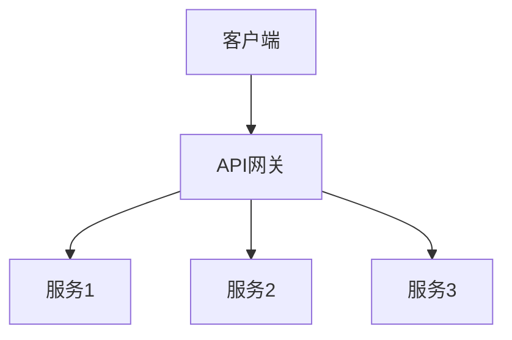
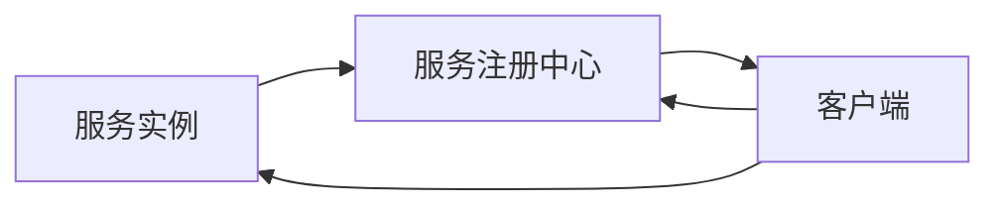
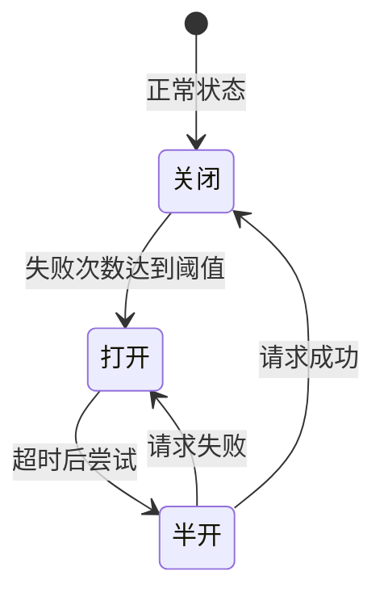
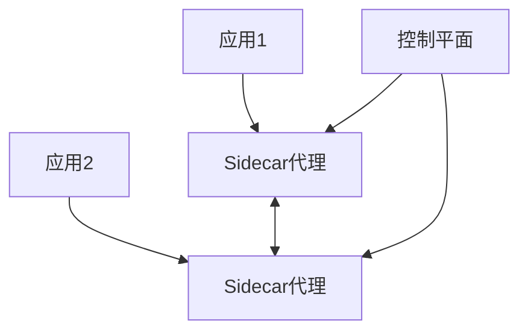
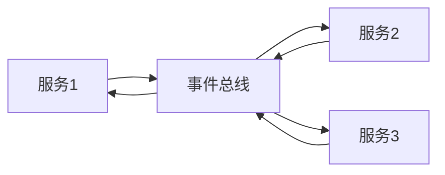
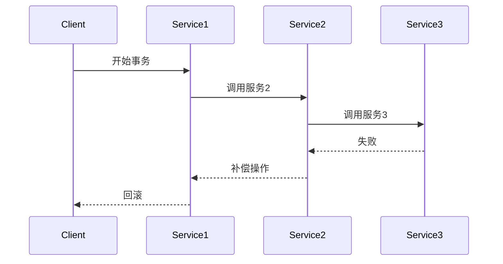
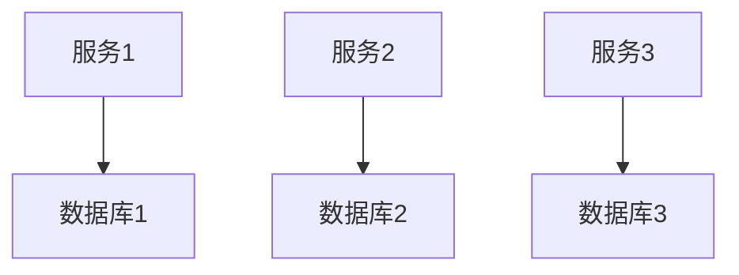
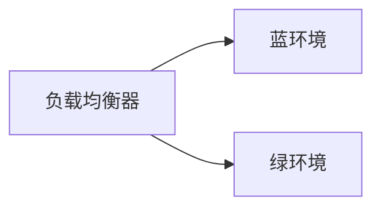
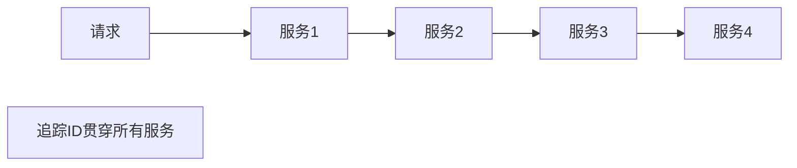
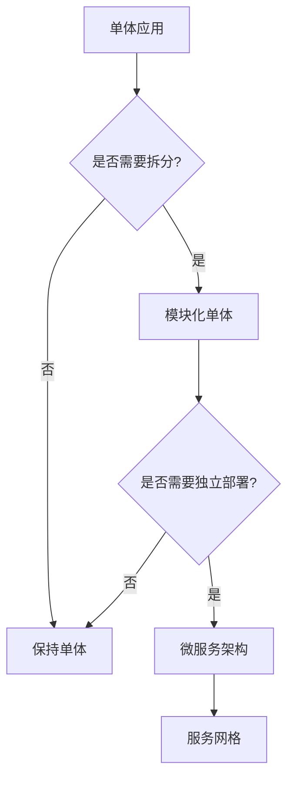

微服务架构（Microservices Architecture）是一种将单一应用程序开发为一套小型服务的方法，每个服务运行在自己的进程中，并通过轻量级机制（通常是HTTP RESTful API）进行通信。

# 微服务架构概述

微服务架构是一种分布式系统架构模式，它将大型单体应用拆分为多个独立的、可独立部署的小型服务。每个微服务专注于完成特定的业务功能，并通过明确定义的API接口与其他服务通信。

## 架构演进历程

### 1. 单体架构（Monolithic Architecture）
- 所有功能模块打包在一个应用中
- 部署简单，但难以扩展和维护

### 2. 垂直拆分
- 按业务功能拆分为多个独立应用
- 解决了部分扩展问题，但仍有代码重复

### 3. SOA架构（Service-Oriented Architecture）
- 面向服务的架构，强调服务复用
- 通常使用ESB（企业服务总线）进行服务编排

### 4. 微服务架构
- 更细粒度的服务拆分
- 去中心化的服务治理

### 5. 服务网格（Service Mesh）
- 在微服务基础上增加服务间通信的抽象层
- 提供统一的服务治理能力

# 微服务架构的核心特征

## 1. 服务独立部署
每个微服务可以独立开发、测试、部署和扩展，不影响其他服务。

## 2. 技术栈多样性
不同的微服务可以使用不同的编程语言、框架和数据库。

## 3. 去中心化治理
没有统一的技术标准，团队可以选择最适合的技术栈。

## 4. 去中心化管理
每个服务由独立的团队负责，实现真正的DevOps。

## 5. 故障隔离
单个服务的故障不会导致整个系统崩溃。

## 6. 数据独立
每个微服务拥有自己的数据库，实现数据隔离。

# 微服务架构的优势

## 1. 技术灵活性
- 可以为不同服务选择最适合的技术栈
- 更容易采用新技术

## 2. 可扩展性
- 可以独立扩展单个服务
- 按需分配资源，提高资源利用率

## 3. 团队自治
- 小团队负责小服务，提高开发效率
- 减少团队间的协调成本

## 4. 故障隔离
- 单个服务故障不会影响整个系统
- 提高系统的整体可用性

## 5. 快速迭代
- 服务可以独立发布
- 缩短发布周期，提高交付速度

# 微服务架构的挑战

## 1. 分布式系统复杂性
- 网络延迟和故障
- 数据一致性挑战
- 分布式事务处理

## 2. 服务间通信
- 需要处理服务发现、负载均衡
- 网络故障和超时处理
- 服务版本管理

## 3. 数据管理
- 数据一致性保证
- 跨服务查询困难
- 数据同步和复制

## 4. 运维复杂度
- 需要管理大量服务实例
- 监控和日志收集困难
- 部署和配置管理复杂

## 5. 测试复杂性
- 需要模拟服务依赖
- 集成测试困难
- 端到端测试复杂

# 微服务设计原则

## 1. 单一职责原则（SRP）
每个微服务应该只负责一个业务功能或领域。

## 2. 高内聚、低耦合
- 服务内部功能高度相关
- 服务间依赖最小化

## 3. 围绕业务能力组织
按照业务领域而非技术层次划分服务。

## 4. 去中心化数据管理
每个服务拥有自己的数据存储，避免共享数据库。

## 5. 基础设施自动化
- CI/CD自动化
- 容器化部署
- 自动化监控和告警

## 6. 容错设计
- 服务降级
- 熔断机制
- 重试和超时处理

# 微服务架构模式

## 1. API网关模式（API Gateway）

**作用：**
- 统一入口，简化客户端调用
- 路由转发和负载均衡
- 认证授权
- 限流和熔断
- 协议转换

## 2. 服务发现模式（Service Discovery）

**实现方式：**
- **客户端发现**：客户端查询注册中心，直接调用服务
- **服务端发现**：通过负载均衡器进行服务发现和路由

**常见工具：**
- Consul
- Eureka
- etcd
- Zookeeper
- Kubernetes Service

## 3. 配置中心模式（Configuration Center）

集中管理所有服务的配置信息，支持动态更新。

**功能：**
- 配置集中管理
- 配置版本控制
- 配置动态刷新
- 环境隔离

**常见工具：**
- Spring Cloud Config
- Apollo
- Nacos

## 4. 熔断器模式（Circuit Breaker）

**状态：**
- **关闭（Closed）**：正常状态，请求正常通过
- **打开（Open）**：服务异常，直接返回失败，不调用服务
- **半开（Half-Open）**：尝试恢复，允许少量请求通过

**常见实现：**
- Hystrix
- Resilience4j
- Sentinel

## 5. 服务网格模式（Service Mesh）

**特点：**
- 将服务间通信逻辑从业务代码中分离
- 通过Sidecar代理处理通信
- 提供统一的服务治理能力

**常见实现：**
- Istio
- Linkerd
- Consul Connect

## 6. 事件驱动架构（Event-Driven Architecture）

**优势：**
- 服务间解耦
- 异步处理
- 易于扩展

**常见实现：**
- Apache Kafka
- RabbitMQ
- Apache Pulsar

## 7. Saga模式（分布式事务）

**两种实现方式：**

**编排式（Orchestration）：**
- 中央协调器负责协调各个服务
- 集中式控制，易于理解

**编排式（Choreography）：**
- 每个服务独立处理自己的事务
- 通过事件进行协调
- 去中心化，但难以追踪

# 微服务通信方式

## 1. 同步通信

### RESTful API
- 基于HTTP协议
- 简单易用，广泛支持
- 适合请求-响应模式

### gRPC
- 基于HTTP/2和Protocol Buffers
- 高性能，支持流式传输
- 适合内部服务间通信

### GraphQL
- 灵活的查询语言
- 客户端可以精确指定需要的数据
- 减少网络传输

## 2. 异步通信

### 消息队列
- 解耦服务
- 异步处理
- 削峰填谷

**常见消息队列：**
- RabbitMQ
- Apache Kafka
- RocketMQ
- Apache Pulsar

### 事件总线
- 发布-订阅模式
- 事件驱动架构
- 服务间解耦

# 数据管理策略

## 1. 数据库 per 服务（Database per Service）

**原则：**
- 每个服务拥有独立的数据库
- 服务只能访问自己的数据库
- 通过API访问其他服务的数据

**优势：**
- 数据隔离
- 技术栈独立
- 独立扩展

**挑战：**
- 跨服务查询困难
- 数据一致性保证

## 2. 数据一致性模式

### 最终一致性（Eventual Consistency）
- 允许短暂的数据不一致
- 通过事件同步最终达到一致
- 适合大多数业务场景

### 强一致性
- 使用分布式事务（如Saga模式）
- 性能开销大
- 适合关键业务场景

### CQRS（Command Query Responsibility Segregation）
- 读写分离
- 命令和查询使用不同的数据模型
- 提高系统性能和可扩展性

## 3. 数据同步策略

### 事件溯源（Event Sourcing）
- 存储所有状态变更事件
- 通过重放事件重建状态
- 提供完整的审计日志

### 变更数据捕获（CDC）
- 捕获数据库变更
- 发布变更事件
- 其他服务订阅事件更新

# 微服务部署策略

## 1. 容器化部署

### Docker
- 轻量级容器
- 环境一致性
- 快速部署

### Kubernetes
- 容器编排
- 自动扩缩容
- 服务发现和负载均衡
- 滚动更新和回滚

## 2. 部署模式

### 蓝绿部署（Blue-Green Deployment）

- 同时维护两个生产环境
- 零停机部署
- 快速回滚

### 金丝雀部署（Canary Deployment）
- 逐步将流量切换到新版本
- 降低部署风险
- 监控新版本表现

### 滚动部署（Rolling Deployment）
- 逐步替换旧实例
- 资源利用率高
- 需要兼容新旧版本

# 监控和可观测性

## 1. 日志聚合

**要求：**
- 集中收集所有服务日志
- 统一日志格式
- 快速检索和分析

**工具：**
- ELK Stack (Elasticsearch, Logstash, Kibana)
- Loki
- Splunk

## 2. 分布式追踪

**功能：**
- 追踪请求在服务间的流转
- 分析性能瓶颈
- 定位问题

**工具：**
- Jaeger
- Zipkin
- SkyWalking

## 3. 指标监控

**关键指标：**
- **延迟（Latency）**：请求响应时间
- **流量（Traffic）**：请求量
- **错误（Errors）**：错误率
- **饱和度（Saturation）**：资源使用率

**工具：**
- Prometheus + Grafana
- Datadog
- New Relic

## 4. 健康检查

- 服务健康状态检查
- 自动故障检测
- 自动恢复机制

# 微服务架构最佳实践

## 1. 服务拆分原则

### 按业务领域拆分
- 识别业务边界（Bounded Context）
- 遵循领域驱动设计（DDD）
- 避免按技术层次拆分

### 服务粒度
- 不要过度拆分
- 服务应该足够小，但不要太小
- 考虑团队规模和服务复杂度

## 2. API设计

### RESTful设计
- 使用标准HTTP方法
- 合理的资源命名
- 版本管理

### 版本控制
- URL版本：`/v1/users`
- Header版本：`Accept: application/vnd.api+json;version=1`
- 支持多版本共存

## 3. 安全

### 认证授权
- OAuth 2.0 / JWT
- API密钥管理
- 服务间认证

### 网络安全
- TLS/SSL加密
- 网络隔离
- 防火墙规则

## 4. 性能优化

### 缓存策略
- 多级缓存
- 缓存更新策略
- 缓存穿透和雪崩防护

### 异步处理
- 非关键路径异步化
- 消息队列削峰
- 批量处理

### 数据库优化
- 读写分离
- 分库分表
- 索引优化

## 5. 测试策略

### 单元测试
- 测试服务内部逻辑
- 高覆盖率

### 集成测试
- 测试服务间交互
- 使用测试容器

### 契约测试
- 测试API契约
- 确保服务兼容性

### 端到端测试
- 测试完整业务流程
- 模拟真实场景

# 微服务 vs 单体架构

| 特性 | 单体架构 | 微服务架构 |
|------|---------|-----------|
| 部署 | 简单 | 复杂 |
| 扩展 | 整体扩展 | 独立扩展 |
| 技术栈 | 统一 | 多样化 |
| 开发速度 | 初期快 | 长期快 |
| 测试 | 简单 | 复杂 |
| 故障隔离 | 差 | 好 |
| 数据一致性 | 强一致性 | 最终一致性 |
| 团队协作 | 需要协调 | 独立开发 |

# 何时使用微服务架构

## 适合场景

1. **大型复杂应用**
   - 团队规模大
   - 业务复杂度高
   - 需要快速迭代

2. **高并发场景**
   - 需要独立扩展不同模块
   - 资源利用率要求高

3. **多技术栈需求**
   - 不同模块适合不同技术
   - 需要快速采用新技术

4. **团队分布**
   - 跨地域团队
   - 需要独立交付

## 不适合场景

1. **小型应用**
   - 团队规模小
   - 业务简单
   - 微服务带来的复杂度不值得

2. **初期项目**
   - 业务边界不清晰
   - 需求变化频繁
   - 应该先使用单体架构

3. **强一致性要求**
   - 金融交易系统
   - 需要ACID事务
   - 微服务的最终一致性不满足

# 微服务架构演进路径

## 演进建议

1. **从单体开始**
   - 不要一开始就使用微服务
   - 先构建单体应用，验证业务

2. **识别边界**
   - 当单体应用变得复杂时
   - 识别业务边界
   - 准备拆分

3. **逐步拆分**
   - 先拆分最独立的模块
   - 逐步迁移
   - 不要一次性全部拆分

4. **持续优化**
   - 根据实际情况调整
   - 合并过度拆分的服务
   - 优化服务粒度

# 总结

微服务架构是一种强大的架构模式，但并不是银弹。选择微服务架构需要权衡其带来的复杂度和收益。

**关键要点：**
- 微服务适合大型复杂应用
- 需要完善的DevOps基础设施
- 团队需要具备分布式系统经验
- 从单体开始，逐步演进
- 关注服务拆分和边界识别
- 重视监控和可观测性

微服务架构的成功实施需要技术、流程和组织的全面配合。只有在合适的场景下，采用合适的方式，才能发挥微服务架构的最大价值。
