工程落地能力是将理论知识转化为实际可运行系统的关键能力。本文档从工程化思维、技术选型、架构设计、代码质量、性能优化、监控运维等多个维度，系统性地介绍如何提升工程落地能力。

# 工程落地能力概述

## 什么是工程落地能力？

工程落地能力是指将技术方案、架构设计转化为可运行、可维护、可扩展的生产系统的能力。

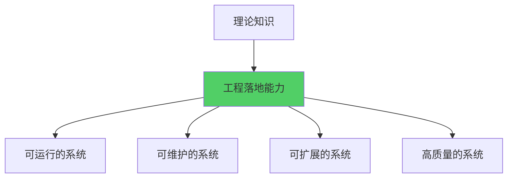

**核心要素：**
- **技术选型能力**：选择合适的技术栈
- **架构设计能力**：设计可落地的架构
- **代码实现能力**：编写高质量代码
- **性能优化能力**：优化系统性能
- **运维监控能力**：保障系统稳定运行
- **团队协作能力**：高效团队协作

## 工程落地能力的价值

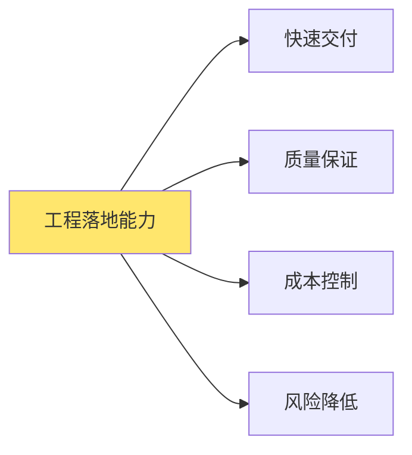

**价值体现：**
- **快速交付**：缩短从设计到上线的周期
- **质量保证**：减少生产环境问题
- **成本控制**：优化资源使用，降低运维成本
- **风险降低**：提前识别和规避风险

# 工程化思维

## 从理论到实践

工程化思维是将理论知识转化为工程实践的关键。

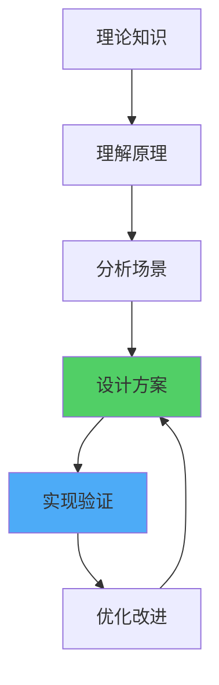

### 思维转变

**理论思维 vs 工程思维：**

| 维度 | 理论思维 | 工程思维 |
|------|---------|---------|
| 关注点 | 正确性、完整性 | 可行性、成本 |
| 方法 | 理想化方案 | 权衡和折中 |
| 目标 | 完美解决 | 实用解决 |
| 约束 | 较少约束 | 多重约束 |

### 工程化原则

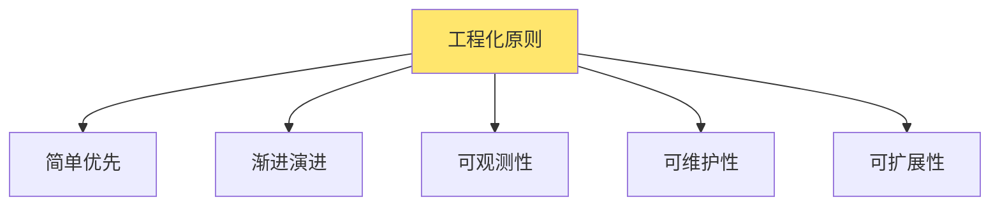

**核心原则：**
1. **简单优先**：选择最简单的可行方案
2. **渐进演进**：从简单到复杂逐步演进
3. **可观测性**：系统可监控、可调试
4. **可维护性**：代码清晰、文档完善
5. **可扩展性**：支持未来扩展需求

## 问题分析与解决

### 问题分析框架

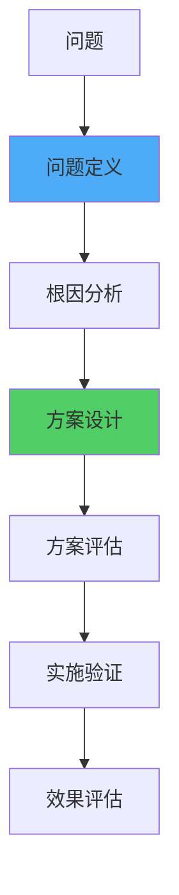

**分析步骤：**
1. **问题定义**：明确问题是什么，影响范围
2. **根因分析**：找到问题的根本原因
3. **方案设计**：设计解决方案
4. **方案评估**：评估方案的可行性、成本、风险
5. **实施验证**：实施并验证方案
6. **效果评估**：评估方案效果，持续改进

### 问题分类

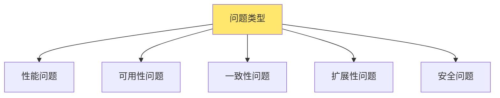

**不同类型的问题需要不同的解决思路：**
- **性能问题**：优化算法、增加缓存、异步处理
- **可用性问题**：冗余部署、故障转移、降级策略
- **一致性问题**：分布式事务、最终一致性、补偿机制
- **扩展性问题**：水平扩展、垂直扩展、架构优化
- **安全问题**：认证授权、数据加密、安全审计

# 技术选型

## 技术选型原则

技术选型是工程落地的第一步，选择合适的技术栈至关重要。

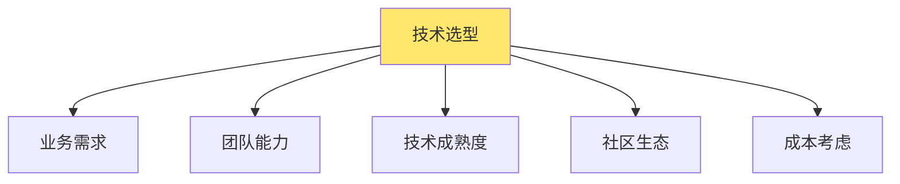

### 选型考虑因素

**1. 业务需求**
- 性能要求
- 可用性要求
- 扩展性要求
- 功能需求

**2. 团队能力**
- 团队技术栈熟悉度
- 学习成本
- 招聘难度

**3. 技术成熟度**
- 技术稳定性
- 生产环境验证
- 版本更新频率

**4. 社区生态**
- 社区活跃度
- 文档完善度
- 第三方支持

**5. 成本考虑**
- 开发成本
- 运维成本
- 授权成本

### 选型决策矩阵


**评估维度：**
- 功能完整性（权重：30%）
- 性能表现（权重：20%）
- 易用性（权重：20%）
- 社区支持（权重：15%）
- 成本（权重：15%）

## 技术选型实践

### 数据库选型

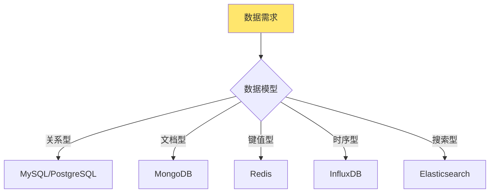

**选型考虑：**
- **关系型数据库**：事务要求、复杂查询
- **NoSQL数据库**：高并发、灵活schema
- **缓存数据库**：高性能、临时数据
- **时序数据库**：时间序列数据
- **搜索引擎**：全文搜索、日志分析

### 消息队列选型

| 特性 | Kafka | RabbitMQ | RocketMQ | Pulsar |
|------|-------|----------|----------|--------|
| 吞吐量 | 极高 | 高 | 高 | 极高 |
| 延迟 | 低 | 极低 | 低 | 低 |
| 顺序性 | ✅ | ⚠️ | ✅ | ✅ |
| 事务 | ⚠️ | ✅ | ✅ | ✅ |
| 适用场景 | 日志、大数据 | 业务消息 | 业务消息 | 多租户 |

### 服务框架选型

**Go语言服务框架：**
- **Gin**：轻量级、高性能HTTP框架
- **Echo**：简洁、快速的Web框架
- **Fiber**：Express风格的框架
- **gRPC**：高性能RPC框架

**选型建议：**
- 简单HTTP服务：Gin
- 需要高性能：gRPC
- 需要中间件丰富：Echo
- 熟悉Node.js：Fiber

# 架构设计实践

## 架构设计原则

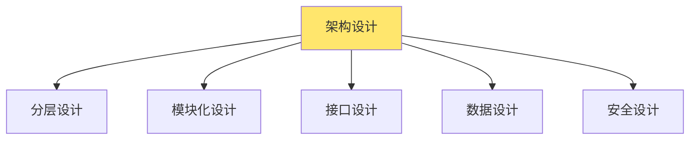

### 分层架构

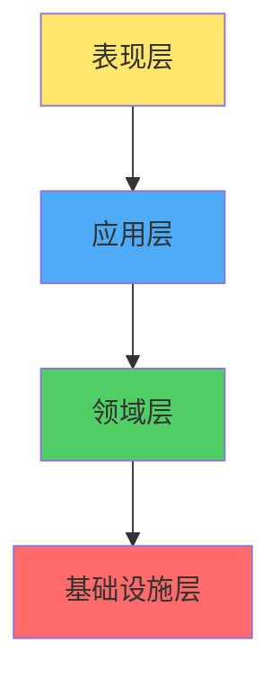

**分层原则：**
- **表现层**：处理HTTP请求、参数验证
- **应用层**：业务流程编排、事务管理
- **领域层**：业务逻辑、领域模型
- **基础设施层**：数据访问、外部服务调用

### 模块化设计

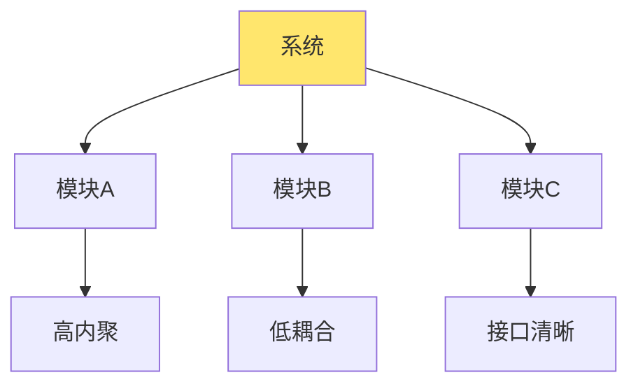

**模块化原则：**
- **高内聚**：模块内部功能紧密相关
- **低耦合**：模块间依赖最小化
- **接口清晰**：模块间通过明确接口通信
- **职责单一**：每个模块只负责一个功能

## 架构演进策略

### 演进路径

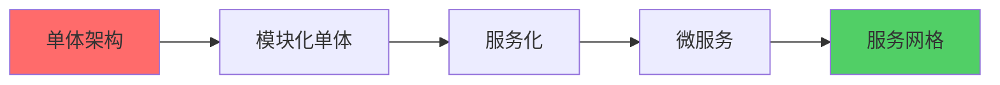

**演进原则：**
- **从简单开始**：不要一开始就设计复杂的微服务
- **按需演进**：根据实际需求演进架构
- **平滑过渡**：保证业务连续性
- **持续优化**：根据运行情况持续优化

### 架构决策记录（ADR）

```markdown
# ADR-001: 选择微服务架构

## 状态
已采纳

## 背景
系统规模扩大，单体架构难以维护和扩展。

## 决策
采用微服务架构，按业务领域拆分服务。

## 后果
- 优点：独立部署、技术栈灵活、团队自治
- 缺点：分布式复杂性、运维成本增加
```

## 设计模式应用

### 常用设计模式

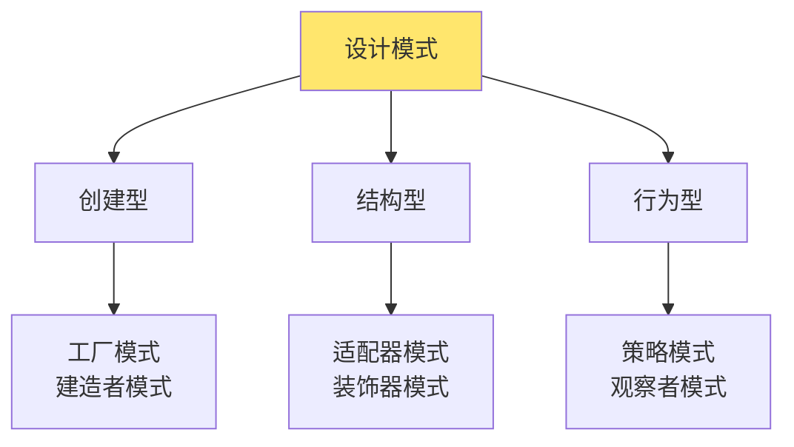

**工程实践中的模式：**
- **工厂模式**：创建复杂对象
- **建造者模式**：构建配置对象
- **适配器模式**：适配不同接口
- **装饰器模式**：功能增强（中间件）
- **策略模式**：算法选择
- **观察者模式**：事件通知

### 模式应用示例

```go
// 工厂模式：创建服务实例
type ServiceFactory interface {
    CreateService(config *Config) (Service, error)
}

type HTTPServiceFactory struct{}

func (f *HTTPServiceFactory) CreateService(config *Config) (Service, error) {
    return NewHTTPService(config), nil
}

// 策略模式：负载均衡算法
type LoadBalanceStrategy interface {
    Select(instances []Instance) Instance
}

type RoundRobinStrategy struct {
    current int
    mu      sync.Mutex
}

func (s *RoundRobinStrategy) Select(instances []Instance) Instance {
    s.mu.Lock()
    defer s.mu.Unlock()
    
    instance := instances[s.current]
    s.current = (s.current + 1) % len(instances)
    return instance
}
```

# 代码质量

## 代码质量维度

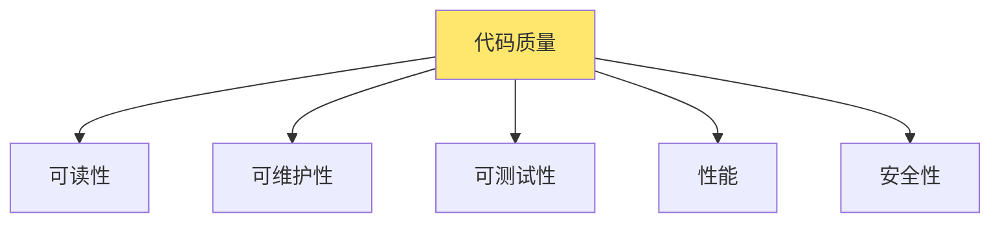

### 代码规范

**命名规范：**
- 变量名：驼峰命名，见名知意
- 函数名：动词开头，描述功能
- 类型名：名词，描述实体
- 常量名：全大写，下划线分隔

**代码组织：**
- 文件结构清晰
- 函数职责单一
- 避免过长的函数
- 合理使用注释

### 代码审查

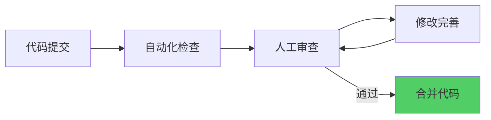

**审查要点：**
- 代码逻辑正确性
- 代码风格一致性
- 性能问题
- 安全问题
- 测试覆盖

## 测试策略

### 测试金字塔

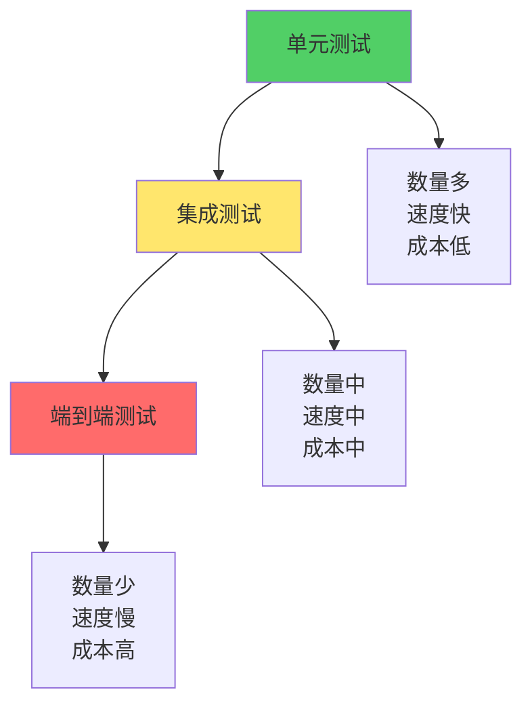

**测试策略：**
- **单元测试**：测试单个函数或方法（70%）
- **集成测试**：测试模块间交互（20%）
- **端到端测试**：测试完整业务流程（10%）

### 测试实践

```go
// 单元测试
func TestCreateOrder(t *testing.T) {
    // 准备
    service := NewOrderService(mockRepo)
    req := &CreateOrderRequest{
        UserID: "user001",
        Items:  []OrderItem{...},
    }
    
    // 执行
    order, err := service.CreateOrder(req)
    
    // 断言
    assert.NoError(t, err)
    assert.NotNil(t, order)
    assert.Equal(t, "user001", order.UserID)
}

// 集成测试
func TestOrderIntegration(t *testing.T) {
    // 启动测试环境
    db := setupTestDB()
    defer db.Close()
    
    // 测试完整流程
    service := NewOrderService(db)
    order, _ := service.CreateOrder(req)
    
    // 验证数据库
    var count int
    db.QueryRow("SELECT COUNT(*) FROM orders").Scan(&count)
    assert.Equal(t, 1, count)
}
```

## 代码重构

### 重构原则

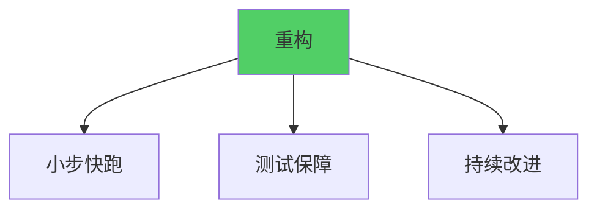

**重构策略：**
- **小步快跑**：每次重构一小部分
- **测试保障**：重构前编写测试
- **持续改进**：定期重构代码
- **工具辅助**：使用重构工具

### 重构技巧

**1. 提取函数**
```go
// 重构前
func processOrder(order *Order) {
    // 验证订单
    if order.Amount <= 0 {
        return
    }
    if order.UserID == "" {
        return
    }
    // 处理订单...
}

// 重构后
func processOrder(order *Order) {
    if !validateOrder(order) {
        return
    }
    // 处理订单...
}

func validateOrder(order *Order) bool {
    return order.Amount > 0 && order.UserID != ""
}
```

**2. 消除重复**
```go
// 重构前：重复代码
func createUser(name, email string) error {
    if name == "" {
        return errors.New("name required")
    }
    if email == "" {
        return errors.New("email required")
    }
    // ...
}

// 重构后：提取验证
func validateRequired(field, name string) error {
    if field == "" {
        return fmt.Errorf("%s required", name)
    }
    return nil
}
```

# 性能优化

## 性能优化原则

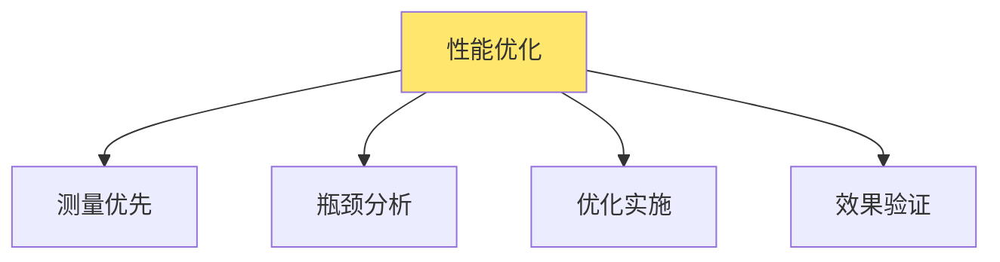

**优化原则：**
1. **测量优先**：先测量，再优化
2. **瓶颈分析**：找到真正的性能瓶颈
3. **优化实施**：针对瓶颈优化
4. **效果验证**：验证优化效果

## 性能优化策略

### 数据库优化

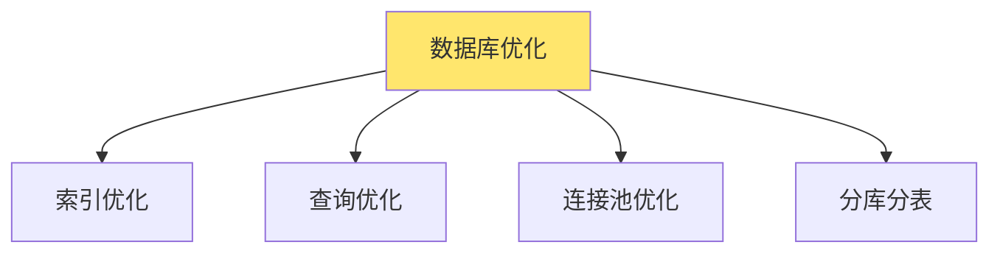

**优化方法：**
- **索引优化**：添加合适的索引
- **查询优化**：优化SQL语句，避免N+1查询
- **连接池优化**：合理配置连接池大小
- **分库分表**：水平拆分数据

### 缓存优化

```mermaid
graph TB
    A[缓存优化] --> B[多级缓存]
    A --> C[缓存策略]
    A --> D[缓存更新]
    
    B --> B1[本地缓存<br/>分布式缓存]
    C --> C1[Cache-Aside<br/>Write-Through]
    
    style A fill:#FFE66D
```

**缓存策略：**
- **Cache-Aside**：应用负责缓存读写
- **Write-Through**：同时写缓存和数据库
- **Write-Back**：先写缓存，异步写数据库

### 异步处理

```mermaid
graph LR
    A[同步处理] --> B[性能瓶颈]
    B --> C[异步处理]
    C --> D[性能提升]
    
    style C fill:#51CF66
```

**异步场景：**
- 非关键路径操作
- 耗时操作
- 批量处理
- 事件通知

### 代码优化

```go
// 优化前：字符串拼接
func buildMessage(parts []string) string {
    result := ""
    for _, part := range parts {
        result += part
    }
    return result
}

// 优化后：使用strings.Builder
func buildMessage(parts []string) string {
    var builder strings.Builder
    for _, part := range parts {
        builder.WriteString(part)
    }
    return builder.String()
}

// 优化前：重复计算
func calculate(items []Item) int {
    total := 0
    for _, item := range items {
        total += item.Price * item.Quantity
    }
    return total
}

// 优化后：预分配
func calculate(items []Item) int {
    total := 0
    for i := range items {
        total += items[i].Price * items[i].Quantity
    }
    return total
}
```

## 性能监控

### 性能指标

```mermaid
graph TB
    A[性能指标] --> B[延迟]
    A --> C[吞吐量]
    A --> D[错误率]
    A --> E[资源使用]
    
    style A fill:#FFE66D
```

**关键指标：**
- **延迟（Latency）**：请求响应时间
- **吞吐量（Throughput）**：每秒处理请求数
- **错误率（Error Rate）**：失败请求比例
- **资源使用**：CPU、内存、网络使用率

### 性能分析工具

**Go语言性能分析：**
- **pprof**：CPU、内存分析
- **trace**：并发分析
- **benchmark**：基准测试

```go
// 性能分析
import _ "net/http/pprof"

func main() {
    go func() {
        log.Println(http.ListenAndServe("localhost:6060", nil))
    }()
    
    // 业务代码
}

// 基准测试
func BenchmarkProcessOrder(b *testing.B) {
    service := setupService()
    req := createTestRequest()
    
    b.ResetTimer()
    for i := 0; i < b.N; i++ {
        service.ProcessOrder(req)
    }
}
```

# 监控与可观测性

## 可观测性三大支柱

```mermaid
graph TB
    A[可观测性] --> B[指标 Metrics]
    A --> C[日志 Logs]
    A --> D[追踪 Traces]
    
    B --> B1[性能指标<br/>业务指标]
    C --> C1[应用日志<br/>系统日志]
    D --> D1[分布式追踪<br/>调用链]
    
    style A fill:#FFE66D
```

### 指标（Metrics）

**指标类型：**
- **计数器（Counter）**：累计值，如请求总数
- **仪表盘（Gauge）**：当前值，如内存使用
- **直方图（Histogram）**：分布情况，如响应时间分布
- **摘要（Summary）**：分位数，如P95、P99延迟

### 日志（Logs）

**日志级别：**
- **DEBUG**：调试信息
- **INFO**：一般信息
- **WARN**：警告信息
- **ERROR**：错误信息
- **FATAL**：致命错误

**日志最佳实践：**
- 结构化日志
- 合理的日志级别
- 包含上下文信息
- 避免敏感信息

### 追踪（Traces）

**追踪信息：**
- 请求ID
- 服务名称
- 操作名称
- 时间戳
- 标签和属性

## 监控系统设计

### 监控架构

```mermaid
graph TB
    A[应用服务] --> B[指标采集]
    A --> C[日志采集]
    A --> D[追踪采集]
    
    B --> E[Prometheus]
    C --> F[ELK/Loki]
    D --> G[Jaeger/Zipkin]
    
    E --> H[Grafana]
    F --> H
    G --> H
    
    style H fill:#51CF66
```

### 告警设计

```mermaid
graph LR
    A[指标异常] --> B[告警规则]
    B --> C[告警触发]
    C --> D[通知渠道]
    D --> E[处理响应]
    
    style C fill:#FF6B6B
```

**告警原则：**
- 告警要有意义
- 避免告警风暴
- 分级告警
- 告警处理流程

# 团队协作

## 协作流程

```mermaid
graph LR
    A[需求分析] --> B[技术设计]
    B --> C[开发实现]
    C --> D[代码审查]
    D --> E[测试验证]
    E --> F[部署上线]
    
    style A fill:#4DABF7
    style F fill:#51CF66
```

### 开发流程

**1. 需求分析**
- 理解业务需求
- 识别技术难点
- 评估工作量

**2. 技术设计**
- 架构设计
- 接口设计
- 数据设计
- 技术方案评审

**3. 开发实现**
- 代码实现
- 单元测试
- 自测验证

**4. 代码审查**
- 代码提交
- 同行评审
- 修改完善

**5. 测试验证**
- 集成测试
- 功能测试
- 性能测试

**6. 部署上线**
- 部署准备
- 灰度发布
- 监控观察
- 全量发布

## 文档管理

### 文档类型

```mermaid
graph TB
    A[技术文档] --> B[架构设计文档]
    A --> C[API文档]
    A --> D[数据库设计文档]
    A --> E[部署文档]
    A --> F[运维文档]
    
    style A fill:#FFE66D
```

**文档要求：**
- 及时更新
- 结构清晰
- 示例完整
- 易于查找

### 代码即文档

```go
// OrderService 订单服务
// 提供订单的创建、查询、更新等功能
type OrderService struct {
    repo OrderRepository
}

// CreateOrder 创建订单
// 
// 参数:
//   - req: 创建订单请求，包含用户ID和订单项
//
// 返回:
//   - *Order: 创建的订单对象
//   - error: 错误信息，如果创建失败
//
// 示例:
//   order, err := service.CreateOrder(&CreateOrderRequest{
//       UserID: "user001",
//       Items:  []OrderItem{...},
//   })
func (s *OrderService) CreateOrder(req *CreateOrderRequest) (*Order, error) {
    // 实现...
}
```

## 知识分享

### 分享形式

- **技术分享会**：定期技术分享
- **代码评审**：通过代码评审学习
- **技术文档**：编写技术文档
- **问题复盘**：问题复盘总结

### 知识沉淀

```mermaid
graph TB
    A[实践经验] --> B[总结提炼]
    B --> C[文档记录]
    C --> D[知识库]
    D --> E[团队共享]
    
    style D fill:#51CF66
```

# 持续改进

## 改进循环

```mermaid
graph LR
    A[实践] --> B[发现问题]
    B --> C[分析原因]
    C --> D[制定方案]
    D --> E[实施改进]
    E --> A
    
    style E fill:#51CF66
```

### 改进方法

**1. 定期回顾**
- 周会回顾
- 迭代回顾
- 季度总结

**2. 问题复盘**
- 问题分析
- 根因查找
- 改进措施
- 跟踪验证

**3. 技术债务管理**
- 识别技术债务
- 评估优先级
- 制定偿还计划
- 持续偿还

## 度量与反馈

### 度量指标

```mermaid
graph TB
    A[工程度量] --> B[开发效率]
    A --> C[代码质量]
    A --> D[系统稳定性]
    A --> E[团队协作]
    
    B --> B1[交付周期<br/>吞吐量]
    C --> C1[代码覆盖率<br/>缺陷率]
    D --> D1[可用性<br/>MTTR]
    E --> E1[代码审查率<br/>知识分享]
    
    style A fill:#FFE66D
```

**关键指标：**
- **交付周期**：从需求到上线的时长
- **代码覆盖率**：测试覆盖率
- **可用性**：系统可用时间比例
- **MTTR**：平均故障恢复时间

### 反馈机制

```mermaid
graph LR
    A[收集反馈] --> B[分析问题]
    B --> C[制定改进]
    C --> D[实施改进]
    D --> E[验证效果]
    E --> A
    
    style D fill:#51CF66
```

# 实践案例

## 案例1：服务拆分实践

### 背景
单体应用性能瓶颈，需要拆分为微服务。

### 实践过程

**1. 分析现状**
- 识别业务边界
- 分析服务依赖
- 评估拆分难度

**2. 设计方案**
- 按业务领域拆分
- 设计服务接口
- 规划数据迁移

**3. 实施拆分**
- 先拆分最独立的模块
- 逐步迁移
- 验证功能

**4. 优化改进**
- 优化服务间调用
- 完善监控告警
- 持续优化

### 经验总结
- 从简单开始，逐步演进
- 保证业务连续性
- 完善监控和告警
- 团队协作很重要

## 案例2：性能优化实践

### 背景
系统响应时间过长，需要优化性能。

### 实践过程

**1. 性能分析**
- 使用pprof分析
- 识别性能瓶颈
- 量化性能问题

**2. 优化方案**
- 数据库查询优化
- 增加缓存
- 异步处理

**3. 实施优化**
- 逐步优化
- 验证效果
- 持续监控

### 经验总结
- 先测量，再优化
- 优化要有针对性
- 验证优化效果
- 持续监控

# 总结

提升工程落地能力是一个持续的过程，需要：

**核心能力：**
1. **工程化思维**：从理论到实践的思维转变
2. **技术选型**：选择合适的技术栈
3. **架构设计**：设计可落地的架构
4. **代码质量**：编写高质量代码
5. **性能优化**：持续优化系统性能
6. **监控运维**：保障系统稳定运行
7. **团队协作**：高效团队协作

**实践原则：**
- **简单优先**：选择最简单的可行方案
- **渐进演进**：从简单到复杂逐步演进
- **持续改进**：不断优化和完善
- **数据驱动**：基于数据做决策
- **团队协作**：发挥团队力量

**关键成功因素：**
- 扎实的技术基础
- 丰富的实践经验
- 良好的工程思维
- 高效的团队协作
- 持续的学习改进

通过系统性的学习和实践，不断提升工程落地能力，将理论知识转化为实际可运行的高质量系统。
