服务发现（Service Discovery）是微服务架构中的核心组件，它解决了在动态环境中服务如何找到并与其他服务通信的问题。在微服务架构中，服务实例的网络位置是动态变化的，服务发现机制使得服务能够自动发现和定位其他服务。

# 服务发现概述

## 为什么需要服务发现？

在传统的单体应用中，服务之间的调用通常通过硬编码的IP地址和端口进行。但在微服务架构中，这种方式存在以下问题：

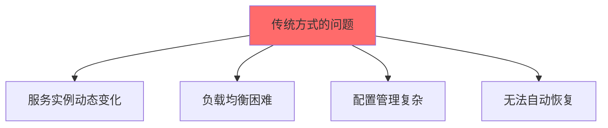

**问题：**
1. **服务实例动态变化**：服务可能随时启动、停止或迁移
2. **负载均衡困难**：需要手动配置多个服务实例
3. **配置管理复杂**：每次服务变更都需要更新配置
4. **无法自动恢复**：服务故障后需要手动处理

## 服务发现的价值

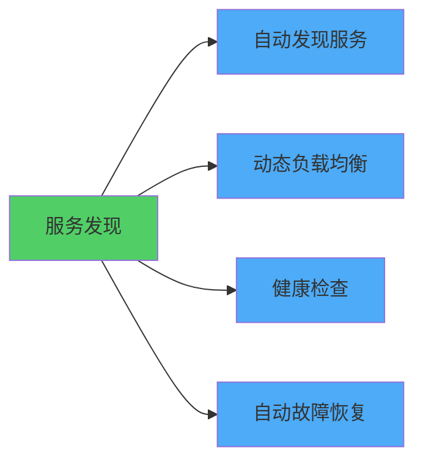

**优势：**
- **自动发现**：服务自动注册和发现
- **动态负载均衡**：自动分发请求到可用实例
- **健康检查**：自动检测服务健康状态
- **自动恢复**：服务恢复后自动加入服务列表

# 服务发现架构

## 基本架构

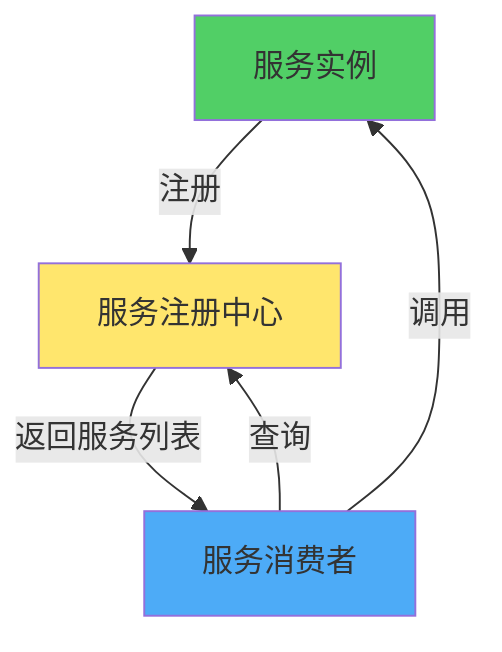

**核心组件：**
1. **服务注册中心（Service Registry）**：存储服务实例信息
2. **服务提供者（Service Provider）**：提供服务，向注册中心注册
3. **服务消费者（Service Consumer）**：消费服务，从注册中心查询

## 服务发现流程

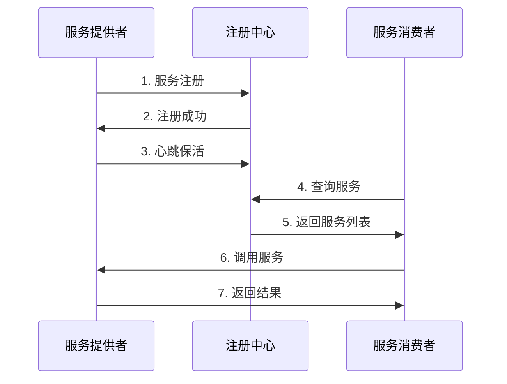

**流程说明：**
1. **服务注册**：服务启动时向注册中心注册
2. **心跳保活**：定期发送心跳维持注册状态
3. **服务查询**：消费者查询可用服务列表
4. **服务调用**：消费者根据服务列表调用服务
5. **服务下线**：服务停止时从注册中心注销

# 服务发现模式

## 1. 客户端发现（Client-Side Discovery）

客户端负责查询服务注册中心，获取服务实例列表，并选择实例进行调用。

### 架构图

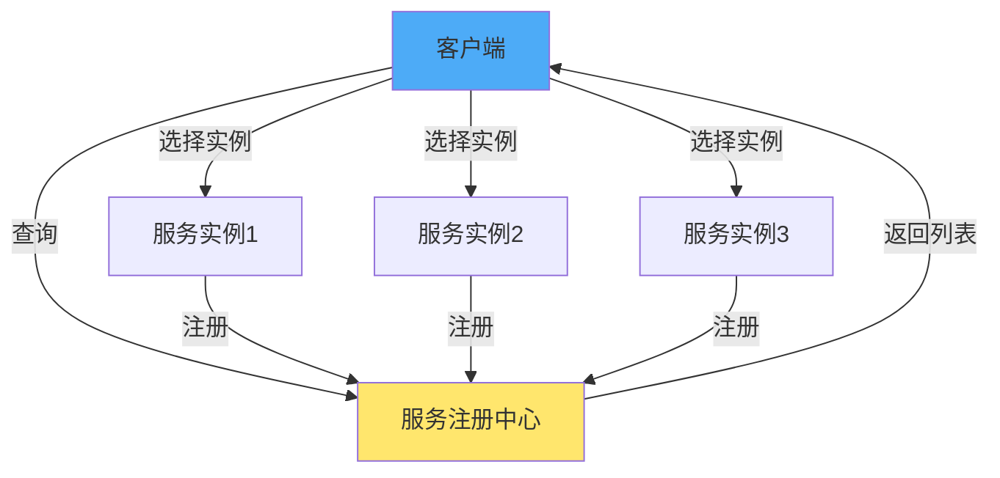

### 工作流程

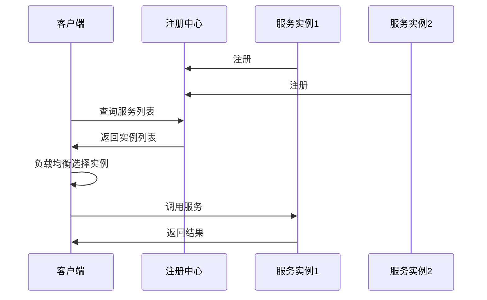

### 特点

**优势：**
- 实现简单
- 客户端可以灵活选择负载均衡策略
- 减少网络跳数（不需要通过负载均衡器）

**劣势：**
- 客户端需要实现服务发现逻辑
- 客户端需要维护服务注册中心连接
- 多语言支持需要重复实现

### 实现示例

```java
// 客户端发现实现
public class ClientSideDiscovery {
    private ServiceRegistry registry;
    private LoadBalancer loadBalancer;
    
    public ServiceInstance getService(String serviceName) {
        // 1. 从注册中心查询服务列表
        List<ServiceInstance> instances = registry.getInstances(serviceName);
        
        // 2. 过滤健康实例
        List<ServiceInstance> healthyInstances = instances.stream()
            .filter(ServiceInstance::isHealthy)
            .collect(Collectors.toList());
        
        // 3. 负载均衡选择实例
        return loadBalancer.select(healthyInstances);
    }
    
    public void callService(String serviceName, Request request) {
        ServiceInstance instance = getService(serviceName);
        // 调用选中的服务实例
        httpClient.call(instance.getHost(), instance.getPort(), request);
    }
}
```

## 2. 服务端发现（Server-Side Discovery）

客户端通过负载均衡器调用服务，负载均衡器负责查询服务注册中心并转发请求。

### 架构图

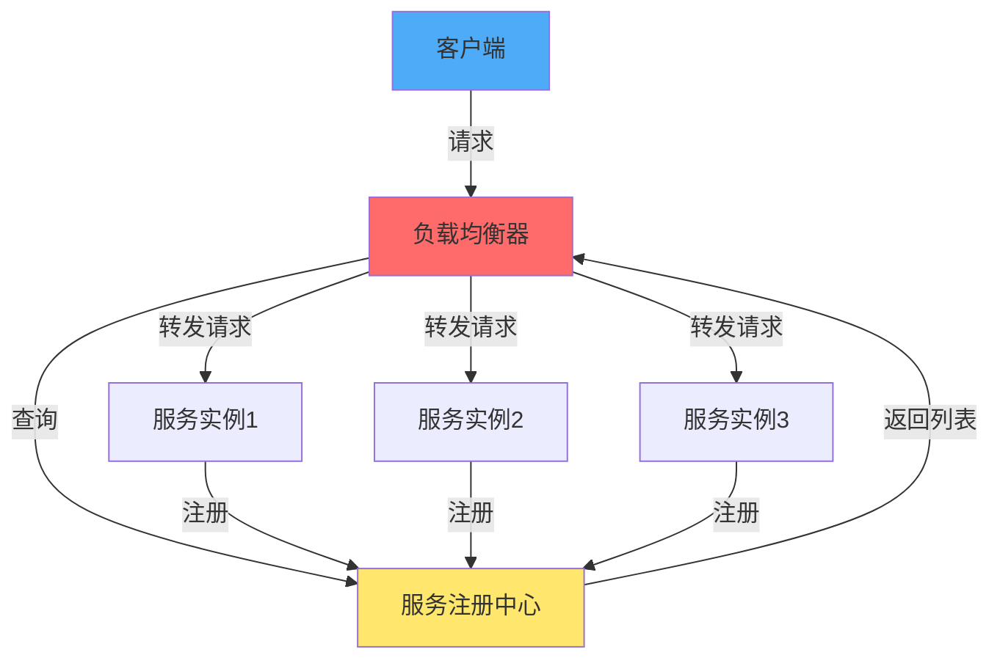

### 工作流程

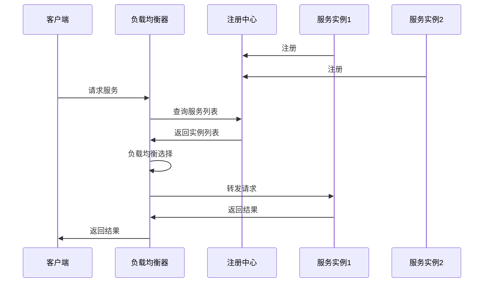

### 特点

**优势：**
- 客户端实现简单，只需要知道负载均衡器地址
- 服务发现逻辑集中在服务端
- 支持多语言客户端
- 可以统一处理认证、限流等横切关注点

**劣势：**
- 需要额外的负载均衡器基础设施
- 增加网络跳数
- 负载均衡器可能成为瓶颈

### 实现示例

```java
// 服务端发现 - 负载均衡器实现
public class ServerSideDiscovery {
    private ServiceRegistry registry;
    private LoadBalancer loadBalancer;
    
    public Response handleRequest(String serviceName, Request request) {
        // 1. 从注册中心查询服务列表
        List<ServiceInstance> instances = registry.getInstances(serviceName);
        
        // 2. 负载均衡选择实例
        ServiceInstance instance = loadBalancer.select(instances);
        
        // 3. 转发请求
        return httpClient.forward(instance, request);
    }
}
```

## 3. 服务注册模式

### 自注册模式（Self-Registration）

服务实例自己负责向注册中心注册和注销。

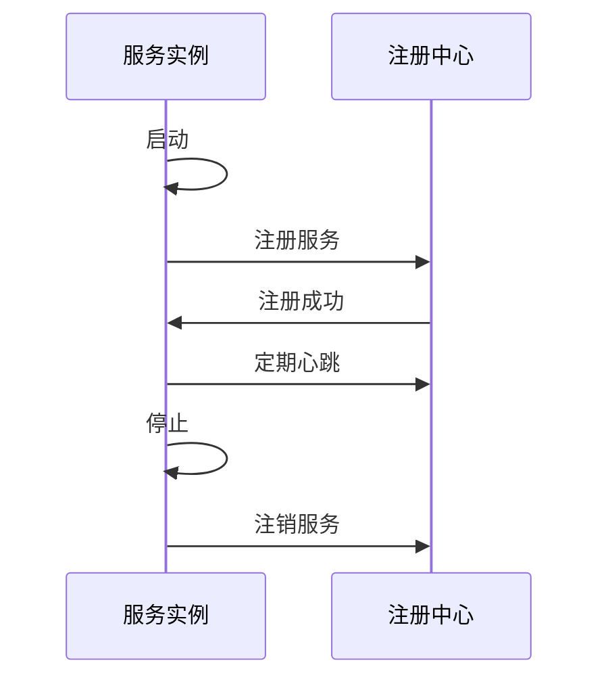

**特点：**
- 实现简单
- 服务实例需要知道注册中心地址
- 服务实例需要实现注册逻辑

### 第三方注册模式（Third-Party Registration）

由服务注册器（Service Registrar）负责注册和注销服务实例。

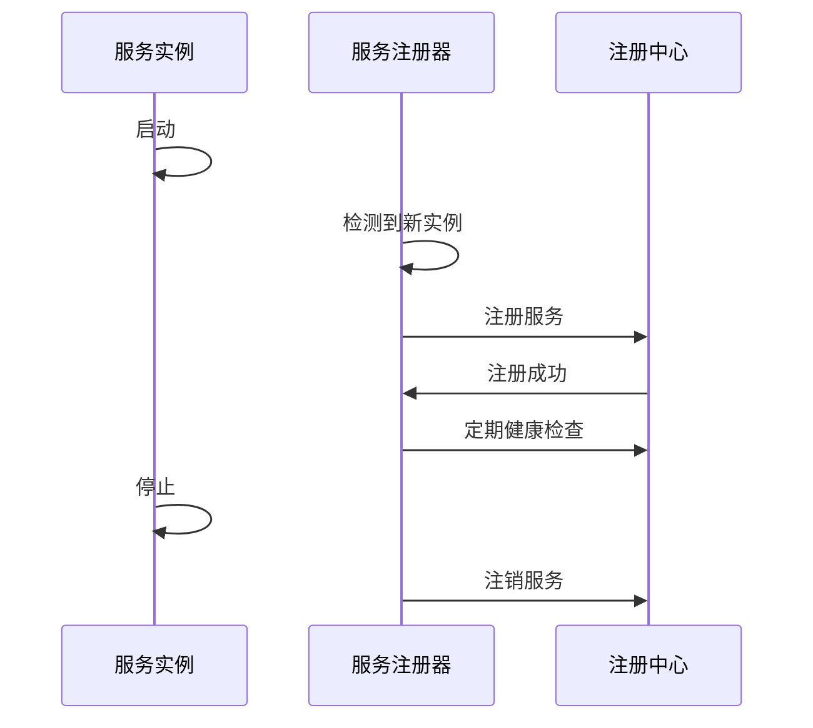

**特点：**
- 服务实例不需要知道注册中心
- 注册逻辑集中管理
- 需要额外的服务注册器组件（如Kubernetes）

# 服务注册中心

## 注册中心功能

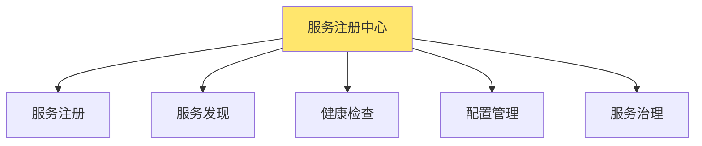

**核心功能：**
1. **服务注册**：接收服务实例的注册请求
2. **服务发现**：提供服务查询接口
3. **健康检查**：监控服务实例健康状态
4. **配置管理**：存储和分发服务配置
5. **服务治理**：提供服务路由、限流等功能

## 服务元数据

服务注册时需要提供以下信息：

```java
public class ServiceInstance {
    private String serviceName;      // 服务名称
    private String instanceId;       // 实例ID
    private String host;             // 主机地址
    private int port;                // 端口
    private String protocol;         // 协议（http/grpc）
    private Map<String, String> metadata;  // 元数据
    private HealthStatus health;     // 健康状态
    private long registrationTime;   // 注册时间
    private long lastHeartbeatTime;  // 最后心跳时间
}
```

**元数据示例：**
- 版本信息
- 区域信息
- 环境信息（dev/test/prod）
- 自定义标签

## 健康检查

### 健康检查方式

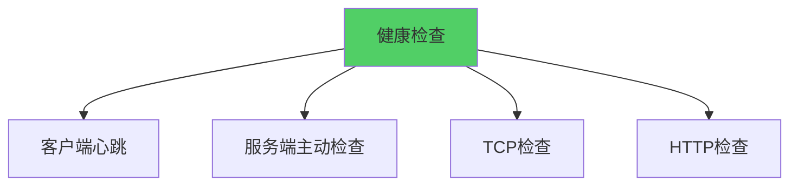

**1. 客户端心跳（Client Heartbeat）**
- 服务实例定期向注册中心发送心跳
- 注册中心超时未收到心跳则标记为不健康

**2. 服务端主动检查（Server-Side Health Check）**
- 注册中心主动调用服务的健康检查接口
- 根据响应判断服务健康状态

**3. TCP检查**
- 尝试建立TCP连接
- 连接成功则认为健康

**4. HTTP检查**
- 调用HTTP健康检查端点
- 根据状态码判断健康状态

### 健康检查实现

```java
// 健康检查接口
public interface HealthChecker {
    HealthStatus check(ServiceInstance instance);
}

// HTTP健康检查
public class HttpHealthChecker implements HealthChecker {
    @Override
    public HealthStatus check(ServiceInstance instance) {
        try {
            HttpResponse response = httpClient.get(
                instance.getHost(), 
                instance.getPort(), 
                "/health"
            );
            return response.getStatus() == 200 
                ? HealthStatus.HEALTHY 
                : HealthStatus.UNHEALTHY;
        } catch (Exception e) {
            return HealthStatus.UNHEALTHY;
        }
    }
}

// 心跳检查
public class HeartbeatChecker implements HealthChecker {
    private long heartbeatTimeout = 30000; // 30秒
    
    @Override
    public HealthStatus check(ServiceInstance instance) {
        long timeSinceLastHeartbeat = System.currentTimeMillis() 
            - instance.getLastHeartbeatTime();
        return timeSinceLastHeartbeat < heartbeatTimeout 
            ? HealthStatus.HEALTHY 
            : HealthStatus.UNHEALTHY;
    }
}
```

# 常见服务发现工具

## 1. Consul

Consul是HashiCorp开发的服务发现和配置管理工具。

### 特性

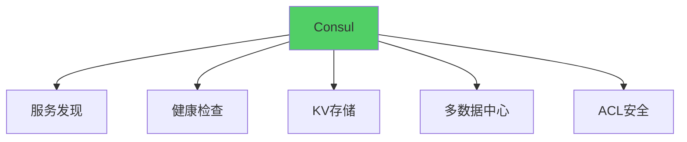

**核心特性：**
- 服务发现和注册
- 健康检查（HTTP、TCP、脚本）
- Key-Value存储
- 多数据中心支持
- ACL安全控制
- DNS和HTTP API

### 架构

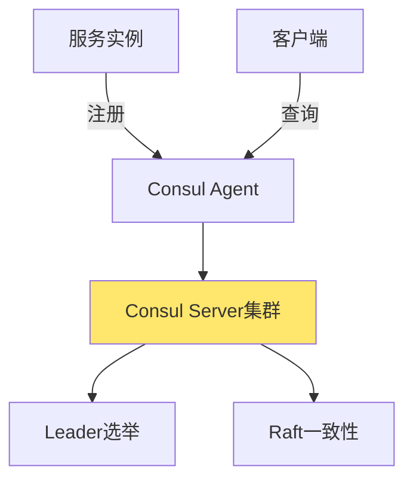

### 使用示例

```java
// Consul客户端
ConsulClient consul = Consul.builder().build();

// 服务注册
NewService newService = NewService.builder()
    .id("order-service-1")
    .name("order-service")
    .address("192.168.1.100")
    .port(8080)
    .check(NewService.Check.http("/health", 10))
    .build();
consul.agentServiceRegister(newService);

// 服务发现
List<HealthService> services = consul.healthServices(
    "order-service", 
    true, 
    QueryOptions.BLANK
).getResponse();
```

## 2. Eureka

Eureka是Netflix开发的服务发现组件，Spring Cloud集成了Eureka。

### 特性

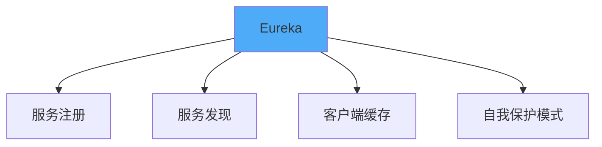

**核心特性：**
- 服务注册和发现
- 客户端缓存服务列表
- 自我保护模式（网络分区时保护注册信息）
- RESTful API
- 与Spring Cloud深度集成

### 架构

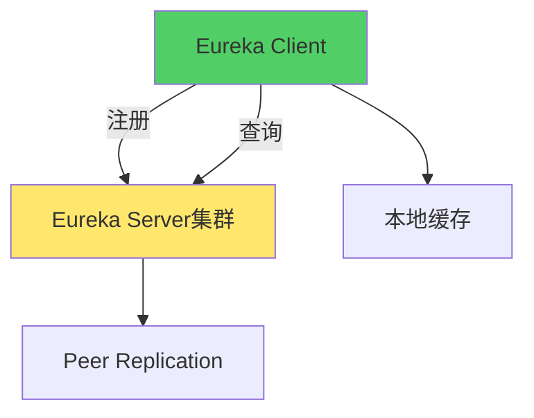

### 使用示例

```java
// Eureka客户端配置
@SpringBootApplication
@EnableEurekaClient
public class OrderServiceApplication {
    public static void main(String[] args) {
        SpringApplication.run(OrderServiceApplication.class, args);
    }
}

// 服务发现
@Autowired
private DiscoveryClient discoveryClient;

public List<ServiceInstance> getInstances(String serviceName) {
    return discoveryClient.getInstances(serviceName);
}
```

## 3. etcd

etcd是CoreOS开发的分布式键值存储，常用于服务发现。

### 特性

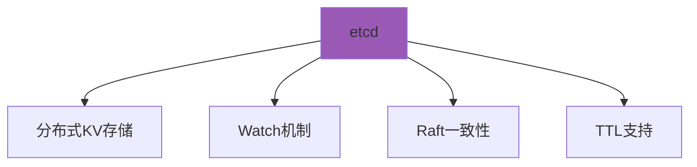

**核心特性：**
- 分布式键值存储
- Watch机制（监听键变化）
- Raft一致性算法
- TTL支持（自动过期）
- 高可用集群

### 使用示例

```java
// etcd客户端
Client client = Client.builder()
    .endpoints("http://localhost:2379")
    .build();
KV kvClient = client.getKVClient();

// 服务注册（带TTL）
PutResponse putResponse = kvClient.put(
    ByteSequence.from("services/order-service/instance-1".getBytes()),
    ByteSequence.from("192.168.1.100:8080".getBytes()),
    PutOption.newBuilder().withLease(leaseId).build()
);

// 服务发现
GetResponse getResponse = kvClient.get(
    ByteSequence.from("services/order-service/".getBytes())
);
```

## 4. Zookeeper

Zookeeper是Apache的分布式协调服务，可用于服务发现。

### 特性

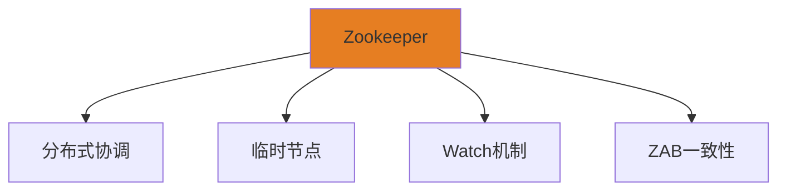

**核心特性：**
- 分布式协调服务
- 临时节点（客户端断开自动删除）
- Watch机制
- ZAB一致性协议
- 广泛使用（Kafka、Hadoop等）

### 使用示例

```java
// Zookeeper客户端
ZooKeeper zk = new ZooKeeper("localhost:2181", 3000, null);

// 服务注册（临时节点）
String path = "/services/order-service/instance-1";
zk.create(
    path,
    "192.168.1.100:8080".getBytes(),
    ZooDefs.Ids.OPEN_ACL_UNSAFE,
    CreateMode.EPHEMERAL
);

// 服务发现
List<String> children = zk.getChildren("/services/order-service", true);
```

## 5. Kubernetes Service

Kubernetes内置的服务发现机制。

### 特性

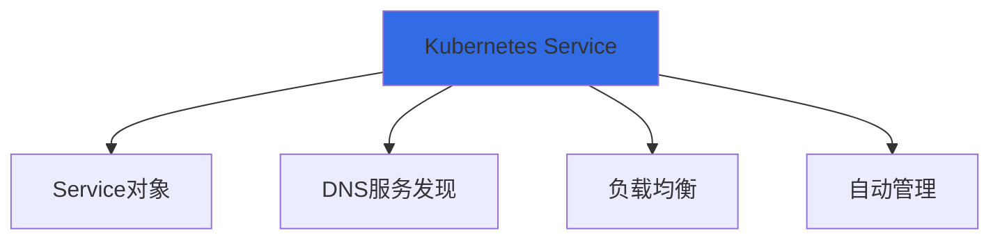

**核心特性：**
- 通过Service对象定义服务
- DNS自动服务发现
- 内置负载均衡
- 自动管理Pod变化
- 支持多种Service类型（ClusterIP、NodePort、LoadBalancer）

### 使用示例

```yaml
# Service定义
apiVersion: v1
kind: Service
metadata:
  name: order-service
spec:
  selector:
    app: order-service
  ports:
    - protocol: TCP
      port: 80
      targetPort: 8080
  type: ClusterIP
```

```java
// Kubernetes中服务发现
// 通过DNS名称访问
String serviceUrl = "http://order-service:80/api/orders";

// 或使用Kubernetes客户端
CoreV1Api api = new CoreV1Api();
V1ServiceList services = api.listServiceForAllNamespaces(
    null, null, null, null, null, null, null, null, null
);
```

## 工具对比

| 特性 | Consul | Eureka | etcd | Zookeeper | Kubernetes |
|------|--------|--------|------|-----------|------------|
| 服务发现 | ✅ | ✅ | ✅ | ✅ | ✅ |
| 健康检查 | ✅ | ✅ | ⚠️ | ⚠️ | ✅ |
| 配置管理 | ✅ | ❌ | ✅ | ✅ | ✅ |
| 多数据中心 | ✅ | ❌ | ❌ | ❌ | ✅ |
| 一致性协议 | Raft | 无 | Raft | ZAB | 无 |
| 语言支持 | 多语言 | Java为主 | 多语言 | 多语言 | 多语言 |
| 运维复杂度 | 中 | 低 | 中 | 高 | 低（K8s环境） |

# 服务发现最佳实践

## 1. 服务注册

### 注册时机

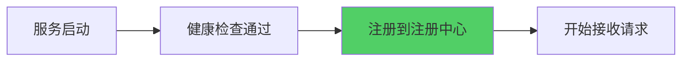

**原则：**
- 服务完全启动后再注册
- 健康检查通过后再注册
- 避免注册不健康的服务

### 注册信息

```java
// 完整的服务注册信息
ServiceRegistration registration = ServiceRegistration.builder()
    .serviceName("order-service")
    .instanceId("order-service-1")
    .host("192.168.1.100")
    .port(8080)
    .protocol("http")
    .version("1.0.0")
    .region("us-east-1")
    .zone("zone-a")
    .metadata(Map.of(
        "environment", "production",
        "team", "order-team"
    ))
    .build();
```

## 2. 服务发现

### 缓存策略

```mermaid
graph TB
    A[服务发现] --> B[本地缓存]
    A --> C[定期刷新]
    A --> D[变更通知]
    
    B --> E[减少注册中心压力]
    C --> F[保证数据新鲜度]
    D --> G[实时更新]
    
    style B fill:#51CF66
```

**策略：**
- 客户端缓存服务列表
- 定期刷新缓存
- 监听服务变更事件
- 缓存失效时从注册中心获取

### 负载均衡

```mermaid
graph TB
    A[服务列表] --> B[负载均衡算法]
    B --> C[轮询]
    B --> D[随机]
    B --> E[加权轮询]
    B --> F[一致性哈希]
    
    style B fill:#4DABF7
```

**算法选择：**
- **轮询（Round Robin）**：简单均匀
- **随机（Random）**：简单快速
- **加权轮询（Weighted Round Robin）**：考虑服务能力
- **一致性哈希（Consistent Hash）**：会话保持

## 3. 健康检查

### 健康检查端点

```java
// 健康检查接口
@RestController
public class HealthController {
    @GetMapping("/health")
    public ResponseEntity<HealthStatus> health() {
        HealthStatus status = checkHealth();
        return ResponseEntity.status(
            status.isHealthy() ? 200 : 503
        ).body(status);
    }
    
    private HealthStatus checkHealth() {
        // 检查数据库连接
        // 检查外部依赖
        // 检查资源使用情况
        return HealthStatus.healthy()
            .withDetail("database", "connected")
            .withDetail("memory", "ok")
            .build();
    }
}
```

### 健康检查策略

- **启动检查**：服务启动时检查依赖是否就绪
- **就绪检查（Readiness）**：服务是否可以接收请求
- **存活检查（Liveness）**：服务是否正常运行
- **优雅下线**：服务停止前等待请求完成

## 4. 故障处理

### 故障隔离

```mermaid
graph TB
    A[服务故障] --> B[健康检查失败]
    B --> C[从服务列表移除]
    C --> D[客户端重试其他实例]
    D --> E[服务恢复]
    E --> F[重新加入服务列表]
    
    style C fill:#FF6B6B
    style F fill:#51CF66
```

**策略：**
- 快速检测故障
- 自动从服务列表移除
- 客户端重试机制
- 服务恢复后自动加入

### 熔断机制

```java
// 熔断器
public class CircuitBreaker {
    private int failureCount = 0;
    private long lastFailureTime = 0;
    private CircuitState state = CircuitState.CLOSED;
    
    public <T> T execute(Supplier<T> operation) {
        if (state == CircuitState.OPEN) {
            if (System.currentTimeMillis() - lastFailureTime > timeout) {
                state = CircuitState.HALF_OPEN;
            } else {
                throw new CircuitBreakerOpenException();
            }
        }
        
        try {
            T result = operation.get();
            onSuccess();
            return result;
        } catch (Exception e) {
            onFailure();
            throw e;
        }
    }
}
```

## 5. 多环境支持

### 环境隔离

```mermaid
graph TB
    A[服务注册] --> B[环境标签]
    B --> C[开发环境]
    B --> D[测试环境]
    B --> E[生产环境]
    
    F[服务发现] --> G[按环境过滤]
    G --> C
    G --> D
    G --> E
    
    style B fill:#FFE66D
```

**实现：**
- 服务注册时添加环境标签
- 服务发现时按环境过滤
- 不同环境使用不同的注册中心或命名空间

# 服务发现常见问题

## 1. 服务注册失败

**原因：**
- 注册中心不可用
- 网络问题
- 配置错误

**解决方案：**
- 重试机制
- 降级处理
- 监控告警

## 2. 服务发现延迟

**原因：**
- 注册中心同步延迟
- 客户端缓存过期
- 网络延迟

**解决方案：**
- 使用Watch机制实时更新
- 优化缓存策略
- 减少网络跳数

## 3. 服务列表不一致

**原因：**
- 注册中心集群数据不一致
- 客户端缓存过期
- 网络分区

**解决方案：**
- 使用强一致性协议（Raft）
- 客户端定期刷新
- 处理网络分区场景

## 4. 服务雪崩

**原因：**
- 大量服务同时注册/注销
- 注册中心压力过大
- 客户端频繁查询

**解决方案：**
- 限流保护
- 批量操作
- 客户端缓存
- 降级策略

# 服务发现与微服务

## 在微服务架构中的作用

```mermaid
graph TB
    A[微服务架构] --> B[服务发现]
    B --> C[服务注册]
    B --> D[服务发现]
    B --> E[负载均衡]
    B --> F[健康检查]
    
    style B fill:#FFE66D
```

**关键作用：**
- 实现服务间的动态发现
- 支持服务的水平扩展
- 提供故障自动恢复
- 简化服务配置管理

## 与其他组件的关系

```mermaid
graph TB
    A[API网关] --> B[服务发现]
    C[负载均衡器] --> B
    D[服务网格] --> B
    E[配置中心] --> B
    
    style B fill:#FFE66D
```

- **API网关**：通过服务发现路由到后端服务
- **负载均衡器**：从服务发现获取服务列表
- **服务网格**：服务发现是服务网格的基础
- **配置中心**：可以集成服务发现功能

# 总结

服务发现是微服务架构的基础设施，它解决了动态环境中服务定位的问题。

**关键要点：**
1. **选择合适的模式**：客户端发现 vs 服务端发现
2. **选择合适的工具**：根据场景选择Consul、Eureka、etcd等
3. **实现健康检查**：确保服务列表的准确性
4. **优化性能**：使用缓存、批量操作等
5. **处理故障**：实现熔断、重试等机制
6. **支持多环境**：实现环境隔离

**最佳实践：**
- 服务完全启动后再注册
- 客户端缓存服务列表
- 实现健康检查机制
- 支持优雅下线
- 监控服务发现状态
- 处理网络分区场景

服务发现的成功实施需要综合考虑性能、可用性、一致性和运维复杂度，选择最适合当前场景的方案。
