服务拆分是微服务架构设计的核心环节，合理的服务拆分能够提高系统的可维护性、可扩展性和团队协作效率。本文详细介绍微服务拆分的原则、方法和实践。

# 服务拆分概述

服务拆分是将大型单体应用分解为多个小型、独立、可部署的服务的过程。拆分的目标是找到服务之间的边界，使得每个服务都能独立开发、测试、部署和扩展。

## 拆分的重要性

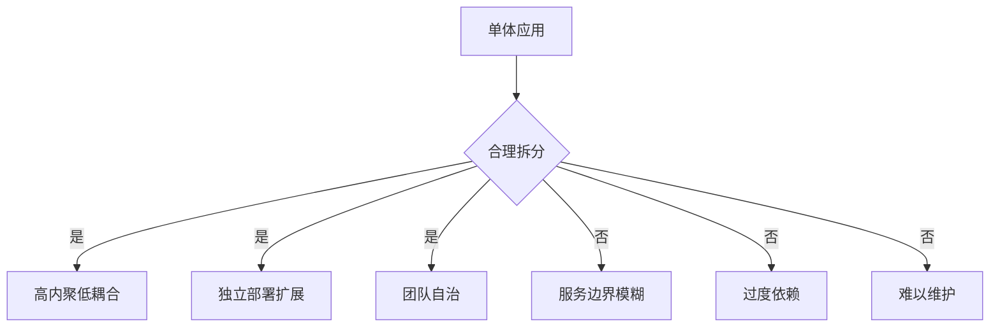

**合理拆分带来的好处：**
- 清晰的业务边界
- 降低服务间耦合
- 提高开发效率
- 便于独立扩展
- 增强系统稳定性

**拆分不当的问题：**
- 服务边界不清晰
- 服务间过度依赖
- 分布式事务复杂
- 网络调用过多
- 运维复杂度增加

# 服务拆分原则

## 1. 单一职责原则（Single Responsibility Principle）

每个微服务应该只负责一个业务功能或领域，具有明确的职责边界。

### 原则说明

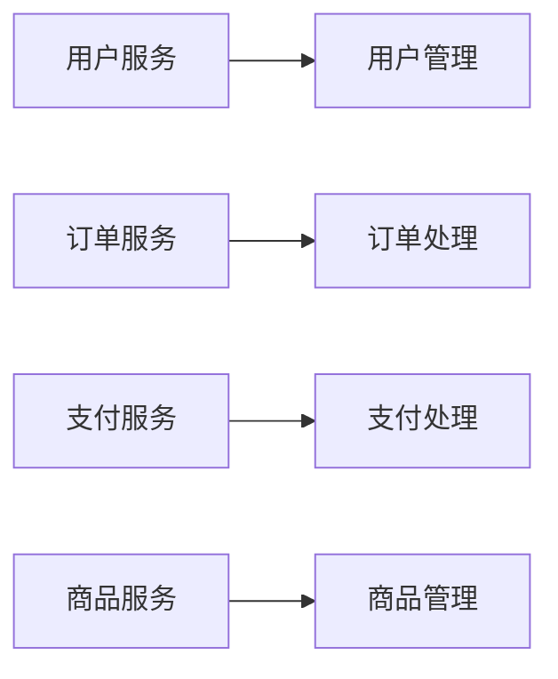

**判断标准：**
- 服务是否只有一个变更理由？
- 服务是否只关注一个业务领域？
- 服务职责是否清晰明确？

**反例：**
```
❌ 用户订单服务（包含用户管理和订单管理）
❌ 商品支付服务（包含商品管理和支付处理）
```

**正例：**
```
✅ 用户服务（只负责用户相关功能）
✅ 订单服务（只负责订单相关功能）
✅ 支付服务（只负责支付相关功能）
```

## 2. 高内聚、低耦合原则

### 高内聚（High Cohesion）

服务内部的功能应该高度相关，共同完成一个业务目标。

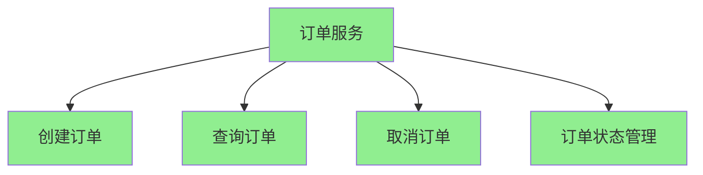

**高内聚的特征：**
- 服务内部功能紧密相关
- 数据模型统一
- 业务逻辑集中
- 变更影响范围小

### 低耦合（Low Coupling）

服务之间的依赖应该最小化，通过明确的接口进行通信。


**低耦合的特征：**
- 服务间通过API通信
- 不共享数据库
- 不直接访问其他服务内部
- 依赖关系清晰

## 3. 围绕业务能力拆分（Organize Around Business Capabilities）

按照业务领域而非技术层次进行拆分，这是微服务架构的核心原则。

### 技术层次拆分（错误方式）

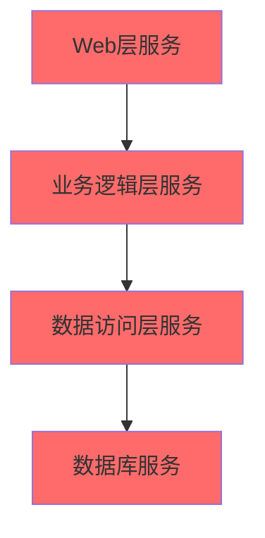

**问题：**
- 服务间强耦合
- 无法独立部署
- 违反微服务原则

### 业务能力拆分（正确方式）

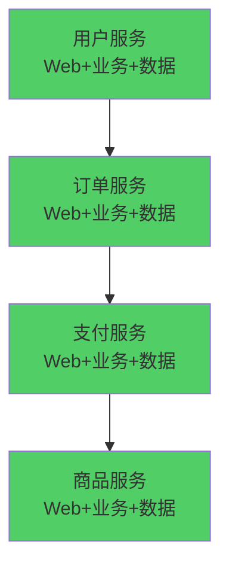

**优势：**
- 完整的业务闭环
- 可以独立部署
- 团队自治

## 4. 数据独立原则（Database per Service）

每个微服务拥有独立的数据库，这是服务独立性的基础。

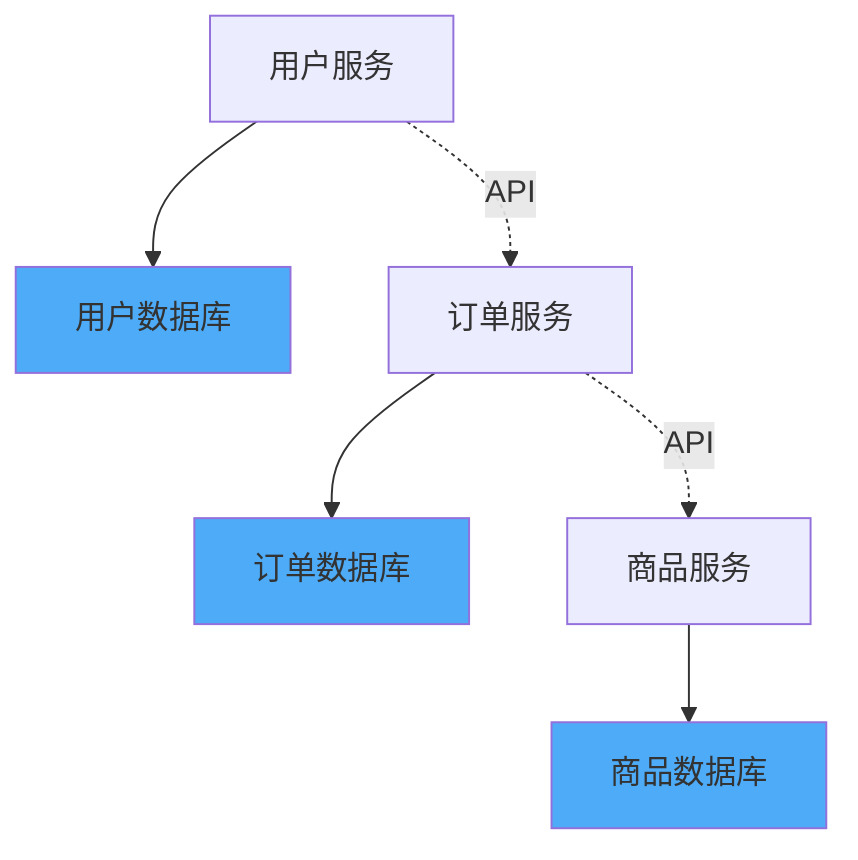

**原则：**
- 服务只能访问自己的数据库
- 不共享数据库表
- 通过API访问其他服务的数据
- 数据模型独立

**好处：**
- 数据隔离
- 技术栈独立
- 独立扩展
- 故障隔离

## 5. 服务粒度原则

服务应该足够小，但不要太小。找到合适的粒度是关键。

### 服务粒度判断

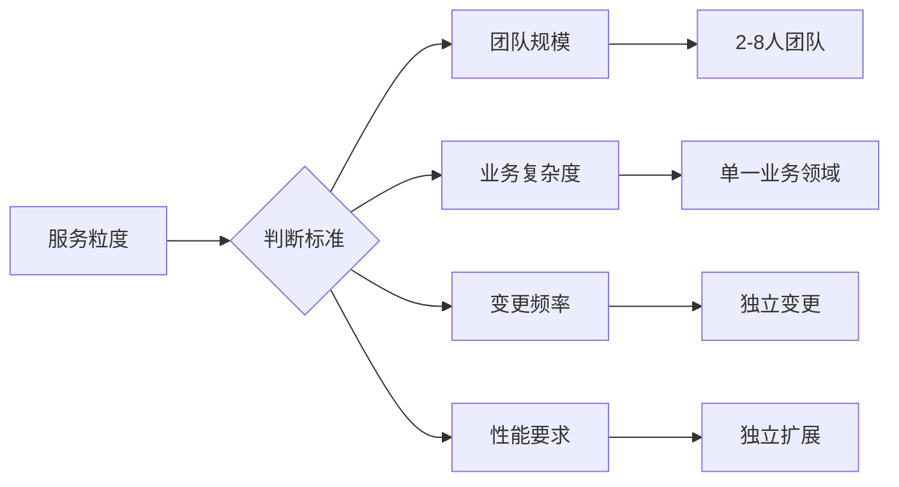

**粒度判断标准：**

1. **团队规模**
   - 2-8人的小团队可以维护一个服务
   - 如果团队太大，考虑进一步拆分

2. **业务复杂度**
   - 一个服务应该只包含一个业务领域
   - 如果业务逻辑过于复杂，考虑拆分

3. **变更频率**
   - 经常一起变更的功能应该放在一起
   - 变更频率不同的功能应该分开

4. **性能要求**
   - 需要独立扩展的功能应该独立成服务
   - 性能要求不同的功能应该分开

### 过度拆分的问题

```
❌ 用户查询服务
❌ 用户创建服务
❌ 用户更新服务
❌ 用户删除服务
```

**问题：**
- 服务数量过多
- 网络调用增加
- 运维复杂度提高
- 事务处理困难

### 合理拆分

```
✅ 用户服务（包含所有用户相关操作）
✅ 订单服务（包含所有订单相关操作）
```

## 6. 领域驱动设计（DDD）原则

使用领域驱动设计来识别服务边界，这是最有效的方法。

### 限界上下文（Bounded Context）

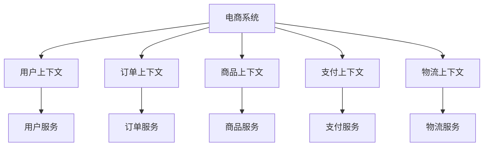

**限界上下文特征：**
- 明确的业务边界
- 统一的数据模型
- 独立的业务语言（Ubiquitous Language）
- 可以映射为一个微服务

### 聚合（Aggregate）

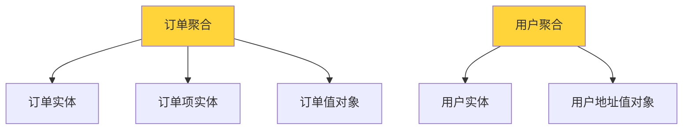

**聚合原则：**
- 聚合是数据修改的单元
- 聚合内部保证一致性
- 聚合间通过ID引用
- 一个聚合通常对应一个服务

### 领域事件（Domain Events）

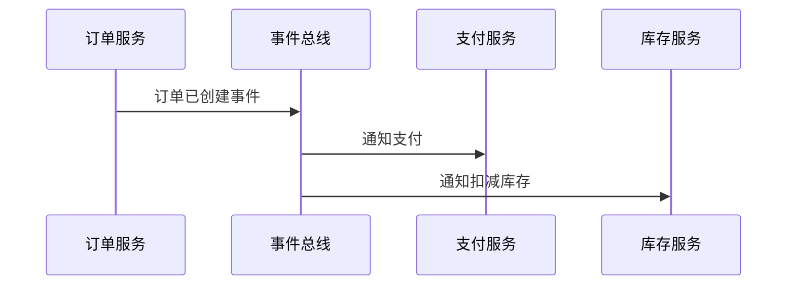

**领域事件的作用：**
- 解耦服务间依赖
- 实现最终一致性
- 支持事件溯源

# 服务拆分方法

## 1. 基于业务领域拆分

### 识别业务领域

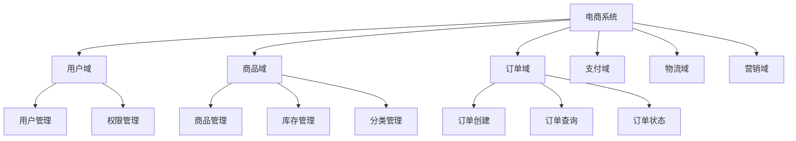

**步骤：**
1. 识别核心业务领域
2. 分析领域间的关系
3. 确定领域边界
4. 映射为微服务

### 领域划分示例

**电商系统领域划分：**

| 领域 | 职责 | 服务名称 |
|------|------|---------|
| 用户域 | 用户注册、登录、信息管理 | 用户服务 |
| 商品域 | 商品信息、分类、库存 | 商品服务 |
| 订单域 | 订单创建、查询、状态管理 | 订单服务 |
| 支付域 | 支付处理、退款 | 支付服务 |
| 物流域 | 物流跟踪、配送 | 物流服务 |
| 营销域 | 优惠券、促销活动 | 营销服务 |

## 2. 基于数据模型拆分

### 数据模型分析

分析数据模型之间的关系，识别数据边界。

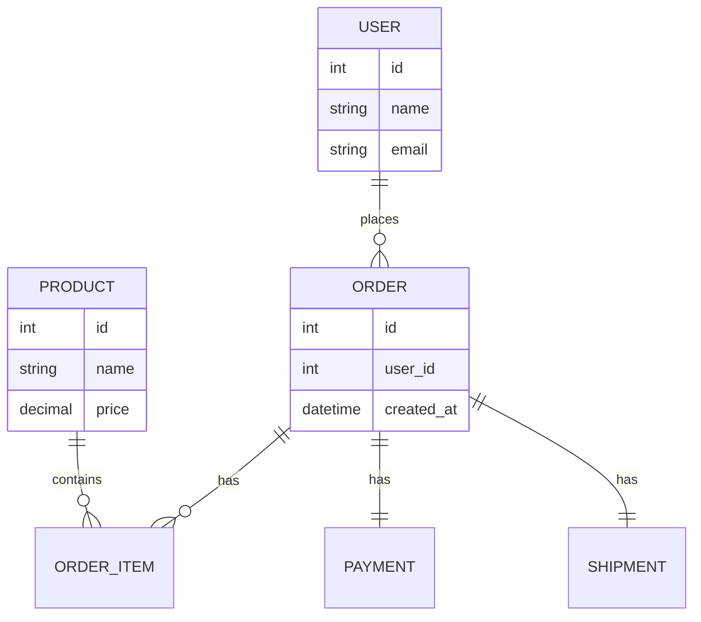

**拆分原则：**
- 强关联的数据放在同一服务
- 弱关联的数据可以拆分
- 通过外键关联的数据通常需要拆分

### 数据访问模式

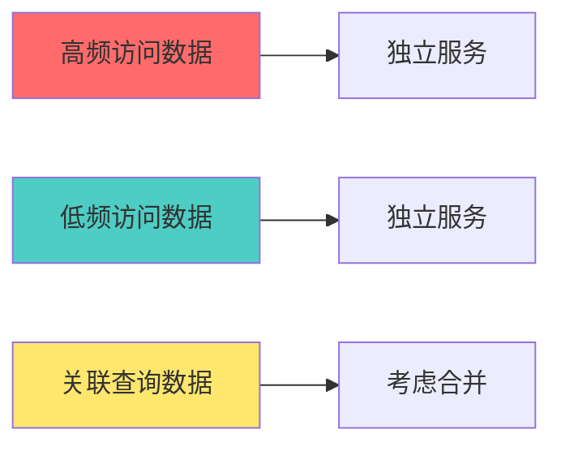

**考虑因素：**
- 数据访问频率
- 数据一致性要求
- 数据量大小
- 查询复杂度

## 3. 基于团队结构拆分

### Conway定律

> "设计系统的架构受制于产生这些设计的组织的沟通结构。" —— Melvin Conway

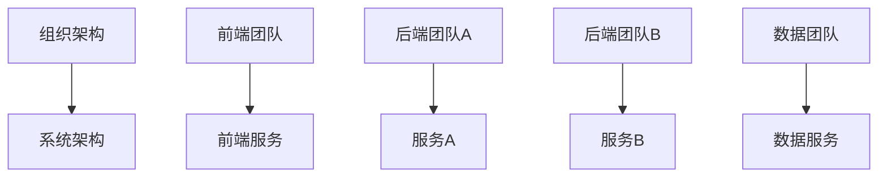

**实践：**
- 按照团队边界拆分服务
- 每个团队负责一个或多个服务
- 减少跨团队协作

### 团队规模考虑

- **小团队（2-3人）**：维护1-2个服务
- **中团队（4-6人）**：维护2-3个服务
- **大团队（7+人）**：考虑拆分服务或团队

## 4. 基于变更频率拆分

### 变更频率分析

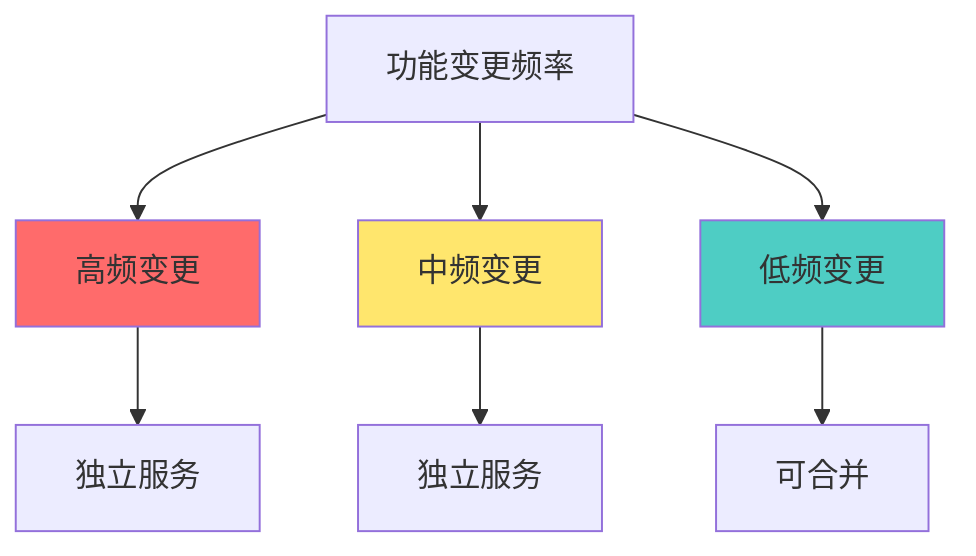

**原则：**
- 变更频率不同的功能应该分开
- 经常一起变更的功能应该放在一起
- 稳定功能可以合并

### 变更影响分析

| 功能模块 | 变更频率 | 影响范围 | 建议 |
|---------|---------|---------|------|
| 用户认证 | 低 | 全局 | 独立服务 |
| 商品展示 | 高 | 局部 | 独立服务 |
| 订单处理 | 中 | 局部 | 独立服务 |
| 报表统计 | 低 | 局部 | 可合并 |

## 5. 基于性能要求拆分

### 性能特征分析

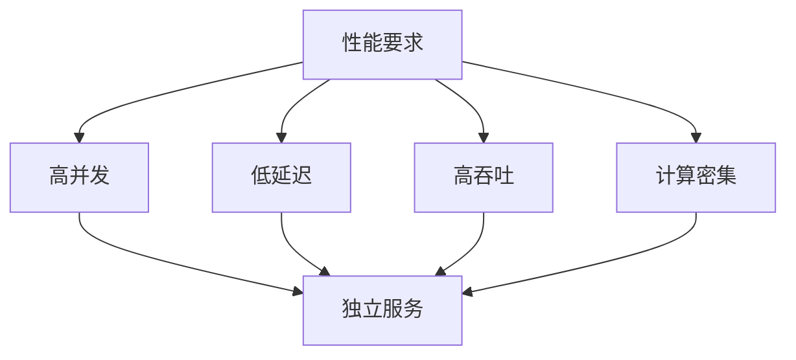

**拆分场景：**
- 需要独立扩展的功能
- 性能要求不同的功能
- 资源消耗不同的功能

### 性能隔离

```
✅ 用户查询服务（高并发，低延迟）
✅ 数据分析服务（低并发，高计算）
✅ 文件上传服务（高吞吐，大存储）
```

# 服务拆分策略

## 1. 渐进式拆分

不要一次性拆分所有服务，采用渐进式拆分策略。

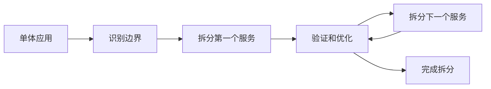

### 拆分步骤

1. **识别拆分候选**
   - 找出最独立的模块
   - 分析依赖关系
   - 评估拆分难度

2. **准备拆分**
   - 提取API接口
   - 数据迁移准备
   - 团队准备

3. **执行拆分**
   - 创建新服务
   - 迁移代码和数据
   - 更新调用方

4. **验证优化**
   - 功能验证
   - 性能测试
   - 监控告警

5. **持续迭代**
   - 总结经验
   - 优化流程
   - 继续拆分

## 2. 绞杀者模式（Strangler Pattern）

逐步用新服务替换旧功能，而不是一次性重写。

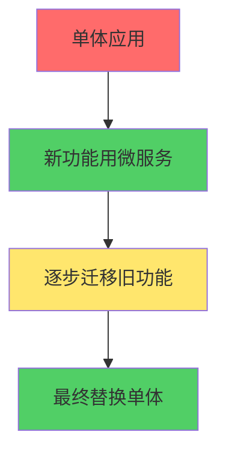

**优势：**
- 降低风险
- 持续交付
- 逐步验证

## 3. 数据库拆分策略

### 共享数据库（过渡阶段）

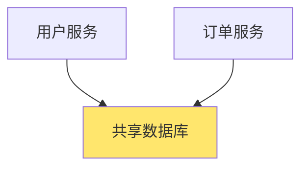

**适用场景：**
- 拆分初期
- 数据迁移困难
- 临时方案

**注意：**
- 明确数据所有权
- 避免直接访问其他服务数据
- 尽快迁移到独立数据库

### 独立数据库（目标状态）

```mermaid
graph TB
    A[用户服务] --> B[用户数据库]
    C[订单服务] --> D[订单数据库]
    
    A -.->|API| C
    
    style B fill:#51CF66
    style D fill:#51CF66
```

**实现方式：**
- 数据迁移
- 双写策略
- 逐步切换

# 拆分实践指南

## 1. 拆分前准备

### 代码分析

```mermaid
graph TB
    A[代码分析] --> B[依赖关系分析]
    A --> C[数据访问分析]
    A --> D[业务逻辑分析]
    
    B --> E[识别耦合点]
    C --> F[识别数据边界]
    D --> G[识别业务边界]
```

**分析工具：**
- 静态代码分析
- 依赖关系图
- 调用链分析
- 数据流分析

### 业务分析

- 识别业务领域
- 分析业务流程
- 确定业务边界
- 识别领域事件

## 2. 拆分执行

### API设计

```mermaid
graph LR
    A[服务A] -->|REST API| B[服务B]
    A -->|gRPC| C[服务C]
    A -->|消息队列| D[服务D]
    
    style A fill:#4DABF7
    style B fill:#51CF66
    style C fill:#51CF66
    style D fill:#51CF66
```

**API设计原则：**
- 明确的接口契约
- 版本管理
- 向后兼容
- 文档完善

### 数据迁移

```mermaid
sequenceDiagram
    participant Old as 旧系统
    participant New as 新服务
    participant DB as 数据库
    
    Old->>DB: 读取数据
    Old->>New: 调用API写入
    New->>DB: 写入新数据库
    New-->>Old: 确认成功
    Old->>DB: 标记已迁移
```

**迁移策略：**
- 双写策略
- 数据同步
- 逐步切换
- 回滚方案

## 3. 拆分后优化

### 服务治理

- 服务注册与发现
- 负载均衡
- 熔断降级
- 监控告警

### 性能优化

- API网关
- 缓存策略
- 异步处理
- 批量操作

# 常见拆分模式

## 1. 按功能拆分

```
用户服务 → 用户管理功能
订单服务 → 订单处理功能
支付服务 → 支付处理功能
```

## 2. 按数据拆分

```
用户服务 → 用户相关数据
订单服务 → 订单相关数据
商品服务 → 商品相关数据
```

## 3. 按流程拆分

```
订单创建服务 → 订单创建流程
订单处理服务 → 订单处理流程
订单查询服务 → 订单查询流程
```

## 4. 按读写拆分（CQRS）

```
订单写服务 → 订单写入操作
订单读服务 → 订单查询操作
```

# 拆分反模式

## 1. 按技术层次拆分

```
❌ Web服务
❌ 业务服务
❌ 数据服务
```

**问题：**
- 服务间强耦合
- 无法独立部署
- 违反微服务原则

## 2. 过度拆分

```
❌ 用户查询服务
❌ 用户创建服务
❌ 用户更新服务
❌ 用户删除服务
```

**问题：**
- 服务数量过多
- 网络调用增加
- 运维复杂

## 3. 共享数据库

```
❌ 多个服务共享一个数据库
❌ 服务间直接访问数据库表
```

**问题：**
- 数据耦合
- 无法独立扩展
- 故障影响范围大

## 4. 分布式单体

```
❌ 服务间强依赖
❌ 需要同时部署多个服务
❌ 无法独立扩展
```

**问题：**
- 失去了微服务的优势
- 增加了分布式系统的复杂度

# 拆分验证标准

## 1. 独立性验证

- ✅ 可以独立部署
- ✅ 可以独立扩展
- ✅ 可以独立测试
- ✅ 故障不影响其他服务

## 2. 边界清晰性

- ✅ 职责明确
- ✅ 数据独立
- ✅ 接口清晰
- ✅ 依赖最小

## 3. 团队自治性

- ✅ 团队可以独立开发
- ✅ 减少跨团队协调
- ✅ 快速交付

## 4. 业务完整性

- ✅ 完整的业务功能
- ✅ 数据一致性保证
- ✅ 性能满足要求

# 总结

服务拆分是微服务架构成功的关键。合理的拆分需要：

1. **遵循原则**
   - 单一职责
   - 高内聚低耦合
   - 围绕业务能力
   - 数据独立

2. **使用方法**
   - 领域驱动设计
   - 业务领域分析
   - 数据模型分析
   - 团队结构考虑

3. **采用策略**
   - 渐进式拆分
   - 绞杀者模式
   - 数据库拆分

4. **避免反模式**
   - 按技术层次拆分
   - 过度拆分
   - 共享数据库
   - 分布式单体

5. **持续优化**
   - 监控和反馈
   - 调整服务边界
   - 优化服务粒度

记住：**没有完美的拆分方案，只有适合当前场景的方案**。拆分是一个持续演进的过程，需要根据业务发展和技术演进不断调整和优化。
