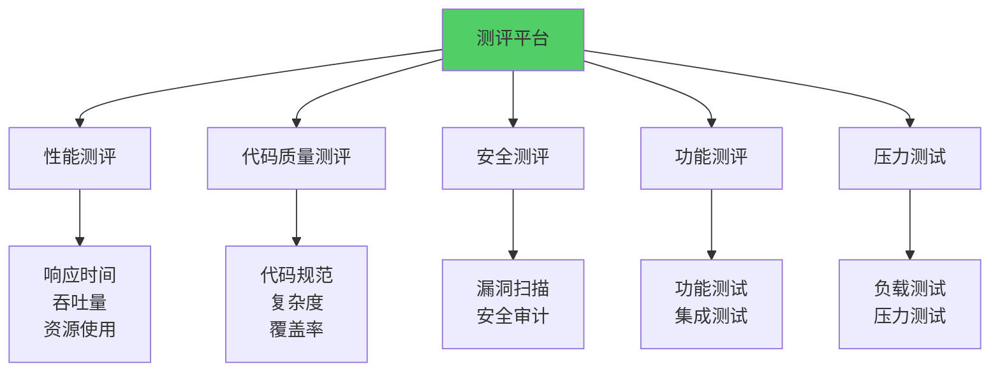
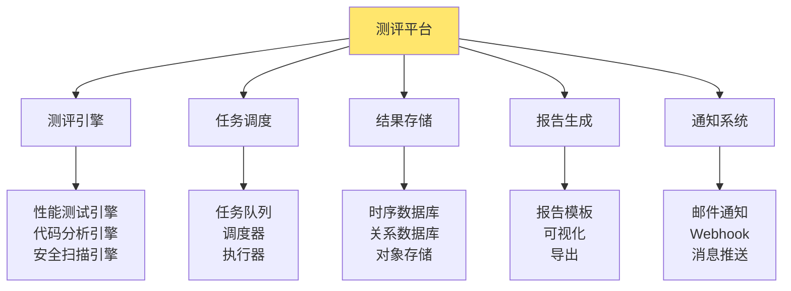
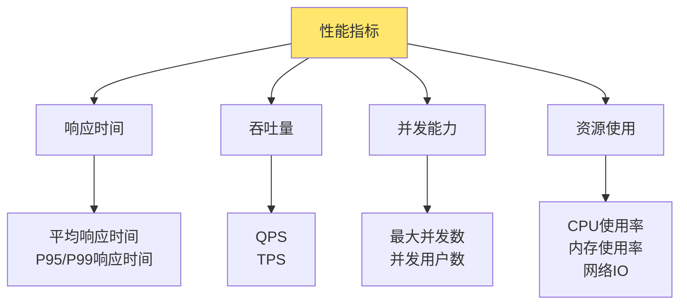
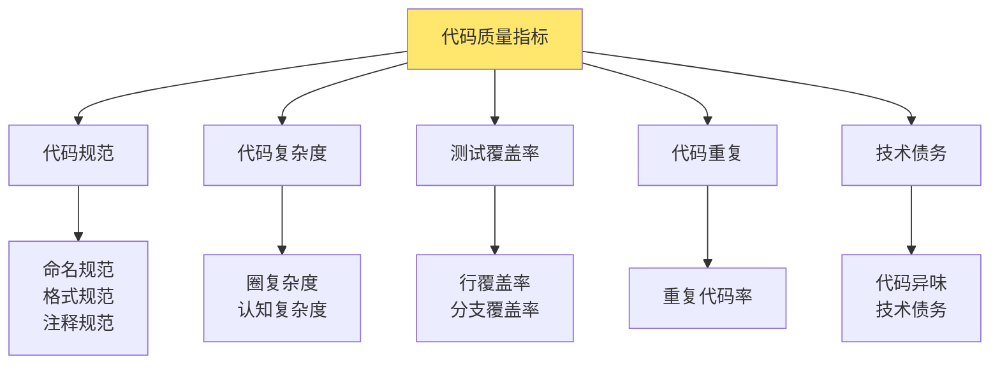
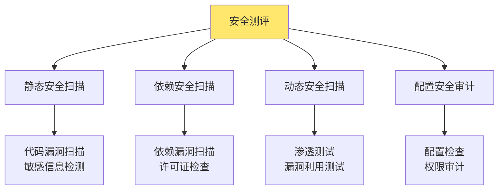
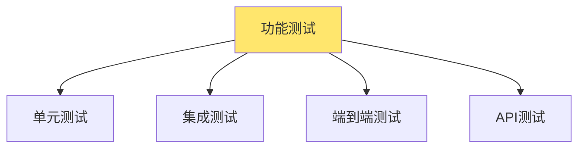
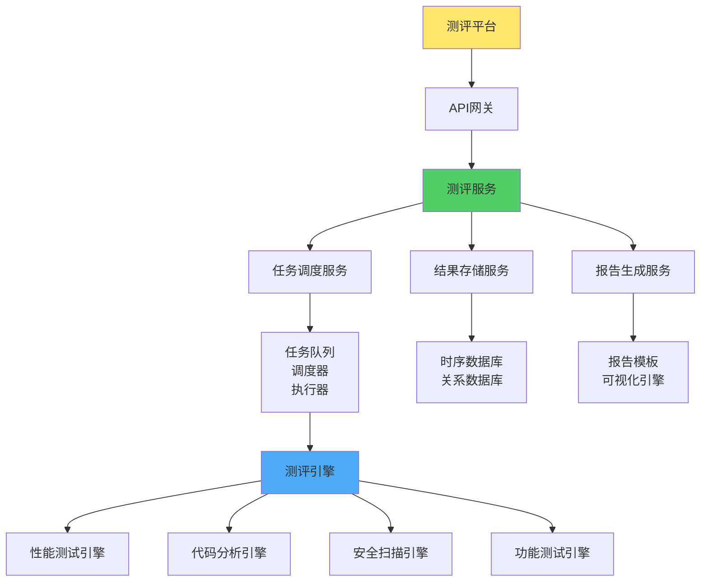
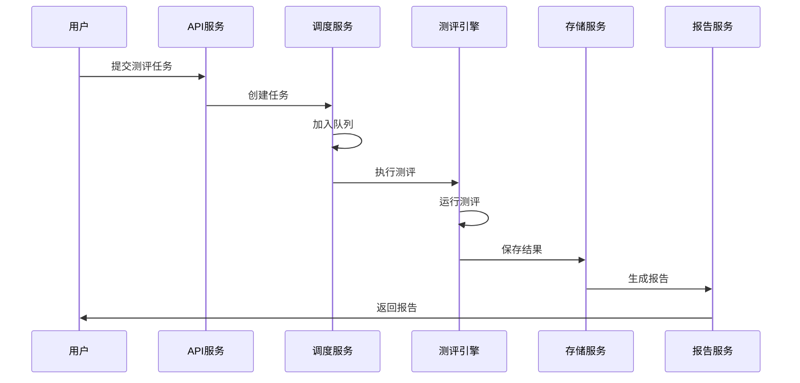
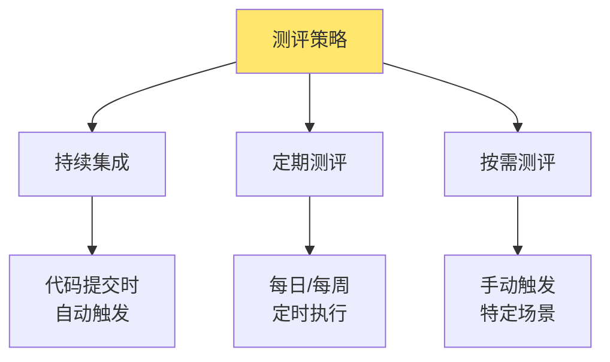

测评平台是用于对系统、代码、性能等进行自动化测评和评估的平台。通过统一的测评平台，可以实现标准化的测评流程，提高测评效率，保证测评质量。

# 测评平台概述

## 什么是测评平台？

测评平台是一个集成的自动化测评系统，提供多种测评能力，包括性能测评、代码质量测评、安全测评、功能测评等，帮助开发团队持续改进代码质量和系统性能。



**核心价值：**
- **自动化测评**：减少人工干预，提高效率
- **标准化流程**：统一的测评标准和流程
- **持续改进**：持续监控和改进代码质量
- **数据驱动**：基于数据做出决策

## 测评平台架构



# 测评类型

## 性能测评

性能测评是对系统性能进行评估，包括响应时间、吞吐量、资源使用等指标。

### 性能指标



### 性能测试类型

**1. 负载测试（Load Testing）**
- 测试系统在正常负载下的性能
- 验证系统是否满足性能需求

**2. 压力测试（Stress Testing）**
- 测试系统在极限负载下的表现
- 找出系统的性能瓶颈和极限

**3. 容量测试（Capacity Testing）**
- 测试系统能处理的最大负载
- 确定系统的容量规划

**4. 稳定性测试（Stability Testing）**
- 长时间运行测试
- 检查内存泄漏、资源耗尽等问题

### 性能测试实现

```go
// 性能测试引擎
type PerformanceTestEngine struct {
    clients    []*http.Client
    config     *TestConfig
    metrics    *MetricsCollector
}

type TestConfig struct {
    TargetURL      string
    ConcurrentUsers int
    Duration       time.Duration
    RampUpTime     time.Duration
    RequestRate    int  // 每秒请求数
}

func (e *PerformanceTestEngine) Run() (*TestResult, error) {
    // 1. 准备测试环境
    e.prepare()
    
    // 2. 启动测试
    startTime := time.Now()
    e.runTest()
    
    // 3. 收集指标
    metrics := e.metrics.Collect()
    
    // 4. 生成报告
    result := &TestResult{
        Duration:    time.Since(startTime),
        TotalRequests: metrics.TotalRequests,
        SuccessRequests: metrics.SuccessRequests,
        FailedRequests: metrics.FailedRequests,
        AvgResponseTime: metrics.AvgResponseTime,
        P95ResponseTime: metrics.P95ResponseTime,
        P99ResponseTime: metrics.P99ResponseTime,
        QPS: metrics.QPS,
        ErrorRate: float64(metrics.FailedRequests) / float64(metrics.TotalRequests),
    }
    
    return result, nil
}

func (e *PerformanceTestEngine) runTest() {
    var wg sync.WaitGroup
    sem := make(chan struct{}, e.config.ConcurrentUsers)
    
    ticker := time.NewTicker(time.Second / time.Duration(e.config.RequestRate))
    defer ticker.Stop()
    
    deadline := time.Now().Add(e.config.Duration)
    
    for time.Now().Before(deadline) {
        <-ticker.C
        
        wg.Add(1)
        sem <- struct{}{}
        
        go func() {
            defer wg.Done()
            defer func() { <-sem }()
            
            e.sendRequest()
        }()
    }
    
    wg.Wait()
}

func (e *PerformanceTestEngine) sendRequest() {
    client := e.clients[rand.Intn(len(e.clients))]
    start := time.Now()
    
    resp, err := client.Get(e.config.TargetURL)
    duration := time.Since(start)
    
    if err != nil {
        e.metrics.RecordFailure(duration)
        return
    }
    defer resp.Body.Close()
    
    if resp.StatusCode >= 200 && resp.StatusCode < 300 {
        e.metrics.RecordSuccess(duration)
    } else {
        e.metrics.RecordFailure(duration)
    }
}
```

## 代码质量测评

代码质量测评是对代码质量进行评估，包括代码规范、复杂度、测试覆盖率等。

### 代码质量指标



### 代码质量工具

**Go语言工具：**
- **golangci-lint**：代码静态分析
- **go vet**：官方代码检查工具
- **gocov**：代码覆盖率工具
- **gocyclo**：圈复杂度分析

### 代码质量测评实现

```go
// 代码质量分析引擎
type CodeQualityEngine struct {
    analyzers []CodeAnalyzer
}

type CodeAnalyzer interface {
    Analyze(path string) (*AnalysisResult, error)
}

type AnalysisResult struct {
    LinterIssues   []LinterIssue
    Complexity     ComplexityMetrics
    Coverage       CoverageMetrics
    Duplication    DuplicationMetrics
    TechnicalDebt  TechnicalDebtMetrics
}

// 代码规范检查
type LinterAnalyzer struct{}

func (a *LinterAnalyzer) Analyze(path string) (*AnalysisResult, error) {
    // 运行golangci-lint
    cmd := exec.Command("golangci-lint", "run", path)
    output, err := cmd.CombinedOutput()
    
    if err != nil {
        // 解析lint结果
        issues := parseLintOutput(output)
        return &AnalysisResult{LinterIssues: issues}, nil
    }
    
    return &AnalysisResult{}, nil
}

// 代码覆盖率分析
type CoverageAnalyzer struct{}

func (a *CoverageAnalyzer) Analyze(path string) (*AnalysisResult, error) {
    // 运行测试并收集覆盖率
    cmd := exec.Command("go", "test", "-coverprofile=coverage.out", path)
    cmd.Run()
    
    // 解析覆盖率报告
    cmd = exec.Command("go", "tool", "cover", "-func=coverage.out")
    output, _ := cmd.Output()
    
    coverage := parseCoverageOutput(output)
    
    return &AnalysisResult{
        Coverage: coverage,
    }, nil
}

// 复杂度分析
type ComplexityAnalyzer struct{}

func (a *ComplexityAnalyzer) Analyze(path string) (*AnalysisResult, error) {
    // 运行gocyclo
    cmd := exec.Command("gocyclo", path)
    output, _ := cmd.Output()
    
    complexity := parseComplexityOutput(output)
    
    return &AnalysisResult{
        Complexity: complexity,
    }, nil
}
```

## 安全测评

安全测评是对系统安全性进行评估，包括漏洞扫描、安全审计等。

### 安全测评类型



### 安全扫描工具

**Go语言工具：**
- **gosec**：Go安全扫描工具
- **nancy**：依赖漏洞扫描
- **truffleHog**：敏感信息检测

### 安全测评实现

```go
// 安全扫描引擎
type SecurityScanEngine struct {
    scanners []SecurityScanner
}

type SecurityScanner interface {
    Scan(path string) (*SecurityResult, error)
}

// 静态安全扫描
type StaticSecurityScanner struct{}

func (s *StaticSecurityScanner) Scan(path string) (*SecurityResult, error) {
    // 运行gosec
    cmd := exec.Command("gosec", "-fmt", "json", path)
    output, _ := cmd.Output()
    
    var result gosec.Report
    json.Unmarshal(output, &result)
    
    issues := make([]SecurityIssue, 0)
    for _, issue := range result.Issues {
        issues = append(issues, SecurityIssue{
            Severity: issue.Severity,
            Confidence: issue.Confidence,
            RuleID: issue.RuleID,
            What: issue.What,
            File: issue.File,
            Code: issue.Code,
        })
    }
    
    return &SecurityResult{
        Issues: issues,
    }, nil
}

// 依赖安全扫描
type DependencySecurityScanner struct{}

func (s *DependencySecurityScanner) Scan(path string) (*SecurityResult, error) {
    // 运行nancy
    cmd := exec.Command("nancy", "sleuth", path)
    output, _ := cmd.Output()
    
    vulnerabilities := parseNancyOutput(output)
    
    return &SecurityResult{
        Vulnerabilities: vulnerabilities,
    }, nil
}
```

## 功能测评

功能测评是对系统功能进行测试，验证功能是否正确实现。

### 功能测试类型



### 功能测试实现

```go
// 功能测试引擎
type FunctionalTestEngine struct {
    testSuites []TestSuite
}

type TestSuite struct {
    Name string
    Tests []TestCase
}

type TestCase struct {
    Name     string
    Steps    []TestStep
    Expected string
}

type TestStep struct {
    Action string
    Target string
    Value  string
}

func (e *FunctionalTestEngine) Run(suiteName string) (*TestResult, error) {
    suite := e.findSuite(suiteName)
    if suite == nil {
        return nil, fmt.Errorf("test suite not found: %s", suiteName)
    }
    
    result := &TestResult{
        SuiteName: suiteName,
        TotalTests: len(suite.Tests),
        PassedTests: 0,
        FailedTests: 0,
    }
    
    for _, test := range suite.Tests {
        if e.runTest(&test) {
            result.PassedTests++
        } else {
            result.FailedTests++
        }
    }
    
    return result, nil
}

func (e *FunctionalTestEngine) runTest(test *TestCase) bool {
    for _, step := range test.Steps {
        if !e.executeStep(step) {
            return false
        }
    }
    return true
}
```

# 测评平台架构设计

## 系统架构



## 核心组件

### 1. 任务调度服务

```go
// 任务调度服务
type TaskScheduler struct {
    queue    TaskQueue
    executor TaskExecutor
    workers  int
}

type Task struct {
    ID          string
    Type        string  // performance, code-quality, security, functional
    Config      map[string]interface{}
    Status      string
    CreatedAt   time.Time
    StartedAt   time.Time
    CompletedAt time.Time
    Result      *TaskResult
}

func (s *TaskScheduler) SubmitTask(task *Task) error {
    // 提交任务到队列
    return s.queue.Enqueue(task)
}

func (s *TaskScheduler) Start() {
    for i := 0; i < s.workers; i++ {
        go s.worker()
    }
}

func (s *TaskScheduler) worker() {
    for {
        task, err := s.queue.Dequeue()
        if err != nil {
            continue
        }
        
        // 执行任务
        result, err := s.executor.Execute(task)
        if err != nil {
            task.Status = "failed"
            task.Result = &TaskResult{Error: err.Error()}
        } else {
            task.Status = "completed"
            task.Result = result
        }
        
        // 保存结果
        s.saveResult(task)
    }
}
```

### 2. 结果存储服务

```go
// 结果存储服务
type ResultStorage struct {
    db        *sql.DB
    tsdb      TimeSeriesDB
    objectStore ObjectStore
}

func (s *ResultStorage) SaveResult(task *Task) error {
    // 1. 保存任务元数据到关系数据库
    _, err := s.db.Exec(`
        INSERT INTO tasks (id, type, status, created_at, completed_at, result)
        VALUES (?, ?, ?, ?, ?, ?)
    `, task.ID, task.Type, task.Status, task.CreatedAt, task.CompletedAt, task.Result)
    
    if err != nil {
        return err
    }
    
    // 2. 保存时序数据到时序数据库
    if task.Type == "performance" {
        metrics := task.Result.Metrics
        s.tsdb.Write("performance_metrics", map[string]interface{}{
            "task_id": task.ID,
            "qps": metrics.QPS,
            "avg_response_time": metrics.AvgResponseTime,
            "error_rate": metrics.ErrorRate,
        })
    }
    
    // 3. 保存详细报告到对象存储
    report := generateReport(task)
    s.objectStore.Put(fmt.Sprintf("reports/%s.json", task.ID), report)
    
    return nil
}
```

### 3. 报告生成服务

```go
// 报告生成服务
type ReportGenerator struct {
    templates map[string]*template.Template
}

func (g *ReportGenerator) GenerateReport(task *Task) (*Report, error) {
    tmpl, ok := g.templates[task.Type]
    if !ok {
        return nil, fmt.Errorf("template not found for type: %s", task.Type)
    }
    
    var buf bytes.Buffer
    if err := tmpl.Execute(&buf, task); err != nil {
        return nil, err
    }
    
    return &Report{
        TaskID: task.ID,
        Type:   task.Type,
        Content: buf.String(),
        Format: "html",
    }, nil
}
```

## 测评流程



# 测评平台功能

## 1. 任务管理

- **任务创建**：支持多种测评任务创建
- **任务调度**：自动调度和执行任务
- **任务监控**：实时监控任务状态
- **任务历史**：查看历史任务和结果

## 2. 结果分析

- **数据可视化**：图表展示测评结果
- **趋势分析**：分析测评结果趋势
- **对比分析**：对比不同版本的测评结果
- **异常检测**：自动检测异常结果

## 3. 报告生成

- **自动报告**：测评完成后自动生成报告
- **报告模板**：支持自定义报告模板
- **报告导出**：支持多种格式导出
- **报告分享**：支持报告分享和协作

## 4. 通知告警

- **测评完成通知**：测评完成时通知
- **异常告警**：发现异常时告警
- **阈值告警**：超过阈值时告警
- **多渠道通知**：邮件、短信、Webhook等

# 测评平台最佳实践

## 1. 测评策略



**策略：**
- **持续集成**：代码提交时自动触发测评
- **定期测评**：定时执行测评任务
- **按需测评**：手动触发特定测评

## 2. 测评标准

- **性能标准**：定义性能基准和阈值
- **质量标准**：定义代码质量标准
- **安全标准**：定义安全标准
- **通过标准**：定义测评通过标准

## 3. 结果处理

- **自动处理**：测评结果自动处理和分析
- **人工审核**：重要结果需要人工审核
- **持续改进**：基于结果持续改进

## 4. 成本控制

- **资源限制**：限制测评资源使用
- **任务优先级**：设置任务优先级
- **结果保留**：合理保留测评结果

# 总结

测评平台是保障系统质量和性能的重要工具，通过自动化的测评流程，可以持续监控和改进系统。

**核心要点：**
1. **多种测评类型**：性能、代码质量、安全、功能等
2. **自动化流程**：任务调度、执行、结果存储、报告生成
3. **数据驱动**：基于测评数据做出决策
4. **持续改进**：持续监控和改进系统质量

**最佳实践：**
- 建立完善的测评标准
- 实现自动化测评流程
- 持续分析和改进
- 合理控制测评成本

通过系统性的测评平台设计，可以构建高质量、高性能的系统。
