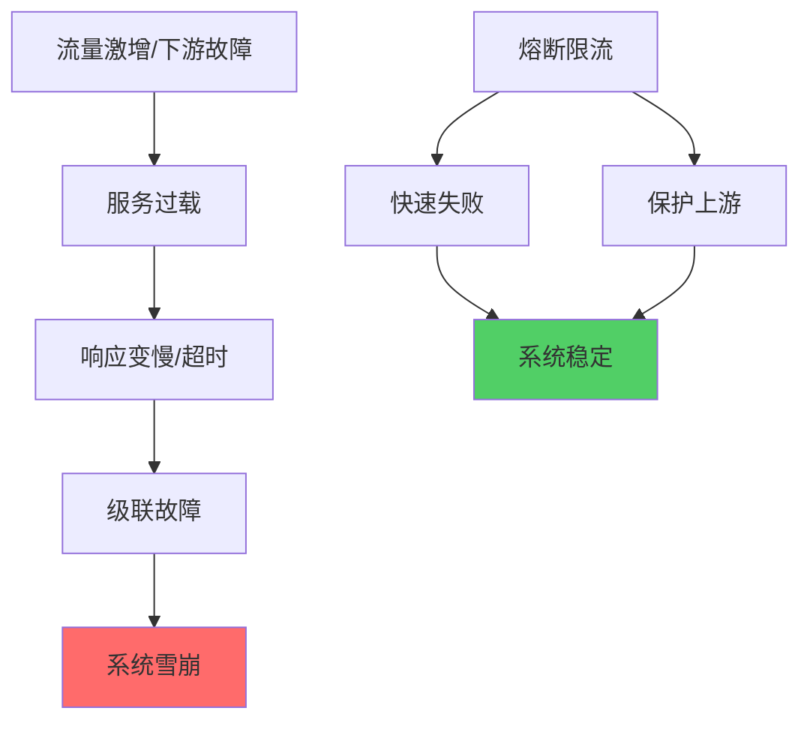
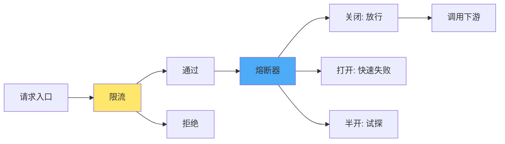
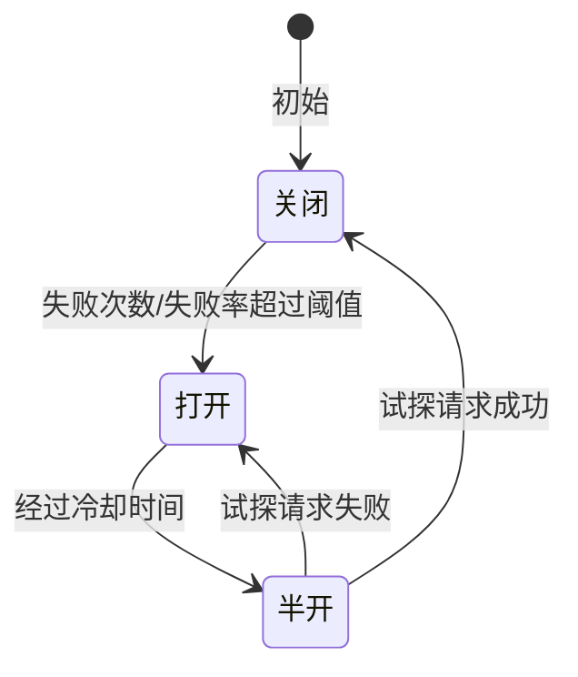
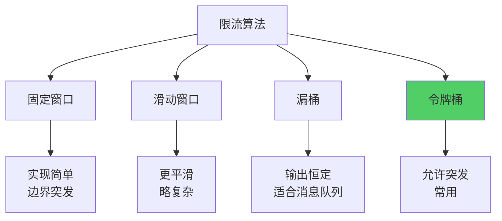
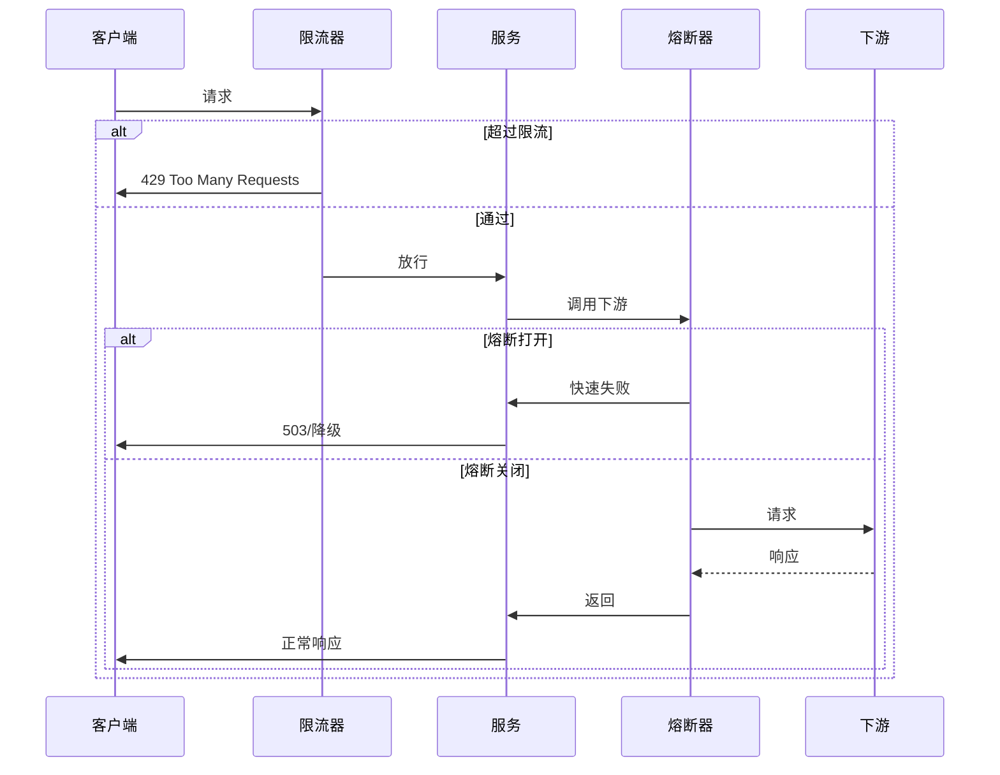

熔断（Circuit Breaker）与限流（Rate Limiting）是分布式系统中保护服务稳定性的两大核心手段。熔断防止故障扩散，限流防止系统过载，二者配合可有效提升系统的弹性和可用性。

# 熔断与限流概述

## 为什么需要熔断与限流？



**核心价值：**
- **熔断**：当下游持续失败时，快速失败并停止调用，避免资源耗尽和故障扩散
- **限流**：控制单位时间内的请求量，防止系统超过承载能力

## 熔断与限流的关系



- **限流**：在入口处控制流量，多用于保护自身或下游的 QPS/并发
- **熔断**：根据失败率/错误类型决定是否继续调用，多用于保护下游故障时的调用方

---

# 熔断器（Circuit Breaker）

## 熔断器原理

熔断器借鉴电路中的保险丝：当故障超过阈值时「熔断」，后续请求不再访问故障服务，而是直接返回错误或降级结果；一段时间后进入「半开」状态试探，成功则关闭熔断，失败则再次打开。



**三种状态：**
- **关闭（Closed）**：正常放行请求，并统计成功/失败
- **打开（Open）**：不再调用下游，直接返回错误（或降级结果）
- **半开（Half-Open）**：放行少量试探请求，根据结果决定变为关闭或再次打开

## Golang 熔断器实现

### 状态定义

```go
package circuitbreaker

import (
	"sync"
	"time"
)

// State 熔断器状态
type State int

const (
	StateClosed   State = iota // 关闭：正常放行
	StateOpen                  // 打开：直接失败
	StateHalfOpen              // 半开：试探
)

func (s State) String() string {
	switch s {
	case StateClosed:
		return "closed"
	case StateOpen:
		return "open"
	case StateHalfOpen:
		return "half-open"
	default:
		return "unknown"
	}
}
```

### 熔断器核心结构

```go
// Breaker 熔断器
type Breaker struct {
	mu sync.RWMutex

	// 配置
	maxFailures  uint          // 触发熔断的失败次数阈值
	resetTimeout time.Duration // 进入半开的冷却时间
	halfOpenMax  uint          // 半开状态允许的试探请求数

	// 状态
	state        State
	failures     uint        // 当前连续失败次数（或周期内失败数）
	lastFailure  time.Time   // 最近一次失败时间
	halfOpenPass uint        // 半开状态下已放行的请求数
	nextAttempt  time.Time   // 可进入半开的时间
}

// NewBreaker 创建熔断器
func NewBreaker(opts ...Option) *Breaker {
	b := &Breaker{
		maxFailures:  5,
		resetTimeout: 30 * time.Second,
		halfOpenMax:  3,
		state:        StateClosed,
	}
	for _, opt := range opts {
		opt(b)
	}
	return b
}

// Option 配置项
type Option func(*Breaker)

func WithMaxFailures(n uint) Option {
	return func(b *Breaker) { b.maxFailures = n }
}

func WithResetTimeout(d time.Duration) Option {
	return func(b *Breaker) { b.resetTimeout = d }
}
```

### 调用前检查：是否允许放行

```go
// Allow 判断是否允许请求通过（在执行业务前调用）
func (b *Breaker) Allow() bool {
	b.mu.Lock()
	defer b.mu.Unlock()

	now := time.Now()

	switch b.state {
	case StateClosed:
		return true
	case StateOpen:
		// 是否已过冷却时间，可进入半开
		if now.After(b.nextAttempt) {
			b.state = StateHalfOpen
			b.halfOpenPass = 0
			return true
		}
		return false
	case StateHalfOpen:
		if b.halfOpenPass < b.halfOpenMax {
			b.halfOpenPass++
			return true
		}
		return false
	}
	return false
}
```

### 记录成功/失败并驱动状态迁移

```go
// Success 记录成功（在业务成功返回后调用）
func (b *Breaker) Success() {
	b.mu.Lock()
	defer b.mu.Unlock()

	switch b.state {
	case StateClosed:
		// 可在此做周期统计，这里简化为仅半开时处理
	case StateHalfOpen:
		b.state = StateClosed
		b.failures = 0
	}
}

// Failure 记录失败（在业务失败或超时后调用）
func (b *Breaker) Failure() {
	b.mu.Lock()
	defer b.mu.Unlock()

	b.lastFailure = time.Now()

	switch b.state {
	case StateClosed:
		b.failures++
		if b.failures >= b.maxFailures {
			b.state = StateOpen
			b.nextAttempt = b.lastFailure.Add(b.resetTimeout)
		}
	case StateHalfOpen:
		b.state = StateOpen
		b.nextAttempt = b.lastFailure.Add(b.resetTimeout)
		b.halfOpenPass = 0
	}
}
```

### 使用示例：在 HTTP 调用中接入熔断器

```go
func callDownstream(ctx context.Context, breaker *circuitbreaker.Breaker) error {
	if !breaker.Allow() {
		return errors.New("circuit breaker is open")
	}

	err := doHTTPCall(ctx)
	if err != nil {
		breaker.Failure()
		return err
	}
	breaker.Success()
	return nil
}
```

---

# 限流（Rate Limiting）

## 限流算法概述

常见限流算法有：固定窗口、滑动窗口、漏桶、令牌桶等，从实现复杂度和平滑度上各有取舍。



| 算法     | 特点           | 适用场景         |
|----------|----------------|------------------|
| 固定窗口 | 实现简单，边界可能突发 | 要求不高的限流   |
| 滑动窗口 | 更平滑，需维护窗口   | 需要平滑限流     |
| 漏桶     | 输出速率恒定       | 消息队列、平滑输出 |
| 令牌桶   | 允许一定突发       | API/网关限流常用 |

## 固定窗口计数器（Golang）

按固定时间窗口统计请求数，超过阈值则拒绝。

```go
package ratelimit

import (
	"sync"
	"time"
)

// FixedWindowLimiter 固定窗口限流器
type FixedWindowLimiter struct {
	mu       sync.Mutex
	limit    int           // 窗口内最大请求数
	window   time.Duration // 窗口大小
	count    int           // 当前窗口已请求数
	windowStart time.Time  // 当前窗口起始时间
}

func NewFixedWindowLimiter(limit int, window time.Duration) *FixedWindowLimiter {
	return &FixedWindowLimiter{
		limit:       limit,
		window:      window,
		windowStart: time.Now(),
	}
}

// Allow 是否允许通过
func (l *FixedWindowLimiter) Allow() bool {
	l.mu.Lock()
	defer l.mu.Unlock()

	now := time.Now()
	if now.Sub(l.windowStart) >= l.window {
		// 进入新窗口，重置
		l.windowStart = now
		l.count = 0
	}
	if l.count >= l.limit {
		return false
	}
	l.count++
	return true
}
```

## 滑动窗口（Golang）

用最近一段时间内的请求时间戳判断是否超限，比固定窗口更平滑。

```go
// SlidingWindowLimiter 滑动窗口限流器（基于时间戳列表）
type SlidingWindowLimiter struct {
	mu       sync.Mutex
	limit    int
	window   time.Duration
	requests []time.Time // 窗口内请求时间
}

func NewSlidingWindowLimiter(limit int, window time.Duration) *SlidingWindowLimiter {
	return &SlidingWindowLimiter{
		limit:   limit,
		window:  window,
		requests: make([]time.Time, 0, limit*2),
	}
}

func (l *SlidingWindowLimiter) Allow() bool {
	l.mu.Lock()
	defer l.mu.Unlock()

	now := time.Now()
	boundary := now.Add(-l.window)

	// 移除窗口外的记录
	var i int
	for i = 0; i < len(l.requests); i++ {
		if l.requests[i].After(boundary) {
			break
		}
	}
	l.requests = l.requests[i:]

	if len(l.requests) >= l.limit {
		return false
	}
	l.requests = append(l.requests, now)
	return true
}
```

## 漏桶（Golang）

请求以任意速率进入桶，以固定速率从桶中流出，桶满则拒绝。

```go
// LeakyBucketLimiter 漏桶限流器
type LeakyBucketLimiter struct {
	mu         sync.Mutex
	capacity   int           // 桶容量
	leakRate   float64       // 每秒漏出数量
	water      float64      // 当前水量
	lastLeakAt time.Time
}

func NewLeakyBucketLimiter(capacity int, leakRatePerSec float64) *LeakyBucketLimiter {
	return &LeakyBucketLimiter{
		capacity:   capacity,
		leakRate:   leakRatePerSec,
		lastLeakAt: time.Now(),
	}
}

func (l *LeakyBucketLimiter) Allow() bool {
	l.mu.Lock()
	defer l.mu.Unlock()

	now := time.Now()
	elapsed := now.Sub(l.lastLeakAt).Seconds()
	l.water -= l.leakRate * elapsed
	if l.water < 0 {
		l.water = 0
	}
	l.lastLeakAt = now

	if l.water >= float64(l.capacity) {
		return false
	}
	l.water++
	return true
}
```

## 令牌桶（Golang）

以固定速率向桶中放令牌，请求消耗令牌，无令牌则拒绝；桶有容量时可短时突发。

```go
// TokenBucketLimiter 令牌桶限流器
type TokenBucketLimiter struct {
	mu         sync.Mutex
	capacity   float64     // 桶容量
	rate       float64     // 每秒放入的令牌数
	tokens     float64     // 当前令牌数
	lastRefill time.Time
}

func NewTokenBucketLimiter(capacity, ratePerSec float64) *TokenBucketLimiter {
	return &TokenBucketLimiter{
		capacity:   capacity,
		rate:       ratePerSec,
		tokens:     capacity, // 初始满桶
		lastRefill: time.Now(),
	}
}

func (l *TokenBucketLimiter) Allow() bool {
	return l.AllowN(1)
}

// AllowN 消费 n 个令牌
func (l *TokenBucketLimiter) AllowN(n int) bool {
	l.mu.Lock()
	defer l.mu.Unlock()

	now := time.Now()
	elapsed := now.Sub(l.lastRefill).Seconds()
	l.tokens += l.rate * elapsed
	if l.tokens > l.capacity {
		l.tokens = l.capacity
	}
	l.lastRefill = now

	if l.tokens >= float64(n) {
		l.tokens -= float64(n)
		return true
	}
	return false
}
```

---

# 熔断与限流组合使用

在实际服务中，通常对「下游调用」做熔断，对「入口或关键路径」做限流，二者可叠加使用。



## 组合示例：中间件形式

```go
// 入口限流 + 下游熔断的 HTTP 示例
func main() {
	limiter := ratelimit.NewTokenBucketLimiter(100, 10) // 桶容量100，每秒10个令牌
	breaker := circuitbreaker.NewBreaker(
		circuitbreaker.WithMaxFailures(5),
		circuitbreaker.WithResetTimeout(30*time.Second),
	)

	http.HandleFunc("/api", func(w http.ResponseWriter, r *http.Request) {
		if !limiter.Allow() {
			http.Error(w, "rate limit exceeded", http.StatusTooManyRequests)
			return
		}

		if !breaker.Allow() {
			http.Error(w, "service unavailable", http.StatusServiceUnavailable)
			return
		}

		err := callBackend(r.Context())
		if err != nil {
			breaker.Failure()
			http.Error(w, err.Error(), http.StatusBadGateway)
			return
		}
		breaker.Success()
		w.Write([]byte("ok"))
	})
}
```

---

# 最佳实践

1. **熔断**：根据业务设置合理的 `maxFailures` 和 `resetTimeout`，半开试探量不宜过大。
2. **限流**：对外 API 优先考虑令牌桶或滑动窗口，避免固定窗口边界突发。
3. **指标**：对熔断状态、限流拒绝次数打点监控，便于调参和告警。
4. **降级**：熔断打开时返回缓存、默认值或友好提示，而不是裸错误。
5. **分层**：网关层做全局限流，服务内对关键下游做熔断，避免单点拖垮整体。

---

# 参考

- [Release It! - Circuit Breaker](https://pragprog.com/titles/mnee2/release-it-second-edition/)
- Go 生态常用库：`golang.org/x/time/rate`（令牌桶）、`github.com/sony/gobreaker`（熔断器）
