配置中心（Configuration Center）是微服务架构中的核心组件，用于集中管理和分发应用程序的配置信息。它解决了分布式系统中配置管理分散、难以维护、动态更新困难等问题。

# 配置中心概述

## 为什么需要配置中心？

在传统的应用开发中，配置通常存储在配置文件中（如application.properties、application.yml），这种方式在微服务架构中存在以下问题：

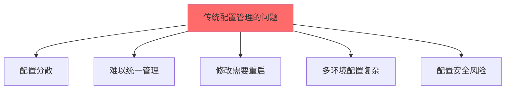

**问题：**
1. **配置分散**：每个服务都有自己的配置文件，难以统一管理
2. **难以统一管理**：修改配置需要在多个地方操作
3. **修改需要重启**：配置变更需要重新部署应用
4. **多环境配置复杂**：开发、测试、生产环境配置管理困难
5. **配置安全风险**：敏感信息（密码、密钥）可能泄露
6. **配置版本管理困难**：难以追踪配置变更历史

## 配置中心的价值

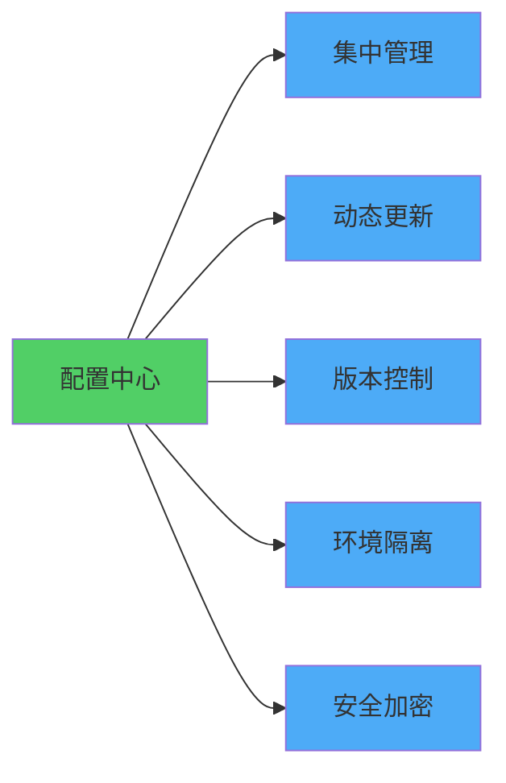

**优势：**
- **集中管理**：所有配置统一存储在配置中心
- **动态更新**：配置变更无需重启应用
- **版本控制**：配置变更历史可追溯
- **环境隔离**：不同环境配置隔离管理
- **安全加密**：敏感配置加密存储
- **权限控制**：细粒度的配置访问权限

# 配置中心架构

## 基本架构

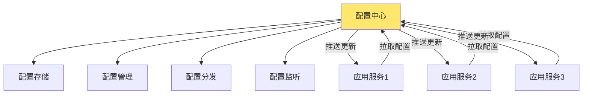

**核心组件：**
1. **配置存储**：持久化存储配置信息
2. **配置管理**：配置的增删改查、版本管理
3. **配置分发**：将配置推送给应用服务
4. **配置监听**：监听配置变更并通知应用

## 配置管理模式

### 1. 拉取模式（Pull）

应用主动从配置中心拉取配置。

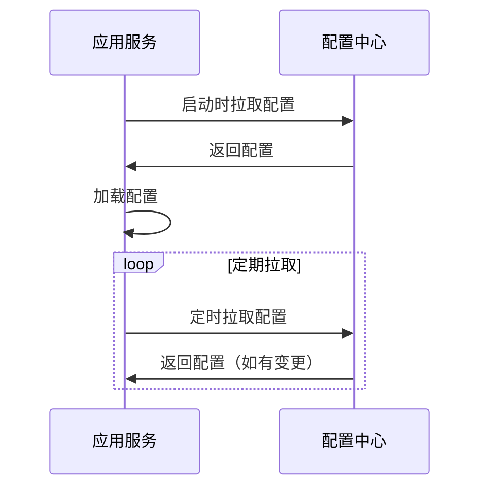

**特点：**
- 实现简单
- 需要应用定期轮询
- 配置更新有延迟

### 2. 推送模式（Push）

配置中心主动推送配置变更给应用。

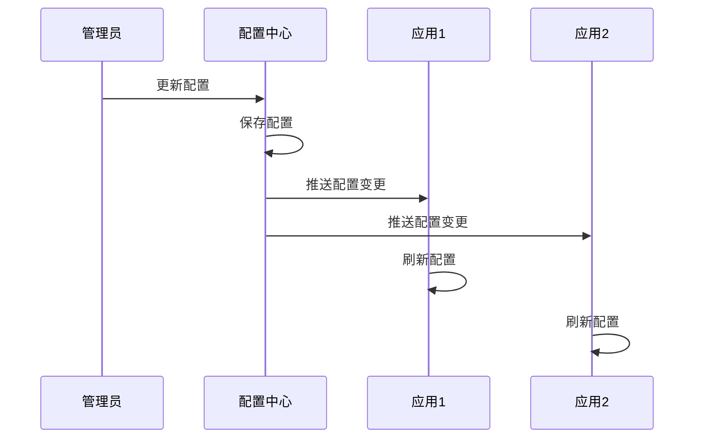

**特点：**
- 配置更新实时
- 需要长连接或消息队列
- 实现相对复杂

### 3. 长轮询模式（Long Polling）

结合拉取和推送的优势，应用发起长轮询请求，配置中心在有变更时立即返回。

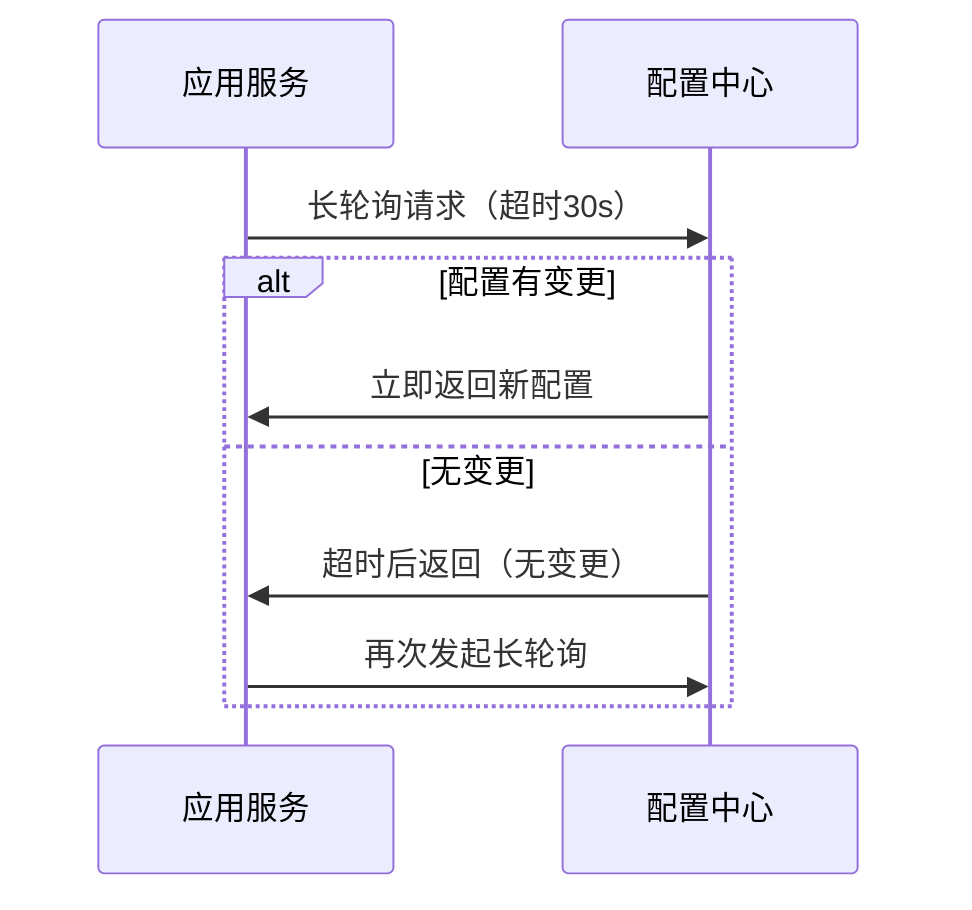

**特点：**
- 实时性好
- 减少无效请求
- 平衡了实时性和实现复杂度

# 配置中心功能

## 核心功能

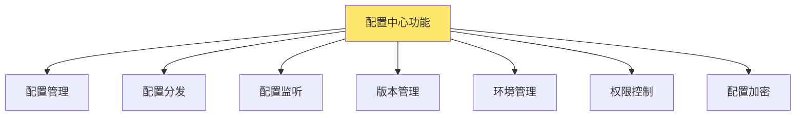

### 1. 配置管理

- **配置CRUD**：创建、读取、更新、删除配置
- **配置分组**：按应用、模块分组管理
- **配置格式支持**：Properties、YAML、JSON、XML等
- **配置模板**：支持配置模板和变量替换

### 2. 配置分发

- **多方式分发**：拉取、推送、长轮询
- **批量分发**：支持批量配置更新
- **灰度发布**：配置灰度发布到部分实例

### 3. 配置监听

- **变更通知**：配置变更时通知应用
- **事件机制**：支持配置变更事件
- **回调支持**：支持配置变更回调

### 4. 版本管理

- **版本历史**：保存配置变更历史
- **版本回滚**：支持回滚到历史版本
- **版本对比**：对比不同版本的配置差异

### 5. 环境管理

- **多环境支持**：开发、测试、生产等环境
- **环境隔离**：不同环境配置隔离
- **环境切换**：支持环境间配置复制

### 6. 权限控制

- **用户管理**：用户和角色管理
- **权限管理**：细粒度的配置访问权限
- **操作审计**：记录配置操作日志

### 7. 配置加密

- **敏感信息加密**：密码、密钥等加密存储
- **传输加密**：配置传输过程加密
- **密钥管理**：密钥的安全管理

# 配置分类

## 配置类型

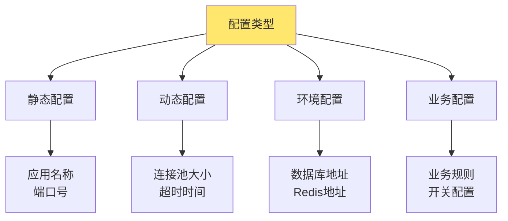

### 1. 静态配置

很少变更的配置，如应用名称、端口号等。

**特点：**
- 变更频率低
- 通常与应用代码一起管理
- 可以放在配置文件中

### 2. 动态配置

需要动态调整的配置，如连接池大小、超时时间等。

**特点：**
- 变更频率高
- 需要动态更新
- 适合放在配置中心

### 3. 环境配置

不同环境不同的配置，如数据库地址、Redis地址等。

**特点：**
- 环境相关
- 需要环境隔离
- 配置中心的核心场景

### 4. 业务配置

业务相关的配置，如业务规则、功能开关等。

**特点：**
- 业务驱动
- 需要快速调整
- 支持灰度发布

## 配置命名规范

### 命名空间（Namespace）

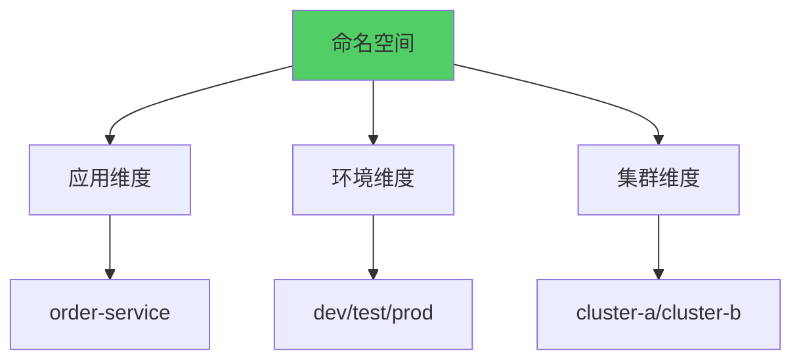

**命名规范：**
- `{application}.{environment}`：如 `order-service.prod`
- `{application}.{environment}.{cluster}`：如 `order-service.prod.cluster-a`
- 支持多级命名空间

### 配置Key规范

```
# 格式：{模块}.{配置项}
database.url=jdbc:mysql://localhost:3306/order
database.username=root
database.password=***

redis.host=localhost
redis.port=6379
redis.timeout=3000

business.order.timeout=30
business.order.maxRetry=3
```

# 常见配置中心工具

## 1. Apollo（携程开源）

Apollo是携程框架部门开发的分布式配置中心。

### 特性

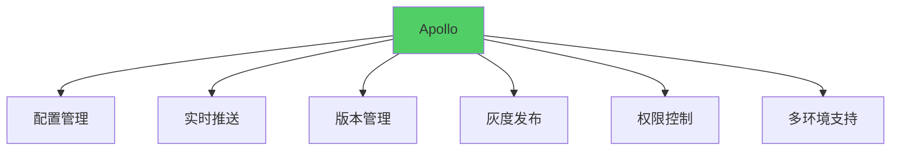

**核心特性：**
- 配置实时推送
- 版本管理和回滚
- 灰度发布
- 权限控制和审计
- 多环境支持
- 配置加密
- 配置监听
- 开放API

### 架构

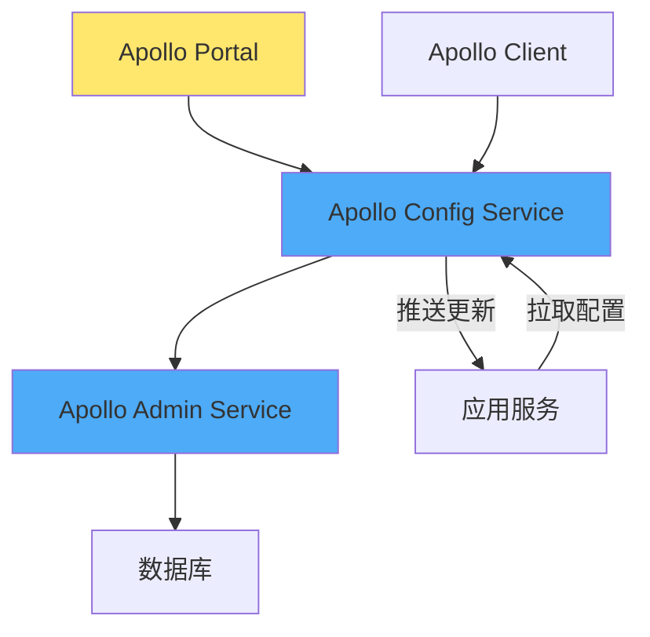

**组件：**
- **Apollo Portal**：配置管理界面
- **Apollo Config Service**：配置服务，提供配置查询接口
- **Apollo Admin Service**：配置管理服务，提供配置修改接口
- **Apollo Client**：客户端SDK

### 使用示例

```java
// Apollo客户端配置
@Configuration
public class ApolloConfig {
    @ApolloConfigChangeListener
    public void onChange(ConfigChangeEvent changeEvent) {
        for (String key : changeEvent.changedKeys()) {
            ConfigChange change = changeEvent.getChange(key);
            System.out.println("配置变更: " + key + 
                ", 旧值: " + change.getOldValue() + 
                ", 新值: " + change.getNewValue());
        }
    }
}

// 获取配置
@Value("${database.url}")
private String databaseUrl;

// 或使用Config对象
@Autowired
private Config config;

public void getConfig() {
    String value = config.getProperty("database.url", "defaultValue");
}
```

## 2. Nacos（阿里巴巴开源）

Nacos是阿里巴巴开源的服务发现和配置管理平台。

### 特性

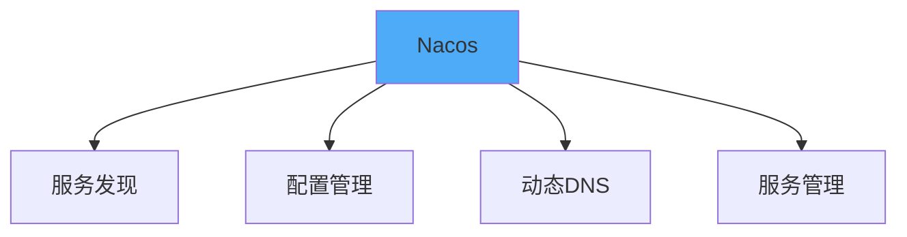

**核心特性：**
- 服务发现和服务健康监测
- 动态配置管理
- 动态DNS服务
- 服务及其元数据管理
- 配置监听和推送
- 多环境支持

### 架构

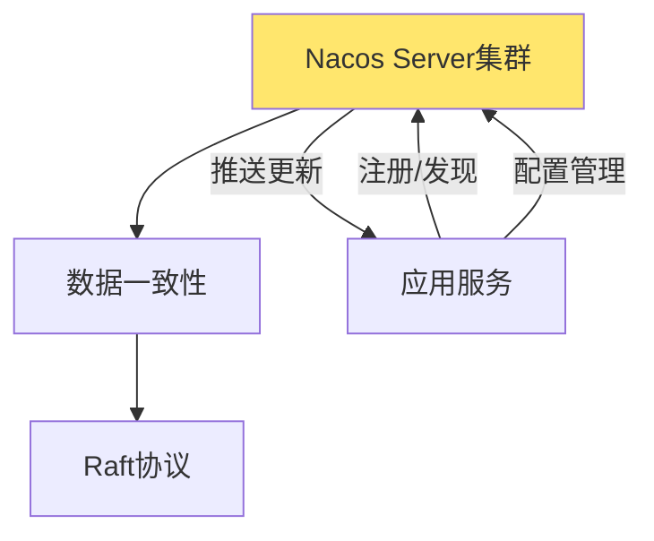

### 使用示例

```java
// Nacos配置
@NacosPropertySource(dataId = "order-service", autoRefreshed = true)
@Configuration
public class NacosConfig {
    @NacosValue(value = "${database.url:default}", autoRefreshed = true)
    private String databaseUrl;
}

// 配置监听
@NacosConfigListener(dataId = "order-service")
public void onMessage(String config) {
    System.out.println("配置变更: " + config);
    // 刷新配置
}
```

## 3. Spring Cloud Config

Spring Cloud Config是Spring Cloud提供的配置中心解决方案。

### 特性

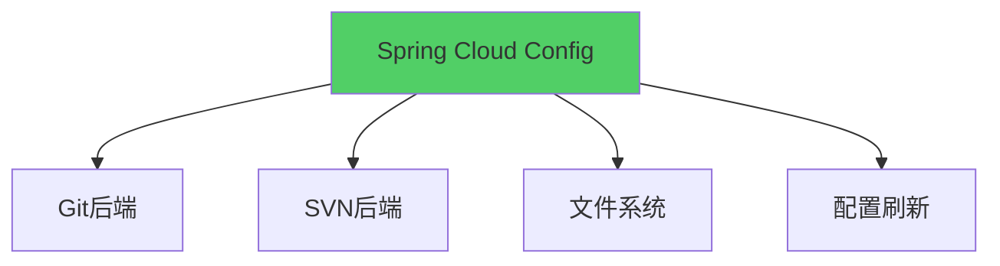

**核心特性：**
- 支持Git、SVN、文件系统等后端
- 配置版本管理（利用Git）
- 配置刷新（Spring Cloud Bus）
- 配置加密
- 多环境支持

### 架构

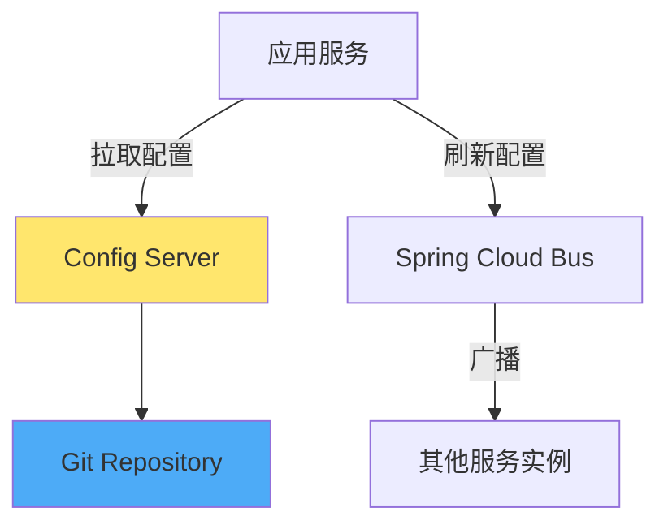

### 使用示例

```yaml
# bootstrap.yml
spring:
  cloud:
    config:
      uri: http://config-server:8888
      name: order-service
      profile: prod
      label: master
```

```java
// 配置刷新
@RefreshScope
@RestController
public class ConfigController {
    @Value("${database.url}")
    private String databaseUrl;
    
    // 配置变更后自动刷新
}
```

## 4. Consul

Consul除了服务发现，也提供配置管理功能。

### 特性

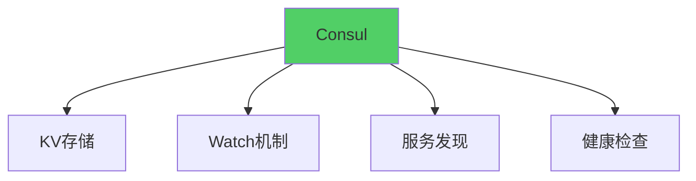

**核心特性：**
- Key-Value存储
- Watch机制监听配置变更
- 服务发现集成
- 多数据中心支持

### 使用示例

```java
// Consul配置
ConsulClient consul = Consul.builder().build();

// 读取配置
Response<GetValue> response = consul.getKVValue("config/order-service/database.url");
String value = response.getValue().getValueAsString().orElse("default");

// 监听配置变更
Consul consul = Consul.builder().build();
consul.keyValueClient().getValues("config/order-service", new ConsulResponseCallback<List<GetValue>>() {
    @Override
    public void onComplete(ConsulResponse<List<GetValue>> response) {
        // 处理配置变更
    }
    
    @Override
    public void onFailure(Throwable throwable) {
        // 处理错误
    }
});
```

## 5. etcd

etcd也可以用作配置中心。

### 特性

- 分布式键值存储
- Watch机制
- Raft一致性
- TTL支持

### 使用示例

```java
// etcd配置
Client client = Client.builder()
    .endpoints("http://localhost:2379")
    .build();

KV kvClient = client.getKVClient();

// 读取配置
ByteSequence key = ByteSequence.from("config/order-service/database.url".getBytes());
GetResponse response = kvClient.get(key);
String value = response.getKvs().get(0).getValue().toString();

// 监听配置变更
Watch watchClient = client.getWatchClient();
watchClient.watch(key, watchResponse -> {
    for (WatchEvent event : watchResponse.getEvents()) {
        // 处理配置变更
    }
});
```

## 工具对比

| 特性 | Apollo | Nacos | Spring Cloud Config | Consul | etcd |
|------|--------|-------|---------------------|--------|------|
| 配置管理 | ✅ | ✅ | ✅ | ✅ | ✅ |
| 实时推送 | ✅ | ✅ | ⚠️ | ✅ | ✅ |
| 版本管理 | ✅ | ✅ | ✅（Git） | ⚠️ | ⚠️ |
| 灰度发布 | ✅ | ✅ | ❌ | ❌ | ❌ |
| 权限控制 | ✅ | ✅ | ⚠️ | ✅ | ⚠️ |
| 配置加密 | ✅ | ✅ | ✅ | ⚠️ | ⚠️ |
| 服务发现 | ❌ | ✅ | ❌ | ✅ | ❌ |
| 多环境 | ✅ | ✅ | ✅ | ✅ | ✅ |
| 社区活跃度 | 高 | 高 | 高 | 中 | 中 |

# 配置管理最佳实践

## 1. 配置分类管理

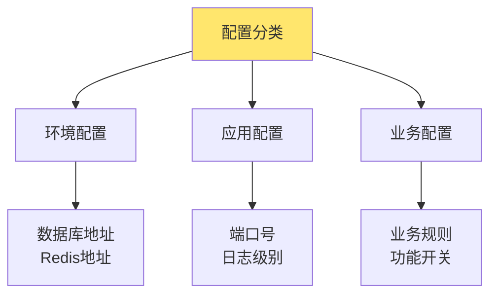

**原则：**
- 环境配置放在配置中心
- 应用配置可以放在代码中
- 业务配置放在配置中心，支持动态调整

## 2. 配置命名规范

### 命名空间设计

```
# 格式：{应用名}.{环境}.{集群}
order-service.prod.cluster-a
order-service.prod.cluster-b
order-service.test
order-service.dev
```

### 配置Key设计

```
# 模块化命名
{模块}.{配置项}

# 示例
database.master.url
database.slave.url
redis.cluster.nodes
business.order.timeout
feature.order.autoCancel.enabled
```

## 3. 配置版本管理


**实践：**
- 每次配置变更创建新版本
- 重要配置变更需要测试验证
- 保留配置历史，支持快速回滚
- 记录配置变更原因和影响

## 4. 配置灰度发布

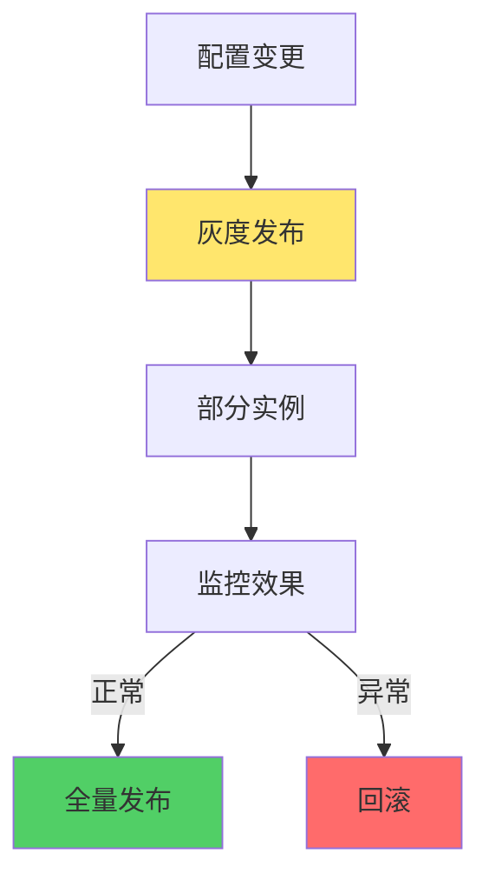

**策略：**
- 先发布到部分实例
- 监控配置变更影响
- 确认正常后全量发布
- 异常时快速回滚

## 5. 配置安全

### 敏感信息加密

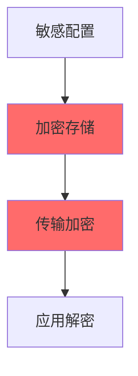

**实践：**
- 密码、密钥等敏感信息加密存储
- 配置传输使用HTTPS
- 应用端解密使用
- 定期轮换密钥

### 权限控制

```java
// 权限设计
public class ConfigPermission {
    // 读取权限
    boolean canRead(String namespace, String userId);
    
    // 修改权限
    boolean canWrite(String namespace, String userId);
    
    // 发布权限
    boolean canPublish(String namespace, String userId);
}
```

## 6. 配置监听和刷新

### 配置变更监听

```java
// Apollo配置监听
@ApolloConfigChangeListener
public void onChange(ConfigChangeEvent changeEvent) {
    for (String key : changeEvent.changedKeys()) {
        ConfigChange change = changeEvent.getChange(key);
        
        // 根据配置类型处理
        if (key.startsWith("database.")) {
            refreshDatabaseConfig(change);
        } else if (key.startsWith("redis.")) {
            refreshRedisConfig(change);
        } else if (key.startsWith("business.")) {
            refreshBusinessConfig(change);
        }
    }
}

private void refreshDatabaseConfig(ConfigChange change) {
    // 刷新数据库连接池配置
    // 注意：某些配置可能需要重启应用
}
```

### 配置刷新策略

```mermaid
graph TB
    A[配置变更] --> B{配置类型}
    B -->|运行时配置| C[立即生效]
    B -->|启动时配置| D[需要重启]
    B -->|连接配置| E[重建连接]
    
    style C fill:#51CF66
    style D fill:#FF6B6B
    style E fill:#FFE66D
```

**策略：**
- **运行时配置**：如业务规则、功能开关，可以立即生效
- **启动时配置**：如端口号、应用名称，需要重启
- **连接配置**：如数据库连接，需要重建连接

## 7. 配置默认值和降级

```java
// 配置获取时提供默认值
public class ConfigManager {
    public String getConfig(String key, String defaultValue) {
        String value = configCenter.get(key);
        return value != null ? value : defaultValue;
    }
    
    // 配置中心不可用时的降级策略
    public String getConfigWithFallback(String key, String defaultValue) {
        try {
            return configCenter.get(key);
        } catch (Exception e) {
            // 降级：使用本地配置文件
            return localConfig.get(key, defaultValue);
        }
    }
}
```

## 8. 配置监控和告警

```mermaid
graph TB
    A[配置监控] --> B[配置变更监控]
    A --> C[配置使用监控]
    A --> D[配置中心健康监控]
    
    B --> E[变更频率告警]
    C --> F[配置缺失告警]
    D --> G[服务不可用告警]
    
    style A fill:#FFE66D
```

**监控指标：**
- 配置变更频率
- 配置拉取成功率
- 配置中心可用性
- 配置刷新失败率

# 配置中心架构设计

## 高可用架构

```mermaid
graph TB
    A[配置中心集群] --> B[主节点]
    A --> C[从节点1]
    A --> D[从节点2]
    
    B --> E[数据同步]
    C --> E
    D --> E
    
    F[应用服务] -->|读取| B
    F -->|读取| C
    F -->|读取| D
    
    style A fill:#FFE66D
    style E fill:#51CF66
```

**设计要点：**
- 集群部署，保证高可用
- 数据一致性（Raft、主从复制）
- 负载均衡，分散请求压力
- 故障自动切换

## 性能优化

### 客户端缓存

```mermaid
graph LR
    A[应用启动] --> B[拉取配置]
    B --> C[本地缓存]
    C --> D[定期刷新]
    D --> E[变更通知]
    E --> C
    
    style C fill:#51CF66
```

**策略：**
- 客户端缓存配置，减少请求
- 定期刷新缓存
- 配置变更时主动更新缓存
- 配置中心不可用时使用缓存

### 批量操作

```java
// 批量获取配置
public Map<String, String> getConfigs(List<String> keys) {
    return configCenter.batchGet(keys);
}

// 批量更新配置
public void updateConfigs(Map<String, String> configs) {
    configCenter.batchUpdate(configs);
}
```

# 配置中心与微服务

## 在微服务架构中的作用

```mermaid
graph TB
    A[微服务架构] --> B[配置中心]
    B --> C[环境配置管理]
    B --> D[动态配置更新]
    B --> E[配置统一管理]
    B --> F[配置安全]
    
    style B fill:#FFE66D
```

**关键作用：**
- 统一管理所有服务的配置
- 支持配置动态更新，无需重启
- 实现环境隔离，不同环境配置分离
- 提供配置安全，敏感信息加密
- 支持配置版本管理和回滚

## 与其他组件的关系

```mermaid
graph TB
    A[配置中心] --> B[服务发现]
    A --> C[API网关]
    A --> D[服务网格]
    A --> E[监控系统]
    
    style A fill:#FFE66D
```

- **服务发现**：配置中心可以存储服务发现相关配置
- **API网关**：网关路由规则可以存储在配置中心
- **服务网格**：服务网格策略配置可以统一管理
- **监控系统**：监控告警规则可以动态配置

# 配置中心常见问题

## 1. 配置中心不可用

**问题：** 配置中心故障，应用无法获取配置

**解决方案：**
- 客户端缓存配置，降级使用本地配置
- 配置中心集群部署，保证高可用
- 多级缓存：内存缓存 + 本地文件缓存

## 2. 配置更新延迟

**问题：** 配置更新后，应用没有及时获取到新配置

**解决方案：**
- 使用长轮询或推送模式
- 缩短客户端轮询间隔
- 配置变更后主动通知应用

## 3. 配置冲突

**问题：** 多个环境配置冲突，或配置覆盖问题

**解决方案：**
- 明确配置优先级规则
- 使用命名空间隔离环境
- 配置变更前进行影响分析

## 4. 配置泄露

**问题：** 敏感配置信息泄露

**解决方案：**
- 敏感配置加密存储
- 配置访问权限控制
- 配置操作审计
- 定期轮换密钥

## 5. 配置变更影响范围大

**问题：** 配置变更影响多个服务，难以控制影响范围

**解决方案：**
- 配置灰度发布
- 配置变更前通知相关团队
- 重要配置变更需要审批流程
- 配置变更后监控影响

# 配置中心选型建议

## 选型考虑因素

```mermaid
graph TB
    A[选型因素] --> B[功能需求]
    A --> C[性能要求]
    A --> D[运维复杂度]
    A --> E[社区支持]
    A --> F[技术栈]
    
    style A fill:#FFE66D
```

**考虑因素：**
1. **功能需求**：是否需要灰度发布、版本管理等高级功能
2. **性能要求**：配置拉取性能、推送实时性
3. **运维复杂度**：部署和维护成本
4. **社区支持**：社区活跃度、文档完善度
5. **技术栈**：与现有技术栈的集成度

## 选型建议

| 场景 | 推荐方案 | 理由 |
|------|---------|------|
| Spring Cloud技术栈 | Spring Cloud Config | 深度集成，使用简单 |
| 需要服务发现+配置管理 | Nacos | 一站式解决方案 |
| 需要高级功能（灰度、版本） | Apollo | 功能完善，企业级 |
| 已有Consul基础设施 | Consul | 复用现有基础设施 |
| Kubernetes环境 | ConfigMap/Secret | 原生支持 |

# 总结

配置中心是微服务架构的重要基础设施，它解决了分布式系统中配置管理的难题。

**关键要点：**
1. **选择合适的模式**：拉取、推送、长轮询
2. **选择合适的工具**：根据场景选择Apollo、Nacos、Spring Cloud Config等
3. **配置分类管理**：区分环境配置、应用配置、业务配置
4. **配置安全**：敏感信息加密，权限控制
5. **配置版本管理**：支持版本回滚
6. **配置灰度发布**：降低配置变更风险
7. **客户端缓存**：提高性能和可用性
8. **监控告警**：监控配置中心健康状态

**最佳实践：**
- 环境配置放在配置中心
- 配置命名规范统一
- 敏感配置加密存储
- 配置变更需要测试验证
- 重要配置变更需要审批
- 配置中心高可用部署
- 客户端实现降级策略

配置中心的成功实施需要综合考虑功能需求、性能要求、运维复杂度和技术栈，选择最适合当前场景的方案，并建立完善的配置管理流程和规范。
