领域驱动设计（Domain-Driven Design，DDD）是一种软件开发方法论，由Eric Evans在2003年提出。它强调以业务领域为核心，通过领域模型来驱动软件设计，帮助开发团队更好地理解和表达业务逻辑。

# DDD概述

领域驱动设计是一种处理复杂领域软件设计的方法论，它通过建立领域模型来连接业务专家和开发人员，使软件能够准确反映业务需求。

## DDD的核心思想

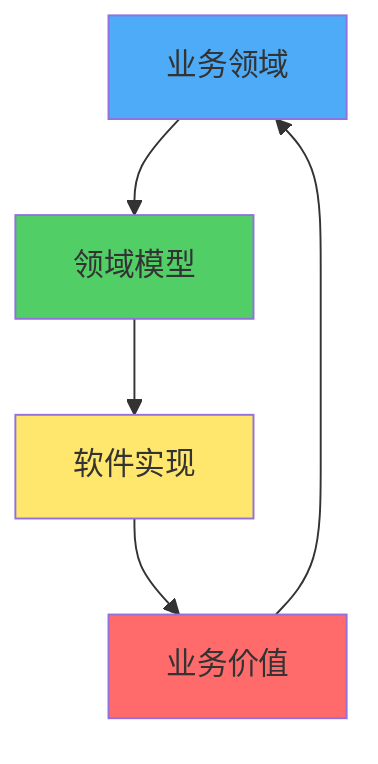

**核心原则：**
1. **以领域为中心**：业务领域是软件设计的核心
2. **统一语言（Ubiquitous Language）**：业务专家和开发人员使用相同的语言
3. **领域模型驱动**：通过领域模型来表达和实现业务逻辑
4. **分层架构**：将领域逻辑与技术实现分离

## DDD解决的问题

### 传统开发的问题

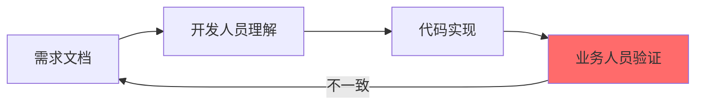

**问题：**
- 需求理解偏差
- 业务逻辑分散
- 代码难以维护
- 业务变更困难

### DDD的解决方案

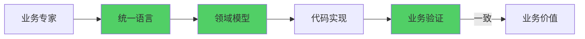

**优势：**
- 业务和代码一致
- 领域逻辑集中
- 易于理解和维护
- 快速响应业务变化

# DDD的分层架构

DDD采用分层架构，将领域逻辑与技术实现分离。

## 分层结构

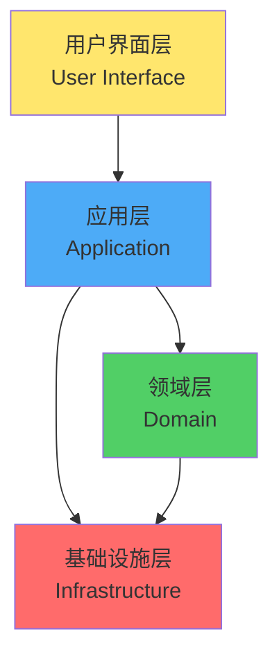

### 1. 用户界面层（User Interface Layer）

**职责：**
- 用户交互
- 数据展示
- 输入验证（UI层面）

**不包含：**
- 业务逻辑
- 领域规则

### 2. 应用层（Application Layer）

**职责：**
- 协调领域对象完成业务用例
- 事务管理
- 安全控制
- 工作流编排

**特点：**
- 薄层，不包含业务逻辑
- 委托给领域层处理

**示例：**
```go
// 应用服务
type OrderApplicationService struct {
    customerRepo CustomerRepository
    productRepo  ProductRepository
    orderRepo    OrderRepository
    orderFactory OrderFactory
    eventPub     EventPublisher
}

func (s *OrderApplicationService) CreateOrder(cmd CreateOrderCommand) error {
    // 1. 获取领域对象
    customer, err := s.customerRepo.FindByID(cmd.CustomerID)
    if err != nil {
        return err
    }
    
    product, err := s.productRepo.FindByID(cmd.ProductID)
    if err != nil {
        return err
    }
    
    // 2. 调用领域服务
    order, err := s.orderFactory.Create(customer, product, cmd.Quantity)
    if err != nil {
        return err
    }
    
    // 3. 持久化
    if err := s.orderRepo.Save(order); err != nil {
        return err
    }
    
    // 4. 发布领域事件
    event := NewOrderCreatedEvent(order.ID())
    return s.eventPub.Publish(event)
}
```

### 3. 领域层（Domain Layer）

**职责：**
- 业务逻辑和规则
- 领域模型
- 领域服务

**特点：**
- 核心层，包含所有业务逻辑
- 不依赖其他层
- 最稳定的一层

### 4. 基础设施层（Infrastructure Layer）

**职责：**
- 技术实现
- 数据持久化
- 消息传递
- 外部服务调用

**特点：**
- 为上层提供技术支撑
- 实现领域层定义的接口

# 核心概念：战术设计

## 1. 实体（Entity）

实体是具有唯一标识的对象，通过ID来区分，即使属性相同，ID不同也是不同的对象。

### 实体特征

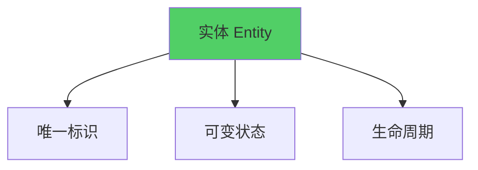

**特征：**
- 有唯一标识（ID）
- 可变状态
- 通过ID判断相等性
- 有生命周期

### 实体示例

```go
// 实体：订单
type Order struct {
    id          OrderID
    customerID  CustomerID
    status      OrderStatus
    items       []*OrderItem
    totalAmount Money
    domainEvents []DomainEvent
}

func NewOrder(id OrderID, customerID CustomerID) *Order {
    return &Order{
        id:          id,
        customerID:  customerID,
        status:      OrderStatusDraft,
        items:       make([]*OrderItem, 0),
        totalAmount: NewMoney(0, "CNY"),
        domainEvents: make([]DomainEvent, 0),
    }
}

func (o *Order) ID() OrderID {
    return o.id
}

// 业务行为：添加商品
func (o *Order) AddItem(product *Product, quantity Quantity) error {
    // 业务规则验证
    if o.status != OrderStatusDraft {
        return errors.New("只能向草稿订单添加商品")
    }
    
    item := NewOrderItem(product, quantity)
    o.items = append(o.items, item)
    o.calculateTotal()
    return nil
}

// 业务行为：确认订单
func (o *Order) Confirm() error {
    if len(o.items) == 0 {
        return errors.New("订单不能为空")
    }
    
    o.status = OrderStatusConfirmed
    event := NewOrderConfirmedEvent(o.id, o.customerID)
    o.domainEvents = append(o.domainEvents, event)
    return nil
}

// 私有方法：计算总金额
func (o *Order) calculateTotal() {
    total := NewMoney(0, "CNY")
    for _, item := range o.items {
        total = total.Add(item.Subtotal())
    }
    o.totalAmount = total
}

func (o *Order) DomainEvents() []DomainEvent {
    return o.domainEvents
}

func (o *Order) ClearDomainEvents() {
    o.domainEvents = make([]DomainEvent, 0)
}
```

## 2. 值对象（Value Object）

值对象是没有唯一标识的对象，通过属性值来判断相等性。

### 值对象特征

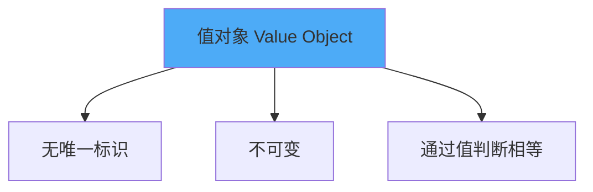

**特征：**
- 没有唯一标识
- 不可变（Immutable）
- 通过属性值判断相等性
- 可以替换

### 值对象示例

```go
// 值对象：金额
type Money struct {
    amount   float64
    currency string
}

func NewMoney(amount float64, currency string) Money {
    if amount < 0 {
        panic("金额必须大于等于0")
    }
    return Money{
        amount:   amount,
        currency: currency,
    }
}

func (m Money) Amount() float64 {
    return m.amount
}

func (m Money) Currency() string {
    return m.currency
}

// 值对象不可变，返回新对象
func (m Money) Add(other Money) Money {
    if m.currency != other.currency {
        panic("货币类型不一致")
    }
    return NewMoney(m.amount+other.amount, m.currency)
}

func (m Money) Multiply(factor float64) Money {
    return NewMoney(m.amount*factor, m.currency)
}

// 通过值判断相等
func (m Money) Equals(other Money) bool {
    return m.amount == other.amount && m.currency == other.currency
}

// 值对象：地址
type Address struct {
    province string
    city     string
    district string
    detail   string
}

func NewAddress(province, city, district, detail string) Address {
    return Address{
        province: province,
        city:     city,
        district: district,
        detail:   detail,
    }
}

func (a Address) Province() string {
    return a.province
}

func (a Address) City() string {
    return a.city
}

func (a Address) District() string {
    return a.district
}

func (a Address) Detail() string {
    return a.detail
}

// 通过值判断相等
func (a Address) Equals(other Address) bool {
    return a.province == other.province &&
        a.city == other.city &&
        a.district == other.district &&
        a.detail == other.detail
}
```

### 实体 vs 值对象

| 特征 | 实体 | 值对象 |
|------|------|--------|
| 标识 | 有唯一ID | 无ID |
| 可变性 | 可变 | 不可变 |
| 相等性 | 通过ID判断 | 通过值判断 |
| 生命周期 | 有生命周期 | 可替换 |
| 示例 | 订单、用户 | 金额、地址 |

## 3. 聚合（Aggregate）

聚合是一组相关对象的集合，作为数据修改的单元。聚合根（Aggregate Root）是聚合的入口。

### 聚合结构

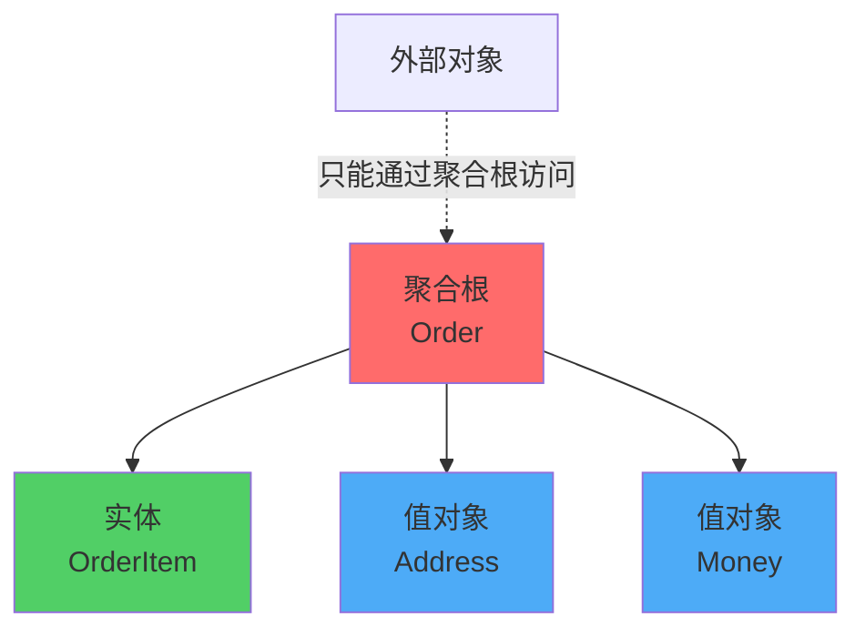

**聚合原则：**
1. **聚合根是唯一入口**：外部只能通过聚合根访问聚合内部
2. **聚合内一致性**：聚合内保证强一致性
3. **聚合间最终一致性**：聚合间通过ID引用，保证最终一致性
4. **事务边界**：一个事务只能修改一个聚合

### 聚合示例

```go
// 聚合根
type Order struct {
    id              OrderID
    customerID      CustomerID
    items           []*OrderItem  // 实体
    shippingAddress Address       // 值对象
    totalAmount     Money         // 值对象
    domainEvents    []DomainEvent
}

func NewOrder(id OrderID, customerID CustomerID) *Order {
    return &Order{
        id:           id,
        customerID:   customerID,
        items:        make([]*OrderItem, 0),
        totalAmount:   NewMoney(0, "CNY"),
        domainEvents: make([]DomainEvent, 0),
    }
}

// 业务方法：添加商品
func (o *Order) AddItem(product *Product, quantity Quantity) {
    // 业务规则：检查商品是否已存在
    for _, item := range o.items {
        if item.ProductID().Equals(product.ID()) {
            item.IncreaseQuantity(quantity)
            o.calculateTotal()
            return
        }
    }
    
    // 商品不存在，创建新订单项
    item := NewOrderItem(product, quantity)
    o.items = append(o.items, item)
    o.calculateTotal()
}

// 业务方法：移除商品
func (o *Order) RemoveItem(productID ProductID) {
    newItems := make([]*OrderItem, 0)
    for _, item := range o.items {
        if !item.ProductID().Equals(productID) {
            newItems = append(newItems, item)
        }
    }
    o.items = newItems
    o.calculateTotal()
}

// 私有方法，外部不能直接修改
func (o *Order) calculateTotal() {
    total := NewMoney(0, "CNY")
    for _, item := range o.items {
        total = total.Add(item.Subtotal())
    }
    o.totalAmount = total
}

// 聚合内的实体
type OrderItem struct {
    productID ProductID
    quantity  Quantity
    unitPrice Money
}

func NewOrderItem(product *Product, quantity Quantity) *OrderItem {
    return &OrderItem{
        productID: product.ID(),
        quantity:  quantity,
        unitPrice: product.Price(),
    }
}

func (oi *OrderItem) ProductID() ProductID {
    return oi.productID
}

func (oi *OrderItem) Quantity() Quantity {
    return oi.quantity
}

func (oi *OrderItem) Subtotal() Money {
    return oi.unitPrice.Multiply(float64(oi.quantity))
}

func (oi *OrderItem) IncreaseQuantity(additional Quantity) {
    oi.quantity += additional
}
```

### 聚合设计原则

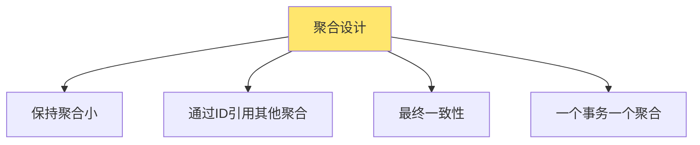

**原则：**
1. **保持聚合小**：聚合应该尽可能小，只包含必须一起修改的对象
2. **通过ID引用**：聚合间通过ID引用，不直接持有对象引用
3. **最终一致性**：跨聚合的操作使用最终一致性
4. **事务边界**：一个事务只修改一个聚合

## 4. 领域服务（Domain Service）

当业务逻辑不属于任何实体或值对象时，使用领域服务。

### 领域服务特征

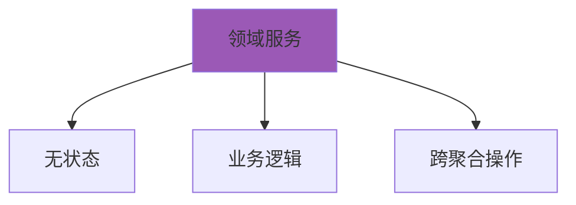

**使用场景：**
- 业务逻辑涉及多个实体
- 业务逻辑不属于任何实体
- 需要访问基础设施（如计算、外部服务）

### 领域服务示例

```go
// 领域服务：转账服务
type TransferService struct {
    eventPub EventPublisher
}

func NewTransferService(eventPub EventPublisher) *TransferService {
    return &TransferService{
        eventPub: eventPub,
    }
}

func (s *TransferService) Transfer(fromAccount, toAccount *Account, amount Money) error {
    // 业务规则：涉及两个账户
    if fromAccount.Balance().Amount() < amount.Amount() {
        return errors.New("余额不足")
    }
    
    if err := fromAccount.Withdraw(amount); err != nil {
        return err
    }
    
    if err := toAccount.Deposit(amount); err != nil {
        return err
    }
    
    // 发布领域事件
    event := NewMoneyTransferredEvent(
        fromAccount.ID(),
        toAccount.ID(),
        amount,
    )
    return s.eventPub.Publish(event)
}

// 领域服务：价格计算服务
type PricingService struct {
    discountRepo DiscountRepository
}

func NewPricingService(discountRepo DiscountRepository) *PricingService {
    return &PricingService{
        discountRepo: discountRepo,
    }
}

func (s *PricingService) CalculatePrice(
    product *Product,
    customer *Customer,
    quantity Quantity,
) Money {
    basePrice := product.Price().Multiply(float64(quantity))
    
    // 应用折扣规则
    discount, err := s.discountRepo.FindByCustomer(customer.ID())
    if err == nil && discount != nil {
        basePrice = discount.Apply(basePrice)
    }
    
    return basePrice
}
```

## 5. 领域事件（Domain Event）

领域事件表示领域中发生的重要业务事件。

### 领域事件特征

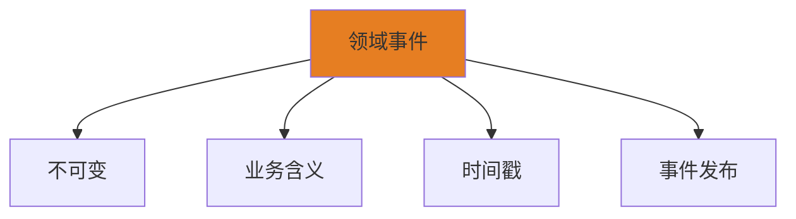

**特征：**
- 表示业务事件
- 不可变
- 包含事件发生时间
- 用于解耦和最终一致性

### 领域事件示例

```go
// 领域事件接口
type DomainEvent interface {
    OccurredOn() time.Time
    EventType() string
}

// 领域事件：订单已创建
type OrderCreatedEvent struct {
    orderID    OrderID
    customerID CustomerID
    totalAmount Money
    occurredOn time.Time
}

func NewOrderCreatedEvent(orderID OrderID, customerID CustomerID, totalAmount Money) *OrderCreatedEvent {
    return &OrderCreatedEvent{
        orderID:    orderID,
        customerID: customerID,
        totalAmount: totalAmount,
        occurredOn: time.Now(),
    }
}

func (e *OrderCreatedEvent) OrderID() OrderID {
    return e.orderID
}

func (e *OrderCreatedEvent) CustomerID() CustomerID {
    return e.customerID
}

func (e *OrderCreatedEvent) TotalAmount() Money {
    return e.totalAmount
}

func (e *OrderCreatedEvent) OccurredOn() time.Time {
    return e.occurredOn
}

func (e *OrderCreatedEvent) EventType() string {
    return "OrderCreated"
}

// 在聚合中发布事件
type Order struct {
    // ... 其他字段
    domainEvents []DomainEvent
}

func (o *Order) Confirm() error {
    if len(o.items) == 0 {
        return errors.New("订单不能为空")
    }
    
    o.status = OrderStatusConfirmed
    // 发布领域事件
    event := NewOrderConfirmedEvent(o.id, o.customerID)
    o.domainEvents = append(o.domainEvents, event)
    return nil
}

func (o *Order) DomainEvents() []DomainEvent {
    // 返回副本，防止外部修改
    events := make([]DomainEvent, len(o.domainEvents))
    copy(events, o.domainEvents)
    return events
}

func (o *Order) ClearDomainEvents() {
    o.domainEvents = make([]DomainEvent, 0)
}
```

### 事件驱动架构

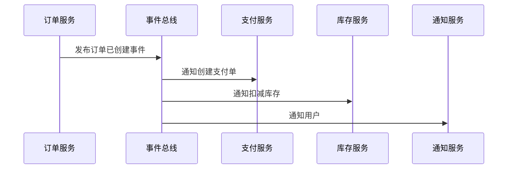

## 6. 仓储（Repository）

仓储封装了获取对象引用所需的逻辑，提供领域对象的持久化抽象。

### 仓储模式

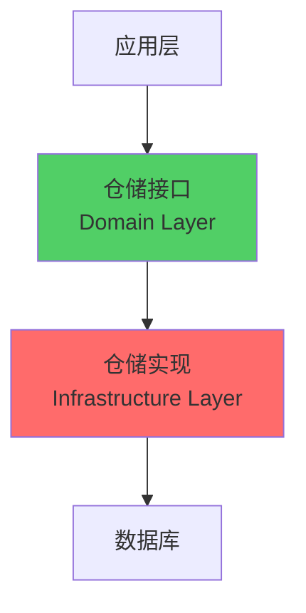

**职责：**
- 提供领域对象的持久化抽象
- 封装数据访问逻辑
- 接口定义在领域层，实现在基础设施层

### 仓储示例

```go
// 仓储接口（领域层）
type OrderRepository interface {
    FindByID(id OrderID) (*Order, error)
    FindByCustomerID(customerID CustomerID) ([]*Order, error)
    Save(order *Order) error
    Remove(order *Order) error
}

// 仓储实现（基础设施层）
type JpaOrderRepository struct {
    db          *sql.DB
    eventPub    EventPublisher
}

func NewJpaOrderRepository(db *sql.DB, eventPub EventPublisher) *JpaOrderRepository {
    return &JpaOrderRepository{
        db:       db,
        eventPub: eventPub,
    }
}

func (r *JpaOrderRepository) FindByID(id OrderID) (*Order, error) {
    // 从数据库查询
    var entity OrderEntity
    err := r.db.QueryRow(
        "SELECT id, customer_id, status, total_amount FROM orders WHERE id = ?",
        id.Value(),
    ).Scan(&entity.ID, &entity.CustomerID, &entity.Status, &entity.TotalAmount)
    
    if err == sql.ErrNoRows {
        return nil, nil
    }
    if err != nil {
        return nil, err
    }
    
    // 转换为领域对象
    return r.toDomain(&entity)
}

func (r *JpaOrderRepository) Save(order *Order) error {
    // 转换为实体
    entity := r.toEntity(order)
    
    // 保存到数据库
    _, err := r.db.Exec(
        "INSERT INTO orders (id, customer_id, status, total_amount) VALUES (?, ?, ?, ?) "+
            "ON DUPLICATE KEY UPDATE status = ?, total_amount = ?",
        entity.ID, entity.CustomerID, entity.Status, entity.TotalAmount,
        entity.Status, entity.TotalAmount,
    )
    if err != nil {
        return err
    }
    
    // 发布领域事件
    for _, event := range order.DomainEvents() {
        if err := r.eventPub.Publish(event); err != nil {
            return err
        }
    }
    order.ClearDomainEvents()
    
    return nil
}

func (r *JpaOrderRepository) toDomain(entity *OrderEntity) (*Order, error) {
    // 实体转领域对象
    order := NewOrder(OrderID(entity.ID), CustomerID(entity.CustomerID))
    // ... 设置其他属性
    return order, nil
}

func (r *JpaOrderRepository) toEntity(order *Order) *OrderEntity {
    // 领域对象转实体
    return &OrderEntity{
        ID:          order.ID().Value(),
        CustomerID:  order.CustomerID().Value(),
        Status:      string(order.Status()),
        TotalAmount: order.TotalAmount().Amount(),
    }
}
```

## 7. 工厂（Factory）

工厂封装了复杂对象的创建逻辑。

### 工厂模式

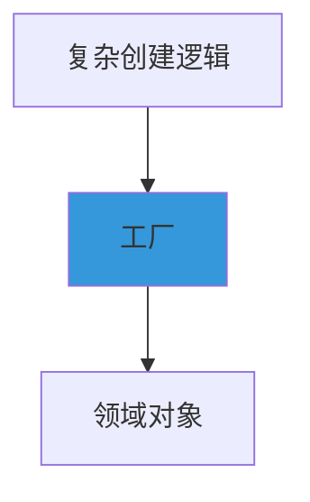

**使用场景：**
- 对象创建逻辑复杂
- 需要封装创建细节
- 保证对象创建的正确性

### 工厂示例

```go
// 工厂
type OrderFactory struct {
    productRepo  ProductRepository
    pricingService *PricingService
}

func NewOrderFactory(
    productRepo ProductRepository,
    pricingService *PricingService,
) *OrderFactory {
    return &OrderFactory{
        productRepo:    productRepo,
        pricingService: pricingService,
    }
}

func (f *OrderFactory) Create(
    customerID CustomerID,
    itemRequests []OrderItemRequest,
) (*Order, error) {
    order := NewOrder(GenerateOrderID(), customerID)
    
    for _, request := range itemRequests {
        product, err := f.productRepo.FindByID(request.ProductID)
        if err != nil {
            return nil, fmt.Errorf("商品不存在: %w", err)
        }
        if product == nil {
            return nil, errors.New("商品不存在")
        }
        
        // 获取客户信息（简化示例）
        customer := &Customer{id: customerID}
        
        price := f.pricingService.CalculatePrice(
            product,
            customer,
            request.Quantity,
        )
        
        item := NewOrderItemWithPrice(product, request.Quantity, price)
        order.AddItem(product, request.Quantity)
    }
    
    return order, nil
}
```

# 核心概念：战略设计

## 1. 限界上下文（Bounded Context）

限界上下文是领域模型的边界，在这个边界内，所有术语和概念都有明确的含义。

### 限界上下文概念

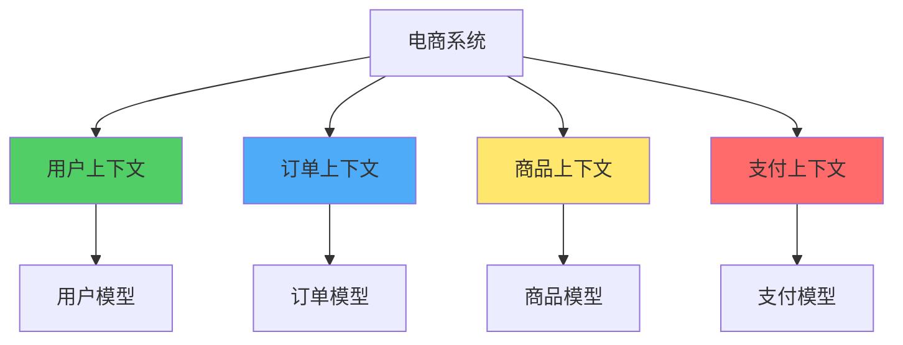

**特征：**
- 明确的业务边界
- 统一的数据模型
- 独立的业务语言
- 可以映射为一个微服务

### 上下文映射（Context Mapping）

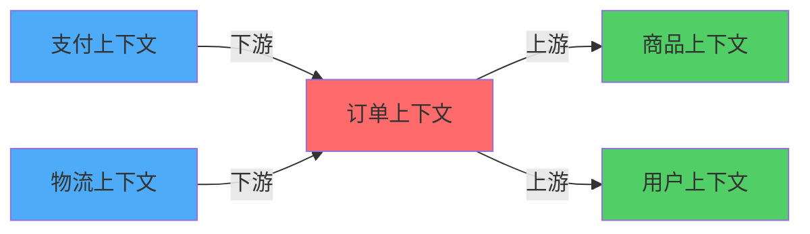

**关系类型：**
- **共享内核（Shared Kernel）**：共享部分模型
- **客户-供应商（Customer-Supplier）**：上下游关系
- **遵奉者（Conformist）**：下游遵从上游
- **防腐层（Anti-Corruption Layer）**：隔离外部系统
- **独立方式（Separate Ways）**：完全独立
- **开放主机服务（Open Host Service）**：提供统一协议

### 限界上下文示例

**订单上下文：**
- 订单实体
- 订单项实体
- 订单状态值对象
- 订单领域服务

**商品上下文：**
- 商品实体
- 商品分类实体
- 价格值对象
- 库存领域服务

## 2. 统一语言（Ubiquitous Language）

统一语言是业务专家和开发人员共同使用的语言，代码中的类名、方法名都使用统一语言。

### 统一语言的作用

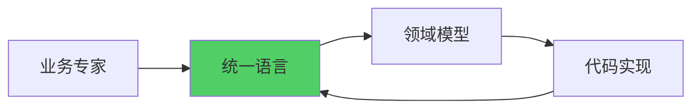

**原则：**
- 代码即文档
- 业务和代码一致
- 持续精炼

### 统一语言示例

**业务术语：**
- 订单（Order）
- 订单项（OrderItem）
- 订单状态（OrderStatus）
- 确认订单（Confirm Order）
- 取消订单（Cancel Order）

**代码体现：**
```go
type Order struct {
    // ...
}

func (o *Order) Confirm() error {  // 确认订单
    // ...
    return nil
}

func (o *Order) Cancel() error {   // 取消订单
    // ...
    return nil
}
```

## 3. 子域（Subdomain）

子域是领域的一部分，根据重要性分为核心域、支撑域和通用域。

### 子域分类

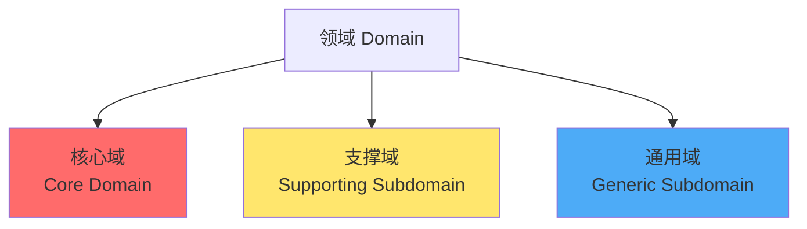

**核心域（Core Domain）：**
- 业务的核心竞争力
- 需要重点投入
- 自主开发

**支撑域（Supporting Subdomain）：**
- 支持核心业务
- 可以外包或购买
- 中等复杂度

**通用域（Generic Subdomain）：**
- 通用功能
- 可以使用现成方案
- 低复杂度

### 电商系统子域示例

| 子域类型 | 示例 | 说明 |
|---------|------|------|
| 核心域 | 订单处理、推荐算法 | 核心竞争力 |
| 支撑域 | 用户管理、商品管理 | 支持功能 |
| 通用域 | 支付、物流、通知 | 通用功能 |

# DDD实践指南

## 1. 领域建模流程

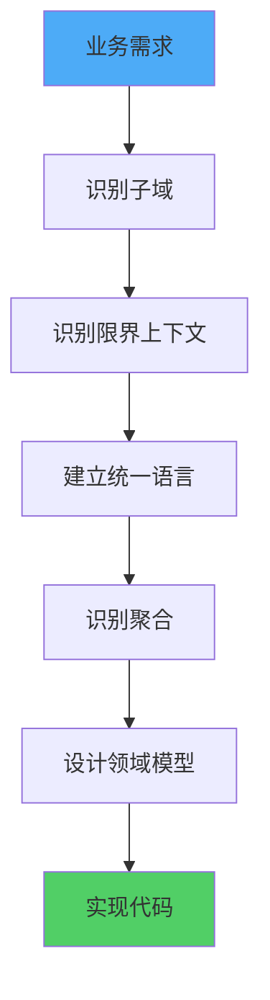

### 步骤详解

1. **业务需求分析**
   - 理解业务目标
   - 识别业务场景
   - 分析业务流程

2. **识别子域**
   - 核心域：核心竞争力
   - 支撑域：支持功能
   - 通用域：通用功能

3. **识别限界上下文**
   - 业务边界
   - 数据模型边界
   - 团队边界

4. **建立统一语言**
   - 业务术语
   - 领域概念
   - 代码命名

5. **识别聚合**
   - 业务一致性边界
   - 事务边界
   - 聚合根

6. **设计领域模型**
   - 实体
   - 值对象
   - 领域服务
   - 领域事件

7. **实现代码**
   - 领域层实现
   - 应用层编排
   - 基础设施层支撑

## 2. 聚合设计实践

### 聚合识别

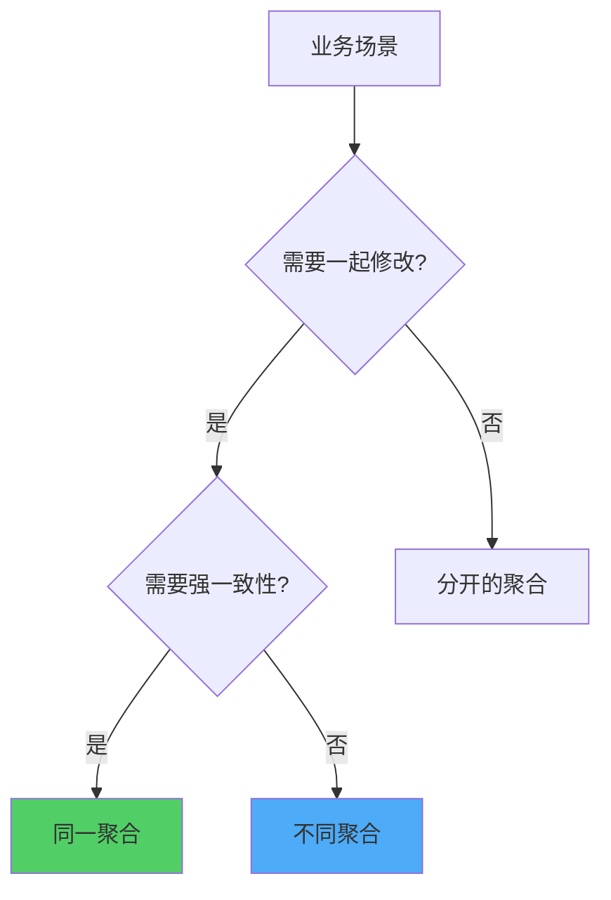

**判断标准：**
- 是否需要一起修改？
- 是否需要强一致性？
- 是否属于同一业务概念？

### 聚合大小

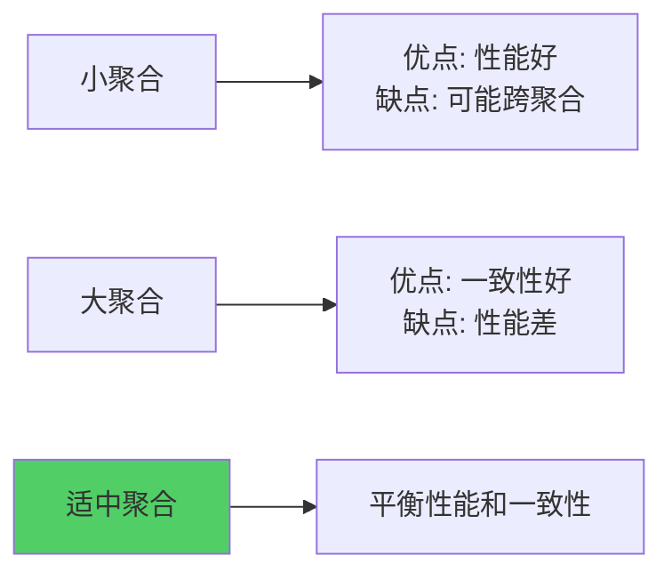

**原则：**
- 保持聚合小
- 只包含必须一起修改的对象
- 通过ID引用其他聚合

## 3. 领域事件实践

### 事件设计

```mermaid
graph TB
    A[业务操作] --> B[状态变更]
    B --> C[发布领域事件]
    C --> D[事件处理]
    D --> E[最终一致性]
    
    style C fill:#E67E22
```

**事件命名：**
- 使用过去时：OrderCreated, PaymentCompleted
- 表达业务含义
- 包含必要信息

### 事件处理

```go
// 事件发布
func (o *Order) Confirm() error {
    if len(o.items) == 0 {
        return errors.New("订单不能为空")
    }
    
    o.status = OrderStatusConfirmed
    event := NewOrderConfirmedEvent(o.id, o.customerID, o.totalAmount)
    o.domainEvents = append(o.domainEvents, event)
    return nil
}

// 事件处理
type OrderConfirmedHandler struct {
    paymentService    PaymentService
    inventoryService  InventoryService
    notificationService NotificationService
}

func NewOrderConfirmedHandler(
    paymentService PaymentService,
    inventoryService InventoryService,
    notificationService NotificationService,
) *OrderConfirmedHandler {
    return &OrderConfirmedHandler{
        paymentService:     paymentService,
        inventoryService:   inventoryService,
        notificationService: notificationService,
    }
}

func (h *OrderConfirmedHandler) Handle(event *OrderConfirmedEvent) error {
    // 创建支付单
    if err := h.paymentService.CreatePayment(
        event.OrderID(),
        event.TotalAmount(),
    ); err != nil {
        return err
    }
    
    // 扣减库存
    if err := h.inventoryService.Reserve(
        event.OrderID(),
        event.Items(),
    ); err != nil {
        return err
    }
    
    // 发送通知
    if err := h.notificationService.NotifyCustomer(
        event.CustomerID(),
        "订单已确认",
    ); err != nil {
        return err
    }
    
    return nil
}
```

## 4. 仓储实践

### 仓储设计

```mermaid
graph TB
    A[领域层] --> B[仓储接口]
    B --> C[查询方法]
    B --> D[保存方法]
    
    E[基础设施层] --> F[仓储实现]
    F --> G[JPA/MyBatis]
    F --> H[NoSQL]
    
    style B fill:#51CF66
    style F fill:#FF6B6B
```

**原则：**
- 接口在领域层
- 实现在基础设施层
- 只保存聚合根
- 封装查询逻辑

### 查询优化

```go
// 使用规格模式（Specification Pattern）
type OrderSpecification interface {
    IsSatisfiedBy(order *Order) bool
}

type OrderByCustomerSpec struct {
    customerID CustomerID
}

func NewOrderByCustomerSpec(customerID CustomerID) *OrderByCustomerSpec {
    return &OrderByCustomerSpec{
        customerID: customerID,
    }
}

func (s *OrderByCustomerSpec) IsSatisfiedBy(order *Order) bool {
    return order.CustomerID().Equals(s.customerID)
}

// 仓储中使用
type OrderRepository interface {
    FindBySpecification(spec OrderSpecification) ([]*Order, error)
}

// 仓储实现
func (r *JpaOrderRepository) FindBySpecification(
    spec OrderSpecification,
) ([]*Order, error) {
    // 获取所有订单（实际场景中应该优化查询）
    allOrders, err := r.findAll()
    if err != nil {
        return nil, err
    }
    
    // 应用规格过滤
    result := make([]*Order, 0)
    for _, order := range allOrders {
        if spec.IsSatisfiedBy(order) {
            result = append(result, order)
        }
    }
    
    return result, nil
}
```

# DDD与微服务

## DDD在微服务中的应用

```mermaid
graph TB
    A[限界上下文] --> B[微服务边界]
    C[聚合] --> D[服务内一致性]
    E[领域事件] --> F[服务间通信]
    G[统一语言] --> H[API设计]
    
    style A fill:#51CF66
    style C fill:#4DABF7
    style E fill:#E67E22
    style G fill:#FFE66D
```

**映射关系：**
- **限界上下文 → 微服务**：一个限界上下文对应一个微服务
- **聚合 → 服务内一致性**：聚合保证服务内强一致性
- **领域事件 → 服务间通信**：通过事件实现服务间解耦
- **统一语言 → API设计**：API使用统一语言

## 服务拆分策略

### 基于限界上下文拆分

```mermaid
graph TB
    A[电商领域] --> B[用户上下文 → 用户服务]
    A --> C[订单上下文 → 订单服务]
    A --> D[商品上下文 → 商品服务]
    A --> E[支付上下文 → 支付服务]
    
    style B fill:#51CF66
    style C fill:#4DABF7
    style D fill:#FFE66D
    style E fill:#FF6B6B
```

**优势：**
- 清晰的业务边界
- 独立的数据模型
- 团队自治
- 易于维护

## 跨服务一致性

### 最终一致性

```mermaid
sequenceDiagram
    participant OrderService as 订单服务
    participant EventBus as 事件总线
    participant PaymentService as 支付服务
    participant InventoryService as 库存服务
    
    OrderService->>OrderService: 创建订单(强一致性)
    OrderService->>EventBus: 发布订单已创建事件
    EventBus->>PaymentService: 创建支付单(最终一致性)
    EventBus->>InventoryService: 扣减库存(最终一致性)
```

**策略：**
- 服务内：强一致性（聚合保证）
- 服务间：最终一致性（事件驱动）

# DDD常见问题

## 1. 如何识别聚合？

**判断标准：**
- 是否需要一起修改？
- 是否需要强一致性？
- 是否属于同一业务概念？

**示例：**
- ✅ 订单和订单项 → 同一聚合
- ❌ 订单和商品 → 不同聚合
- ❌ 订单和支付 → 不同聚合

## 2. 实体和值对象如何选择？

**实体：**
- 有唯一标识
- 需要跟踪生命周期
- 可变状态

**值对象：**
- 无唯一标识
- 通过值判断相等
- 不可变

**示例：**
- 订单 → 实体（有ID，需要跟踪）
- 金额 → 值对象（无ID，不可变）
- 地址 → 值对象（无ID，可替换）

## 3. 何时使用领域服务？

**使用场景：**
- 业务逻辑涉及多个实体
- 业务逻辑不属于任何实体
- 需要访问基础设施

**示例：**
- 转账服务（涉及两个账户）
- 价格计算服务（需要访问折扣规则）
- 邮件发送服务（需要访问基础设施）

## 4. 如何设计限界上下文？

**步骤：**
1. 识别业务领域
2. 分析业务边界
3. 确定数据模型边界
4. 识别团队边界
5. 定义统一语言

# DDD工具和框架

## Go生态

- **GORM**：ORM框架，支持持久化
- **go-eventstore**：事件存储实现
- **watermill**：事件驱动和消息传递库
- **go-cqrs**：CQRS模式实现
- **ent**：Facebook开源的实体框架

## Java生态

- **Spring Data JPA**：持久化支持
- **Axon Framework**：CQRS和事件溯源
- **jMolecules**：DDD注解支持

## .NET生态

- **ABP Framework**：DDD应用框架
- **MediatR**：领域事件处理

## 其他

- **EventStore**：事件存储
- **Apache Kafka**：事件总线
- **RabbitMQ**：消息队列

# 总结

领域驱动设计是一种强大的软件设计方法论，它帮助我们：

1. **理解业务**：通过领域模型深入理解业务
2. **统一语言**：业务和代码使用相同语言
3. **清晰边界**：限界上下文明确业务边界
4. **合理拆分**：基于领域模型进行服务拆分
5. **易于维护**：领域逻辑集中，易于理解和修改

**关键要点：**
- 以领域为中心，而非技术
- 使用统一语言连接业务和代码
- 通过限界上下文划分业务边界
- 使用聚合保证一致性
- 通过领域事件实现解耦
- 将DDD与微服务结合使用

DDD不是银弹，但在复杂业务场景下，它能够帮助我们构建更好的软件系统。记住：**DDD的核心是理解业务，而不是技术实现**。
